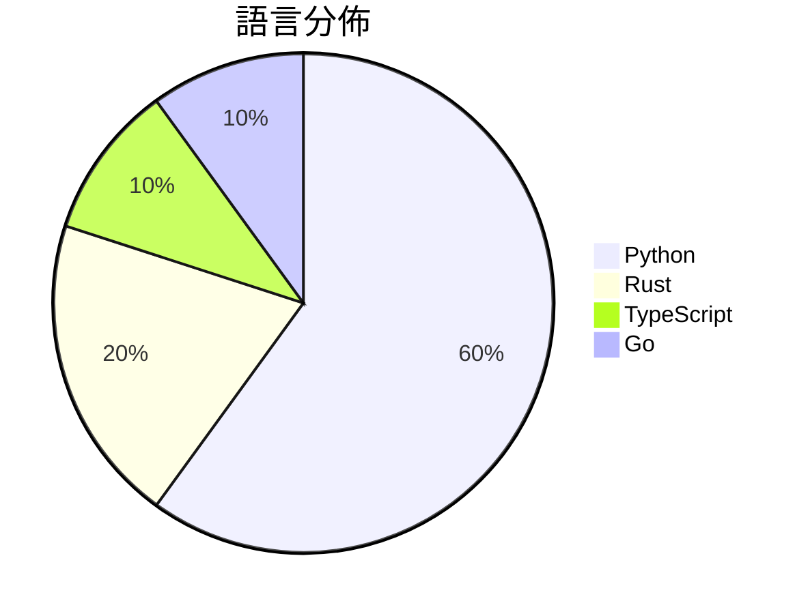

# GitHub Trending - 2026-06-07

> [!summary] 本日摘要
> 收錄 **10** 個新專案，合計 **68.7k** stars
> 語言分佈：Python (6) · Rust (2) · TypeScript (1) · Go (1)

> [!tip] 本週焦點
> **[[pewdiepie-archdaemon--odysseus|pewdiepie-archdaemon/odysseus]]** — 6 天內累積 59.1k stars（9.9k stars/天）
> 提供一個自我托管的 AI 工作空間，讓用戶在本地運行 AI 模型，並保有數據隱私。



---

## 收錄列表

| # | 專案 | 分類 | Stars | 速度 | 安裝 | 語言 | 用途 |
| :--: | --- | --- | ---: | ---: | --- | --- | --- |
| 1 | [[pewdiepie-archdaemon--odysseus\|pewdiepie-archdaemon/odysseus]] | 開發工具 | 59.1k | 9.9k/天 | `medium` | Python | 提供一個自我托管的 AI 工作空間，讓用戶在本地運行 AI 模型，並保有數據隱私 |
| 2 | [[b-nnett--goose\|b-nnett/goose]] | 其他 | 2.2k | 542/天 | `medium` | Rust | 提供 WHOOP 5.0 數據的本地健康監測解決方案，讓開發者評估其可行性。 |
| 3 | [[cpaczek--skylight\|cpaczek/skylight]] | 其他 | 2.1k | 521/天 | `medium` | TypeScript | 將飛機實時投影到天花板，讓你在家中享受飛行的樂趣。 |
| 4 | [[asz798838958--aBaiAutoplus\|asz798838958/aBaiAutoplus]] | 開發工具 | 1.6k | 260/天 | `medium` | Python | 自動化多平台 AI 账号註冊與管理，並提供協議化付款一鍵開通 ChatGPT P |
| 5 | [[ClaudioDrews--memory-os\|ClaudioDrews/memory-os]] | AI/ML | 951 | 159/天 | `easy` | Python | 為 Hermes Agent 提供持久記憶的操作系統，讓 AI 不再忘記重要資訊 |
| 6 | [[jd-opensource--JoyAI-Echo\|jd-opensource/JoyAI-Echo]] | AI/ML | 716 | 179/天 | `medium` | Python | 實現長時間音視頻生成，讓創作更具互動性和一致性。 |
| 7 | [[qiuqiubuchongle-cloud--chokepoint-atlas\|qiuqiubuchongle-cloud/chokepoint-atlas]] | 開發工具 | 590 | 118/天 | `easy` | Python | 幫助研究 AI 產業鏈中的瓶頸，提供結構化的研究資料。 |
| 8 | [[anomalyco--rift\|anomalyco/rift]] | 開發工具 | 548 | 91/天 | `easy` | Rust | 提供更佳的 git worktrees 替代方案，透過寫時複製技術節省空間。 |
| 9 | [[VAST-AI-Research--TripoSplat\|VAST-AI-Research/TripoSplat]] | 開發工具 | 494 | 99/天 | `easy` | Python | 將單張 2D 圖像轉換為高品質和可變數量的 3D 高斯分佈。 |
| 10 | [[tastyeffectco--sandboxes\|tastyeffectco/sandboxes]] | 開發工具 | 471 | 157/天 | `easy` | Go | 提供自我托管的開發沙箱，讓每位用戶都能擁有獨立的雲端開發環境和即時預覽網址。 |

---

## 重點摘要

### 1. [[pewdiepie-archdaemon--odysseus|pewdiepie-archdaemon/odysseus]] `開發工具`

> 提供一個自我托管的 AI 工作空間，讓用戶在本地運行 AI 模型，並保有數據隱私。

**59.1k** stars · **9.9k** stars/天 · Python · `medium`

_建立 6 天內累積 59117 stars（9853/天），forks 7116（12.0%），顯示出強勁的增長潛力。作者 pewdiepie-archdaemon 和其他貢獻者在開源社群中有一定的影響力，解決了自我托管 AI 的需求，特別是在數據隱私方面。這個專案的出現正好填補了市場上對於本地 AI 解決方案的需求，並且有活躍的社群支持。社群中的熱門提案和問題顯示出用戶對於功能的需求和改進的期待，這進一步促進了專案的發展。_

---

### 2. [[b-nnett--goose|b-nnett/goose]] `其他`

> 提供 WHOOP 5.0 數據的本地健康監測解決方案，讓開發者評估其可行性。

**2.2k** stars · **542** stars/天 · Rust · `medium`

_建立 4 天內累積 2168 stars（542/天），forks 505（23.3%），這顯示出開發者對這個專案的高度興趣。作者 b-nnett 是一位活躍的開發者，專注於健康數據的本地處理，這解決了以往依賴雲端的健康數據監測方案的隱私和延遲問題。該專案的推出吸引了不少關注，特別是在 WHOOP 5.0 用戶中。技術上，Goose 的本地數據處理能力和即時反饋是其主要賣點，這在健康監測領域中是相對少見的。forks/stars 比率高達 23.3%，顯示出許多開發者對其進行了實際的修改和擴展，表明該專案在社群中有著良好的反響。_

---

### 3. [[cpaczek--skylight|cpaczek/skylight]] `其他`

> 將飛機實時投影到天花板，讓你在家中享受飛行的樂趣。

**2.1k** stars · **521** stars/天 · TypeScript · `medium`

_建立 4 天內累積 2083 stars（521/天），forks 197（9.5%），顯示出強烈的社群興趣。作者 cpaczek 和 wes-chen 具備相關技術背景，解決了以往航空追蹤工具缺乏直觀視覺化的痛點。這個專案的出現正好滿足了對於家庭娛樂和教育的需求，特別是在疫情期間，許多人尋求新的居家活動。社群的反應也顯示出對於此類創新應用的期待，尤其是結合了科技與藝術的表現形式。_

---

### 4. [[asz798838958--aBaiAutoplus|asz798838958/aBaiAutoplus]] `開發工具`

> 自動化多平台 AI 账号註冊與管理，並提供協議化付款一鍵開通 ChatGPT Plus 的功能。

**1.6k** stars · **260** stars/天 · Python · `medium`

_建立 6 天內累積 1558 stars（260/天），forks 704（45.2%），顯示出強烈的社群參與度。作者 asz798838958 過去在開源領域有一定的貢獻，這個專案解決了多平台 AI 账号註冊的痛點，特別是針對印尼市場的 GoPay 付款功能，這在現有工具中較為稀缺。近期的推廣活動和社群討論也可能促進了這個專案的曝光率。高達 45.2% 的 forks/stars 比率顯示出許多開發者對於此專案的實際修改和使用意圖。_

---

### 5. [[ClaudioDrews--memory-os|ClaudioDrews/memory-os]] `AI/ML`

> 為 Hermes Agent 提供持久記憶的操作系統，讓 AI 不再忘記重要資訊。

**951** stars · **159** stars/天 · Python · `easy`

_建立 6 天內累積 951 stars（159/天），forks 92（9.7%），顯示出強烈的社群興趣。作者 ClaudioDrews 之前在 AI 記憶領域有多項貢獻，這個專案解決了現有記憶方案的雲端依賴問題，讓用戶能夠在本地運行記憶系統。這一需求在 AI 應用中越來越明顯，尤其是在數據隱私和安全性方面。社群的活躍度和開發者的回應速度也顯示出這個專案的潛力。_

---

### 6. [[jd-opensource--JoyAI-Echo|jd-opensource/JoyAI-Echo]] `AI/ML`

> 實現長時間音視頻生成，讓創作更具互動性和一致性。

**716** stars · **179** stars/天 · Python · `medium`

_建立 4 天就累積 716 stars（179/天），forks 44（6.1%），這顯示出穩定的增長潛力。作者團隊由多位貢獻者組成，專注於音視頻生成技術，解決了長視頻生成中存在的錯誤累積和時間一致性問題。這個專案的推出恰逢對高效視頻生成需求上升的時期，並且在社群中引發了關注，特別是對於其性能提升的討論。forks/stars 比率在 6.1% 表示有一定數量的用戶在實際修改和使用這個工具。_

---

### 7. [[qiuqiubuchongle-cloud--chokepoint-atlas|qiuqiubuchongle-cloud/chokepoint-atlas]] `開發工具`

> 幫助研究 AI 產業鏈中的瓶頸，提供結構化的研究資料。

**590** stars · **118** stars/天 · Python · `easy`

_建立 5 天內累積 590 stars（118/天），forks 125（21.2%），顯示出相對較高的社群關注度。作者 qiuqiubuchongle-cloud 的背景不詳，但該工具解決了傳統選股工具無法深入分析供應鏈瓶頸的痛點，尤其是在 AI 產業快速發展的背景下。這種需求的增加可能促使了該工具的興起。forks/stars 比率為 21.2%，顯示出許多用戶對於進一步修改和使用該工具的興趣。_

---

### 8. [[anomalyco--rift|anomalyco/rift]] `開發工具`

> 提供更佳的 git worktrees 替代方案，透過寫時複製技術節省空間。

**548** stars · **91** stars/天 · Rust · `easy`

_建立 6 天內累積 548 stars（91/天），forks 9（1.6%），顯示出一定的關注度。作者 nexxeln 和其他貢獻者在開源社群中有一定的影響力，這個專案解決了 git worktrees 在性能和空間使用上的不足，特別是對於大型專案的開發者來說，這是一個值得關注的工具。社群的活躍度也表現在最近的多次提交和功能擴展上，顯示出開發者對於這個專案的持續投入。Rift 的設計理念和功能正好填補了現有工具的空白，特別是在需要高效管理多個工作區的情境下。_

---

### 9. [[VAST-AI-Research--TripoSplat|VAST-AI-Research/TripoSplat]] `開發工具`

> 將單張 2D 圖像轉換為高品質和可變數量的 3D 高斯分佈。

**494** stars · **99** stars/天 · Python · `easy`

_建立 5 天內累積 494 stars（99/天），forks 47（9.5%），顯示出不錯的增長潛力。作者 Benny Guo 之前在 3D 生成領域有豐富經驗，這個專案解決了傳統 3D 資產生成工具複雜且依賴重的問題，提供了一個輕量級的替代方案。社群的反應也顯示出對於 AMD GPU 支援的需求，這可能會成為未來的發展重點。技術上，隨著深度學習和計算能力的提升，這種高效的 3D 生成方法越來越受到關注，顯示出其在遊戲和 AR/VR 領域的潛力。forks/stars 比率為 9.5%，顯示出有相當比例的用戶在實際修改和使用該專案。_

---

### 10. [[tastyeffectco--sandboxes|tastyeffectco/sandboxes]] `開發工具`

> 提供自我托管的開發沙箱，讓每位用戶都能擁有獨立的雲端開發環境和即時預覽網址。

**471** stars · **157** stars/天 · Go · `easy`

_建立 3 天內累積 471 stars（157/天），forks 10（2.1%），顯示出一定的使用者關注度。作者 tastyeffectco 的背景不詳，但這個專案解決了多用戶開發環境的需求，特別是在 AI 應用開發方面，之前的解決方案往往需要複雜的 Kubernetes 環境或手動管理容器。這個工具的簡單性和自我托管的特性吸引了許多開發者的注意，尤其是在社群中對於簡化開發環境的需求日益增加。最近的推廣活動或討論可能也促進了其曝光率。_

---

## 今日到期複習

> [!tip] 根據間隔複習排程，今天該回顧的專案

```dataview
TABLE
  stars_per_day AS "Stars/天",
  category AS "分類",
  engagement AS "參與度"
FROM "Repos"
WHERE next_review AND date(next_review) <= date("2026-06-07") AND status != "archived"
SORT priority DESC
```

## 待處理

```dataviewjs
const pending = dv.pages('"Repos"').where(p => p.status === "to-review").length;
const unrated = dv.pages('"Repos"').where(p => p.status !== "archived" && p.status !== "to-review" && (p.my_rating || 0) === 0).length;
const noVerdict = dv.pages('"Repos"').where(p => p.status !== "archived" && (p.my_rating || 0) > 0 && (!p.verdict || p.verdict === "")).length;
const items = [];
if (pending > 0) items.push(`**${pending}** 個待分流`);
if (unrated > 0) items.push(`**${unrated}** 個已讀但未評分`);
if (noVerdict > 0) items.push(`**${noVerdict}** 個已評分但無結論`);
if (items.length > 0) dv.paragraph(items.join(" / "));
else dv.paragraph("所有專案都已處理完畢！");
```
