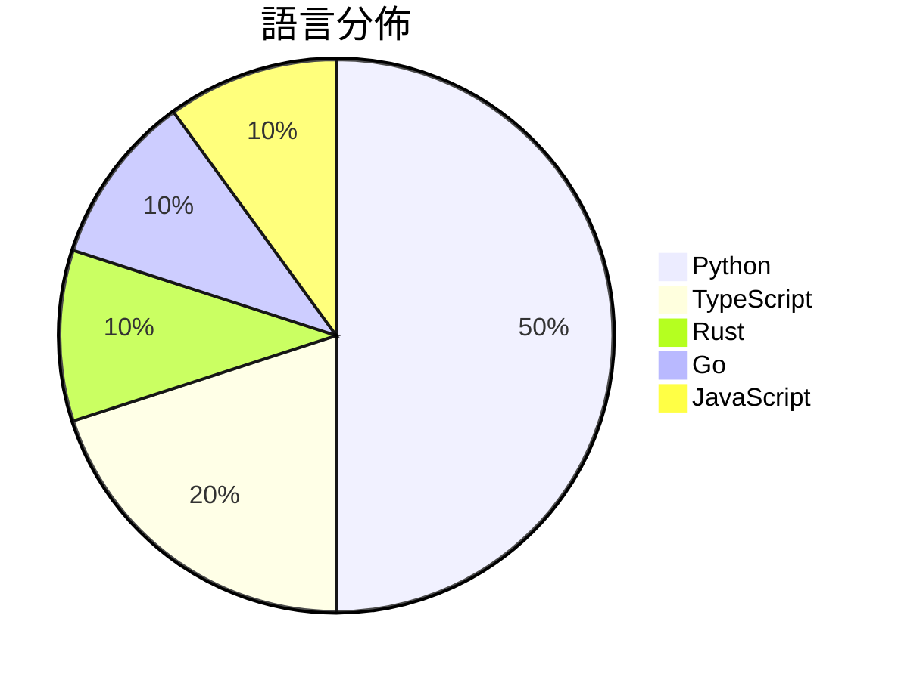

# GitHub Trending - 2026-06-08

> [!summary] 本日摘要
> 收錄 **10** 個新專案，合計 **8.7k** stars
> 語言分佈：Python (5) · TypeScript (2) · Rust (1) · Go (1) · JavaScript (1)

> [!tip] 本週焦點
> **[[cpaczek--skylight|cpaczek/skylight]]** — 5 天內累積 2.3k stars（453 stars/天）
> 將飛機實時投影到天花板，讓你在家中享受飛行的樂趣。



---

## 收錄列表

| # | 專案 | 分類 | Stars | 速度 | 安裝 | 語言 | 用途 |
| :--: | --- | --- | ---: | ---: | --- | --- | --- |
| 1 | [[cpaczek--skylight\|cpaczek/skylight]] | 其他 | 2.3k | 453/天 | `medium` | TypeScript | 將飛機實時投影到天花板，讓你在家中享受飛行的樂趣。 |
| 2 | [[b-nnett--goose\|b-nnett/goose]] | 開發工具 | 2.3k | 451/天 | `medium` | Rust | 提供 WHOOP 5.0 數據和健康指標的本地應用程式原型。 |
| 3 | [[jd-opensource--JoyAI-Echo\|jd-opensource/JoyAI-Echo]] | AI/ML | 854 | 171/天 | `medium` | Python | 實現長時間音視頻生成的高效框架，讓用戶能夠生成連貫的多鏡頭故事。 |
| 4 | [[qiuqiubuchongle-cloud--chokepoint-atlas\|qiuqiubuchongle-cloud/chokepoint-atlas]] | 開發工具 | 602 | 100/天 | `medium` | Python | 幫助用戶研究 AI 產業鏈中的瓶頸，提供結構化的研究結果。 |
| 5 | [[VAST-AI-Research--TripoSplat\|VAST-AI-Research/TripoSplat]] | 開發工具 | 526 | 88/天 | `easy` | Python | 將單張 2D 圖像轉換為高品質的 3D 高斯，適用於資產創建、AR/VR 和遊戲 |
| 6 | [[tastyeffectco--sandboxd\|tastyeffectco/sandboxd]] | 開發工具 | 497 | 124/天 | `easy` | Go | 提供自我托管的開發沙盒，讓每位用戶擁有隔離的雲端開發環境和即時預覽 URL。 |
| 7 | [[tiantianGPU--reg-factory\|tiantianGPU/reg-factory]] | 開發工具 | 478 | 80/天 | `medium` | Python | 自動化註冊多個平台帳號，並導出可用的 cookie。 |
| 8 | [[Jane-xiaoer--xiaoer-videolab\|Jane-xiaoer/xiaoer-videolab]] | 開發工具 | 467 | 156/天 | `medium` | JavaScript | 一鍵將當前頁面的視頻下載到本地，支持 1800 多個網站。 |
| 9 | [[S-Sigdel--vimhjkl\|S-Sigdel/vimhjkl]] | 其他 | 403 | 67/天 | `easy` | Python | 透過真實的 Vim 環境學習高級技巧，並使用間隔重複法進行練習。 |
| 10 | [[zenhosta--9drive\|zenhosta/9drive]] | 生產力 | 398 | 133/天 | `medium` | TypeScript | 將多個 Google Drive 帳號整合到一個虛擬儲存儀表板的存儲網關應用。 |

---

## 重點摘要

### 1. [[cpaczek--skylight|cpaczek/skylight]] `其他`

> 將飛機實時投影到天花板，讓你在家中享受飛行的樂趣。

**2.3k** stars · **453** stars/天 · TypeScript · `medium`

_建立 5 天內累積 2265 stars（453/天），forks 226（10.0%），顯示出強烈的社群興趣。作者 cpaczek 之前在開源社群中活躍，這個專案解決了傳統飛行追蹤工具缺乏互動性和視覺化的痛點。專案的獨特性和實時性吸引了許多航空愛好者的注意，並且在社群中引發了熱烈討論。技術上，使用 RTL-SDR 和 TypeScript 的組合，使得這個專案在硬體和軟體的整合上都具備了良好的可行性。forks/stars 比率為 10.0%，表示有相當比例的用戶對此專案進行了修改或擴展，顯示出其實用性和潛在的開發需求。_

---

### 2. [[b-nnett--goose|b-nnett/goose]] `開發工具`

> 提供 WHOOP 5.0 數據和健康指標的本地應用程式原型。

**2.3k** stars · **451** stars/天 · Rust · `medium`

_建立 5 天內累積 2253 stars（451/天），forks 530（23.5%），顯示出強烈的興趣。作者 b-nnett 之前有開發相關健康數據的經驗，這個專案解決了目前市場上缺乏針對 WHOOP 5.0 的本地數據處理工具的痛點。該專案的快速增長可能與其獨特的功能和開發者社群的需求有關。這個工具的出現也反映了對個人數據隱私的重視，尤其是在健康數據領域。forks/stars 比率高，顯示出許多人對此專案有實際的修改需求。_

---

### 3. [[jd-opensource--JoyAI-Echo|jd-opensource/JoyAI-Echo]] `AI/ML`

> 實現長時間音視頻生成的高效框架，讓用戶能夠生成連貫的多鏡頭故事。

**854** stars · **171** stars/天 · Python · `medium`

_建立 5 天內累積 854 stars（171/天），forks 54（6.3%），顯示出穩定的增長潛力。這個專案由一群活躍的貢獻者推動，解決了長視頻生成中存在的時間一致性和生成速度問題，之前的工具在這些方面表現不佳。社群中對於其 ComfyUI 集成的需求也反映了用戶對於簡化使用流程的期待。技術上，CUDA 的進步使得這種高效生成成為可能，並且 JoyAI-Echo 的設計使其在高效能環境中表現出色。forks/stars 比率顯示出用戶對於這個專案的實際修改和使用興趣，屬於中等偏高的範疇。_

---

### 4. [[qiuqiubuchongle-cloud--chokepoint-atlas|qiuqiubuchongle-cloud/chokepoint-atlas]] `開發工具`

> 幫助用戶研究 AI 產業鏈中的瓶頸，提供結構化的研究結果。

**602** stars · **100** stars/天 · Python · `medium`

_建立 6 天就累積 602 stars（100/天），forks 126（20.9%），顯示出強烈的使用者興趣。作者 qiuqiubuchongle-cloud 似乎專注於 AI 相關的研究工具，這個專案解決了傳統選股工具缺乏深度分析的痛點，提供了更系統化的研究方法。最近的推廣活動可能引發了社群的討論，進一步促進了使用者的參與。高比例的 forks 表示許多人在實際修改和使用這個工具，顯示出其實用性和需求。_

---

### 5. [[VAST-AI-Research--TripoSplat|VAST-AI-Research/TripoSplat]] `開發工具`

> 將單張 2D 圖像轉換為高品質的 3D 高斯，適用於資產創建、AR/VR 和遊戲開發。

**526** stars · **88** stars/天 · Python · `easy`

_建立 6 天內累積 526 stars（88/天），forks 52（9.9%），顯示出穩定的增長潛力。作者 Benny Guo 先前在 3D 生成領域有過多項研究，這個專案解決了傳統 3D 資產生成工具的靈活性不足問題。之前的工具通常需要較高的依賴性或複雜的設定，而 TripoSplat 提供了簡單易用的解決方案。社群的反應雖然尚未熱烈，但已有針對 AMD GPU 的需求反映出其潛在的市場需求。這個工具的設計也符合當前對於簡化開發流程的需求，尤其是在 3D 資產生成方面。_

---

### 6. [[tastyeffectco--sandboxd|tastyeffectco/sandboxd]] `開發工具`

> 提供自我托管的開發沙盒，讓每位用戶擁有隔離的雲端開發環境和即時預覽 URL。

**497** stars · **124** stars/天 · Go · `easy`

_建立 4 天內累積 497 stars（124/天），forks 12（2.4%），這顯示出一定的關注度。作者 tastyeffectco 是一個新興團隊，專注於開發開源工具，這個專案解決了在多用戶環境中如何有效管理開發沙盒的痛點，之前的解決方案往往需要複雜的 Kubernetes 設定。這個工具的簡單性和自我托管的特性吸引了許多開發者的注意，尤其是對於需要快速部署開發環境的團隊。社群的反應也顯示出對於功能擴展的需求，例如多主機集群和不同運行時的支持。_

---

### 7. [[tiantianGPU--reg-factory|tiantianGPU/reg-factory]] `開發工具`

> 自動化註冊多個平台帳號，並導出可用的 cookie。

**478** stars · **80** stars/天 · Python · `medium`

_建立 6 天內累積 478 stars（每天 80），forks 232（48.5%），顯示出極高的使用興趣。作者 tiantianGPU 之前可能有相關的開源經驗，這個專案解決了批量註冊帳號的痛點，特別是在需要通過 Cloudflare 的情況下。這個工具的出現，正好滿足了對於自動化註冊的需求，尤其是在當前許多平台對於新帳號的驗證越來越嚴格的背景下。這個專案的高 forks/stars 比率（48.5%）表明許多使用者不僅在觀望，還在實際修改和使用這個工具。_

---

### 8. [[Jane-xiaoer--xiaoer-videolab|Jane-xiaoer/xiaoer-videolab]] `開發工具`

> 一鍵將當前頁面的視頻下載到本地，支持 1800 多個網站。

**467** stars · **156** stars/天 · JavaScript · `medium`

_建立 3 天就累積 467 stars（156/天），forks 74（15.8%），這顯示出這個工具在短時間內受到廣泛關注。作者 Jane-xiaoer 在開源社區中活躍，過去有多個成功的項目。這個工具解決了許多視頻下載器在安全性和易用性上的不足，特別是許多現有的擴展需要過多的權限來運行。這個工具的推出正好滿足了用戶對隱私和安全的需求，並且簡化了下載流程。社群的反饋也表明，這個工具在實際使用中表現良好，並且能夠穩定地支持多種視頻來源。_

---

### 9. [[S-Sigdel--vimhjkl|S-Sigdel/vimhjkl]] `其他`

> 透過真實的 Vim 環境學習高級技巧，並使用間隔重複法進行練習。

**403** stars · **67** stars/天 · Python · `easy`

_建立 6 天內累積 403 stars（67 stars/天），forks 6（1.5%），顯示出穩定的增長潛力。作者 S-Sigdel 是一位專注於 Vim 教學的開發者，解決了傳統 Vim 教學資源不足以涵蓋高級技巧的痛點。這個工具的出現正好填補了這一空白，並且在社群中引發了討論。技術上，這個工具的設計使得用戶能夠在真實環境中進行練習，而不是依賴模擬器，這種設計在學習效率上有顯著提升。forks/stars 比率較低，顯示出使用者對於這個工具的實際應用還在觀望中。_

---

### 10. [[zenhosta--9drive|zenhosta/9drive]] `生產力`

> 將多個 Google Drive 帳號整合到一個虛擬儲存儀表板的存儲網關應用。

**398** stars · **133** stars/天 · TypeScript · `medium`

_建立 3 天內累積 398 stars（132.67/天），forks 141（35.4%），顯示出強烈的用戶興趣。作者 Adytm404 過去在開源社群活躍，這個專案解決了多帳號 Google Drive 管理的痛點，之前用戶通常需要手動切換帳號或使用多個應用。社群的反饋和需求促進了這個專案的快速成長。技術上，這個工具的設計符合當前對於雲端存儲整合的需求，特別是在遠端工作和資料共享日益增加的背景下。高達 35.4% 的 forks/stars 比率顯示出許多開發者對此專案的實際修改和使用，這意味著它不僅僅是觀望，而是有實際的應用場景。_

---

## 今日到期複習

> [!tip] 根據間隔複習排程，今天該回顧的專案

```dataview
TABLE
  stars_per_day AS "Stars/天",
  category AS "分類",
  engagement AS "參與度"
FROM "Repos"
WHERE next_review AND date(next_review) <= date("2026-06-08") AND status != "archived"
SORT priority DESC
```

## 待處理

```dataviewjs
const pending = dv.pages('"Repos"').where(p => p.status === "to-review").length;
const unrated = dv.pages('"Repos"').where(p => p.status !== "archived" && p.status !== "to-review" && (p.my_rating || 0) === 0).length;
const noVerdict = dv.pages('"Repos"').where(p => p.status !== "archived" && (p.my_rating || 0) > 0 && (!p.verdict || p.verdict === "")).length;
const items = [];
if (pending > 0) items.push(`**${pending}** 個待分流`);
if (unrated > 0) items.push(`**${unrated}** 個已讀但未評分`);
if (noVerdict > 0) items.push(`**${noVerdict}** 個已評分但無結論`);
if (items.length > 0) dv.paragraph(items.join(" / "));
else dv.paragraph("所有專案都已處理完畢！");
```
