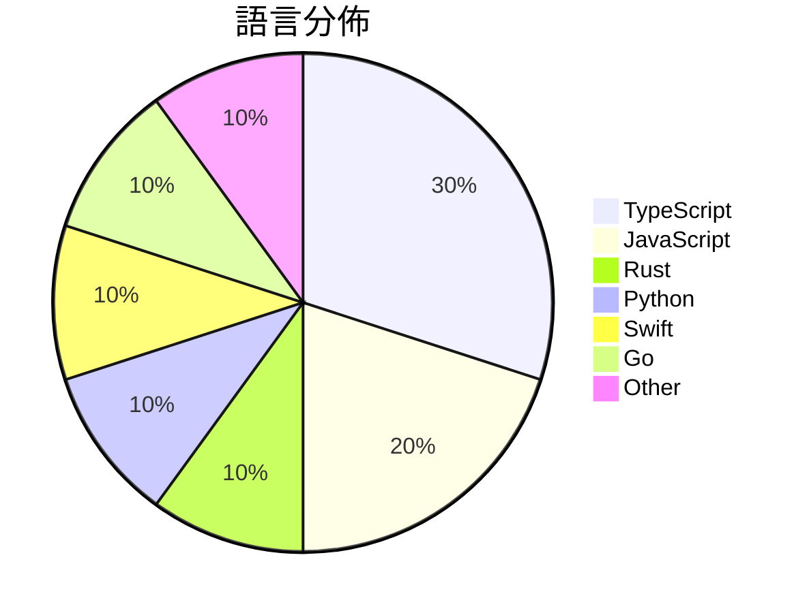

# GitHub Trending - 2026-06-09

> [!summary] 本日摘要
> 收錄 **10** 個新專案，合計 **9.3k** stars
> 語言分佈：TypeScript (3) · JavaScript (2) · Rust (1) · Python (1) · Swift (1) · Go (1) · Other (1)

> [!tip] 本週焦點
> **[[cpaczek--skylight|cpaczek/skylight]]** — 6 天內累積 2.4k stars（399 stars/天）
> 將飛機的實時飛行路徑投影到天花板上，並顯示真實的天空層。



---

## 收錄列表

| # | 專案 | 分類 | Stars | 速度 | 安裝 | 語言 | 用途 |
| :--: | --- | --- | ---: | ---: | --- | --- | --- |
| 1 | [[cpaczek--skylight\|cpaczek/skylight]] | 其他 | 2.4k | 399/天 | `medium` | TypeScript | 將飛機的實時飛行路徑投影到天花板上，並顯示真實的天空層。 |
| 2 | [[b-nnett--goose\|b-nnett/goose]] | 開發工具 | 2.3k | 387/天 | `medium` | Rust | 提供 WHOOP 5.0 健康數據的本地應用程式，讓開發者評估其可行性。 |
| 3 | [[jd-opensource--JoyAI-Echo\|jd-opensource/JoyAI-Echo]] | AI/ML | 1.1k | 183/天 | `medium` | Python | 實現長時間音視頻生成的框架，解決了生成過程中的一致性和延遲問題。 |
| 4 | [[NoopApp--noop\|NoopApp/noop]] | 其他 | 532 | 532/天 | `medium` | Swift | 讓你在本地管理 WHOOP strap 的數據，無需雲端、帳號或訂閱。 |
| 5 | [[JimLiu--baoyu-design\|JimLiu/baoyu-design]] | 開發工具 | 522 | 261/天 | `easy` | JavaScript | 在本地運行 Claude Design 作為 Agent Skill，生成精美的 |
| 6 | [[tastyeffectco--sandboxd\|tastyeffectco/sandboxd]] | 開發工具 | 514 | 103/天 | `easy` | Go | 提供自我託管的開發沙盒，讓每位用戶擁有獨立的雲端開發環境和即時預覽網址。 |
| 7 | [[diffusionstudio--lottie\|diffusionstudio/lottie]] | 開發工具 | 513 | 128/天 | `easy` | TypeScript | 生成可用於生產的 Lottie 動畫，讓開發者能夠即時預覽和調整動畫效果。 |
| 8 | [[Jane-xiaoer--xiaoer-videolab\|Jane-xiaoer/xiaoer-videolab]] | 開發工具 | 482 | 121/天 | `medium` | JavaScript | 一鍵將當前頁面的視頻下載到本地，支持1800多個網站。 |
| 9 | [[amElnagdy--guard-skills\|amElnagdy/guard-skills]] | 開發工具 | 470 | 235/天 | `easy` | N/A | 為編碼代理提供質量門檻，捕捉 AI 生成代碼、測試和文檔的失敗模式。 |
| 10 | [[zenhosta--9drive\|zenhosta/9drive]] | 開發工具 | 449 | 112/天 | `medium` | TypeScript | 將多個 Google Drive 帳戶整合到一個虛擬存儲儀表板的存儲網關應用程式 |

---

## 重點摘要

### 1. [[cpaczek--skylight|cpaczek/skylight]] `其他`

> 將飛機的實時飛行路徑投影到天花板上，並顯示真實的天空層。

**2.4k** stars · **399** stars/天 · TypeScript · `medium`

_建立 6 天內累積 2391 stars（398.5/天），forks 236（9.9%），顯示出強勁的增長潛力。專案的主要貢獻者 cpaczek 和其他成員在開源社群中有一定的影響力，過去也參與了多個相關專案。Skylight 解決了傳統飛行追蹤工具的視覺化不足問題，提供了一個更具互動性和沉浸感的解決方案。這個專案的推出引起了社群的廣泛關注，尤其是在 DIY 和航空愛好者中。技術上，這個專案的成功也得益於 RTL-SDR 技術的普及，使得接收和解碼飛行數據變得更加容易。forks/stars 比率接近 10%，顯示出很多使用者對此專案進行了實際修改和使用。_

---

### 2. [[b-nnett--goose|b-nnett/goose]] `開發工具`

> 提供 WHOOP 5.0 健康數據的本地應用程式，讓開發者評估其可行性。

**2.3k** stars · **387** stars/天 · Rust · `medium`

_建立 6 天內累積 2322 stars（387/天），forks 548（23.6%），顯示出強烈的開發者興趣。這個專案由 b-nnett 貢獻，專注於健康數據的本地處理，填補了市場上對於 WHOOP 5.0 數據管理的空白。由於目前市場上缺乏針對 WHOOP 5.0 的本地應用，這個專案的出現正好滿足了開發者的需求。社群對於性能優化的需求也促進了討論和貢獻。這個專案的高 forks/stars 比率（23.6%）表明許多開發者正在積極修改和使用這個工具。_

---

### 3. [[jd-opensource--JoyAI-Echo|jd-opensource/JoyAI-Echo]] `AI/ML`

> 實現長時間音視頻生成的框架，解決了生成過程中的一致性和延遲問題。

**1.1k** stars · **183** stars/天 · Python · `medium`

_建立 6 天內累積 1100 stars（183/天），forks 85（7.7%），這顯示出相對活躍的社群參與。主要貢獻者來自於活躍的開源社群，並且該專案解決了長視頻生成中的一致性和延遲問題，這在目前的技術環境中是個重要的痛點。技術上，隨著深度學習模型的進步，這種高效的生成方式變得可行。forks/stars 比率為 7.7%，顯示出使用者對該專案的實際修改和參與度較高。_

---

### 4. [[NoopApp--noop|NoopApp/noop]] `其他`

> 讓你在本地管理 WHOOP strap 的數據，無需雲端、帳號或訂閱。

**532** stars · **532** stars/天 · Swift · `medium`

_建立 1 天就累積 532 stars（532/天），forks 486（91.4%），這顯示出極高的用戶參與度。NOOP 的開發者 NoopApp 在開源社群中有一定的知名度，並且這個專案解決了許多用戶對於 WHOOP 官方應用的隱私和數據控制的擔憂。使用者可以在不依賴雲端的情況下，完全掌控自己的數據，這在當前數據隱私日益受到重視的背景下，顯得尤為重要。最近的推廣活動和社群討論也促進了這個專案的曝光率。_

---

### 5. [[JimLiu--baoyu-design|JimLiu/baoyu-design]] `開發工具`

> 在本地運行 Claude Design 作為 Agent Skill，生成精美的 UI 模擬圖、原型、簡報和線框圖，無需使用 claude.ai/design。

**522** stars · **261** stars/天 · JavaScript · `easy`

_建立 2 天內累積 522 stars（261/天），forks 38（7.3%），顯示出強烈的社群興趣。作者 JimLiu 之前有過相關的開源經驗，這個專案解決了設計工具需要網絡連接和訂閱的痛點，讓使用者能在本地環境中自由創作。近期的推廣活動和社群討論也可能促進了這個專案的曝光率。由於其獨特的本地運行特性，這個工具在設計界的需求上升，尤其是在需要快速迭代的情境下。forks/stars 比率適中，顯示出使用者對這個工具的實際修改和應用。_

---

### 6. [[tastyeffectco--sandboxd|tastyeffectco/sandboxd]] `開發工具`

> 提供自我託管的開發沙盒，讓每位用戶擁有獨立的雲端開發環境和即時預覽網址。

**514** stars · **103** stars/天 · Go · `easy`

_建立 5 天內累積 514 stars（103/天），forks 13（2.5%），顯示出一定的關注度。作者團隊的背景不詳，但這個專案解決了許多開發者在構建多用戶開發環境時面臨的問題，特別是在資源管理和隔離方面。沒有明顯的觸發事件，但其簡單的安裝和使用方式吸引了開發者的興趣。這個工具的設計使得它能夠在不需要 Kubernetes 的情況下，提供類似的功能，這對於不想進行複雜配置的團隊來說是個優勢。forks/stars 比率偏低，顯示出大多數用戶目前可能是觀望狀態。_

---

### 7. [[diffusionstudio--lottie|diffusionstudio/lottie]] `開發工具`

> 生成可用於生產的 Lottie 動畫，讓開發者能夠即時預覽和調整動畫效果。

**513** stars · **128** stars/天 · TypeScript · `easy`

_建立 4 天內累積 513 stars（128/天），forks 28（5.5%），顯示出強烈的初期關注。作者 k9p5 在開源社群中有一定的影響力，這個專案解決了 Lottie 動畫生成過程中的即時預覽問題，之前的解決方案往往缺乏這種互動性。該專案的推出可能受到社群對於 LLM 整合的熱烈討論影響，特別是在動畫和視覺效果領域。高比例的 forks/stars（5.5%）表明有許多開發者對此專案進行了實際修改，顯示出其在實際應用中的潛力。_

---

### 8. [[Jane-xiaoer--xiaoer-videolab|Jane-xiaoer/xiaoer-videolab]] `開發工具`

> 一鍵將當前頁面的視頻下載到本地，支持1800多個網站。

**482** stars · **121** stars/天 · JavaScript · `medium`

_建立 4 天內累積 482 stars（121/天），forks 76（15.8%），這顯示出不錯的增長潛力。這個專案的主要貢獻者 Jane-xiaoer 之前在開源社區有過其他貢獻，這使得這個工具在社群中獲得了一定的信任。它解決了許多視頻下載工具存在的隱私和安全問題，特別是針對那些不希望使用大型商業工具的用戶。這個工具的設計理念是簡化下載過程，並且強調本地處理，這在當前的環境中是非常受歡迎的。社群的反饋和活躍度也顯示出這個工具的實用性和需求。_

---

### 9. [[amElnagdy--guard-skills|amElnagdy/guard-skills]] `開發工具`

> 為編碼代理提供質量門檻，捕捉 AI 生成代碼、測試和文檔的失敗模式。

**470** stars · **235** stars/天 · N/A · `easy`

_建立 2 天就累積 470 stars（235/天），forks 55（11.7%），這顯示出強烈的興趣和需求。作者 amElnagdy 在 AI 和編碼代理領域有豐富的經驗，這個專案解決了 AI 生成代碼質量不穩定的痛點，提供了一個具體的解決方案。這個工具的出現正好填補了市場上對於 AI 生成代碼質量檢查的需求，特別是在開發者面對大量自動生成代碼時。社群對這個工具的反應熱烈，顯示出其潛在的實用性和價值。_

---

### 10. [[zenhosta--9drive|zenhosta/9drive]] `開發工具`

> 將多個 Google Drive 帳戶整合到一個虛擬存儲儀表板的存儲網關應用程式。

**449** stars · **112** stars/天 · TypeScript · `medium`

_建立 4 天內累積 449 stars（112/天），forks 156（34.7%），這顯示出相當高的使用者參與度。作者 Adytm404 之前的專案經驗可能吸引了不少關注。這個專案解決了多帳戶管理的痛點，尤其是對於需要在多個 Google Drive 帳戶間頻繁切換的用戶來說，傳統的單帳戶管理方式顯得不夠靈活。雖然目前的 GitHub 活躍度不算高，但隨著使用者的需求增加，未來有潛力成為一個更成熟的工具。_

---

## 今日到期複習

> [!tip] 根據間隔複習排程，今天該回顧的專案

```dataview
TABLE
  stars_per_day AS "Stars/天",
  category AS "分類",
  engagement AS "參與度"
FROM "Repos"
WHERE next_review AND date(next_review) <= date("2026-06-09") AND status != "archived"
SORT priority DESC
```

## 待處理

```dataviewjs
const pending = dv.pages('"Repos"').where(p => p.status === "to-review").length;
const unrated = dv.pages('"Repos"').where(p => p.status !== "archived" && p.status !== "to-review" && (p.my_rating || 0) === 0).length;
const noVerdict = dv.pages('"Repos"').where(p => p.status !== "archived" && (p.my_rating || 0) > 0 && (!p.verdict || p.verdict === "")).length;
const items = [];
if (pending > 0) items.push(`**${pending}** 個待分流`);
if (unrated > 0) items.push(`**${unrated}** 個已讀但未評分`);
if (noVerdict > 0) items.push(`**${noVerdict}** 個已評分但無結論`);
if (items.length > 0) dv.paragraph(items.join(" / "));
else dv.paragraph("所有專案都已處理完畢！");
```
