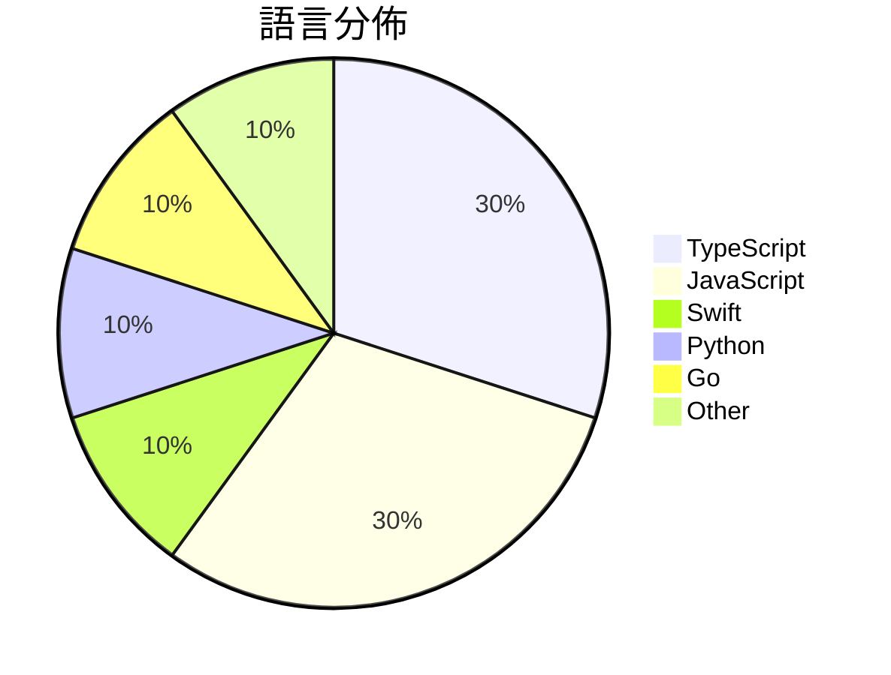

# GitHub Trending - 2026-06-10

> [!summary] 本日摘要
> 收錄 **10** 個新專案，合計 **7.0k** stars
> 語言分佈：TypeScript (3) · JavaScript (3) · Swift (1) · Python (1) · Go (1) · Other (1)

> [!tip] 本週焦點
> **[[diffusionstudio--lottie|diffusionstudio/lottie]]** — 5 天內累積 1.5k stars（300 stars/天）
> 讓開發者透過 LLM 生成即時播放的 Lottie 動畫，簡化動畫創作流程。



---

## 收錄列表

| # | 專案 | 分類 | Stars | 速度 | 安裝 | 語言 | 用途 |
| :--: | --- | --- | ---: | ---: | --- | --- | --- |
| 1 | [[diffusionstudio--lottie\|diffusionstudio/lottie]] | 開發工具 | 1.5k | 300/天 | `medium` | TypeScript | 讓開發者透過 LLM 生成即時播放的 Lottie 動畫，簡化動畫創作流程。 |
| 2 | [[NoopApp--noop\|NoopApp/noop]] | 其他 | 1.0k | 515/天 | `medium` | Swift | 離線的 WHOOP 伴侶，透過藍牙配對，將所有數據保留在自己的設備上，無需雲端、 |
| 3 | [[nevertoday--zhongguo-traditional-colors\|nevertoday/zhongguo-traditional-colors]] | 其他 | 668 | 111/天 | `easy` | JavaScript | 提供中华传统色的色卡浏览和知识科普，方便设计和内容创作。 |
| 4 | [[JimLiu--baoyu-design\|JimLiu/baoyu-design]] | 開發工具 | 638 | 213/天 | `easy` | JavaScript | 在本地運行 Claude Design 作為 Agent Skill，生成精美的 |
| 5 | [[GordenSun--GordenSuperPPTSkills\|GordenSun/GordenSuperPPTSkills]] |  | 614 | 307/天 |  | Python | AI PPT赛道终结者，史上最最最强 PPT Skill！！！  使用GPT生成 |
| 6 | [[tastyeffectco--sandboxd\|tastyeffectco/sandboxd]] | 開發工具 | 538 | 90/天 | `easy` | Go | 提供自我託管的開發沙盒，讓用戶能快速獲得獨立的開發環境和即時預覽網址。 |
| 7 | [[vorpus--performativeUI\|vorpus/performativeUI]] | 開發工具 | 521 | 261/天 | `easy` | TypeScript | 提供 AI 原生的 React 元件，顯示資金募集的超額情況。 |
| 8 | [[amElnagdy--guard-skills\|amElnagdy/guard-skills]] | 開發工具 | 517 | 172/天 | `easy` | N/A | 為編碼代理提供質量檢查，捕捉 AI 生成代碼、測試和文檔的失敗模式。 |
| 9 | [[Jane-xiaoer--xiaoer-videolab\|Jane-xiaoer/xiaoer-videolab]] | CLI 工具 | 493 | 99/天 | `medium` | JavaScript | 一鍵將當前頁面的視頻下載到本地，支持1800多個網站。 |
| 10 | [[zenhosta--9drive\|zenhosta/9drive]] | 開發工具 | 473 | 95/天 | `medium` | TypeScript | 將多個 Google Drive 帳號整合成一個虛擬儲存儀表板的存儲網關應用。 |

---

## 重點摘要

### 1. [[diffusionstudio--lottie|diffusionstudio/lottie]] `開發工具`

> 讓開發者透過 LLM 生成即時播放的 Lottie 動畫，簡化動畫創作流程。

**1.5k** stars · **300** stars/天 · TypeScript · `medium`

_建立 5 天就累積 1501 stars（300/天），forks 77（5.1%），這顯示出一定的社群關注度。作者 k9p5 和 doruk-kavcioglu 在開源社群中有一定的影響力，這個專案解決了 Lottie 動畫生成的痛點，以往開發者需要手動編輯 JSON 文件，現在可以透過 LLM 自動生成，極大地提高了效率。社群的活躍度和開放的問題追蹤讓這個專案的未來發展充滿潛力。_

---

### 2. [[NoopApp--noop|NoopApp/noop]] `其他`

> 離線的 WHOOP 伴侶，透過藍牙配對，將所有數據保留在自己的設備上，無需雲端、帳號或訂閱。

**1.0k** stars · **515** stars/天 · Swift · `medium`

_建立 2 天內累積 1029 stars（515/天），forks 574（55.8%），顯示出強烈的用戶興趣。作者 NoopApp 是一位專注於開源和用戶隱私的開發者，這個專案解決了使用 WHOOP strap 的用戶在數據隱私和控制上的痛點，之前的解決方案往往需要依賴雲端服務。近期的推特和社群討論也讓這個工具受到關注，尤其是在對隱私要求高的用戶中。高比例的 forks 表示許多開發者對此專案有實際的修改和使用需求，顯示出其在開發者社群中的活躍度。_

---

### 3. [[nevertoday--zhongguo-traditional-colors|nevertoday/zhongguo-traditional-colors]] `其他`

> 提供中华传统色的色卡浏览和知识科普，方便设计和内容创作。

**668** stars · **111** stars/天 · JavaScript · `easy`

_建立 6 天就累積 668 stars（111/天），forks 66（9.9%），這顯示出一定的社群關注度。作者nevertoday在開源社群中活躍，這個專案填補了中國傳統色資料不足的空白，特別是針對設計師和內容創作者的需求。社群對於色彩資料的需求逐漸增加，這可能是促使專案快速增長的原因之一。專案的設計理念和實用性也吸引了不少設計師的注意，進一步推動了其流行。_

---

### 4. [[JimLiu--baoyu-design|JimLiu/baoyu-design]] `開發工具`

> 在本地運行 Claude Design 作為 Agent Skill，生成精美的 UI 模擬圖、原型和線框圖，無需依賴外部網站。

**638** stars · **213** stars/天 · JavaScript · `easy`

_建立 3 天內累積 638 stars（213/天），forks 48（7.5%），顯示出強勁的增長潛力。作者 JimLiu 先前在設計和開發領域有豐富經驗，這個專案解決了設計師在使用外部網站時的依賴性問題，讓設計過程可以在本地環境中進行，避免了上傳和訂閱的麻煩。近期的社交媒體討論和開發者社群的關注也促進了這個專案的曝光。這個工具的出現正好契合了設計師對於更高效、靈活的設計流程的需求，尤其是在本地開發環境中進行設計的趨勢日益明顯。forks/stars 比率為 7.5%，顯示出有相當比例的使用者對此工具進行了實際修改和使用。_

---

### 5. [[GordenSun--GordenSuperPPTSkills|GordenSun/GordenSuperPPTSkills]]

**614** stars · **307** stars/天 · Python

---

### 6. [[tastyeffectco--sandboxd|tastyeffectco/sandboxd]] `開發工具`

> 提供自我託管的開發沙盒，讓用戶能快速獲得獨立的開發環境和即時預覽網址。

**538** stars · **90** stars/天 · Go · `easy`

_建立 6 天內累積 538 stars（90/天），forks 18（3.3%），顯示出穩定的增長潛力。作者 tastyeffectco 是一個專注於開發工具的團隊，這個專案解決了開發者在多租戶環境下的資源管理問題，之前的解決方案往往需要複雜的 Kubernetes 配置，對於小型團隊來說不夠友好。這個工具的簡化安裝和使用流程吸引了許多開發者的注意，尤其是在社群中對於自我託管解決方案的需求日益增加。最近的推文和討論也進一步提升了它的曝光率，讓更多人關注到這個專案的潛力。_

---

### 7. [[vorpus--performativeUI|vorpus/performativeUI]] `開發工具`

> 提供 AI 原生的 React 元件，顯示資金募集的超額情況。

**521** stars · **261** stars/天 · TypeScript · `easy`

_建立 2 天內累積 521 stars（261/天），forks 13（2.5%），這顯示出一定的初步關注度。作者 vorpus 及其團隊在開源社群中有一定的影響力，這個專案解決了資金募集過程中缺乏專業化元件的痛點，讓開發者能夠更容易地展示資金狀況。社群中對於這個專案的反饋也相對積極，特別是在創業者和投資者之間的互動中。技術上，這個專案的出現正好契合了當前對於資金募集透明度的需求，並且提供了一個簡單的解決方案。_

---

### 8. [[amElnagdy--guard-skills|amElnagdy/guard-skills]] `開發工具`

> 為編碼代理提供質量檢查，捕捉 AI 生成代碼、測試和文檔的失敗模式。

**517** stars · **172** stars/天 · N/A · `easy`

_建立 3 天就累積 517 stars（172/天），forks 59（11.4%），這顯示出一定的社群關注度。專案的作者在 AI 和編碼代理領域有一定的背景，這個工具解決了 AI 生成代碼質量不穩定的問題，之前的解決方案往往缺乏針對性和有效性。這個工具的推出正好填補了這一空白，並且在社群中引發了討論和關注。技術上，AI 生成代碼的普及使得這種質量檢查工具變得更加必要，尤其是在實際開發環境中。_

---

### 9. [[Jane-xiaoer--xiaoer-videolab|Jane-xiaoer/xiaoer-videolab]] `CLI 工具`

> 一鍵將當前頁面的視頻下載到本地，支持1800多個網站。

**493** stars · **99** stars/天 · JavaScript · `medium`

_建立 5 天內累積 493 stars（99/天），forks 76（15.4%），顯示出穩定的增長。開發者 Jane-xiaoer 及其團隊專注於提供一個安全的視頻下載解決方案，解決了許多現有擴展需要過多權限的問題。這個工具的出現正值用戶對隱私保護的需求上升，並且在社群中獲得了積極的反饋。GitHub 上的活動也顯示出持續的更新和維護，這有助於吸引更多用戶使用。_

---

### 10. [[zenhosta--9drive|zenhosta/9drive]] `開發工具`

> 將多個 Google Drive 帳號整合成一個虛擬儲存儀表板的存儲網關應用。

**473** stars · **95** stars/天 · TypeScript · `medium`

_建立 5 天內累積 473 stars（95/天），forks 160（33.8%），顯示出強烈的社群興趣。這個專案的主要貢獻者 Adytm404 在開源社群中有一定的影響力，並且這個工具解決了多帳號管理的痛點，因為許多用戶在使用 Google Drive 時需要管理多個帳號，但缺乏簡單的整合方案。這個工具的出現正好填補了這一需求。近期的推廣活動和社群討論也可能促進了其流行。forks/stars 比率高達 33.8%，顯示出許多人在實際修改和使用這個工具。_

---

## 今日到期複習

> [!tip] 根據間隔複習排程，今天該回顧的專案

```dataview
TABLE
  stars_per_day AS "Stars/天",
  category AS "分類",
  engagement AS "參與度"
FROM "Repos"
WHERE next_review AND date(next_review) <= date("2026-06-10") AND status != "archived"
SORT priority DESC
```

## 待處理

```dataviewjs
const pending = dv.pages('"Repos"').where(p => p.status === "to-review").length;
const unrated = dv.pages('"Repos"').where(p => p.status !== "archived" && p.status !== "to-review" && (p.my_rating || 0) === 0).length;
const noVerdict = dv.pages('"Repos"').where(p => p.status !== "archived" && (p.my_rating || 0) > 0 && (!p.verdict || p.verdict === "")).length;
const items = [];
if (pending > 0) items.push(`**${pending}** 個待分流`);
if (unrated > 0) items.push(`**${unrated}** 個已讀但未評分`);
if (noVerdict > 0) items.push(`**${noVerdict}** 個已評分但無結論`);
if (items.length > 0) dv.paragraph(items.join(" / "));
else dv.paragraph("所有專案都已處理完畢！");
```
