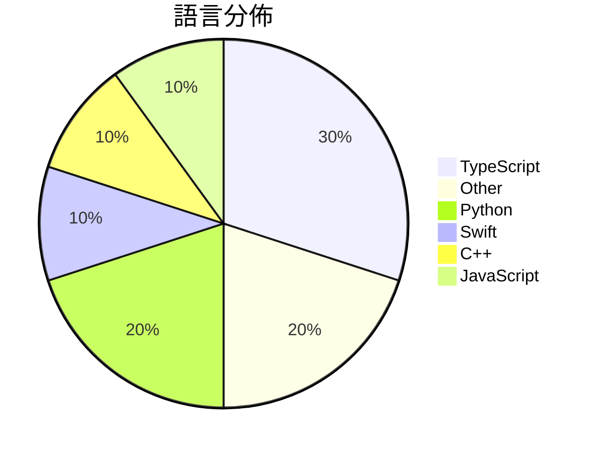

# GitHub Trending - 2026-06-11

> [!summary] 本日摘要
> 收錄 **10** 個新專案，合計 **9.1k** stars
> 語言分佈：TypeScript (3) · Other (2) · Python (2) · Swift (1) · C++ (1) · JavaScript (1)

> [!tip] 本週焦點
> **[[diffusionstudio--lottie|diffusionstudio/lottie]]** — 6 天內累積 2.0k stars（339 stars/天）
> 讓開發者透過 Claude Code 或 Codex 生成生產就緒的 Lottie 動畫。



---

## 收錄列表

| # | 專案 | 分類 | Stars | 速度 | 安裝 | 語言 | 用途 |
| :--: | --- | --- | ---: | ---: | --- | --- | --- |
| 1 | [[diffusionstudio--lottie\|diffusionstudio/lottie]] | 開發工具 | 2.0k | 339/天 | `easy` | TypeScript | 讓開發者透過 Claude Code 或 Codex 生成生產就緒的 Lotti |
| 2 | [[NoopApp--noop\|NoopApp/noop]] | 其他 | 1.4k | 465/天 | `medium` | Swift | 離線的 WHOOP 伴侶應用，透過藍牙連接你的帶子，所有數據保存在本地，無需雲端 |
| 3 | [[MSNightmare--RoguePlanet\|MSNightmare/RoguePlanet]] | 安全 | 913 | 913/天 | `medium` | C++ | 利用 Windows Defender 的競爭條件漏洞來獲取系統權限。 |
| 4 | [[shadcn--improve\|shadcn/improve]] | 開發工具 | 876 | 876/天 | `easy` | N/A | 利用最強大的模型審核代碼庫，並為較便宜的模型撰寫執行計劃。 |
| 5 | [[GordenSun--GordenSuperPPTSkills\|GordenSun/GordenSuperPPTSkills]] | 生產力 | 730 | 243/天 | `medium` | Python | 讓 AI 自動生成豪華的可編輯 PPT，簡化報告製作流程。 |
| 6 | [[JimLiu--baoyu-design\|JimLiu/baoyu-design]] | 開發工具 | 692 | 173/天 | `medium` | JavaScript | 在本地運行 Claude Design 作為 Agent Skill，生成精美的 |
| 7 | [[XiaomiMiMo--MiMo-Code\|XiaomiMiMo/MiMo-Code]] | 開發工具 | 681 | 681/天 | `easy` | TypeScript | 提供持久記憶的 AI 編碼助手，幫助開發者更高效地管理和編寫代碼。 |
| 8 | [[apple--coreai-models\|apple/coreai-models]] | AI/ML | 618 | 309/天 | `medium` | Python | 提供用於在設備上運行 AI 的模型導出配方、Python 基本元件和 Swift |
| 9 | [[vorpus--performativeUI\|vorpus/performativeUI]] | 開發工具 | 573 | 191/天 | `easy` | TypeScript | 提供 AI 原生的 React 元件，幫助用戶了解資金募集的熱度。 |
| 10 | [[amElnagdy--guard-skills\|amElnagdy/guard-skills]] | 開發工具 | 553 | 138/天 | `easy` | N/A | 為編碼代理提供質量門檻，捕捉 AI 生成的代碼、測試和文檔中的失敗模式。 |

---

## 重點摘要

### 1. [[diffusionstudio--lottie|diffusionstudio/lottie]] `開發工具`

> 讓開發者透過 Claude Code 或 Codex 生成生產就緒的 Lottie 動畫。

**2.0k** stars · **339** stars/天 · TypeScript · `easy`

_建立 6 天就累積 2032 stars（339/天），forks 101（5.0%），這顯示出其快速增長的潛力。作者 k9p5 和 doruk-kavcioglu 具備開源項目的經驗，這使得他們能夠針對開發者的需求進行優化。這個工具解決了傳統動畫製作流程繁瑣的痛點，讓開發者能夠快速生成動畫，之前的方案往往需要手動編輯和調整，效率低下。社群的反饋也顯示出對於這種生成工具的需求，特別是在設計和開發的快速迭代中。技術上，這個工具的出現得益於現代瀏覽器對於 WebAssembly 的支持，使得高效的動畫渲染成為可能。forks/stars 比率為 5.0%，顯示出有相當比例的用戶在進行實際的修改和使用。_

---

### 2. [[NoopApp--noop|NoopApp/noop]] `其他`

> 離線的 WHOOP 伴侶應用，透過藍牙連接你的帶子，所有數據保存在本地，無需雲端、帳號或訂閱。

**1.4k** stars · **465** stars/天 · Swift · `medium`

_建立 3 天內累積 1395 stars（465/天），forks 644（46.2%），這顯示出極高的用戶參與度。作者 NoopApp 之前有開發其他開源項目，這次專注於提供一個獨立的 WHOOP 替代方案，解決了用戶對數據隱私的擔憂。NOOP 的出現正好滿足了那些不想依賴雲端服務的用戶需求，並且在社群中引起了討論。這個工具的設計理念與當前數據隱私的趨勢相符，讓用戶能夠完全控制自己的數據。_

---

### 3. [[MSNightmare--RoguePlanet|MSNightmare/RoguePlanet]] `安全`

> 利用 Windows Defender 的競爭條件漏洞來獲取系統權限。

**913** stars · **913** stars/天 · C++ · `medium`

_建立 1 天就累積 913 stars（913/天），forks 393（43.0%），這顯示出極高的社群興趣。作者 MSNightmare 似乎專注於 Windows 安全漏洞的研究，這個專案解決了 Windows Defender 中一個特定的競爭條件漏洞，這在過去的安全研究中並未得到充分的關注。這個漏洞的存在讓許多使用者感到擔憂，並促使他們探索這個工具。由於該專案剛剛成立，社群的反應和使用者的互動也顯示出對這個工具的高度關注，這可能是因為它涉及到實際的安全漏洞利用，並且提供了對 Windows 系統的深入了解。_

---

### 4. [[shadcn--improve|shadcn/improve]] `開發工具`

> 利用最強大的模型審核代碼庫，並為較便宜的模型撰寫執行計劃。

**876** stars · **876** stars/天 · N/A · `easy`

_建立 1 天就累積 876 stars（876/天），forks 26（3.0%），這顯示出一定的關注度。作者 shadcn 是一位活躍的開發者，過去參與過多個開源專案，這使得他在社群中有一定的影響力。這個專案解決了代碼審核過程中高效能模型與低效能模型之間的協作問題，之前的方案通常無法有效地將這兩者結合。技術上，Agent Skills 的格式使得這個工具能夠在不同的代理中靈活運用，這是之前沒有的功能。forks/stars 比率為 3.0%，顯示出使用者對這個工具的實際修改和使用的興趣。_

---

### 5. [[GordenSun--GordenSuperPPTSkills|GordenSun/GordenSuperPPTSkills]] `生產力`

> 讓 AI 自動生成豪華的可編輯 PPT，簡化報告製作流程。

**730** stars · **243** stars/天 · Python · `medium`

_建立 3 天內累積 730 stars（243/天），forks 78（10.7%），顯示出強勁的增長潛力。作者 GordenSun 在 PPT 生成領域有豐富經驗，這個專案解決了傳統 PPT 製作繁瑣的痛點，特別是對於需要快速生成高品質內容的使用者。近期的社交媒體討論和技術論壇的關注也推動了這個專案的曝光率。技術上，GPT 的進步使得這種自動化生成變得可行，並且能夠提供更高的質量和效率。forks/stars 比率為 10.7%，顯示出許多人對這個工具的實際使用和修改需求。_

---

### 6. [[JimLiu--baoyu-design|JimLiu/baoyu-design]] `開發工具`

> 在本地運行 Claude Design 作為 Agent Skill，生成精美的 UI 模型、原型、簡報和線框圖，無需上傳至 claude.ai/design。

**692** stars · **173** stars/天 · JavaScript · `medium`

_建立 4 天內累積 692 stars（173/天），forks 54（7.8%），顯示出強勁的增長潛力。這個專案的主要貢獻者 JimLiu 及其團隊在設計和 AI 工具方面有豐富的經驗，之前的工具往往需要依賴雲端服務，這個專案解決了本地設計的需求，讓用戶能夠在不依賴外部網站的情況下進行設計。隨著設計需求的多樣化，這個工具的出現正好滿足了市場對於本地化設計工具的需求。其高效的設計流程和即時反饋機制吸引了大量設計師和開發者的關注。_

---

### 7. [[XiaomiMiMo--MiMo-Code|XiaomiMiMo/MiMo-Code]] `開發工具`

> 提供持久記憶的 AI 編碼助手，幫助開發者更高效地管理和編寫代碼。

**681** stars · **681** stars/天 · TypeScript · `easy`

_建立 1 天就累積 681 stars（681/天），forks 45（6.6%），這顯示出強烈的初期興趣。作者 qiaozongming 在開源社群中有一定的影響力，這個專案解決了開發者在多會話中管理代碼的痛點，特別是持久記憶的需求。沒有其他工具能夠如此有效地整合上下文管理和多任務處理，這使得 MiMoCode 在功能上具有獨特的優勢。社群的反饋也顯示出對於其功能的期待和改進建議，這可能會進一步推動其發展。_

---

### 8. [[apple--coreai-models|apple/coreai-models]] `AI/ML`

> 提供用於在設備上運行 AI 的模型導出配方、Python 基本元件和 Swift 運行時工具。

**618** stars · **309** stars/天 · Python · `medium`

_建立 2 天就累積 618 stars（309/天），forks 36（5.8%），顯示出相對穩定的關注度。主要貢獻者來自 Apple 的開發團隊，這些人對於 Apple 生態系統有深厚的理解。這個專案解決了將流行開源模型導出到 Apple 硬體的需求，過去開發者通常需要手動處理模型轉換，這樣的過程繁瑣且容易出錯。隨著 Apple 硬體性能的提升，對於高效能 AI 應用的需求也隨之增加，這使得這個工具的出現正好滿足了市場需求。forks/stars 比率顯示出一定的實際使用情況，這意味著有開發者在進行實際的修改和使用。_

---

### 9. [[vorpus--performativeUI|vorpus/performativeUI]] `開發工具`

> 提供 AI 原生的 React 元件，幫助用戶了解資金募集的熱度。

**573** stars · **191** stars/天 · TypeScript · `easy`

_建立 3 天就累積 573 stars（191/天），forks 14（2.4%），顯示出一定的社群關注度。作者 vorpus 是一位活躍的開發者，專注於開源項目，這個專案解決了資金募集過程中缺乏視覺化工具的痛點，讓用戶能夠更直觀地了解資金的熱度。近期的推文和社群討論可能也促進了這個專案的曝光度。技術上，React 的普及使得這個工具的需求上升，並且對於新創公司來說，這樣的元件庫能夠快速提升產品的專業度。forks/stars 比率相對較低，顯示出目前的使用者多數是觀望者，尚未進行實際的修改或使用。_

---

### 10. [[amElnagdy--guard-skills|amElnagdy/guard-skills]] `開發工具`

> 為編碼代理提供質量門檻，捕捉 AI 生成的代碼、測試和文檔中的失敗模式。

**553** stars · **138** stars/天 · N/A · `easy`

_建立 4 天就累積 553 stars（138/天），forks 61（11.0%），這顯示出強烈的初期興趣。作者 amElnagdy 之前專注於 AI 和編碼代理的開發，這個專案解決了 AI 生成內容的質量問題，這在當前的開發環境中是個迫切需求。沒有其他工具能夠如此專注於後期檢查，這使得 guard-skills 成為一個獨特的解決方案。社群的反應也表明了對這一工具的需求，尤其是在 AI 生成代碼的質量控制方面。這個工具的出現恰逢 AI 技術快速發展的時期，讓開發者能夠更好地管理 AI 生成的內容。_

---

## 今日到期複習

> [!tip] 根據間隔複習排程，今天該回顧的專案

```dataview
TABLE
  stars_per_day AS "Stars/天",
  category AS "分類",
  engagement AS "參與度"
FROM "Repos"
WHERE next_review AND date(next_review) <= date("2026-06-11") AND status != "archived"
SORT priority DESC
```

## 待處理

```dataviewjs
const pending = dv.pages('"Repos"').where(p => p.status === "to-review").length;
const unrated = dv.pages('"Repos"').where(p => p.status !== "archived" && p.status !== "to-review" && (p.my_rating || 0) === 0).length;
const noVerdict = dv.pages('"Repos"').where(p => p.status !== "archived" && (p.my_rating || 0) > 0 && (!p.verdict || p.verdict === "")).length;
const items = [];
if (pending > 0) items.push(`**${pending}** 個待分流`);
if (unrated > 0) items.push(`**${unrated}** 個已讀但未評分`);
if (noVerdict > 0) items.push(`**${noVerdict}** 個已評分但無結論`);
if (items.length > 0) dv.paragraph(items.join(" / "));
else dv.paragraph("所有專案都已處理完畢！");
```
