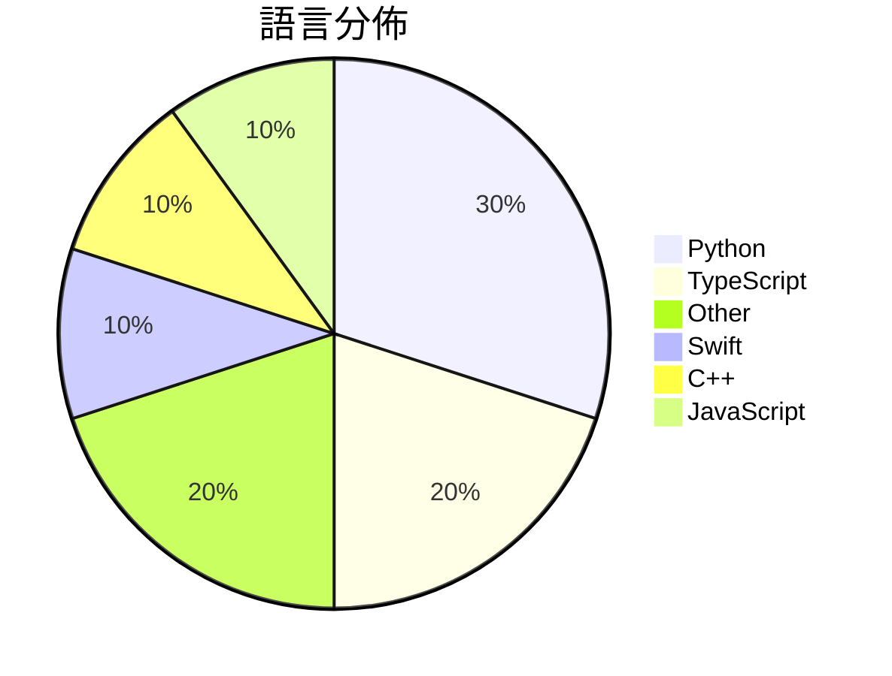

# GitHub Trending - 2026-06-12

> [!summary] 本日摘要
> 收錄 **10** 個新專案，合計 **13.2k** stars
> 語言分佈：Python (3) · TypeScript (2) · Other (2) · Swift (1) · C++ (1) · JavaScript (1)

> [!tip] 本週焦點
> **[[XiaomiMiMo--MiMo-Code|XiaomiMiMo/MiMo-Code]]** — 1 天內累積 4.7k stars（4.7k stars/天）
> 提供一個具備持久記憶的 AI 編碼助手，幫助開發者更有效率地編寫和管理代碼。



---

## 收錄列表

| # | 專案 | 分類 | Stars | 速度 | 安裝 | 語言 | 用途 |
| :--: | --- | --- | ---: | ---: | --- | --- | --- |
| 1 | [[XiaomiMiMo--MiMo-Code\|XiaomiMiMo/MiMo-Code]] | 開發工具 | 4.7k | 4.7k/天 | `easy` | TypeScript | 提供一個具備持久記憶的 AI 編碼助手，幫助開發者更有效率地編寫和管理代碼。 |
| 2 | [[shadcn--improve\|shadcn/improve]] | 開發工具 | 1.9k | 1.9k/天 | `easy` | N/A | 利用最強大的模型審核代碼庫並為較便宜的模型撰寫執行計劃。 |
| 3 | [[NoopApp--noop\|NoopApp/noop]] | 其他 | 1.5k | 371/天 | `medium` | Swift | 離線的 WHOOP 伴侶，透過藍牙配對，所有數據保留在自己的設備上，無需雲端、帳 |
| 4 | [[MSNightmare--RoguePlanet\|MSNightmare/RoguePlanet]] | 安全 | 1.1k | 560/天 | `medium` | C++ | 利用 Windows Defender 的競爭條件漏洞來獲取系統權限。 |
| 5 | [[GordenSun--GordenSuperPPTSkills\|GordenSun/GordenSuperPPTSkills]] | 生產力 | 788 | 197/天 | `medium` | Python | 讓 AI 自動生成豪華的 PPT，並轉換為可編輯的 PPTX 文件。 |
| 6 | [[JimLiu--baoyu-design\|JimLiu/baoyu-design]] | 開發工具 | 772 | 154/天 | `easy` | JavaScript | 在本地運行 Claude Design 作為 Agent Skill，無需上傳， |
| 7 | [[apple--coreai-models\|apple/coreai-models]] | AI/ML | 742 | 247/天 | `medium` | Python | 提供模型導出配方、Python 原語和 Swift 運行時工具，方便在設備上進行 |
| 8 | [[vorpus--performativeUI\|vorpus/performativeUI]] | 開發工具 | 605 | 151/天 | `easy` | TypeScript | 提供 AI 原生的 React 元件，幫助用戶了解資金募集的熱度。 |
| 9 | [[amElnagdy--guard-skills\|amElnagdy/guard-skills]] | 開發工具 | 571 | 114/天 | `easy` | N/A | 為編碼代理提供質量檢查，捕捉 AI 生成的代碼、測試和文檔中的失敗模式。 |
| 10 | [[Tencent-Hunyuan--UniRL\|Tencent-Hunyuan/UniRL]] | AI/ML | 524 | 175/天 | `medium` | Python | 提供統一的多模態模型強化學習框架，簡化多種模型的訓練流程。 |

---

## 重點摘要

### 1. [[XiaomiMiMo--MiMo-Code|XiaomiMiMo/MiMo-Code]] `開發工具`

> 提供一個具備持久記憶的 AI 編碼助手，幫助開發者更有效率地編寫和管理代碼。

**4.7k** stars · **4.7k** stars/天 · TypeScript · `easy`

_建立 1 天就累積 4740 stars（4740/天），forks 361（7.6%），顯示出強烈的社群興趣。作者 qiaozongming 和團隊在開源社群中有一定的知名度，這個專案解決了開發者在多會話間保持上下文的痛點，這在傳統的 IDE 或編輯器中通常難以實現。近期的推廣活動和社群互動可能也促進了這個專案的快速增長。_

---

### 2. [[shadcn--improve|shadcn/improve]] `開發工具`

> 利用最強大的模型審核代碼庫並為較便宜的模型撰寫執行計劃。

**1.9k** stars · **1.9k** stars/天 · N/A · `easy`

_建立 1 天就累積 1851 stars（1851/天），forks 63（3.4%），這顯示出相對較高的關注度。作者 shadcn 在開源社群中有一定的影響力，過去也參與了多個相關專案。這個工具解決了代碼審核和執行計劃生成的痛點，之前的方案往往需要開發者手動進行，效率低下且容易出錯。近期的技術討論和社群反饋也促進了這個專案的曝光。這個工具的設計使得代碼審核變得更為高效，並且能夠在多種環境中運行，這是其受歡迎的原因之一。_

---

### 3. [[NoopApp--noop|NoopApp/noop]] `其他`

> 離線的 WHOOP 伴侶，透過藍牙配對，所有數據保留在自己的設備上，無需雲端、帳號或訂閱。

**1.5k** stars · **371** stars/天 · Swift · `medium`

_建立 4 天就累積 1482 stars（370.5/天），forks 670（45.2%），這顯示出用戶對於數據隱私的強烈需求。作者 NoopApp 是一位專注於開源和用戶隱私的開發者，之前有過相關項目的經驗。NOOP 解決了用戶在使用 WHOOP 腕帶時無法擁有數據控制權的痛點，因為傳統的 WHOOP 應用需要雲端帳號和訂閱。這個工具的出現正好滿足了對隱私和數據擁有權的需求，並且在社群中引發了熱烈討論。隨著越來越多的人關注數據隱私，NOOP 的受歡迎程度也隨之上升。_

---

### 4. [[MSNightmare--RoguePlanet|MSNightmare/RoguePlanet]] `安全`

> 利用 Windows Defender 的競爭條件漏洞來獲取系統權限。

**1.1k** stars · **560** stars/天 · C++ · `medium`

_建立 2 天就累積 1119 stars（560/天），forks 471（42.1%），顯示出極高的社群關注度。作者 MSNightmare 在安全研究領域有一定的知名度，這個專案解決了 Windows Defender 中一個具體的漏洞，之前缺乏有效的利用工具。該漏洞的存在讓許多 Windows 用戶面臨安全風險，這引發了社群的廣泛討論和興趣。短時間內的高反響可能與社群對於安全研究的熱情有關，特別是在 Windows 環境中的漏洞利用。這個專案的成功率和使用環境的變化也吸引了許多安全研究者的注意，促進了討論和合作的可能性。_

---

### 5. [[GordenSun--GordenSuperPPTSkills|GordenSun/GordenSuperPPTSkills]] `生產力`

> 讓 AI 自動生成豪華的 PPT，並轉換為可編輯的 PPTX 文件。

**788** stars · **197** stars/天 · Python · `medium`

_建立 4 天內累積 788 stars（197/天），forks 82（10.4%），顯示出強烈的使用需求。作者 GordenSun 是一位專注於 AI 和 PPT 工具的開發者，這個專案解決了傳統 PPT 工具在生成高品質簡報時的效率問題。之前的工具往往需要大量手動操作，而這個工具通過自動化流程大幅簡化了這一過程。社群對於這個工具的反應熱烈，顯示出對於高效簡報生成的需求。這個工具的成功也反映了 AI 技術在日常工作中的實用性，尤其是在簡報製作方面。_

---

### 6. [[JimLiu--baoyu-design|JimLiu/baoyu-design]] `開發工具`

> 在本地運行 Claude Design 作為 Agent Skill，無需上傳，直接生成 UI 模擬圖、原型及 HTML 檔案。

**772** stars · **154** stars/天 · JavaScript · `easy`

_建立 5 天內累積 772 stars（154/天），forks 60（7.8%），顯示出該專案的快速增長。作者 JimLiu 之前在設計工具領域有一定的經驗，這個專案解決了用戶在使用在線設計工具時的依賴問題，讓設計過程更加靈活。該專案的推出正好滿足了對本地設計工具需求的增長，特別是在開發者社群中。這個工具的設計理念和功能吸引了許多開發者的注意，並促進了其快速擴散。_

---

### 7. [[apple--coreai-models|apple/coreai-models]] `AI/ML`

> 提供模型導出配方、Python 原語和 Swift 運行時工具，方便在設備上進行 AI 開發。

**742** stars · **247** stars/天 · Python · `medium`

_建立 3 天內累積 742 stars（247/天），forks 50（6.7%），顯示出強勁的增長潛力。這個專案的主要貢獻者來自 Apple 的開發團隊，過去在 AI 和 Swift 生態系統有豐富經驗。它解決了在 Apple 設備上運行 AI 模型的需求，特別是針對 Core AI 的專用工具，這在其他開源方案中並不常見。近期的推文和社群討論也引起了對於新模型支持的需求，進一步推動了專案的關注度。隨著 Apple 生態系統的持續擴展，這個工具的實用性和需求只會增加。forks/stars 比率顯示出使用者對於這個專案的興趣，且有不少人開始進行實際修改和使用。_

---

### 8. [[vorpus--performativeUI|vorpus/performativeUI]] `開發工具`

> 提供 AI 原生的 React 元件，幫助用戶了解資金募集的熱度。

**605** stars · **151** stars/天 · TypeScript · `easy`

_建立 4 天內累積 605 stars（151/天），forks 15（2.5%），這顯示出一定的市場需求和興趣。作者 vorpus 似乎專注於開發針對 AI 和資金募集的工具，這在目前的創業環境中是個不錯的切入點。這個專案解決了傳統 UI 元件庫無法針對資金募集進行專門設計的痛點，提供了更具針對性的解決方案。社群的反應和熱門 Issues 也顯示出用戶對於功能擴展的需求，這可能會進一步推動專案的發展。_

---

### 9. [[amElnagdy--guard-skills|amElnagdy/guard-skills]] `開發工具`

> 為編碼代理提供質量檢查，捕捉 AI 生成的代碼、測試和文檔中的失敗模式。

**571** stars · **114** stars/天 · N/A · `easy`

_建立 5 天就累積 571 stars（114/天），forks 63（11.0%），顯示出良好的增長潛力。專案的作者在 AI 和編碼代理領域有一定的背景，這使得他們能夠針對 AI 生成代碼的質量問題提出解決方案。這個工具填補了市場上對於 AI 生成代碼質量檢查的需求，特別是在代碼審查過程中，能有效捕捉到 AI 生成的錯誤。社群對於這個工具的反應積極，顯示出對於 AI 生成內容的質量控制有著強烈的需求。_

---

### 10. [[Tencent-Hunyuan--UniRL|Tencent-Hunyuan/UniRL]] `AI/ML`

> 提供統一的多模態模型強化學習框架，簡化多種模型的訓練流程。

**524** stars · **175** stars/天 · Python · `medium`

_建立 3 天內累積 524 stars（175/天），forks 28（5.3%），顯示出穩定的增長潛力。這個專案的主要貢獻者來自於 Tencent-Hunyuan 團隊，過去在強化學習和多模態模型方面有豐富的經驗。UniRL 解決了在多模態學習中，模型訓練過程複雜且不易管理的痛點，提供了一個統一的框架來簡化這一過程。近期的推文和討論也引起了社群的關注，進一步推動了其流行。這個工具的出現正好契合了強化學習和多模態模型快速發展的趨勢，並且其設計理念符合當前對於靈活性和可擴展性的需求。_

---

## 今日到期複習

> [!tip] 根據間隔複習排程，今天該回顧的專案

```dataview
TABLE
  stars_per_day AS "Stars/天",
  category AS "分類",
  engagement AS "參與度"
FROM "Repos"
WHERE next_review AND date(next_review) <= date("2026-06-12") AND status != "archived"
SORT priority DESC
```

## 待處理

```dataviewjs
const pending = dv.pages('"Repos"').where(p => p.status === "to-review").length;
const unrated = dv.pages('"Repos"').where(p => p.status !== "archived" && p.status !== "to-review" && (p.my_rating || 0) === 0).length;
const noVerdict = dv.pages('"Repos"').where(p => p.status !== "archived" && (p.my_rating || 0) > 0 && (!p.verdict || p.verdict === "")).length;
const items = [];
if (pending > 0) items.push(`**${pending}** 個待分流`);
if (unrated > 0) items.push(`**${unrated}** 個已讀但未評分`);
if (noVerdict > 0) items.push(`**${noVerdict}** 個已評分但無結論`);
if (items.length > 0) dv.paragraph(items.join(" / "));
else dv.paragraph("所有專案都已處理完畢！");
```
