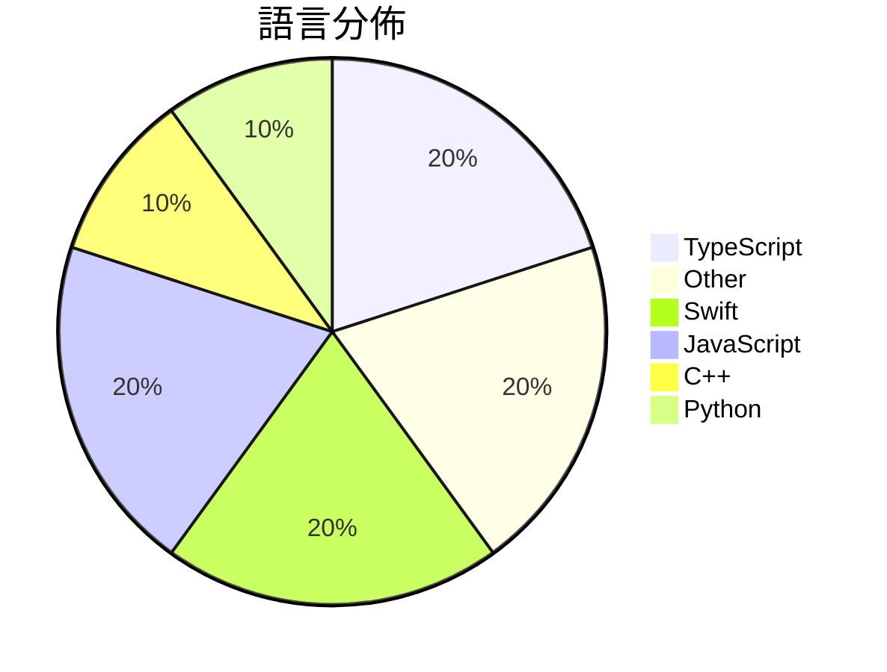

# GitHub Trending - 2026-06-13

> [!summary] 本日摘要
> 收錄 **10** 個新專案，合計 **16.8k** stars
> 語言分佈：TypeScript (2) · Other (2) · Swift (2) · JavaScript (2) · C++ (1) · Python (1)

> [!tip] 本週焦點
> **[[XiaomiMiMo--MiMo-Code|XiaomiMiMo/MiMo-Code]]** — 2 天內累積 6.9k stars（3.4k stars/天）
> 提供跨會話記憶的 AI 編碼助手，幫助開發者更高效地管理代碼與任務。



---

## 收錄列表

| # | 專案 | 分類 | Stars | 速度 | 安裝 | 語言 | 用途 |
| :--: | --- | --- | ---: | ---: | --- | --- | --- |
| 1 | [[XiaomiMiMo--MiMo-Code\|XiaomiMiMo/MiMo-Code]] | 開發工具 | 6.9k | 3.4k/天 | `easy` | TypeScript | 提供跨會話記憶的 AI 編碼助手，幫助開發者更高效地管理代碼與任務。 |
| 2 | [[shadcn--improve\|shadcn/improve]] | 開發工具 | 2.4k | 1.2k/天 | `easy` | N/A | 利用最強大的模型審核你的代碼庫並為便宜的模型撰寫執行計畫。 |
| 3 | [[NoopApp--noop\|NoopApp/noop]] | 其他 | 1.5k | 309/天 | `medium` | Swift | 離線的 WHOOP 伴侶，透過藍牙配對你的帶子，所有數據都保留在本地，不需雲端、 |
| 4 | [[MSNightmare--RoguePlanet\|MSNightmare/RoguePlanet]] | 安全 | 1.2k | 406/天 | `medium` | C++ | 利用 Windows Defender 漏洞實現系統權限提升的工具。 |
| 5 | [[DietrichGebert--ponytail\|DietrichGebert/ponytail]] | 開發工具 | 939 | 939/天 | `easy` | JavaScript | 讓 AI agent 像最懶的資深開發者一樣思考，最佳的代碼是你從未寫過的代碼。 |
| 6 | [[GordenSun--GordenSuperPPTSkills\|GordenSun/GordenSuperPPTSkills]] |  | 846 | 169/天 |  | Python | AI PPT赛道终结者，史上最最最强 PPT Skill！！！  使用GPT生成 |
| 7 | [[apple--coreai-models\|apple/coreai-models]] | AI/ML | 834 | 209/天 | `medium` | Swift | 提供模型匯出食譜、Python 原語和 Swift 運行時工具，讓 AI 模型能 |
| 8 | [[JimLiu--baoyu-design\|JimLiu/baoyu-design]] | 開發工具 | 830 | 138/天 | `easy` | JavaScript | 在本地運行 Claude Design 作為 Agent Skill，生成精美的 |
| 9 | [[vorpus--performativeUI\|vorpus/performativeUI]] | 開發工具 | 661 | 132/天 | `easy` | TypeScript | 提供 AI 原生的 React 元件，幫助用戶了解其融資輪的超額認購情況。 |
| 10 | [[amElnagdy--guard-skills\|amElnagdy/guard-skills]] | 開發工具 | 601 | 100/天 | `easy` | N/A | 為編碼代理提供質量檢查，捕捉 AI 生成的代碼、測試和文檔中的失敗模式。 |

---

## 重點摘要

### 1. [[XiaomiMiMo--MiMo-Code|XiaomiMiMo/MiMo-Code]] `開發工具`

> 提供跨會話記憶的 AI 編碼助手，幫助開發者更高效地管理代碼與任務。

**6.9k** stars · **3.4k** stars/天 · TypeScript · `easy`

_建立 2 天就累積 6887 stars（3444/天），forks 546（7.9%），這顯示出強烈的社群興趣。作者 qiaozongming 和團隊背景不明，但他們解決了開發者在多會話中記憶管理的痛點，這在傳統工具中往往需要手動處理。專案的快速增長可能受到社群的積極反饋和對 AI 助手需求的驅動。_

---

### 2. [[shadcn--improve|shadcn/improve]] `開發工具`

> 利用最強大的模型審核你的代碼庫並為便宜的模型撰寫執行計畫。

**2.4k** stars · **1.2k** stars/天 · N/A · `easy`

_建立 2 天就累積 2445 stars（1223/天），forks 87（3.6%），這顯示出相對穩定的關注度。作者 shadcn 是一位活躍的開發者，過去參與多個開源專案，這個工具解決了代碼審核過程中使用高效模型進行智能分析的痛點，之前的工具往往無法有效分配資源。近期的推廣和社群討論也可能促進了其曝光率。這個工具的設計理念符合當前對於代碼質量和自動化的需求，並且在技術生態中提供了一種新的解決方案。forks/stars 比率偏低，顯示出使用者對於這個工具的實際應用仍在觀望階段。_

---

### 3. [[NoopApp--noop|NoopApp/noop]] `其他`

> 離線的 WHOOP 伴侶，透過藍牙配對你的帶子，所有數據都保留在本地，不需雲端、帳號或訂閱。

**1.5k** stars · **309** stars/天 · Swift · `medium`

_建立 5 天就累積 1544 stars（309/天），forks 691（44.8%），這顯示出強烈的社群參與度。這個專案的作者 NoopApp 針對 WHOOP 帶子的數據隱私需求提供了解決方案，之前的官方應用需要雲端帳號，這讓許多用戶感到不安。NOOP 的出現正好填補了這個市場空白，並且在 Reddit 和 GitHub 上引發了討論，進一步推動了其流行。技術上，隨著用戶對數據隱私的重視，NOOP 的本地優先設計變得越來越受歡迎，這也是其快速增長的原因之一。_

---

### 4. [[MSNightmare--RoguePlanet|MSNightmare/RoguePlanet]] `安全`

> 利用 Windows Defender 漏洞實現系統權限提升的工具。

**1.2k** stars · **406** stars/天 · C++ · `medium`

_建立 3 天就累積 1218 stars（406/天），forks 509（41.8%），這顯示出強烈的社群關注。作者 MSNightmare 之前在安全研究領域有一定的知名度，這個專案解決了 Windows 系統中一個特定的漏洞問題，之前的工具未能針對 Windows Defender 提供有效的利用方案。該專案的推出引發了社群的熱烈討論，尤其是在安全研究者和開發者之間。技術上，Windows 系統的安全性一直是熱門話題，這使得相關工具的需求持續上升。forks/stars 比率高達 41.8%，顯示出許多開發者在實際修改和使用該工具。_

---

### 5. [[DietrichGebert--ponytail|DietrichGebert/ponytail]] `開發工具`

> 讓 AI agent 像最懶的資深開發者一樣思考，最佳的代碼是你從未寫過的代碼。

**939** stars · **939** stars/天 · JavaScript · `easy`

_建立 1 天就累積 939 stars（939/天），forks 42（4.5%），這顯示出相對穩定的興趣增長。作者 DietrichGebert 之前在開源社群活躍，這個專案解決了開發者在代碼冗長和維護困難上的痛點，提供了一個簡化的代碼生成方式。技術上，AI 生成代碼的需求不斷上升，這使得 Ponytail 的出現恰逢其時。forks/stars 比率在 4.5%，顯示出有一定數量的開發者在實際修改和使用這個工具。_

---

### 6. [[GordenSun--GordenSuperPPTSkills|GordenSun/GordenSuperPPTSkills]]

**846** stars · **169** stars/天 · Python

---

### 7. [[apple--coreai-models|apple/coreai-models]] `AI/ML`

> 提供模型匯出食譜、Python 原語和 Swift 運行時工具，讓 AI 模型能在設備上運行。

**834** stars · **209** stars/天 · Swift · `medium`

_建立 4 天內累積 834 stars（209/天），forks 61（7.3%），顯示出不錯的社群參與度。這個專案由 Apple 團隊主導，解決了在 Apple 硬體上運行 AI 模型的需求，並提供了簡化的匯出流程。之前，開發者在 Apple 硬體上運行 AI 模型時，常常需要面對複雜的轉換和兼容性問題，而這個專案的出現簡化了這一過程。社群中的反饋和需求也促進了這個專案的快速成長，特別是對於 Qwen 3.6 的支援請求，顯示出開發者對於最新模型的需求。_

---

### 8. [[JimLiu--baoyu-design|JimLiu/baoyu-design]] `開發工具`

> 在本地運行 Claude Design 作為 Agent Skill，生成精美的 UI 原型和設計稿。

**830** stars · **138** stars/天 · JavaScript · `easy`

_建立 6 天內累積 830 stars（138/天），forks 65（7.8%），顯示出不錯的增長潛力。作者 JimLiu 擁有開發多個相關工具的經驗，這個專案解決了設計師需要依賴網頁工具的痛點，提供了一個本地化的解決方案。此專案的推出正值設計工具需求上升的時期，尤其是在遠端工作環境中，使用者對於本地化工具的需求愈加迫切。高達 100% 的 issue 解決率也顯示出活躍的維護和支持。forks/stars 比率為 7.8%，顯示出有相當比例的使用者在實際修改和使用這個工具。_

---

### 9. [[vorpus--performativeUI|vorpus/performativeUI]] `開發工具`

> 提供 AI 原生的 React 元件，幫助用戶了解其融資輪的超額認購情況。

**661** stars · **132** stars/天 · TypeScript · `easy`

_建立 5 天內累積 661 stars（132/天），forks 16（2.4%），顯示出一定的關注度。作者 vorpus 是一位活躍的開發者，過去有多個開源專案，這次專案解決了傳統 UI 元件庫無法針對融資狀況進行即時反饋的痛點。這個專案的推出吸引了不少關注，尤其是在初創公司和投資者之間。社群中對於這個工具的需求也促使了其快速成長，並且目前的 forks/stars 比率顯示出使用者對於這個工具的實際修改意願不高，可能是因為它的功能相對專一。_

---

### 10. [[amElnagdy--guard-skills|amElnagdy/guard-skills]] `開發工具`

> 為編碼代理提供質量檢查，捕捉 AI 生成的代碼、測試和文檔中的失敗模式。

**601** stars · **100** stars/天 · N/A · `easy`

_建立 6 天內累積 601 stars（100/天），forks 68（11.3%），顯示出不錯的增長潛力。這個專案由 amElnagdy 開發，他在 AI 和編碼代理領域有一定的經驗。這個工具解決了 AI 生成代碼中常見的質量問題，之前的解決方案往往缺乏針對性，無法有效捕捉 AI 特有的錯誤模式。近期的社群討論和需求增加，促進了這個工具的快速成長。技術上，AI 生成內容的普及使得這類質量檢查工具變得越來越重要，尤其是在開發流程中。forks/stars 比率為 11.3%，顯示出不少開發者對此工具的實際應用感興趣。_

---

## 今日到期複習

> [!tip] 根據間隔複習排程，今天該回顧的專案

```dataview
TABLE
  stars_per_day AS "Stars/天",
  category AS "分類",
  engagement AS "參與度"
FROM "Repos"
WHERE next_review AND date(next_review) <= date("2026-06-13") AND status != "archived"
SORT priority DESC
```

## 待處理

```dataviewjs
const pending = dv.pages('"Repos"').where(p => p.status === "to-review").length;
const unrated = dv.pages('"Repos"').where(p => p.status !== "archived" && p.status !== "to-review" && (p.my_rating || 0) === 0).length;
const noVerdict = dv.pages('"Repos"').where(p => p.status !== "archived" && (p.my_rating || 0) > 0 && (!p.verdict || p.verdict === "")).length;
const items = [];
if (pending > 0) items.push(`**${pending}** 個待分流`);
if (unrated > 0) items.push(`**${unrated}** 個已讀但未評分`);
if (noVerdict > 0) items.push(`**${noVerdict}** 個已評分但無結論`);
if (items.length > 0) dv.paragraph(items.join(" / "));
else dv.paragraph("所有專案都已處理完畢！");
```
