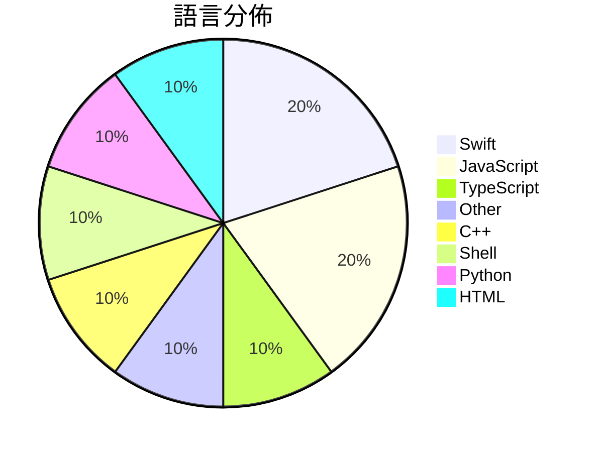

# GitHub Trending - 2026-06-14

> [!summary] 本日摘要
> 收錄 **10** 個新專案，合計 **20.2k** stars
> 語言分佈：Swift (2) · JavaScript (2) · TypeScript (1) · Other (1) · C++ (1) · Shell (1) · Python (1) · HTML (1)

> [!tip] 本週焦點
> **[[XiaomiMiMo--MiMo-Code|XiaomiMiMo/MiMo-Code]]** — 3 天內累積 7.9k stars（2.6k stars/天）
> 提供 AI 驅動的開發工具，具備跨會話記憶功能。



---

## 收錄列表

| # | 專案 | 分類 | Stars | 速度 | 安裝 | 語言 | 用途 |
| :--: | --- | --- | ---: | ---: | --- | --- | --- |
| 1 | [[XiaomiMiMo--MiMo-Code\|XiaomiMiMo/MiMo-Code]] | 開發工具 | 7.9k | 2.6k/天 | `easy` | TypeScript | 提供 AI 驅動的開發工具，具備跨會話記憶功能。 |
| 2 | [[shadcn--improve\|shadcn/improve]] | 開發工具 | 3.4k | 1.1k/天 | `easy` | N/A | 利用最強大的模型審核代碼庫並為便宜的模型撰寫執行計畫。 |
| 3 | [[NoopApp--noop\|NoopApp/noop]] | 其他 | 1.6k | 268/天 | `medium` | Swift | 離線的 WHOOP 伴侶，透過藍牙配對你的帶子，所有數據保留在你自己的設備上，無 |
| 4 | [[DietrichGebert--ponytail\|DietrichGebert/ponytail]] | 開發工具 | 1.5k | 771/天 | `easy` | JavaScript | 讓 AI 代理像最懶的資深開發者一樣思考，寫出更少的代碼。 |
| 5 | [[MSNightmare--RoguePlanet\|MSNightmare/RoguePlanet]] | 安全 | 1.3k | 313/天 | `medium` | C++ | 利用 Windows Defender 的競爭條件漏洞來獲取系統權限。 |
| 6 | [[SkyBlue997--enableMacosAI\|SkyBlue997/enableMacosAI]] | 其他 | 996 | 332/天 | `easy` | Shell | 讓國行 Mac 一鍵啟用完整的 Apple 智能功能。 |
| 7 | [[JimLiu--baoyu-design\|JimLiu/baoyu-design]] | 開發工具 | 943 | 135/天 | `easy` | JavaScript | 在本地運行 Claude Design 作為代理技能，生成精美的 UI 模擬圖、 |
| 8 | [[GordenSun--GordenSuperPPTSkills\|GordenSun/GordenSuperPPTSkills]] |  | 885 | 148/天 |  | Python | AI PPT赛道终结者，史上最最最强 PPT Skill！！！  使用GPT生成 |
| 9 | [[apple--coreai-models\|apple/coreai-models]] | AI/ML | 872 | 174/天 | `medium` | Swift | 提供模型匯出食譜、Python 原始碼和 Swift 運行時工具，專為在裝置上運 |
| 10 | [[plannotator--effective-html\|plannotator/effective-html]] | 開發工具 | 753 | 188/天 | `easy` | HTML | 生成優雅且簡單的 HTML 計畫、架構圖或其他視覺化文檔。 |

---

## 重點摘要

### 1. [[XiaomiMiMo--MiMo-Code|XiaomiMiMo/MiMo-Code]] `開發工具`

> 提供 AI 驅動的開發工具，具備跨會話記憶功能。

**7.9k** stars · **2.6k** stars/天 · TypeScript · `easy`

_建立 3 天內累積 7947 stars（2649/天），forks 657（8.3%），顯示出強烈的社群興趣。作者 qiaozongming 和團隊過去在開源社群中活躍，這個專案解決了開發者在多會話環境中管理代碼和記憶的痛點。之前的工具如 OpenCode 雖然功能強大，但缺乏持久記憶和智能上下文管理，這使得 MiMoCode 在功能上有明顯的優勢。社群的反饋和熱門 Issues 顯示出使用者對於功能改進的需求，這可能會進一步推動專案的發展。_

---

### 2. [[shadcn--improve|shadcn/improve]] `開發工具`

> 利用最強大的模型審核代碼庫並為便宜的模型撰寫執行計畫。

**3.4k** stars · **1.1k** stars/天 · N/A · `easy`

_建立 3 天就累積 3424 stars（1141/天），forks 120（3.5%），這顯示出強烈的興趣和潛在的實際應用。作者 shadcn 及其團隊在開源社群中有一定的影響力，過去參與過多個成功的開源專案。這個專案解決了代碼審核過程中的效率問題，以前的工具往往無法有效地將審核結果轉化為可執行的計畫。社群對於這種新型的代碼審核方式表現出極大的興趣，尤其是在需要快速迭代的開發環境中。這種工具的出現正好契合了當前對於自動化和智能化開發流程的需求。_

---

### 3. [[NoopApp--noop|NoopApp/noop]] `其他`

> 離線的 WHOOP 伴侶，透過藍牙配對你的帶子，所有數據保留在你自己的設備上，無需雲端、帳號或訂閱。

**1.6k** stars · **268** stars/天 · Swift · `medium`

_建立 6 天就累積 1605 stars（268/天），forks 700（43.6%），這顯示出強烈的社群參與。NOOP 的開發者 NoopApp 專注於提供用戶擁有數據的權利，這在當前數據隱私日益受到重視的背景下，解決了許多用戶對於數據安全的擔憂。這個專案的推出正好滿足了對於個人健康數據管理的需求，並且在 Reddit 和其他社群平台上引發了討論。技術上，NOOP 利用本地數據處理的方式，避免了依賴雲端服務的風險，這使得它在類似工具中脫穎而出。高達 43.6% 的 forks/stars 比率顯示出許多開發者對這個專案的興趣，可能會進行自定義或擴展。_

---

### 4. [[DietrichGebert--ponytail|DietrichGebert/ponytail]] `開發工具`

> 讓 AI 代理像最懶的資深開發者一樣思考，寫出更少的代碼。

**1.5k** stars · **771** stars/天 · JavaScript · `easy`

_建立 2 天就累積 1541 stars（771/天），forks 70（4.5%），這顯示出對於簡化代碼的需求正在增長。作者 DietrichGebert 之前有多個成功的開源專案，這次專案解決了開發過程中代碼冗餘的痛點，讓開發者能夠更專注於業務邏輯而非代碼細節。此專案的出現正好契合了當前對於高效開發的需求，並且在社群中引起了討論。forks/stars 比率 4.5% 表示使用者對於這個工具的實際應用有一定的興趣。_

---

### 5. [[MSNightmare--RoguePlanet|MSNightmare/RoguePlanet]] `安全`

> 利用 Windows Defender 的競爭條件漏洞來獲取系統權限。

**1.3k** stars · **313** stars/天 · C++ · `medium`

_建立 4 天內累積 1252 stars（313/天），forks 519（41.5%），顯示出強烈的社群關注。作者 MSNightmare 是安全領域的活躍貢獻者，過去曾針對多個安全漏洞進行研究。這個專案解決了 Windows Defender 的一個具體漏洞，之前的工具無法有效利用此漏洞，讓安全研究者能夠更深入地測試系統的安全性。近期的社交媒體討論和技術論壇的關注也促進了這個專案的曝光度。高達 41.5% 的 forks/stars 比率顯示出許多開發者對此專案進行了實際修改和使用，這代表著社群對於這個工具的實用性有著高度的興趣。_

---

### 6. [[SkyBlue997--enableMacosAI|SkyBlue997/enableMacosAI]] `其他`

> 讓國行 Mac 一鍵啟用完整的 Apple 智能功能。

**996** stars · **332** stars/天 · Shell · `easy`

_建立 3 天內累積 996 stars（332/天），forks 51（5.1%），顯示出強烈的用戶需求。作者 SkyBlue997 針對 Apple 智能的解鎖，提供了一個簡單且有效的解決方案，填補了國行 Mac 用戶無法使用完整 Apple 智能的痛點。此工具的出現引起了社群的廣泛關注，特別是在國行 Mac 用戶中。由於 Apple 智能功能的需求日益增加，這個工具的可行性和實用性也隨之提升。高比例的 forks/stars 表示許多用戶正在積極修改和使用這個工具，顯示出其潛在的社群支持。_

---

### 7. [[JimLiu--baoyu-design|JimLiu/baoyu-design]] `開發工具`

> 在本地運行 Claude Design 作為代理技能，生成精美的 UI 模擬圖、原型、簡報和線框圖。

**943** stars · **135** stars/天 · JavaScript · `easy`

_建立 7 天內累積 943 stars（134.7/天），forks 70（7.4%），顯示出不錯的增長潛力。作者 JimLiu 之前在設計和代理技能方面有豐富經驗，這個專案解決了設計工具需要依賴網路和訂閱的痛點，讓用戶能夠在本地環境中自由創作。最近的推廣活動和社群討論也提升了它的曝光率。技術上，這個工具的出現得益於本地運行 AI 模型的可行性，讓設計過程更為高效。forks/stars 比率適中，顯示出使用者對於這個工具的實際修改和使用意圖。_

---

### 8. [[GordenSun--GordenSuperPPTSkills|GordenSun/GordenSuperPPTSkills]]

**885** stars · **148** stars/天 · Python

---

### 9. [[apple--coreai-models|apple/coreai-models]] `AI/ML`

> 提供模型匯出食譜、Python 原始碼和 Swift 運行時工具，專為在裝置上運行 AI 而設計。

**872** stars · **174** stars/天 · Swift · `medium`

_建立 5 天內累積 872 stars（174/天），forks 64（7.3%），顯示出穩定的增長潛力。這個專案由 Apple 團隊開發，專注於解決在 Apple 生態系統中運行 AI 模型的需求，之前的解決方案往往缺乏針對性和整合性。近期的 GitHub 討論和需求反映了開發者對於 Qwen 3.6 支持的強烈需求，顯示出社群的活躍度。隨著 Apple 硬體的普及，這個工具的需求將持續增長，特別是在移動設備上的 AI 應用方面。_

---

### 10. [[plannotator--effective-html|plannotator/effective-html]] `開發工具`

> 生成優雅且簡單的 HTML 計畫、架構圖或其他視覺化文檔。

**753** stars · **188** stars/天 · HTML · `easy`

_建立 4 天就累積 753 stars（188/天），forks 48（6.4%），這顯示出一定的市場需求。主要貢獻者 backnotprop 和 velaswami 在開源社群中有一定的影響力，這可能吸引了不少關注。這個專案解決了生成高品質 HTML 視覺化文檔的需求，之前的工具往往缺乏針對性的功能。近期的推文和社群討論也可能促進了這個專案的曝光。隨著對視覺化工具需求的增加，這個專案的出現正好填補了市場空白。forks/stars 比率在 6.4% 屬於中等，顯示出有一定的開發者在實際修改和使用這個工具。_

---

## 今日到期複習

> [!tip] 根據間隔複習排程，今天該回顧的專案

```dataview
TABLE
  stars_per_day AS "Stars/天",
  category AS "分類",
  engagement AS "參與度"
FROM "Repos"
WHERE next_review AND date(next_review) <= date("2026-06-14") AND status != "archived"
SORT priority DESC
```

## 待處理

```dataviewjs
const pending = dv.pages('"Repos"').where(p => p.status === "to-review").length;
const unrated = dv.pages('"Repos"').where(p => p.status !== "archived" && p.status !== "to-review" && (p.my_rating || 0) === 0).length;
const noVerdict = dv.pages('"Repos"').where(p => p.status !== "archived" && (p.my_rating || 0) > 0 && (!p.verdict || p.verdict === "")).length;
const items = [];
if (pending > 0) items.push(`**${pending}** 個待分流`);
if (unrated > 0) items.push(`**${unrated}** 個已讀但未評分`);
if (noVerdict > 0) items.push(`**${noVerdict}** 個已評分但無結論`);
if (items.length > 0) dv.paragraph(items.join(" / "));
else dv.paragraph("所有專案都已處理完畢！");
```
