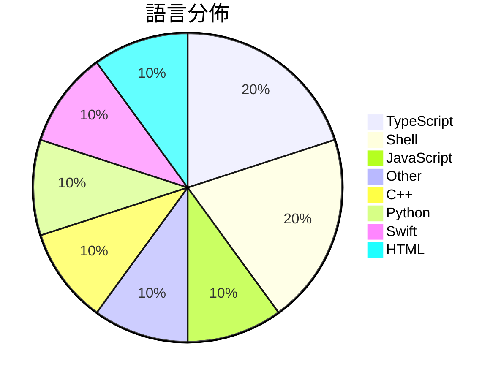

# GitHub Trending - 2026-06-15

> [!summary] 本日摘要
> 收錄 **10** 個新專案，合計 **28.1k** stars
> 語言分佈：TypeScript (2) · Shell (2) · JavaScript (1) · Other (1) · C++ (1) · Python (1) · Swift (1) · HTML (1)

> [!tip] 本週焦點
> **[[XiaomiMiMo--MiMo-Code|XiaomiMiMo/MiMo-Code]]** — 4 天內累積 8.5k stars（2.1k stars/天）
> 提供 AI 驅動的開發工具，能夠跨會話記憶並持續自我改進。



---

## 收錄列表

| # | 專案 | 分類 | Stars | 速度 | 安裝 | 語言 | 用途 |
| :--: | --- | --- | ---: | ---: | --- | --- | --- |
| 1 | [[XiaomiMiMo--MiMo-Code\|XiaomiMiMo/MiMo-Code]] | 開發工具 | 8.5k | 2.1k/天 | `easy` | TypeScript | 提供 AI 驅動的開發工具，能夠跨會話記憶並持續自我改進。 |
| 2 | [[DietrichGebert--ponytail\|DietrichGebert/ponytail]] | 開發工具 | 8.3k | 2.8k/天 | `easy` | JavaScript | 讓你的 AI 代理像懶惰的資深開發者一樣思考，最好的程式碼是你從未寫過的程式碼。 |
| 3 | [[shadcn--improve\|shadcn/improve]] | 開發工具 | 4.4k | 1.1k/天 | `easy` | N/A | 使用最強大的模型審核代碼庫並為較便宜的模型撰寫執行計劃。 |
| 4 | [[MSNightmare--RoguePlanet\|MSNightmare/RoguePlanet]] | 安全 | 1.3k | 255/天 | `medium` | C++ | 利用 Windows Defender 漏洞實現系統權限提升。 |
| 5 | [[omnigent-ai--omnigent\|omnigent-ai/omnigent]] | 開發工具 | 1.2k | 407/天 | `easy` | Python | 提供一個統一的層級來管理和協作多個 AI 代理，無需重寫代碼。 |
| 6 | [[SkyBlue997--enableMacosAI\|SkyBlue997/enableMacosAI]] | 其他 | 1.2k | 297/天 | `medium` | Shell | 讓國行 Mac 一鍵啟用完整 Apple 智能，實現端側與雲端計算功能。 |
| 7 | [[apple--coreai-models\|apple/coreai-models]] | AI/ML | 907 | 151/天 | `medium` | Swift | 提供模型匯出配方、Python 原語和 Swift 運行時工具，以便在設備上執行 |
| 8 | [[lenucksi--aur-malware-check\|lenucksi/aur-malware-check]] | 安全 | 890 | 445/天 | `easy` | Shell | 檢測 2026 年 AUR 供應鏈攻擊的惡意軟體工具。 |
| 9 | [[plannotator--effective-html\|plannotator/effective-html]] | 開發工具 | 834 | 167/天 | `easy` | HTML | 生成優雅且簡單的 HTML 計劃和架構圖。 |
| 10 | [[levy-street--world-of-claudecraft\|levy-street/world-of-claudecraft]] | 遊戲 | 701 | 175/天 | `medium` | TypeScript | 提供一個可線上或離線遊玩的微型 MMO 遊戲環境，模擬經典 WoW 體驗。 |

---

## 重點摘要

### 1. [[XiaomiMiMo--MiMo-Code|XiaomiMiMo/MiMo-Code]] `開發工具`

> 提供 AI 驅動的開發工具，能夠跨會話記憶並持續自我改進。

**8.5k** stars · **2.1k** stars/天 · TypeScript · `easy`

_建立 4 天內累積 8469 stars（2117/天），forks 719（8.5%），顯示出強烈的社群興趣。作者 qiaozongming 和團隊過去在開源領域有豐富經驗，解決了開發者在多會話環境下記憶保持的痛點，這在現有工具中並不常見。最近的推廣活動和社群互動也促進了這一增長，特別是在開發者社群中引起了廣泛討論。這些因素共同推動了其快速增長。_

---

### 2. [[DietrichGebert--ponytail|DietrichGebert/ponytail]] `開發工具`

> 讓你的 AI 代理像懶惰的資深開發者一樣思考，最好的程式碼是你從未寫過的程式碼。

**8.3k** stars · **2.8k** stars/天 · JavaScript · `easy`

_建立 3 天就累積 8281 stars（2760/天），forks 362（4.4%），顯示出強烈的興趣。作者 DietrichGebert 之前在 AI 和開發工具領域有豐富經驗，這個專案解決了開發過程中代碼膨脹的問題，讓開發者能夠專注於必要的功能而非過度設計。近期的社交媒體討論和技術社群的關注也推動了這個專案的快速增長。這個工具的設計理念與當前對於簡化開發流程的需求相契合，讓開發者能夠在繁忙的工作中找到效率的提升。_

---

### 3. [[shadcn--improve|shadcn/improve]] `開發工具`

> 使用最強大的模型審核代碼庫並為較便宜的模型撰寫執行計劃。

**4.4k** stars · **1.1k** stars/天 · N/A · `easy`

_建立 4 天內累積 4353 stars（1088/天），forks 155（3.6%），這顯示出強烈的興趣和潛在的實際應用。作者 shadcn 在開源社群中活躍，過去有多個成功的專案。這個專案解決了在大型代碼庫中進行有效審核的痛點，之前的工具往往無法提供具體的執行計劃，導致開發者需要花費大量時間進行手動處理。社群的反饋和需求也促進了這個專案的快速增長，特別是在代碼質量和成本控制方面的需求日益增加。_

---

### 4. [[MSNightmare--RoguePlanet|MSNightmare/RoguePlanet]] `安全`

> 利用 Windows Defender 漏洞實現系統權限提升。

**1.3k** stars · **255** stars/天 · C++ · `medium`

_建立 5 天內累積 1275 stars（255/天），forks 527（41.3%），顯示出極高的社群關注度。作者 MSNightmare 似乎在安全研究領域有一定的經驗，這個專案解決了 Windows Defender 中一個未被廣泛利用的漏洞，之前的工具多數針對靜態漏洞，這使得 RoguePlanet 成為一個新穎的選擇。社群的反應熱烈，顯示出對於這個工具的興趣和需求。這個工具的出現正值許多安全研究者尋找有效的權限提升方法之際，特別是在 Windows 環境中。_

---

### 5. [[omnigent-ai--omnigent|omnigent-ai/omnigent]] `開發工具`

> 提供一個統一的層級來管理和協作多個 AI 代理，無需重寫代碼。

**1.2k** stars · **407** stars/天 · Python · `easy`

_建立 3 天內累積 1220 stars（407/天），forks 137（11.2%），顯示出強烈的社群興趣。這個專案由 Databricks 團隊開發，旨在解決多個 AI 代理之間的協作問題，之前的解決方案往往缺乏統一的接口和靈活性。近期的推廣活動和社群討論可能進一步推動了這個專案的曝光率。高 forks/stars 比率（11.2%）顯示出許多使用者對這個專案進行實際修改和使用，反映出其潛在的實用性和需求。_

---

### 6. [[SkyBlue997--enableMacosAI|SkyBlue997/enableMacosAI]] `其他`

> 讓國行 Mac 一鍵啟用完整 Apple 智能，實現端側與雲端計算功能。

**1.2k** stars · **297** stars/天 · Shell · `medium`

_建立 4 天內累積 1189 stars（297/天），forks 63（5.3%），這顯示出相對穩定的關注度。作者 SkyBlue997 似乎專注於 Apple 生態系統的開發，這個專案解決了國行 Mac 用戶無法使用完整 Apple 智能的痛點，之前的解決方案往往需要繁瑣的手動配置或無法達到預期效果。近期的社群討論和問題反饋也促進了這個專案的快速成長，特別是在 GitHub Issues 中出現的多個功能請求和故障排查問題。技術上，這個專案的實現依賴於 macOS 的內核擴展機制，這在過去的工具中並不常見，讓它在功能上有了更大的靈活性。_

---

### 7. [[apple--coreai-models|apple/coreai-models]] `AI/ML`

> 提供模型匯出配方、Python 原語和 Swift 運行時工具，以便在設備上執行 AI。

**907** stars · **151** stars/天 · Swift · `medium`

_建立 6 天就累積 907 stars（151/天），forks 68（7.5%），顯示出相對穩定的增長。這個專案的主要貢獻者來自 Apple，過去在 AI 和 Swift 開發方面有豐富經驗。它解決了在 Apple 硬體上運行 AI 模型的需求，特別是針對 Core AI 的優化，這在其他通用框架中難以實現。近期的社群反饋集中在對新模型的支持和潛在的 bug 修復，顯示出使用者對於功能擴展的需求。隨著 Apple 硬體性能的提升，這個工具的需求也在上升，特別是在開發者社群中。forks/stars 比率為 7.5%，顯示出有相當比例的開發者在實際修改和使用這個專案。_

---

### 8. [[lenucksi--aur-malware-check|lenucksi/aur-malware-check]] `安全`

> 檢測 2026 年 AUR 供應鏈攻擊的惡意軟體工具。

**890** stars · **445** stars/天 · Shell · `easy`

_建立 2 天就累積 890 stars（445/天），forks 23（2.6%），顯示出社群對於這個專案的高度關注。作者 lenucksi 及其團隊在安全領域有一定的經驗，這個專案解決了 AUR 社群在供應鏈攻擊後的迫切需求，提供了一個集中化的檢測工具。由於攻擊的影響範圍廣泛，這個工具的出現正好填補了社群對於快速檢測的需求。社群對於這個專案的反應也顯示出其實用性，尤其是在面對假陽性問題的討論中，進一步強化了其重要性。_

---

### 9. [[plannotator--effective-html|plannotator/effective-html]] `開發工具`

> 生成優雅且簡單的 HTML 計劃和架構圖。

**834** stars · **167** stars/天 · HTML · `easy`

_建立 5 天內累積 834 stars（167/天），forks 57（6.8%），顯示出穩定的增長潛力。主要貢獻者 backnotprop 和 velaswami 在開源社群中有過往的貢獻紀錄，這增強了專案的可信度。這個工具解決了生成視覺化 HTML 內容的需求，之前的工具往往缺乏針對視覺效果的考量。隨著對視覺化工具需求的增加，這個專案的出現正好填補了這一空白。forks/stars 比率在中等範圍，顯示出有不少使用者在實際修改和使用這個專案。_

---

### 10. [[levy-street--world-of-claudecraft|levy-street/world-of-claudecraft]] `遊戲`

> 提供一個可線上或離線遊玩的微型 MMO 遊戲環境，模擬經典 WoW 體驗。

**701** stars · **175** stars/天 · TypeScript · `medium`

_建立 4 天就累積 701 stars（175/天），forks 180（25.7%），這顯示出強烈的社群興趣。作者 Rubsey 和其他貢獻者在遊戲開發領域有過往經驗，這讓專案更具可信度。這個專案解決了傳統 MMO 開發中的複雜性，提供了一個簡單的部署方式，讓開發者能夠快速上手。社群的活躍度和快速增長的 stars 數量顯示出用戶對於這個工具的需求。最近的討論和問題也反映了使用者對於功能的期待和改進的需求。_

---

## 今日到期複習

> [!tip] 根據間隔複習排程，今天該回顧的專案

```dataview
TABLE
  stars_per_day AS "Stars/天",
  category AS "分類",
  engagement AS "參與度"
FROM "Repos"
WHERE next_review AND date(next_review) <= date("2026-06-15") AND status != "archived"
SORT priority DESC
```

## 待處理

```dataviewjs
const pending = dv.pages('"Repos"').where(p => p.status === "to-review").length;
const unrated = dv.pages('"Repos"').where(p => p.status !== "archived" && p.status !== "to-review" && (p.my_rating || 0) === 0).length;
const noVerdict = dv.pages('"Repos"').where(p => p.status !== "archived" && (p.my_rating || 0) > 0 && (!p.verdict || p.verdict === "")).length;
const items = [];
if (pending > 0) items.push(`**${pending}** 個待分流`);
if (unrated > 0) items.push(`**${unrated}** 個已讀但未評分`);
if (noVerdict > 0) items.push(`**${noVerdict}** 個已評分但無結論`);
if (items.length > 0) dv.paragraph(items.join(" / "));
else dv.paragraph("所有專案都已處理完畢！");
```
