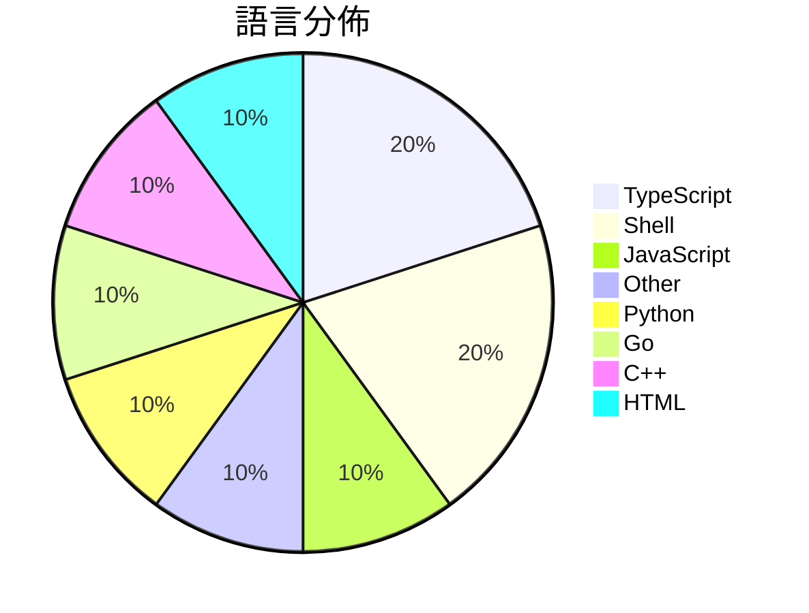

# GitHub Trending - 2026-06-16

> [!summary] 本日摘要
> 收錄 **10** 個新專案，合計 **39.6k** stars
> 語言分佈：TypeScript (2) · Shell (2) · JavaScript (1) · Other (1) · Python (1) · Go (1) · C++ (1) · HTML (1)

> [!tip] 本週焦點
> **[[DietrichGebert--ponytail|DietrichGebert/ponytail]]** — 4 天內累積 16.7k stars（4.2k stars/天）
> 讓 AI agent 像最懶的資深開發者一樣思考，最佳的程式碼是你從未寫過的程式碼。



---

## 收錄列表

| # | 專案 | 分類 | Stars | 速度 | 安裝 | 語言 | 用途 |
| :--: | --- | --- | ---: | ---: | --- | --- | --- |
| 1 | [[DietrichGebert--ponytail\|DietrichGebert/ponytail]] | 開發工具 | 16.7k | 4.2k/天 | `easy` | JavaScript | 讓 AI agent 像最懶的資深開發者一樣思考，最佳的程式碼是你從未寫過的程式 |
| 2 | [[XiaomiMiMo--MiMo-Code\|XiaomiMiMo/MiMo-Code]] | 開發工具 | 9.0k | 1.8k/天 | `easy` | TypeScript | 提供 AI 驅動的開發助手，能讀寫程式碼、管理 Git 並持續學習專案上下文。 |
| 3 | [[shadcn--improve\|shadcn/improve]] | 開發工具 | 4.9k | 976/天 | `easy` | N/A | 利用最強大的模型審核代碼庫並為便宜的模型撰寫執行計畫。 |
| 4 | [[omnigent-ai--omnigent\|omnigent-ai/omnigent]] | AI/ML | 1.9k | 486/天 | `medium` | Python | 提供一個統一的框架來管理和協作多個 AI 代理。 |
| 5 | [[tamnd--kage\|tamnd/kage]] | 其他 | 1.5k | 1.5k/天 | `medium` | Go | 讓網站離線瀏覽，並去除所有 JavaScript 代碼。 |
| 6 | [[MSNightmare--RoguePlanet\|MSNightmare/RoguePlanet]] | 安全 | 1.3k | 215/天 | `medium` | C++ | 利用 Windows Defender 漏洞實現系統權限提升。 |
| 7 | [[SkyBlue997--enableMacosAI\|SkyBlue997/enableMacosAI]] | 其他 | 1.3k | 257/天 | `medium` | Shell | 讓國行 Mac 一鍵啟用完整 Apple 智能功能，突破區域限制。 |
| 8 | [[lenucksi--aur-malware-check\|lenucksi/aur-malware-check]] | 安全 | 1.2k | 394/天 | `easy` | Shell | 檢測 2026 年 AUR 供應鏈攻擊的惡意軟體工具。 |
| 9 | [[plannotator--effective-html\|plannotator/effective-html]] | 開發工具 | 921 | 154/天 | `easy` | HTML | 生成優雅且簡單的 HTML 計畫、架構圖或其他視覺化文檔。 |
| 10 | [[levy-street--world-of-claudecraft\|levy-street/world-of-claudecraft]] | 遊戲 | 795 | 159/天 | `medium` | TypeScript | 提供一個可自訂的微型 MMO 遊戲環境，讓玩家可以在線或離線遊玩。 |

---

## 重點摘要

### 1. [[DietrichGebert--ponytail|DietrichGebert/ponytail]] `開發工具`

> 讓 AI agent 像最懶的資深開發者一樣思考，最佳的程式碼是你從未寫過的程式碼。

**16.7k** stars · **4.2k** stars/天 · JavaScript · `easy`

_建立 4 天就累積 16706 stars（4177/天），forks 699（4.2%），這顯示出強烈的興趣。作者 DietrichGebert 以其在 AI 和開發工具領域的經驗，解決了開發者在代碼冗餘和效率低下方面的痛點。之前的方案往往需要大量的手動編碼和維護，而 Ponytail 則通過自動化決策來簡化這一過程。社群的反應熱烈，特別是在 GitHub 上的討論和整合建議，顯示出其潛在的廣泛應用。這個工具的出現正好符合了開發者對於簡化工作流程的需求。_

---

### 2. [[XiaomiMiMo--MiMo-Code|XiaomiMiMo/MiMo-Code]] `開發工具`

> 提供 AI 驅動的開發助手，能讀寫程式碼、管理 Git 並持續學習專案上下文。

**9.0k** stars · **1.8k** stars/天 · TypeScript · `easy`

_建立 5 天就累積 9041 stars（1808/天），forks 797（8.8%），顯示出極高的使用興趣。作者團隊來自小米，過去在 AI 和開發工具領域有豐富經驗。這個工具解決了開發者在多任務和上下文管理上的痛點，尤其是持久記憶的需求，這在現有工具中並不常見。近期的社群討論和反饋也顯示出對於這個工具的期待和需求，特別是在自動化開發流程方面。_

---

### 3. [[shadcn--improve|shadcn/improve]] `開發工具`

> 利用最強大的模型審核代碼庫並為便宜的模型撰寫執行計畫。

**4.9k** stars · **976** stars/天 · N/A · `easy`

_建立 5 天內累積 4878 stars（976/天），forks 167（3.4%），這顯示出不錯的增長潛力。作者 shadcn 之前在開源社群中有一定的影響力，這個專案解決了代碼審核和執行之間的成本問題，讓開發者能夠更有效率地管理代碼庫。近期的推廣活動和社群討論也可能促進了這個專案的曝光度。forks/stars 比率偏低，顯示出目前大多數用戶還在觀望階段，尚未進行實際修改。_

---

### 4. [[omnigent-ai--omnigent|omnigent-ai/omnigent]] `AI/ML`

> 提供一個統一的框架來管理和協作多個 AI 代理。

**1.9k** stars · **486** stars/天 · Python · `medium`

_建立 4 天內累積 1944 stars（486/天），forks 238（12.2%），顯示出強烈的社群興趣。這個專案的主要貢獻者來自 Databricks，該公司在 AI 和數據處理領域有豐富的經驗。Omnigent 解決了多代理協作的痛點，之前的方案往往缺乏靈活性和即時性，無法有效支持跨設備的工作流。最近的推廣和社群討論也促進了其曝光率，特別是在開發者圈子中。技術生態的變化，如對多代理系統的需求增加，也讓這個工具的出現變得更加合時宜。forks/stars 比率為 12.2%，顯示出有相當比例的用戶在實際修改和使用這個工具。_

---

### 5. [[tamnd--kage|tamnd/kage]] `其他`

> 讓網站離線瀏覽，並去除所有 JavaScript 代碼。

**1.5k** stars · **1.5k** stars/天 · Go · `medium`

_建立 1 天就累積 1546 stars（1546/天），forks 36（2.3%），這顯示出用戶對於這個工具的高度興趣。作者 tamnd 是一位活躍的開發者，過去在 GitHub 上有多個開源專案，這使得其具備一定的信譽。kage 解決了傳統網站保存方式的痛點，特別是對於需要去除 JavaScript 的需求，這在現有工具中並不常見。最近的推廣活動和社群討論也可能促進了其曝光率。隨著網路內容日益增長，對於離線存取的需求也在增加，這使得 kage 的出現正好符合市場需求。forks/stars 比率的相對偏低，顯示出目前仍有許多用戶在觀望，尚未進行實際修改。_

---

### 6. [[MSNightmare--RoguePlanet|MSNightmare/RoguePlanet]] `安全`

> 利用 Windows Defender 漏洞實現系統權限提升。

**1.3k** stars · **215** stars/天 · C++ · `medium`

_建立 6 天就累積 1292 stars（215/天），forks 536（41.5%），這顯示出極高的社群關注度。作者 MSNightmare 在安全研究領域有一定的知名度，這個專案解決了 Windows Defender 漏洞利用的需求，之前的工具在這方面的支持有限。該工具的出現引發了社群的熱烈討論，尤其是在安全研究者中間。技術生態的變化，如對 Windows 安全性研究的需求增加，也促進了這個工具的流行。高達 41.5% 的 forks/stars 比率顯示出許多開發者正在積極修改和使用這個工具，而不是僅僅觀望。_

---

### 7. [[SkyBlue997--enableMacosAI|SkyBlue997/enableMacosAI]] `其他`

> 讓國行 Mac 一鍵啟用完整 Apple 智能功能，突破區域限制。

**1.3k** stars · **257** stars/天 · Shell · `medium`

_建立 5 天內累積 1284 stars（257/天），forks 69（5.4%），顯示出快速增長的潛力。作者 SkyBlue997 針對 Apple 智能的區域限制提出了解決方案，填補了市場上對於國行 Mac 用戶的需求。此工具的出現，讓許多用戶能夠突破 Apple 的地區限制，獲得更完整的功能，這在過去是無法輕易實現的。社群的活躍度和對於功能的需求也促進了這個專案的快速發展。_

---

### 8. [[lenucksi--aur-malware-check|lenucksi/aur-malware-check]] `安全`

> 檢測 2026 年 AUR 供應鏈攻擊的惡意軟體工具。

**1.2k** stars · **394** stars/天 · Shell · `easy`

_建立 3 天內累積 1181 stars（394/天），forks 30（2.5%），顯示出社群對於這個專案的高度關注。作者 lenucksi 和其他貢獻者在安全領域有豐富經驗，這個專案解決了 AUR 社群在供應鏈攻擊後的迫切需求，因為之前缺乏有效的檢測工具。這次攻擊的影響範圍廣泛，讓許多開發者感受到威脅，因此對於這類工具的需求急劇上升。社群的反應也顯示出對於這個工具的實用性和必要性，尤其是在開發者需要快速應對安全威脅的情況下。_

---

### 9. [[plannotator--effective-html|plannotator/effective-html]] `開發工具`

> 生成優雅且簡單的 HTML 計畫、架構圖或其他視覺化文檔。

**921** stars · **154** stars/天 · HTML · `easy`

_這個專案在建立 6 天內累積了 921 stars（每天 154），forks 數量為 64（6.9%），顯示出相對穩定的關注度。主要貢獻者 backnotprop 和 velaswami 在開源社群中有一定的影響力，這可能促進了專案的曝光。此工具解決了生成高品質 HTML 視覺文檔的需求，之前的工具多數集中於代碼生成或文本處理，缺乏針對視覺化的專注。最近的推文和社群討論可能也為其帶來了關注。隨著 HTML 和視覺化需求的增長，這個工具的出現恰逢其時。forks/stars 比率顯示出有相當比例的使用者在實際修改和使用這個工具，這是其受歡迎的指標之一。_

---

### 10. [[levy-street--world-of-claudecraft|levy-street/world-of-claudecraft]] `遊戲`

> 提供一個可自訂的微型 MMO 遊戲環境，讓玩家可以在線或離線遊玩。

**795** stars · **159** stars/天 · TypeScript · `medium`

_建立 5 天內累積 795 stars（159/天），forks 215（27.0%），顯示出強烈的社群興趣。這個專案由 Rubsey 和其他幾位貢獻者共同開發，解決了玩家對於自訂 MMO 環境的需求，特別是在現有的遊戲中缺乏靈活性和可擴展性。此專案的推出恰逢許多玩家尋求更具個性化的遊戲體驗，並且在 Discord 社群中引發了熱烈討論。高達 27% 的 forks/stars 比率顯示出許多人正在積極修改和使用這個專案，而不是僅僅觀望。_

---

## 今日到期複習

> [!tip] 根據間隔複習排程，今天該回顧的專案

```dataview
TABLE
  stars_per_day AS "Stars/天",
  category AS "分類",
  engagement AS "參與度"
FROM "Repos"
WHERE next_review AND date(next_review) <= date("2026-06-16") AND status != "archived"
SORT priority DESC
```

## 待處理

```dataviewjs
const pending = dv.pages('"Repos"').where(p => p.status === "to-review").length;
const unrated = dv.pages('"Repos"').where(p => p.status !== "archived" && p.status !== "to-review" && (p.my_rating || 0) === 0).length;
const noVerdict = dv.pages('"Repos"').where(p => p.status !== "archived" && (p.my_rating || 0) > 0 && (!p.verdict || p.verdict === "")).length;
const items = [];
if (pending > 0) items.push(`**${pending}** 個待分流`);
if (unrated > 0) items.push(`**${unrated}** 個已讀但未評分`);
if (noVerdict > 0) items.push(`**${noVerdict}** 個已評分但無結論`);
if (items.length > 0) dv.paragraph(items.join(" / "));
else dv.paragraph("所有專案都已處理完畢！");
```
