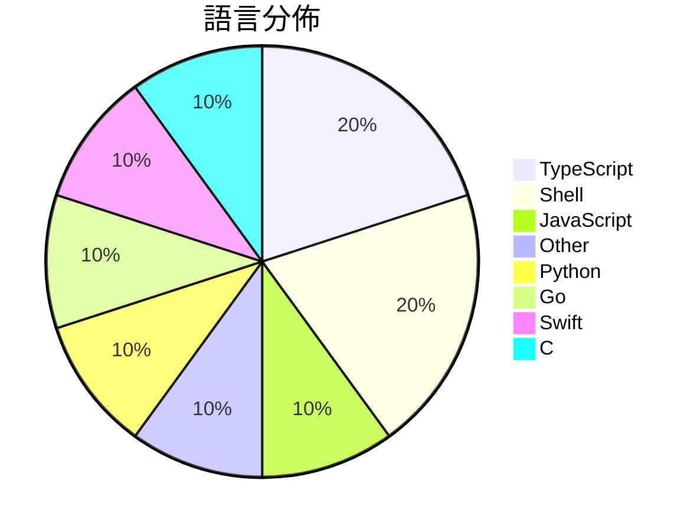

# GitHub Trending - 2026-06-17

> [!summary] 本日摘要
> 收錄 **10** 個新專案，合計 **49.5k** stars
> 語言分佈：TypeScript (2) · Shell (2) · JavaScript (1) · Other (1) · Python (1) · Go (1) · Swift (1) · C (1)

> [!tip] 本週焦點
> **[[DietrichGebert--ponytail|DietrichGebert/ponytail]]** — 5 天內累積 25.3k stars（5.1k stars/天）
> 讓你的 AI agent 像最懶的資深開發者一樣思考，寫出更少的程式碼。



---

## 收錄列表

| # | 專案 | 分類 | Stars | 速度 | 安裝 | 語言 | 用途 |
| :--: | --- | --- | ---: | ---: | --- | --- | --- |
| 1 | [[DietrichGebert--ponytail\|DietrichGebert/ponytail]] | 開發工具 | 25.3k | 5.1k/天 | `easy` | JavaScript | 讓你的 AI agent 像最懶的資深開發者一樣思考，寫出更少的程式碼。 |
| 2 | [[XiaomiMiMo--MiMo-Code\|XiaomiMiMo/MiMo-Code]] | 開發工具 | 9.4k | 1.6k/天 | `easy` | TypeScript | 提供一個終端原生的 AI 編碼助手，能夠讀寫代碼、運行命令、管理 Git，並具備 |
| 3 | [[shadcn--improve\|shadcn/improve]] | 開發工具 | 5.0k | 836/天 | `easy` | N/A | 利用最強大的模型審核代碼庫並為便宜的模型撰寫執行計畫。 |
| 4 | [[omnigent-ai--omnigent\|omnigent-ai/omnigent]] | 開發工具 | 2.8k | 565/天 | `medium` | Python | 提供一個統一的層級來管理各種 AI 代理，讓開發者能夠靈活組合和監控 AI 代理 |
| 5 | [[tamnd--kage\|tamnd/kage]] | 開發工具 | 1.8k | 881/天 | `easy` | Go | 讓你離線瀏覽網站，並移除所有 JavaScript 代碼。 |
| 6 | [[lenucksi--aur-malware-check\|lenucksi/aur-malware-check]] | 安全 | 1.3k | 337/天 | `easy` | Shell | 檢測 2026 年 AUR 供應鏈攻擊的工具，幫助用戶識別被感染的套件。 |
| 7 | [[SkyBlue997--enableMacosAI\|SkyBlue997/enableMacosAI]] | 其他 | 1.3k | 223/天 | `easy` | Shell | 在国行 Mac 上一键开启完整 Apple 智能功能。 |
| 8 | [[levy-street--world-of-claudecraft\|levy-street/world-of-claudecraft]] | 遊戲 | 878 | 146/天 | `medium` | TypeScript | 提供一個經典風格的微型 MMO 遊戲環境，支持多人在線和離線遊玩。 |
| 9 | [[EEliberto--IPA-Download\|EEliberto/IPA-Download]] | 開發工具 | 831 | 277/天 | `medium` | Swift | 一款用于安装 IPA 历史版本的工具，适用于获取旧版应用并自动捕获数据包。 |
| 10 | [[loc567--loc567\|loc567/loc567]] | 開發工具 | 781 | 156/天 | `easy` | C | 提供一個完全開源的網頁端 iOS 模擬定位工具，無需安裝任何應用程式。 |

---

## 重點摘要

### 1. [[DietrichGebert--ponytail|DietrichGebert/ponytail]] `開發工具`

> 讓你的 AI agent 像最懶的資深開發者一樣思考，寫出更少的程式碼。

**25.3k** stars · **5.1k** stars/天 · JavaScript · `easy`

_建立 5 天就累積 25328 stars（5066/天），forks 1117（4.4%），這顯示出強勁的增長潛力。作者 DietrichGebert 在開源社群中有一定的影響力，之前的專案也獲得了良好的反響。Ponytail 解決了開發者在寫代碼時面臨的過度工程問題，這在當前快速迭代的開發環境中尤為重要。此專案的推出恰逢 AI 工具需求上升的時期，並且其簡化代碼的理念引起了廣泛關注。forks/stars 比率相對較低，顯示出使用者對此工具的實際應用興趣較高。_

---

### 2. [[XiaomiMiMo--MiMo-Code|XiaomiMiMo/MiMo-Code]] `開發工具`

> 提供一個終端原生的 AI 編碼助手，能夠讀寫代碼、運行命令、管理 Git，並具備持久記憶系統。

**9.4k** stars · **1.6k** stars/天 · TypeScript · `easy`

_建立 6 天內累積 9378 stars（1563/天），forks 831（8.9%），顯示出強烈的社群關注。作者 qiaozongming 和其他貢獻者在開源社群中有一定的影響力，這個工具解決了開發者在多會話中保持上下文和記憶的痛點，之前的解決方案如 OpenCode 雖然有類似功能，但缺乏持久記憶和智能上下文管理的能力。近期的社群討論和反饋也表明，MiMoCode 在功能上有明顯的優勢，並且有潛力成為開發者的首選工具。這些因素共同促進了其快速增長。_

---

### 3. [[shadcn--improve|shadcn/improve]] `開發工具`

> 利用最強大的模型審核代碼庫並為便宜的模型撰寫執行計畫。

**5.0k** stars · **836** stars/天 · N/A · `easy`

_建立 6 天內累積 5016 stars（836/天），forks 178（3.5%），顯示出強烈的社群興趣。作者 shadcn 在開源社群中有著良好的聲譽，過去參與了多個成功的專案。這個專案解決了代碼審核與執行的成本問題，之前的解決方案往往需要高成本的模型來執行，這使得許多團隊無法有效利用 AI 進行代碼管理。近期的推文與討論也讓這個工具獲得了更多的曝光，進一步促進了其使用。高 forks/stars 比率顯示出許多人在實際修改使用，反映出這個工具的實用性與需求。_

---

### 4. [[omnigent-ai--omnigent|omnigent-ai/omnigent]] `開發工具`

> 提供一個統一的層級來管理各種 AI 代理，讓開發者能夠靈活組合和監控 AI 代理的行為。

**2.8k** stars · **565** stars/天 · Python · `medium`

_建立 5 天內累積 2826 stars（565 stars/天），forks 330（11.7%），顯示出強勁的增長潛力。這個專案由 Databricks 團隊開發，專注於解決多 AI 代理協作的痛點，過去開發者常常需要手動整合不同的 AI 服務，這樣的方式效率低下且容易出錯。Omnigent 提供了一個統一的管理平台，讓開發者能夠在同一環境中使用多種 AI 代理，並且能夠輕鬆地進行監控和管理。社群對於這個工具的需求明顯，尤其是在多代理協作的場景中。Forks/stars 比率為 11.7%，顯示出有相當比例的用戶在積極修改和使用這個工具。_

---

### 5. [[tamnd--kage|tamnd/kage]] `開發工具`

> 讓你離線瀏覽網站，並移除所有 JavaScript 代碼。

**1.8k** stars · **881** stars/天 · Go · `easy`

_建立 2 天就累積 1762 stars（881/天），forks 50（2.8%），這顯示出強烈的使用者興趣。作者 tamnd 之前在開源社群中活躍，這個專案解決了人們在離線保存網站內容時遇到的問題，特別是動態網站的內容保存。這個工具的推出正好填補了市場上對於簡單易用的網站克隆工具的需求，並且在社群中引發了討論。其獨特的功能和簡單的使用流程吸引了許多開發者的注意。_

---

### 6. [[lenucksi--aur-malware-check|lenucksi/aur-malware-check]] `安全`

> 檢測 2026 年 AUR 供應鏈攻擊的工具，幫助用戶識別被感染的套件。

**1.3k** stars · **337** stars/天 · Shell · `easy`

_建立 4 天內累積 1347 stars（337/天），forks 30（2.2%），顯示出社群對於供應鏈安全的高度關注。專案的主要貢獻者來自於活躍的開源社群，過去在安全檢測領域有豐富的經驗。這個工具解決了 AUR 使用者面臨的供應鏈攻擊問題，提供了一個集中化的檢測方案，避免了用戶需要在多個 Gist 中尋找資源的困擾。近期的討論和問題反映了社群對於這個工具的需求和期待，尤其在供應鏈安全日益受到重視的背景下，這個工具的出現正好填補了市場的空白。_

---

### 7. [[SkyBlue997--enableMacosAI|SkyBlue997/enableMacosAI]] `其他`

> 在国行 Mac 上一键开启完整 Apple 智能功能。

**1.3k** stars · **223** stars/天 · Shell · `easy`

_建立 6 天內累積 1338 stars（223/天），forks 73（5.5%），顯示出強烈的用戶興趣。作者 SkyBlue997 在此領域有一定的經驗，提供了一個針對國行 Mac 的解決方案，之前的方案往往需要繁瑣的手動配置或無法完全啟用 Apple 智能功能。這個工具的出現填補了這一空白，使得使用者能夠更方便地使用 Apple 的智能功能。社群的反饋和熱門問題顯示出使用者在安裝和配置過程中遇到的實際挑戰，這進一步促進了專案的改進和發展。_

---

### 8. [[levy-street--world-of-claudecraft|levy-street/world-of-claudecraft]] `遊戲`

> 提供一個經典風格的微型 MMO 遊戲環境，支持多人在線和離線遊玩。

**878** stars · **146** stars/天 · TypeScript · `medium`

_建立 6 天內累積 878 stars（146/天），forks 247（28.1%），顯示出強烈的社群參與。主要貢獻者包括 Rubsey 和 FernandoX7，他們在開源社區有一定的影響力。這個專案解決了傳統 MMO 遊戲中缺乏靈活性和可自定義性的問題，讓玩家能夠在本地或雲端輕鬆運行遊戲。社群的活躍度和開發者的回應速度也促進了專案的成長。最近的更新和功能增強吸引了許多玩家的注意，尤其是新加入的副本和 AI 行為。_

---

### 9. [[EEliberto--IPA-Download|EEliberto/IPA-Download]] `開發工具`

> 一款用于安装 IPA 历史版本的工具，适用于获取旧版应用并自动捕获数据包。

**831** stars · **277** stars/天 · Swift · `medium`

_建立 3 天內累積 831 stars（277/天），forks 44（5.3%），這顯示出穩定的增長趨勢。作者 EEliberto 之前在開源社區有過其他貢獻，這次專案解決了用戶在獲取舊版應用時的痛點，特別是雙重認證的繁瑣流程。近期的社交媒體討論也引起了不少關注，讓更多人了解這個工具。技術上，隨著 SwiftUI 的普及，這個工具的開發變得更加可行，能夠提供更好的用戶體驗。forks/stars 比率適中，顯示出使用者對於這個工具的實際修改需求不高，主要是觀望和使用。_

---

### 10. [[loc567--loc567|loc567/loc567]] `開發工具`

> 提供一個完全開源的網頁端 iOS 模擬定位工具，無需安裝任何應用程式。

**781** stars · **156** stars/天 · C · `easy`

_建立 5 天就累積 781 stars（156/天），forks 91（11.7%），顯示出強烈的社群興趣。作者 loc567 是一位專注於開源工具的開發者，這個工具解決了許多 iOS 開發者在定位測試時的痛點，尤其是無需越獄或特殊環境的限制。此工具的推出正值許多開發者尋求更靈活的測試方案之際，並且其開源特性吸引了不少開發者的注意。社群活躍度高，能夠快速回應使用者的問題，顯示出良好的支持潛力。_

---

## 今日到期複習

> [!tip] 根據間隔複習排程，今天該回顧的專案

```dataview
TABLE
  stars_per_day AS "Stars/天",
  category AS "分類",
  engagement AS "參與度"
FROM "Repos"
WHERE next_review AND date(next_review) <= date("2026-06-17") AND status != "archived"
SORT priority DESC
```

## 待處理

```dataviewjs
const pending = dv.pages('"Repos"').where(p => p.status === "to-review").length;
const unrated = dv.pages('"Repos"').where(p => p.status !== "archived" && p.status !== "to-review" && (p.my_rating || 0) === 0).length;
const noVerdict = dv.pages('"Repos"').where(p => p.status !== "archived" && (p.my_rating || 0) > 0 && (!p.verdict || p.verdict === "")).length;
const items = [];
if (pending > 0) items.push(`**${pending}** 個待分流`);
if (unrated > 0) items.push(`**${unrated}** 個已讀但未評分`);
if (noVerdict > 0) items.push(`**${noVerdict}** 個已評分但無結論`);
if (items.length > 0) dv.paragraph(items.join(" / "));
else dv.paragraph("所有專案都已處理完畢！");
```
