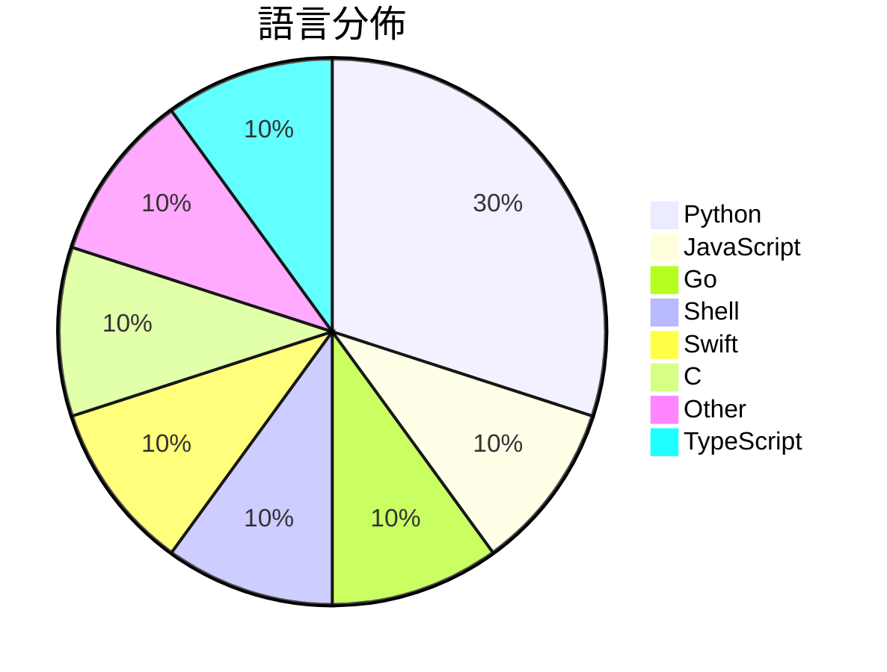

# GitHub Trending - 2026-06-18

> [!summary] 本日摘要
> 收錄 **10** 個新專案，合計 **43.6k** stars
> 語言分佈：Python (3) · JavaScript (1) · Go (1) · Shell (1) · Swift (1) · C (1) · Other (1) · TypeScript (1)

> [!tip] 本週焦點
> **[[DietrichGebert--ponytail|DietrichGebert/ponytail]]** — 6 天內累積 31.9k stars（5.3k stars/天）
> 讓你的 AI 助手像懶惰的資深開發者一樣思考，寫出更少的程式碼。



---

## 收錄列表

| # | 專案 | 分類 | Stars | 速度 | 安裝 | 語言 | 用途 |
| :--: | --- | --- | ---: | ---: | --- | --- | --- |
| 1 | [[DietrichGebert--ponytail\|DietrichGebert/ponytail]] | 開發工具 | 31.9k | 5.3k/天 | `easy` | JavaScript | 讓你的 AI 助手像懶惰的資深開發者一樣思考，寫出更少的程式碼。 |
| 2 | [[omnigent-ai--omnigent\|omnigent-ai/omnigent]] | AI/ML | 3.5k | 588/天 | `medium` | Python | 提供一個開源的 AI agent 框架，讓開發者能夠方便地協調多個 AI 模型和 |
| 3 | [[tamnd--kage\|tamnd/kage]] | CLI 工具 | 1.9k | 621/天 | `medium` | Go | 讓你在沒有網路的情況下，離線瀏覽任何網站，並去除所有 JavaScript。 |
| 4 | [[lenucksi--aur-malware-check\|lenucksi/aur-malware-check]] | 安全 | 1.5k | 292/天 | `easy` | Shell | 檢測 2026 年 AUR 供應鏈攻擊的工具，幫助用戶識別被攻擊的套件。 |
| 5 | [[EEliberto--IPA-Download\|EEliberto/IPA-Download]] | 開發工具 | 1.0k | 253/天 | `medium` | Swift | 一款用于安装 IPA 历史版本的工具，适用于获取旧版应用并自动捕获数据包。 |
| 6 | [[loc567--loc567\|loc567/loc567]] | 開發工具 | 1.0k | 168/天 | `easy` | C | 提供一個完全開源的網頁端 iOS 模擬定位工具，無需安裝和越獄。 |
| 7 | [[orange2ai--renwei-writing\|orange2ai/renwei-writing]] | 其他 | 769 | 154/天 | `easy` | N/A | 讓 AI 編輯文字時保留人味，避免失去背後的存在感。 |
| 8 | [[nolangz--pixel2motion\|nolangz/pixel2motion]] | 開發工具 | 718 | 144/天 | `medium` | Python | 將光柵 logo 轉換為平滑的 SVG 動畫，並生成互動式 HTML 演示和 G |
| 9 | [[vercel--eve\|vercel/eve]] | 開發工具 | 693 | 693/天 | `easy` | TypeScript | 提供一個基於檔案系統的框架來構建持久的 AI 代理。 |
| 10 | [[joeseesun--qiaomu-goal-meta-skill\|joeseesun/qiaomu-goal-meta-skill]] | 開發工具 | 648 | 108/天 | `easy` | Python | 將模糊或複雜的 Codex 任務轉化為強大的 `/goal` 命令，包含結果、驗 |

---

## 重點摘要

### 1. [[DietrichGebert--ponytail|DietrichGebert/ponytail]] `開發工具`

> 讓你的 AI 助手像懶惰的資深開發者一樣思考，寫出更少的程式碼。

**31.9k** stars · **5.3k** stars/天 · JavaScript · `easy`

_建立 6 天就累積 31942 stars（5324/天），forks 1443（4.5%），這顯示出極高的使用者興趣。作者 DietrichGebert 過去有多個開源專案，這個專案解決了開發者在寫代碼時經常面臨的過度設計問題，讓 AI 助手能夠自動化簡化代碼的過程。近期的討論和社群反饋也進一步推動了這個專案的曝光率，特別是在開發者社群中。這個工具的出現正好契合了對於高效能和低成本開發的需求，並且在技術上能夠與現有的 AI 生態系統無縫整合。_

---

### 2. [[omnigent-ai--omnigent|omnigent-ai/omnigent]] `AI/ML`

> 提供一個開源的 AI agent 框架，讓開發者能夠方便地協調多個 AI 模型和自定義代理。

**3.5k** stars · **588** stars/天 · Python · `medium`

_建立 6 天就累積 3526 stars（588/天），forks 393（11.1%），顯示出強勁的增長潛力。主要貢獻者來自 Databricks，這是一家在 AI 和數據處理領域有豐富經驗的公司，這使得專案在技術上有一定的保障。Omnigent 解決了過去在多模型協作和管理上的痛點，開發者通常需要手動整合不同的 AI 模型，這不僅耗時而且容易出錯。這個框架的出現讓這一過程變得更加自動化和高效。社群的反饋和需求也促進了功能的快速迭代，特別是對於支持更多模型的請求。_

---

### 3. [[tamnd--kage|tamnd/kage]] `CLI 工具`

> 讓你在沒有網路的情況下，離線瀏覽任何網站，並去除所有 JavaScript。

**1.9k** stars · **621** stars/天 · Go · `medium`

_建立 3 天內累積 1863 stars（621/天），forks 57（3.1%），這顯示出其快速增長的潛力。作者 tamnd 之前在開源社群有過其他貢獻，這使得他在開發者中有一定的信譽。kage 解決了傳統網站保存工具無法有效處理 JavaScript 的痛點，讓使用者能夠獲得一個完整的離線版本，這在許多情境下都是非常有用的。社群對於這個工具的需求也反映在熱門 Issues 上，像是對於爬蟲限制和 cookie 的處理等問題。這些需求的存在顯示出使用者在實際操作中遇到的挑戰，進一步推動了這個專案的發展。_

---

### 4. [[lenucksi--aur-malware-check|lenucksi/aur-malware-check]] `安全`

> 檢測 2026 年 AUR 供應鏈攻擊的工具，幫助用戶識別被攻擊的套件。

**1.5k** stars · **292** stars/天 · Shell · `easy`

_建立 5 天內累積 1462 stars（292/天），forks 32（2.2%），顯示出相對穩定的關注度。這個專案的作者 lenucksi 及其團隊專注於供應鏈安全，解決了 AUR 中缺乏有效檢測工具的痛點，特別是在 2026 年的攻擊事件後。社群的討論和問題反映了用戶對於安全檢測的迫切需求，並且有助於快速迭代和改進工具。技術生態的變化，如對供應鏈攻擊的重視，也促進了這類工具的發展。forks/stars 比率較低，顯示出用戶主要是觀望，尚未廣泛修改或使用。_

---

### 5. [[EEliberto--IPA-Download|EEliberto/IPA-Download]] `開發工具`

> 一款用于安装 IPA 历史版本的工具，适用于获取旧版应用并自动捕获数据包。

**1.0k** stars · **253** stars/天 · Swift · `medium`

_建立 4 天就累積 1012 stars（253/天），forks 54（5.3%），這顯示出相對穩定的增長。作者 EEliberto 之前的專案有一定的知名度，這次的工具解決了用戶在獲取舊版應用時的痛點，特別是雙重認證的問題。這款工具的推出恰逢許多用戶需要舊版應用的時候，並且在社群中引發了討論。技術上，隨著 macOS 26 的普及，這款工具的可行性和需求也隨之上升。forks/stars 比率顯示出有相當比例的用戶在實際修改和使用這個工具。_

---

### 6. [[loc567--loc567|loc567/loc567]] `開發工具`

> 提供一個完全開源的網頁端 iOS 模擬定位工具，無需安裝和越獄。

**1.0k** stars · **168** stars/天 · C · `easy`

_建立 6 天內累積 1007 stars（168/天），forks 131（13.0%），顯示出強勁的增長勢頭。作者 loc567 是一位專注於開源工具的開發者，這個工具解決了以往需要越獄或依賴電腦的定位需求，讓用戶能夠在不改變設備狀態的情況下進行測試。隨著 iOS 系統的更新，對於開發者來說，能夠快速適應新版本的定位工具變得越來越重要。社群的積極反饋和實測數據也促進了這個工具的流行。forks/stars 比率為 13.0%，顯示出許多用戶在積極修改和使用這個工具。_

---

### 7. [[orange2ai--renwei-writing|orange2ai/renwei-writing]] `其他`

> 讓 AI 編輯文字時保留人味，避免失去背後的存在感。

**769** stars · **154** stars/天 · N/A · `easy`

_建立 5 天內累積 769 stars（153.8/天），forks 77（10%），顯示出良好的接受度。作者 orange2ai 專注於 AI 相關的寫作工具，這個專案解決了現有 AI 編輯工具常常忽略的情感和個人風格問題。這個工具的出現正好填補了市場上對於人性化寫作的需求，讓使用者能夠在享受 AI 效率的同時，保留自己的聲音。社群的反饋和需求顯示出這個方向的潛力，可能會引起更多的關注和討論。_

---

### 8. [[nolangz--pixel2motion|nolangz/pixel2motion]] `開發工具`

> 將光柵 logo 轉換為平滑的 SVG 動畫，並生成互動式 HTML 演示和 GIF/視頻預覽。

**718** stars · **144** stars/天 · Python · `medium`

_建立 5 天就累積 718 stars（144/天），forks 68（9.5%），這顯示出相對穩定的增長。作者 nolangz 在 AI 設計工具領域有一定的經驗，這個專案解決了將光柵圖像轉換為高質量動畫的需求，之前的工具往往無法提供這樣的功能。近期的 GitHub 活動和社群討論也顯示出對這個工具的興趣，尤其是在品牌設計和動畫領域。這個工具的設計使得動畫過程更為簡化，並且能夠生成可檢查的輸出，這在設計工作中是非常重要的。forks/stars 比率為 9.5%，顯示出許多使用者對這個專案進行了實際的修改和使用。_

---

### 9. [[vercel--eve|vercel/eve]] `開發工具`

> 提供一個基於檔案系統的框架來構建持久的 AI 代理。

**693** stars · **693** stars/天 · TypeScript · `easy`

_建立 1 天就累積 693 stars（693/天），forks 29（4.2%），顯示出強烈的興趣。這位作者 ijjk 在 Vercel 生態系統中有豐富的經驗，之前也參與過多個成功的開源專案。eve 解決了開發 AI 代理時的結構化問題，讓開發者能夠更方便地管理和擴展代理的功能，這在過去的框架中並不常見。近期的推廣活動和社群討論也引起了開發者的注意，進一步促進了其使用率。這個框架的設計理念符合當前對於可維護性和可擴展性的需求，特別是在快速變化的 AI 領域。_

---

### 10. [[joeseesun--qiaomu-goal-meta-skill|joeseesun/qiaomu-goal-meta-skill]] `開發工具`

> 將模糊或複雜的 Codex 任務轉化為強大的 `/goal` 命令，包含結果、驗證、約束、邊界、迭代策略和完成證據。

**648** stars · **108** stars/天 · Python · `easy`

_建立 6 天內累積 648 stars（108/天），forks 47（7.3%），顯示出穩定的增長潛力。作者 joeseesun 在開源社群中活躍，這個工具解決了 Codex 在處理模糊需求時的痛點，之前的解決方案往往缺乏明確的執行框架和驗證標準。這個工具的推出正好填補了這一空白，並且在社群中引起了討論和關注。技術上，隨著對 AI agent 的需求增加，這個工具的實用性也隨之提升，特別是在複雜任務的自動化方面。forks/stars 比率為 7.3%，顯示出使用者對這個工具的實際修改和使用意願。_

---

## 今日到期複習

> [!tip] 根據間隔複習排程，今天該回顧的專案

```dataview
TABLE
  stars_per_day AS "Stars/天",
  category AS "分類",
  engagement AS "參與度"
FROM "Repos"
WHERE next_review AND date(next_review) <= date("2026-06-18") AND status != "archived"
SORT priority DESC
```

## 待處理

```dataviewjs
const pending = dv.pages('"Repos"').where(p => p.status === "to-review").length;
const unrated = dv.pages('"Repos"').where(p => p.status !== "archived" && p.status !== "to-review" && (p.my_rating || 0) === 0).length;
const noVerdict = dv.pages('"Repos"').where(p => p.status !== "archived" && (p.my_rating || 0) > 0 && (!p.verdict || p.verdict === "")).length;
const items = [];
if (pending > 0) items.push(`**${pending}** 個待分流`);
if (unrated > 0) items.push(`**${unrated}** 個已讀但未評分`);
if (noVerdict > 0) items.push(`**${noVerdict}** 個已評分但無結論`);
if (items.length > 0) dv.paragraph(items.join(" / "));
else dv.paragraph("所有專案都已處理完畢！");
```
