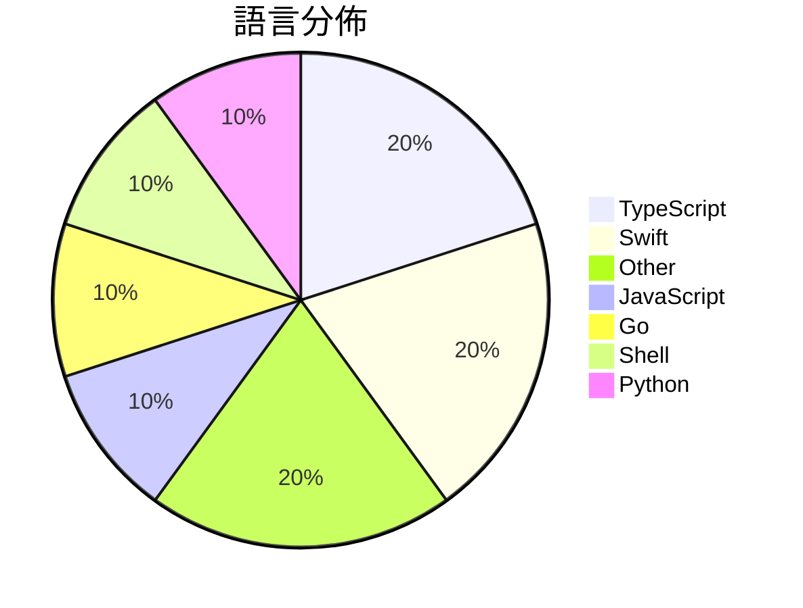

# GitHub Trending - 2026-06-19

> [!summary] 本日摘要
> 收錄 **10** 個新專案，合計 **46.7k** stars
> 語言分佈：TypeScript (2) · Swift (2) · Other (2) · JavaScript (1) · Go (1) · Shell (1) · Python (1)

> [!tip] 本週焦點
> **[[DietrichGebert--ponytail|DietrichGebert/ponytail]]** — 7 天內累積 36.9k stars（5.3k stars/天）
> 讓你的 AI 助手像最懶的資深開發者一樣思考，寫出更少的程式碼。



---

## 收錄列表

| # | 專案 | 分類 | Stars | 速度 | 安裝 | 語言 | 用途 |
| :--: | --- | --- | ---: | ---: | --- | --- | --- |
| 1 | [[DietrichGebert--ponytail\|DietrichGebert/ponytail]] | 開發工具 | 36.9k | 5.3k/天 | `medium` | JavaScript | 讓你的 AI 助手像最懶的資深開發者一樣思考，寫出更少的程式碼。 |
| 2 | [[tamnd--kage\|tamnd/kage]] | 開發工具 | 2.0k | 503/天 | `medium` | Go | 讓網站離線瀏覽，並去除所有 JavaScript。 |
| 3 | [[lenucksi--aur-malware-check\|lenucksi/aur-malware-check]] | 安全 | 1.5k | 257/天 | `easy` | Shell | 檢測 2026 年 AUR 供應鏈攻擊的工具，幫助用戶識別受感染的軟體包。 |
| 4 | [[vercel--eve\|vercel/eve]] | 開發工具 | 1.4k | 688/天 | `easy` | TypeScript | 提供一個以檔案系統為基礎的框架，讓開發者能夠輕鬆構建持久的 AI 代理。 |
| 5 | [[EEliberto--IPA-Download\|EEliberto/IPA-Download]] | 開發工具 | 1.1k | 214/天 | `medium` | Swift | 一款用于安装 IPA 历史版本的工具，适用于获取旧版应用并自动捕获数据包。 |
| 6 | [[Waishnav--devspace\|Waishnav/devspace]] | 開發工具 | 870 | 218/天 | `medium` | TypeScript | 讓 ChatGPT 直接在本地專案中讀取、編輯和執行代碼，無需上傳到第三方。 |
| 7 | [[orange2ai--renwei-writing\|orange2ai/renwei-writing]] | AI/ML | 814 | 136/天 | `easy` | N/A | 讓 AI 編輯文字時保留人味，增強文字的存在感。 |
| 8 | [[nolangz--pixel2motion\|nolangz/pixel2motion]] | 開發工具 | 798 | 133/天 | `medium` | Python | 將像素 logo 轉換為平滑的 SVG 動畫，並生成互動式 HTML 演示和 G |
| 9 | [[alchaincyf--loop-engineering-orange-book\|alchaincyf/loop-engineering-orange-book]] | 其他 | 672 | 224/天 | `easy` | N/A | 提供一個清晰的 Loop Engineering 指導，幫助開發者設計自動化系統 |
| 10 | [[vorssaint--vorssaint-utils\|vorssaint/vorssaint-utils]] | 開發工具 | 668 | 111/天 | `easy` | Swift | 提供多種功能的 macOS 菜單列工具，整合音量混音、系統監控、窗口切換等功能。 |

---

## 重點摘要

### 1. [[DietrichGebert--ponytail|DietrichGebert/ponytail]] `開發工具`

> 讓你的 AI 助手像最懶的資深開發者一樣思考，寫出更少的程式碼。

**36.9k** stars · **5.3k** stars/天 · JavaScript · `medium`

_建立 7 天就累積 36916 stars（5274/天），forks 1717（4.7%），這顯示出強勁的增長潛力。作者 DietrichGebert 之前在 AI 和開發工具方面有豐富的經驗，這個專案解決了開發者在編寫程式碼時常常過度建構的痛點，讓 AI 能夠自動化地減少不必要的程式碼。近期的推廣和社群討論也為這個專案的曝光度提供了助力。技術上，Ponytail 的設計理念符合當前對於簡化開發流程的需求，特別是在多種 AI 助手的生態系中，這樣的工具越來越受到重視。forks/stars 比率約 4.7%，顯示出相對穩定的使用者基礎，且許多人可能在實際使用中進行修改和優化。_

---

### 2. [[tamnd--kage|tamnd/kage]] `開發工具`

> 讓網站離線瀏覽，並去除所有 JavaScript。

**2.0k** stars · **503** stars/天 · Go · `medium`

_建立 4 天就累積 2010 stars（502.5/天），forks 62（3.1%），這顯示出相對穩定的增長。作者 tamnd 是一位活躍的開發者，過去參與過多個開源專案。kage 解決了傳統網站下載工具無法有效去除 JavaScript 的問題，這使得離線瀏覽變得更加可靠。近期的推廣和社群討論也可能促進了其知名度。隨著人們對數位資料保存的重視，這類工具的需求自然上升。_

---

### 3. [[lenucksi--aur-malware-check|lenucksi/aur-malware-check]] `安全`

> 檢測 2026 年 AUR 供應鏈攻擊的工具，幫助用戶識別受感染的軟體包。

**1.5k** stars · **257** stars/天 · Shell · `easy`

_建立 6 天就累積 1540 stars（257/天），forks 31（2.0%），顯示出這是一個受到廣泛關注的安全工具。作者 lenucksi 和其他貢獻者在社群中活躍，這個專案解決了 AUR 供應鏈攻擊後的檢測需求，之前用戶只能依賴分散的 Gist 資源。近期的攻擊事件引發了開發者的警覺，促使他們尋找有效的防護工具。這個專案的快速增長顯示出社群對於安全性工具的需求日益增加，特別是在開源生態系統中。_

---

### 4. [[vercel--eve|vercel/eve]] `開發工具`

> 提供一個以檔案系統為基礎的框架，讓開發者能夠輕鬆構建持久的 AI 代理。

**1.4k** stars · **688** stars/天 · TypeScript · `easy`

_建立 2 天內累積 1375 stars（688/天），forks 82（6.0%），顯示出強勁的增長潛力。主要貢獻者 ijjk 和 AndrewBarba 在開源社群中有良好的聲譽，過去參與過多個成功的專案。eve 解決了傳統代理框架配置繁瑣的痛點，透過簡化的檔案結構和快速初始化流程，讓開發者能夠更專注於業務邏輯而非繁瑣的設定。社群討論區的活躍度也顯示出使用者對於這個框架的興趣和需求，未來可能會吸引更多的開發者參與。forks/stars 比率在 6% 左右，顯示出使用者對於修改和擴展的興趣，這對於未來的發展是個好兆頭。_

---

### 5. [[EEliberto--IPA-Download|EEliberto/IPA-Download]] `開發工具`

> 一款用于安装 IPA 历史版本的工具，适用于获取旧版应用并自动捕获数据包。

**1.1k** stars · **214** stars/天 · Swift · `medium`

_建立 5 天就累積 1072 stars（214/天），forks 57（5.3%），這顯示出穩定的增長。作者 EEliberto 之前有開發過相關工具，這次的 Pastel 解決了舊版應用下載過程中的多重認證問題，特別是對於開發者來說，這是一個長期存在的痛點。此工具的推出引起了社群的廣泛關注，並在短時間內獲得了大量的 stars 和 forks，顯示出其實用性和需求。技術上，隨著 macOS 的更新，對於舊版應用的需求也在增加，這使得 Pastel 的出現正好滿足了這一市場需求。_

---

### 6. [[Waishnav--devspace|Waishnav/devspace]] `開發工具`

> 讓 ChatGPT 直接在本地專案中讀取、編輯和執行代碼，無需上傳到第三方。

**870** stars · **218** stars/天 · TypeScript · `medium`

_建立 4 天內累積 870 stars（217.5/天），forks 80（9.2%），顯示出相對活躍的社群參與。作者 Waishnav 過去創建了 GitCMS，這是一個基於 Git 的內容管理系統，顯示了他在開發工具方面的專業知識。DevSpace 解決了開發者在使用 ChatGPT 進行代碼編輯時的安全性問題，因為它允許在本地環境中進行操作，而不是將代碼上傳至雲端。這樣的設計在目前的開發生態中是相對少見的，特別是在需要保護敏感資料的情況下。社群對於這個工具的需求和興趣也在快速增長，特別是在開發者尋求更安全的 AI 整合方案時。_

---

### 7. [[orange2ai--renwei-writing|orange2ai/renwei-writing]] `AI/ML`

> 讓 AI 編輯文字時保留人味，增強文字的存在感。

**814** stars · **136** stars/天 · N/A · `easy`

_建立 6 天就累積 814 stars（136/天），forks 77（9.5%），這顯示出相對較高的使用者參與度。專案的作者 orange2ai 似乎專注於 AI 相關的寫作工具，這個專案解決了目前 AI 編輯工具缺乏人性化的痛點，滿足了對個性化編輯的需求。雖然沒有明確的觸發事件，但其獨特的設計理念和功能吸引了不少使用者的關注。技術生態的變化，如 AI 技術的進步，使得這種工具的實現成為可能。forks/stars 比率為 9.5%，顯示出使用者對於這個專案的實際修改和使用意願較高。_

---

### 8. [[nolangz--pixel2motion|nolangz/pixel2motion]] `開發工具`

> 將像素 logo 轉換為平滑的 SVG 動畫，並生成互動式 HTML 演示和 GIF/視頻預覽。

**798** stars · **133** stars/天 · Python · `medium`

_建立 6 天內累積 798 stars（133/天），forks 73（9.1%），顯示出不錯的增長潛力。作者 nolangz 之前有相關的開發經驗，這使得他能夠針對品牌動畫的需求提供解決方案。Pixel2Motion 解決了傳統動畫工具在質量控制和可重用性上的不足，特別是對於需要將光柵圖像轉換為矢量格式的設計師來說。社群的反應也表明，這個工具在實際使用中能夠有效提升工作效率。技術上，隨著 SVG 和動畫設計的需求增加，這個工具的出現正好填補了市場空白。_

---

### 9. [[alchaincyf--loop-engineering-orange-book|alchaincyf/loop-engineering-orange-book]] `其他`

> 提供一個清晰的 Loop Engineering 指導，幫助開發者設計自動化系統。

**672** stars · **224** stars/天 · N/A · `easy`

_建立 3 天內累積 672 stars（224/天），forks 57（8.5%），顯示出強烈的社群興趣。這本書的作者 HuaShu 是知名的 AI 內容創作者，擁有超過 50 萬的追隨者，並且在 AI 工具的開發上有豐富的經驗。Loop Engineering 的概念在短時間內受到廣泛關注，因為它解決了開發者在使用 AI 代理時的痛點，特別是如何減少手動提示的需求。這本書的發表正值多位業界領袖對 Loop Engineering 的討論熱潮，進一步推動了其流行。_

---

### 10. [[vorssaint--vorssaint-utils|vorssaint/vorssaint-utils]] `開發工具`

> 提供多種功能的 macOS 菜單列工具，整合音量混音、系統監控、窗口切換等功能。

**668** stars · **111** stars/天 · Swift · `easy`

_建立 6 天內累積 668 stars（111/天），forks 38（5.7%），顯示出穩定的增長趨勢。這個專案由 vorssaint 和其他幾位貢獻者共同開發，目的是解決 macOS 用戶在使用多個單一功能應用時的繁瑣問題。之前，類似功能的應用通常需要用戶支付高額費用，Vorssaint 提供了一個免費且開源的替代方案，這吸引了許多用戶的關注。社群的反饋也促進了功能的持續改進，像是對 Intel 芯片的支持和菜單欄的改進等需求。_

---

## 今日到期複習

> [!tip] 根據間隔複習排程，今天該回顧的專案

```dataview
TABLE
  stars_per_day AS "Stars/天",
  category AS "分類",
  engagement AS "參與度"
FROM "Repos"
WHERE next_review AND date(next_review) <= date("2026-06-19") AND status != "archived"
SORT priority DESC
```

## 待處理

```dataviewjs
const pending = dv.pages('"Repos"').where(p => p.status === "to-review").length;
const unrated = dv.pages('"Repos"').where(p => p.status !== "archived" && p.status !== "to-review" && (p.my_rating || 0) === 0).length;
const noVerdict = dv.pages('"Repos"').where(p => p.status !== "archived" && (p.my_rating || 0) > 0 && (!p.verdict || p.verdict === "")).length;
const items = [];
if (pending > 0) items.push(`**${pending}** 個待分流`);
if (unrated > 0) items.push(`**${unrated}** 個已讀但未評分`);
if (noVerdict > 0) items.push(`**${noVerdict}** 個已評分但無結論`);
if (items.length > 0) dv.paragraph(items.join(" / "));
else dv.paragraph("所有專案都已處理完畢！");
```
