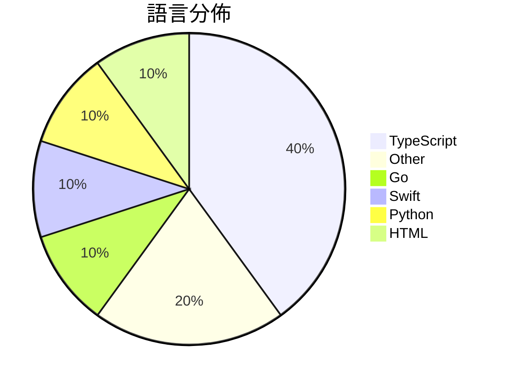

# GitHub Trending - 2026-06-20

> [!summary] 本日摘要
> 收錄 **10** 個新專案，合計 **9.4k** stars
> 語言分佈：TypeScript (4) · Other (2) · Go (1) · Swift (1) · Python (1) · HTML (1)

> [!tip] 本週焦點
> **[[tamnd--kage|tamnd/kage]]** — 5 天內累積 2.1k stars（420 stars/天）
> 讓你離線瀏覽網站，並移除所有 JavaScript 代碼。



---

## 收錄列表

| # | 專案 | 分類 | Stars | 速度 | 安裝 | 語言 | 用途 |
| :--: | --- | --- | ---: | ---: | --- | --- | --- |
| 1 | [[tamnd--kage\|tamnd/kage]] | CLI 工具 | 2.1k | 420/天 | `easy` | Go | 讓你離線瀏覽網站，並移除所有 JavaScript 代碼。 |
| 2 | [[vercel--eve\|vercel/eve]] | 開發工具 | 1.6k | 549/天 | `easy` | TypeScript | 提供一個以檔案系統為基礎的框架來構建耐用的 AI 代理。 |
| 3 | [[Waishnav--devspace\|Waishnav/devspace]] | 開發工具 | 1.4k | 281/天 | `medium` | TypeScript | 讓 ChatGPT 直接在本地代碼上進行編輯和執行，無需上傳任何資料。 |
| 4 | [[EEliberto--IPA-Download\|EEliberto/IPA-Download]] | 開發工具 | 1.1k | 186/天 | `medium` | Swift | 一款用于安装 IPA 历史版本的工具，适用于获取旧版应用并自动捕获数据包。 |
| 5 | [[alchaincyf--loop-engineering-orange-book\|alchaincyf/loop-engineering-orange-book]] | 其他 | 702 | 176/天 | `easy` | N/A | 提供一個簡明易懂的 Loop Engineering 指南，幫助開發者設計自動化 |
| 6 | [[mrtooher--fable-mode\|mrtooher/fable-mode]] | AI/ML | 519 | 87/天 | `medium` | N/A | 讓 Claude 具備多階段計劃、子代理委派和自我驗證的能力，適合處理複雜任務。 |
| 7 | [[Plaer1--junction\|Plaer1/junction]] | 開發工具 | 513 | 257/天 | `medium` | TypeScript | 提供 VS Code 聊天側邊欄，連接本地 AI 編碼代理。 |
| 8 | [[fivetaku--fablize\|fivetaku/fablize]] | 開發工具 | 504 | 101/天 | `easy` | Python | 讓 Opus 像 Fable 一樣運作，透過程序強制完成、證據和驗證。 |
| 9 | [[royalbhati--sqltoerdiagram\|royalbhati/sqltoerdiagram]] | 開發工具 | 483 | 97/天 | `easy` | HTML | 將 SQL 表結構轉換為互動式 ER 圖，完全在瀏覽器中運行，無需上傳。 |
| 10 | [[rebel0789--codexpro\|rebel0789/codexpro]] | 開發工具 | 446 | 149/天 | `easy` | TypeScript | 讓 ChatGPT 成為你的本地編碼代理，輕鬆操作你的代碼庫。 |

---

## 重點摘要

### 1. [[tamnd--kage|tamnd/kage]] `CLI 工具`

> 讓你離線瀏覽網站，並移除所有 JavaScript 代碼。

**2.1k** stars · **420** stars/天 · Go · `easy`

_建立 5 天內累積 2098 stars（420/天），forks 63（3.0%），顯示出不錯的社群反應。作者 tamnd 之前有開發其他開源工具，這次的 kage 解決了用戶在離線瀏覽時的痛點，特別是網站內容隨時間變化的問題。此工具的出現正好契合了對於長期保存網頁內容的需求，並且提供了一個簡單的解決方案。社群的活躍度和開發者的背景都為這個專案的未來發展提供了良好的基礎。_

---

### 2. [[vercel--eve|vercel/eve]] `開發工具`

> 提供一個以檔案系統為基礎的框架來構建耐用的 AI 代理。

**1.6k** stars · **549** stars/天 · TypeScript · `easy`

_建立 3 天內累積 1646 stars（549/天），forks 106（6.4%），顯示出強烈的社群興趣。主要貢獻者 ijjk 和 AndrewBarba 之前在 Vercel 的其他專案中有過豐富的經驗，這使得這個框架能夠快速解決開發者在構建 AI 代理時面臨的複雜性問題。之前，開發者常常需要手動配置代理的各種組件，而 eve 的檔案系統結構能夠簡化這一過程。最近的推文和討論也讓這個專案獲得了更多的曝光，進一步推動了其受歡迎程度。forks/stars 比率約 6.4% 表示許多開發者正在實際修改和使用這個工具，而不是單純觀望。_

---

### 3. [[Waishnav--devspace|Waishnav/devspace]] `開發工具`

> 讓 ChatGPT 直接在本地代碼上進行編輯和執行，無需上傳任何資料。

**1.4k** stars · **281** stars/天 · TypeScript · `medium`

_建立 5 天就累積 1405 stars（281/天），forks 126（9.0%），這顯示出強烈的用戶興趣。Waishnav 是這個專案的創建者，之前開發過 GitCMS，這讓他在開源社群中有一定的知名度。DevSpace 解決了本地編碼環境與 ChatGPT 之間的連接問題，之前的方案往往需要將代碼上傳到雲端，這樣容易引發安全隱患。這個專案的推出正好滿足了對安全性和隱私的需求，並且在社群中引發了討論和關注。forks/stars 比率為 9.0%，顯示出許多人對這個專案進行實際修改和使用。_

---

### 4. [[EEliberto--IPA-Download|EEliberto/IPA-Download]] `開發工具`

> 一款用于安装 IPA 历史版本的工具，适用于获取旧版应用并自动捕获数据包。

**1.1k** stars · **186** stars/天 · Swift · `medium`

_建立 6 天就累積 1117 stars（186/天），forks 61（5.5%），顯示出穩定的增長潛力。作者 EEliberto 之前有開發相關工具，這次解決了用戶在安裝舊版應用時的繁瑣流程，特別是雙重認證的問題。此工具的推出引起了開發者社群的關注，尤其是在需要安裝舊版應用的場景下。技術上，macOS 的新特性使得這個工具的開發成為可能，並且其高自動化程度讓用戶體驗更佳。forks/stars 比率適中，顯示出有一定的實際使用需求。_

---

### 5. [[alchaincyf--loop-engineering-orange-book|alchaincyf/loop-engineering-orange-book]] `其他`

> 提供一個簡明易懂的 Loop Engineering 指南，幫助開發者設計自動化系統。

**702** stars · **176** stars/天 · N/A · `easy`

_建立 4 天內累積 702 stars（176/天），forks 60（8.5%），顯示出高關注度。作者 HuaShu 是一位知名的 AI 開發者，擁有超過 50 萬的追隨者，並且在 AI 工具開發上有豐富的經驗。這本書解決了開發者在使用 AI 代理時的手動提示問題，提供了一個系統化的解決方案。近期的社交媒體討論和相關文章也促進了這一概念的流行。技術上，AI 工具的快速發展使得這種自動化方法成為可能，並且在實際應用中能夠顯著提高效率。forks/stars 比率為 8.5%，顯示出許多人對這本書的內容進行實際修改和使用。_

---

### 6. [[mrtooher--fable-mode|mrtooher/fable-mode]] `AI/ML`

> 讓 Claude 具備多階段計劃、子代理委派和自我驗證的能力，適合處理複雜任務。

**519** stars · **87** stars/天 · N/A · `medium`

_建立 6 天內累積 519 stars（87/天），forks 58（11.2%），顯示出相對穩定的增長。這個專案的作者 mrtooher 及其團隊在 Claude 生態系統中有一定的影響力，之前的專案也多數聚焦於提升 AI 的執行能力。這個技能解決了在處理複雜任務時，模型容易出現的無序和不一致問題，提供了一個結構化的執行流程，這在過去的 AI 工具中並不常見。社群對於這種多階段執行的需求逐漸上升，特別是在需要高可靠性的商業應用中。_

---

### 7. [[Plaer1--junction|Plaer1/junction]] `開發工具`

> 提供 VS Code 聊天側邊欄，連接本地 AI 編碼代理。

**513** stars · **257** stars/天 · TypeScript · `medium`

_建立 2 天就累積 513 stars（256.5/天），forks 6（1.2%），這顯示出一定的初步關注。作者 Plaer1 是一位活躍的開發者，專注於開源工具的開發。這個專案解決了開發者在 VS Code 中與本地 AI 代理交互的需求，之前的解決方案多數無法提供這樣的整合。近期的推廣活動和社群討論也可能促進了其曝光度。技術上，Junction 的多橋接架構和動畫效果使其在同類工具中脫穎而出，吸引了不少開發者的注意。forks/stars 比率較低，顯示目前使用者多為觀望者，尚未大量修改或擴展此工具。_

---

### 8. [[fivetaku--fablize|fivetaku/fablize]] `開發工具`

> 讓 Opus 像 Fable 一樣運作，透過程序強制完成、證據和驗證。

**504** stars · **101** stars/天 · Python · `easy`

_建立 5 天內累積 504 stars（101/天），forks 73（14.5%），顯示出良好的社群反響。這個專案由 fivetaku 和 GPTaku-ai 共同開發，專注於解決 Opus 在開放式任務上的表現不足，透過程序化的方式來提升其效能。之前的工具未能有效解決這一問題，fablize 提供了一個可行的解決方案。社群的反應顯示出對於這種新方法的需求，尤其是在 AI 模型的應用上。此專案的成功也反映了對於更高效能 AI 工具的需求增加，尤其是在開發者社群中。_

---

### 9. [[royalbhati--sqltoerdiagram|royalbhati/sqltoerdiagram]] `開發工具`

> 將 SQL 表結構轉換為互動式 ER 圖，完全在瀏覽器中運行，無需上傳。

**483** stars · **97** stars/天 · HTML · `easy`

_建立 5 天內累積 483 stars（97/天），forks 39（8.1%），這顯示出不錯的增長潛力。作者 Royal Bhati 之前有開發過其他開源工具，這次專案解決了現有 SQL 圖表工具的多數痛點，如付費牆和性能問題。這個工具的出現恰逢開發者對於簡單、快速的本地解決方案的需求上升，特別是在數據隱私日益受到重視的背景下。forks/stars 比率在 8.1% 表示有相當一部分使用者對其進行了實際修改或使用，這是健康的社群參與指標。_

---

### 10. [[rebel0789--codexpro|rebel0789/codexpro]] `開發工具`

> 讓 ChatGPT 成為你的本地編碼代理，輕鬆操作你的代碼庫。

**446** stars · **149** stars/天 · TypeScript · `easy`

_建立 3 天內累積 446 stars（149/天），forks 40（9%），顯示出強勁的增長潛力。該專案由 rebel0789 和 Jasonzld 共同開發，前者在開源社群中有一定的知名度。CodexPro 解決了開發者在本地環境中使用 ChatGPT 的痛點，提供了一個簡單的設置流程，讓開發者能夠快速上手。近期的 GitHub 討論和社群反饋也促進了這個專案的曝光度。隨著本地開發需求的增加，CodexPro 的出現正好滿足了這一需求。_

---

## 今日到期複習

> [!tip] 根據間隔複習排程，今天該回顧的專案

```dataview
TABLE
  stars_per_day AS "Stars/天",
  category AS "分類",
  engagement AS "參與度"
FROM "Repos"
WHERE next_review AND date(next_review) <= date("2026-06-20") AND status != "archived"
SORT priority DESC
```

## 待處理

```dataviewjs
const pending = dv.pages('"Repos"').where(p => p.status === "to-review").length;
const unrated = dv.pages('"Repos"').where(p => p.status !== "archived" && p.status !== "to-review" && (p.my_rating || 0) === 0).length;
const noVerdict = dv.pages('"Repos"').where(p => p.status !== "archived" && (p.my_rating || 0) > 0 && (!p.verdict || p.verdict === "")).length;
const items = [];
if (pending > 0) items.push(`**${pending}** 個待分流`);
if (unrated > 0) items.push(`**${unrated}** 個已讀但未評分`);
if (noVerdict > 0) items.push(`**${noVerdict}** 個已評分但無結論`);
if (items.length > 0) dv.paragraph(items.join(" / "));
else dv.paragraph("所有專案都已處理完畢！");
```
