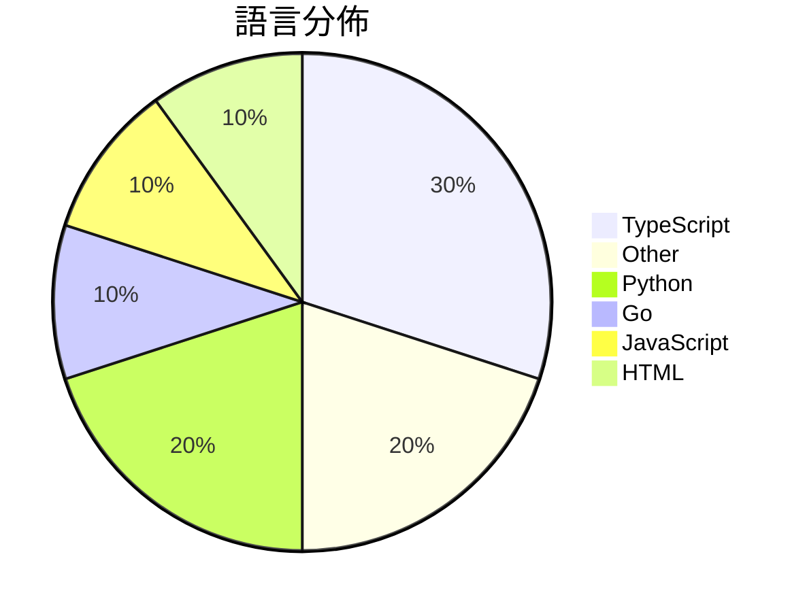

# GitHub Trending - 2026-06-21

> [!summary] 本日摘要
> 收錄 **10** 個新專案，合計 **9.4k** stars
> 語言分佈：TypeScript (3) · Other (2) · Python (2) · Go (1) · JavaScript (1) · HTML (1)

> [!tip] 本週焦點
> **[[tamnd--kage|tamnd/kage]]** — 6 天內累積 2.2k stars（361 stars/天）
> 讓網站離線瀏覽，並移除所有 JavaScript。



---

## 收錄列表

| # | 專案 | 分類 | Stars | 速度 | 安裝 | 語言 | 用途 |
| :--: | --- | --- | ---: | ---: | --- | --- | --- |
| 1 | [[tamnd--kage\|tamnd/kage]] | 開發工具 | 2.2k | 361/天 | `medium` | Go | 讓網站離線瀏覽，並移除所有 JavaScript。 |
| 2 | [[vercel--eve\|vercel/eve]] | 開發工具 | 1.9k | 467/天 | `easy` | TypeScript | 提供一個以檔案系統為基礎的框架，讓開發者能夠輕鬆構建持久的 AI 代理。 |
| 3 | [[Waishnav--devspace\|Waishnav/devspace]] | 開發工具 | 1.6k | 272/天 | `easy` | TypeScript | 讓 ChatGPT 直接在本地專案中編碼，無需上傳任何資料。 |
| 4 | [[alchaincyf--loop-engineering-orange-book\|alchaincyf/loop-engineering-orange-book]] | 其他 | 716 | 143/天 | `easy` | N/A | 提供一個簡明易懂的 Loop Engineering 指導，幫助開發者設計自動化 |
| 5 | [[rebel0789--codexpro\|rebel0789/codexpro]] | 開發工具 | 542 | 136/天 | `easy` | JavaScript | 將 ChatGPT 開發者模式用作本地代碼代理，輕鬆與你的代碼庫互動。 |
| 6 | [[fivetaku--fablize\|fivetaku/fablize]] | 開發工具 | 533 | 89/天 | `easy` | Python | 讓 Opus 像 Fable 一樣執行任務，強調過程中的證據和驗證。 |
| 7 | [[Forsy-AI--agent-apprenticeship\|Forsy-AI/agent-apprenticeship]] | AI/ML | 529 | 529/天 | `easy` | N/A | 讓 AI 代理透過真實世界的工作學習，實現迭代工作流程和經驗共享。 |
| 8 | [[Plaer1--junction\|Plaer1/junction]] | 開發工具 | 516 | 172/天 | `medium` | TypeScript | 提供 VS Code 的聊天側邊欄，連接本地 AI 編碼代理。 |
| 9 | [[royalbhati--sqltoerdiagram\|royalbhati/sqltoerdiagram]] | 開發工具 | 494 | 82/天 | `easy` | HTML | 將 SQL 表結構轉換為互動式 ER 圖，無需上傳資料，完全在瀏覽器運行。 |
| 10 | [[dongshuyan--compass-skills\|dongshuyan/compass-skills]] | 開發工具 | 397 | 79/天 | `easy` | Python | 提供 AI 編碼代理的個性化任務管理與技能系統。 |

---

## 重點摘要

### 1. [[tamnd--kage|tamnd/kage]] `開發工具`

> 讓網站離線瀏覽，並移除所有 JavaScript。

**2.2k** stars · **361** stars/天 · Go · `medium`

_建立 6 天就累積 2166 stars（361/天），forks 69（3.2%），這顯示出強勁的增長潛力。作者 tamnd 之前有開發其他開源工具，這次的 kage 解決了用戶在保存網站時常遇到的問題，特別是 JavaScript 依賴導致的離線瀏覽困難。這個工具的推出正好契合了對於網站資料保存的需求，尤其是在網路環境不穩定的情況下。社群的反應熱烈，熱門問題也顯示出用戶對於功能的期待和使用中的痛點。整體來看，kage 的成功是因為它填補了市場上的一個空白，並且提供了一個簡單易用的解決方案。_

---

### 2. [[vercel--eve|vercel/eve]] `開發工具`

> 提供一個以檔案系統為基礎的框架，讓開發者能夠輕鬆構建持久的 AI 代理。

**1.9k** stars · **467** stars/天 · TypeScript · `easy`

_建立 4 天就累積 1868 stars（467/天），forks 121（6.5%），顯示出穩定的增長潛力。主要貢獻者包括 Vercel 的開發者，這些人有著豐富的開源經驗。eve 解決了傳統代理框架在可維護性和擴展性上的不足，特別是對於需要快速迭代的 AI 專案。社群的活躍度和開發者的反饋也促進了專案的快速發展。技術生態的進步，如 TypeScript 和現代化的開發工具，使得這個框架的實現變得可行。forks/stars 比率顯示出有相當一部分用戶在實際修改和使用這個專案，代表著良好的社群參與度。_

---

### 3. [[Waishnav--devspace|Waishnav/devspace]] `開發工具`

> 讓 ChatGPT 直接在本地專案中編碼，無需上傳任何資料。

**1.6k** stars · **272** stars/天 · TypeScript · `easy`

_建立 6 天內累積 1632 stars（272/天），forks 147（9.0%），顯示出強勁的增長潛力。作者 Waishnav 過去曾開發 GitCMS，這是一個 Git 支持的 CMS，顯示了其在開源領域的經驗。DevSpace 解決了開發者在使用 ChatGPT 進行編碼時的安全性問題，因為它允許在本地環境中進行操作而不需上傳資料。這樣的設計滿足了對於安全性和隱私的需求，特別是在處理敏感代碼時。社群的活躍度也反映在開放的問題和反饋上，顯示出使用者對於這個工具的興趣和需求。_

---

### 4. [[alchaincyf--loop-engineering-orange-book|alchaincyf/loop-engineering-orange-book]] `其他`

> 提供一個簡明易懂的 Loop Engineering 指導，幫助開發者設計自動化系統，減少手動提示的需求。

**716** stars · **143** stars/天 · N/A · `easy`

_建立 5 天內累積 716 stars（143/天），forks 62（8.7%），顯示出強烈的社群興趣。作者 HuaShu 是一位知名的 AI 開發者，擁有超過 50 萬的追隨者，並且在 AI 工具的使用上有豐富的經驗。這本書解決了開發者在使用 AI 工具時需要不斷手動提示的痛點，提供了一個更高效的自動化解決方案。近期的社交媒體討論和技術文章推廣了 Loop Engineering 的概念，吸引了許多開發者的注意。這個工具的出現正好契合了當前 AI 工具快速發展的趨勢，讓開發者能夠更有效地利用這些技術。forks/stars 比率為 8.7%，顯示出許多人對於這本書的實用性有興趣，並計劃進行實際修改或使用。_

---

### 5. [[rebel0789--codexpro|rebel0789/codexpro]] `開發工具`

> 將 ChatGPT 開發者模式用作本地代碼代理，輕鬆與你的代碼庫互動。

**542** stars · **136** stars/天 · JavaScript · `easy`

_建立 4 天內累積 542 stars（135.5/天），forks 48（8.9%），這顯示出不錯的關注度。作者 rebel0789 在開源社群中有一定的知名度，這個專案解決了開發者在本地環境中使用 ChatGPT 的需求，之前的工具往往需要繁瑣的配置或不支持直接的本地開發集成。近期的推廣活動和社群討論也為專案帶來了流量，特別是在開發者圈子中引起了熱烈的反響。這個工具的出現正好契合了開發者對於提高工作效率的需求，且其簡單的安裝和使用流程使得它更具吸引力。_

---

### 6. [[fivetaku--fablize|fivetaku/fablize]] `開發工具`

> 讓 Opus 像 Fable 一樣執行任務，強調過程中的證據和驗證。

**533** stars · **89** stars/天 · Python · `easy`

_建立 6 天就累積 533 stars（89/天），forks 76（14.3%），這顯示出相對活躍的使用者關注。作者 fivetaku 和 GPTaku-ai 在 AI 和 Claude 模型領域有一定的背景，這個插件解決了 Opus 模型在執行過程中缺乏嚴謹驗證的痛點。之前的解決方案往往無法有效地將 Fable 的優勢轉移到 Opus，fablize 透過程序化的方式填補了這一空白。社群的反饋也顯示出對於這個插件的興趣，尤其是在開發者圈子中。這個工具的出現正好符合了對於更高效能和可靠性的需求。_

---

### 7. [[Forsy-AI--agent-apprenticeship|Forsy-AI/agent-apprenticeship]] `AI/ML`

> 讓 AI 代理透過真實世界的工作學習，實現迭代工作流程和經驗共享。

**529** stars · **529** stars/天 · N/A · `easy`

_建立 1 天就累積 529 stars（529/天），forks 0（0.0%），顯示出極高的初期關注度。作者 ray-r-ren 在 AI 代理領域有豐富的經驗，這個專案解決了 AI 代理在真實世界任務中學習的痛點，之前的工具往往缺乏有效的經驗共享機制。這個專案的推出可能受到社群對於 AI 代理經濟價值的關注，並且在技術生態上，對於多種模型的支持使其更具吸引力。由於 forks/stars 比率為 0.0%，顯示目前使用者仍在觀望階段。_

---

### 8. [[Plaer1--junction|Plaer1/junction]] `開發工具`

> 提供 VS Code 的聊天側邊欄，連接本地 AI 編碼代理。

**516** stars · **172** stars/天 · TypeScript · `medium`

_建立 3 天就累積 516 stars（172/天），forks 7（1.4%），顯示出穩定的增長潛力。作者 Plaer1 之前的開發經驗顯示出對 VS Code 生態的熟悉，這個專案解決了開發者在使用本地 AI 代理時的整合問題，之前的解決方案往往缺乏統一的界面和多後端支持。這個工具的推出可能受到社群對於 AI 編碼助手需求增加的影響，並且其多樣的功能設計也吸引了不少開發者的注意。_

---

### 9. [[royalbhati--sqltoerdiagram|royalbhati/sqltoerdiagram]] `開發工具`

> 將 SQL 表結構轉換為互動式 ER 圖，無需上傳資料，完全在瀏覽器運行。

**494** stars · **82** stars/天 · HTML · `easy`

_建立 6 天就累積 494 stars（82/天），forks 41（8.3%），顯示出良好的用戶接受度。作者 Royal Bhati 之前的工作經驗可能讓他能夠快速開發出這個工具，解決了現有 SQL 圖表工具普遍存在的緩慢、難用或需付費的問題。這個工具的出現正好填補了市場的空白，特別是對於需要快速生成 ERD 的開發者來說。最近的社群討論和推廣活動也可能促進了其知名度的提升。_

---

### 10. [[dongshuyan--compass-skills|dongshuyan/compass-skills]] `開發工具`

> 提供 AI 編碼代理的個性化任務管理與技能系統。

**397** stars · **79** stars/天 · Python · `easy`

_建立 5 天內累積 397 stars（79/天），forks 34（8.6%），顯示出穩定的增長趨勢。作者 dongshuyan 之前在 AI 代理領域有豐富經驗，這個專案解決了長期任務管理中的上下文保持問題，之前的工具往往無法有效追蹤多輪對話中的任務狀態。這個專案的發布引起了社群的關注，尤其是在 AI 編碼代理的應用場景中。高 forks/stars 比率（8.6%）顯示出不少開發者對這個工具的實際修改和使用，表明其在社群中的實用性。_

---

## 今日到期複習

> [!tip] 根據間隔複習排程，今天該回顧的專案

```dataview
TABLE
  stars_per_day AS "Stars/天",
  category AS "分類",
  engagement AS "參與度"
FROM "Repos"
WHERE next_review AND date(next_review) <= date("2026-06-21") AND status != "archived"
SORT priority DESC
```

## 待處理

```dataviewjs
const pending = dv.pages('"Repos"').where(p => p.status === "to-review").length;
const unrated = dv.pages('"Repos"').where(p => p.status !== "archived" && p.status !== "to-review" && (p.my_rating || 0) === 0).length;
const noVerdict = dv.pages('"Repos"').where(p => p.status !== "archived" && (p.my_rating || 0) > 0 && (!p.verdict || p.verdict === "")).length;
const items = [];
if (pending > 0) items.push(`**${pending}** 個待分流`);
if (unrated > 0) items.push(`**${unrated}** 個已讀但未評分`);
if (noVerdict > 0) items.push(`**${noVerdict}** 個已評分但無結論`);
if (items.length > 0) dv.paragraph(items.join(" / "));
else dv.paragraph("所有專案都已處理完畢！");
```
