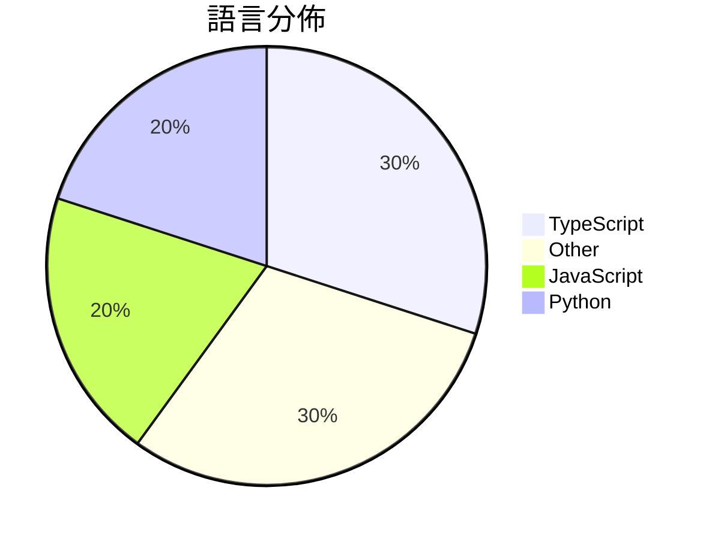

# GitHub Trending - 2026-06-22

> [!summary] 本日摘要
> 收錄 **10** 個新專案，合計 **7.5k** stars
> 語言分佈：TypeScript (3) · Other (3) · JavaScript (2) · Python (2)

> [!tip] 本週焦點
> **[[vercel--eve|vercel/eve]]** — 5 天內累積 2.1k stars（417 stars/天）
> 提供一個以檔案系統為基礎的框架，讓開發者能輕鬆構建持久的 AI 代理。



---

## 收錄列表

| # | 專案 | 分類 | Stars | 速度 | 安裝 | 語言 | 用途 |
| :--: | --- | --- | ---: | ---: | --- | --- | --- |
| 1 | [[vercel--eve\|vercel/eve]] | 開發工具 | 2.1k | 417/天 | `easy` | TypeScript | 提供一個以檔案系統為基礎的框架，讓開發者能輕鬆構建持久的 AI 代理。 |
| 2 | [[zhongerxin--Cowart\|zhongerxin/Cowart]] | 開發工具 | 1.2k | 409/天 | `medium` | JavaScript | 提供一個本地的無限畫布插件，讓 Codex 用戶能夠創建和生成圖片。 |
| 3 | [[alchaincyf--loop-engineering-orange-book\|alchaincyf/loop-engineering-orange-book]] | 其他 | 726 | 121/天 | `easy` | N/A | 提供 Loop Engineering 的平易近人指南，幫助開發者設計自動化系統 |
| 4 | [[rebel0789--codexpro\|rebel0789/codexpro]] | 開發工具 | 625 | 125/天 | `easy` | JavaScript | 將 ChatGPT 開發者模式轉變為本地編碼代理，輕鬆管理你的代碼庫。 |
| 5 | [[Forsy-AI--agent-apprenticeship\|Forsy-AI/agent-apprenticeship]] | AI/ML | 609 | 305/天 | `easy` | N/A | 讓 AI 代理透過實際工作學習，實現可重複的經驗和集體訓練信號交換。 |
| 6 | [[Plaer1--junction\|Plaer1/junction]] | 開發工具 | 517 | 129/天 | `easy` | TypeScript | 提供 VS Code 的聊天側邊欄，連接本地 AI 編碼代理。 |
| 7 | [[ngrok--webernetes\|ngrok/webernetes]] | 開發工具 | 482 | 96/天 | `easy` | TypeScript | 在瀏覽器中運行的 Kubernetes 模擬器。 |
| 8 | [[dongshuyan--compass-skills\|dongshuyan/compass-skills]] | 開發工具 | 429 | 72/天 | `easy` | Python | 提供 AI 代理的個性化任務管理與協作技能系統。 |
| 9 | [[boogu-project--Boogu-Image\|boogu-project/Boogu-Image]] | AI/ML | 392 | 78/天 | `medium` | Python | 提供高品質的圖像生成和編輯功能，並以較少的數據達成接近封閉源的性能。 |
| 10 | [[MstKail--polymarket-trading-bot-services-polyedge365\|MstKail/polymarket-trading-bot-services-polyedge365]] | 開發工具 | 378 | 126/天 | `medium` | N/A | 提供多種自動化交易策略，幫助用戶在 Polymarket 上進行交易。 |

---

## 重點摘要

### 1. [[vercel--eve|vercel/eve]] `開發工具`

> 提供一個以檔案系統為基礎的框架，讓開發者能輕鬆構建持久的 AI 代理。

**2.1k** stars · **417** stars/天 · TypeScript · `easy`

_建立 5 天內累積 2083 stars（417/天），forks 150（7.2%），顯示出穩定的增長潛力。這個專案的主要貢獻者 ijjk 之前在 Vercel 的開發中有豐富經驗，這使得專案在技術上有良好的基礎。eve 解決了以往 AI 代理開發中缺乏靈活性和可維護性的問題，傳統上開發者需要手動處理許多細節，而這個框架通過簡化檔案結構來降低了這些複雜性。最近的推廣活動和社群討論也吸引了不少開發者的注意，特別是在 GitHub Discussions 中的活躍互動。這個工具的設計理念與當前流行的微服務架構相吻合，使得它在現代開發環境中更具吸引力。_

---

### 2. [[zhongerxin--Cowart|zhongerxin/Cowart]] `開發工具`

> 提供一個本地的無限畫布插件，讓 Codex 用戶能夠創建和生成圖片。

**1.2k** stars · **409** stars/天 · JavaScript · `medium`

_建立 3 天內累積 1227 stars（409/天），forks 108（8.8%），這顯示出強烈的增長趨勢。作者 zhongerxin 之前在 AI 工具開發上有豐富經驗，Cowart 解決了 Codex 用戶在本地無限畫布方面的需求，之前的解決方案往往依賴於雲端服務，造成延遲和隱私問題。這個專案的推出正好滿足了對本地化工具的需求，並且在社群中引發了討論。其技術架構的選擇，如使用 Vite 和 React，讓它在性能上具備優勢，這也是其受歡迎的原因之一。_

---

### 3. [[alchaincyf--loop-engineering-orange-book|alchaincyf/loop-engineering-orange-book]] `其他`

> 提供 Loop Engineering 的平易近人指南，幫助開發者設計自動化系統以取代手動提示。

**726** stars · **121** stars/天 · N/A · `easy`

_建立 6 天就累積 726 stars（121/天），forks 63（8.7%），這顯示出強烈的興趣和需求。作者 HuaShu 是一位 AI 內容創作者，擁有超過 50 萬的追隨者，並且在 AI 工具的開發上有豐富經驗。這本書解決了開發者在使用 AI 工具時的痛點，特別是如何從手動提示轉向自動化的系統設計。這一概念在社群中引起了廣泛的討論，尤其是當多位知名開發者同時提到 Loop Engineering 時，進一步推動了這一趨勢。技術生態的變化，如 AI 工具的普及，使得這種自動化設計變得可行且必要。forks/stars 比率為 8.7%，顯示出許多人在實際修改和使用這本書的內容。_

---

### 4. [[rebel0789--codexpro|rebel0789/codexpro]] `開發工具`

> 將 ChatGPT 開發者模式轉變為本地編碼代理，輕鬆管理你的代碼庫。

**625** stars · **125** stars/天 · JavaScript · `easy`

_建立 5 天內累積 625 stars（125/天），forks 57（9.1%），顯示出穩定的增長潛力。作者 rebel0789 及 Jasonzld 具備開發背景，專注於提升開發者體驗。這個工具解決了開發者在使用 ChatGPT 時的上下文管理問題，之前的方案往往無法有效整合本地代碼庫的上下文。近期在社群中引發討論，尤其是如何使用第三方網站的 Pro 版本，顯示出用戶對於功能擴展的需求。隨著開發者對於 AI 工具的需求增加，CodexPro 的出現正好填補了這一空白，並且其簡單的設置流程降低了使用門檻。_

---

### 5. [[Forsy-AI--agent-apprenticeship|Forsy-AI/agent-apprenticeship]] `AI/ML`

> 讓 AI 代理透過實際工作學習，實現可重複的經驗和集體訓練信號交換。

**609** stars · **305** stars/天 · N/A · `easy`

_建立 2 天內累積 609 stars（304.5/天），forks 1（0.2%），顯示出初期的增長潛力。作者 ray-r-ren 以開發 AI 代理為主，這個專案解決了代理學習和經驗共享的痛點，之前的方案往往缺乏有效的學習信號交換機制。雖然目前尚未有明顯的觸發事件，但該專案的設計理念符合當前 AI 代理發展的趨勢，特別是在經濟價值任務的執行上。forks/stars 比率低，顯示出目前使用者對於實際修改的需求不高，可能是因為專案仍在早期階段。_

---

### 6. [[Plaer1--junction|Plaer1/junction]] `開發工具`

> 提供 VS Code 的聊天側邊欄，連接本地 AI 編碼代理。

**517** stars · **129** stars/天 · TypeScript · `easy`

_建立 4 天就累積 517 stars（129/天），forks 7（1.4%），這顯示出一定的初期關注度。作者 Plaer1 是一位活躍的開發者，過去參與了多個開源專案。這個工具解決了開發者在使用多個 AI 編碼代理時的整合問題，之前的方案往往需要手動切換，效率低下。近期的推廣活動和社群討論可能也提升了其知名度。技術上，Junction 利用 WebSocket 和 HTTP 來連接不同的後端，這使得它能夠在多種環境下靈活運作。forks/stars 比率較低，意味著大多數用戶仍在觀望階段。_

---

### 7. [[ngrok--webernetes|ngrok/webernetes]] `開發工具`

> 在瀏覽器中運行的 Kubernetes 模擬器。

**482** stars · **96** stars/天 · TypeScript · `easy`

_建立 5 天內累積 482 stars（96/天），forks 38（7.9%），顯示出一定的關注度。這個專案由 ngrok 團隊開發，ngrok 本身在網絡隧道技術上有良好的聲譽，這使得他們的工具更容易被接受。Webernetes 解決了在瀏覽器中模擬 Kubernetes 的需求，這在以往需要實際的基礎設施支持，成本較高且維護困難。這樣的創新讓開發者能夠在無需複雜設置的情況下學習和演示 Kubernetes 的功能。社群的反饋和需求也促進了這個專案的快速增長。_

---

### 8. [[dongshuyan--compass-skills|dongshuyan/compass-skills]] `開發工具`

> 提供 AI 代理的個性化任務管理與協作技能系統。

**429** stars · **72** stars/天 · Python · `easy`

_建立 6 天內累積 429 stars（72/天），forks 35（8.2%），顯示出穩定的增長潛力。作者 dongshuyan 之前有開發相關的 AI 工具，這個專案解決了 AI 代理在任務管理上的痛點，特別是在長期任務和多會話的情境中。技術上，這個工具的出現正好迎合了對於個性化 AI 代理的需求，尤其是在任務澄清和記憶管理方面。forks/stars 比率為 8.2%，顯示出有相當比例的用戶對此專案進行了實際修改或使用。_

---

### 9. [[boogu-project--Boogu-Image|boogu-project/Boogu-Image]] `AI/ML`

> 提供高品質的圖像生成和編輯功能，並以較少的數據達成接近封閉源的性能。

**392** stars · **78** stars/天 · Python · `medium`

_建立 5 天就累積 392 stars（78/天），forks 19（4.8%），這顯示出一定的社群關注度。Boogu 團隊的背景不明，但他們的目標是提供一個開源替代品，解決現有封閉源模型在數據需求上的高成本問題。這個專案的出現正好填補了開源社群對於高效能圖像生成工具的需求，並且在社群中引起了討論，尤其是對於其編輯功能的敏感性和多圖支持的需求。技術上，這個專案的出現也得益於 PyTorch 和其他深度學習框架的成熟，使得開發者能夠在較低的資源下實現高效能的模型。_

---

### 10. [[MstKail--polymarket-trading-bot-services-polyedge365|MstKail/polymarket-trading-bot-services-polyedge365]] `開發工具`

> 提供多種自動化交易策略，幫助用戶在 Polymarket 上進行交易。

**378** stars · **126** stars/天 · N/A · `medium`

_建立 3 天內累積 378 stars（126/天），forks 710（187.8%），這顯示出極高的用戶興趣。作者 MstKail 針對 Polymarket 的交易需求，提供了一個多功能的自動化交易解決方案，填補了市場上對於高效交易工具的需求。這個專案的推出正值預測市場逐漸受歡迎的時期，讓用戶能夠更有效地利用市場機會。高達 187.8% 的 forks/stars 比率顯示出用戶對於修改和擴展此工具的強烈興趣，這可能意味著該專案的實用性和靈活性受到廣泛認可。_

---

## 今日到期複習

> [!tip] 根據間隔複習排程，今天該回顧的專案

```dataview
TABLE
  stars_per_day AS "Stars/天",
  category AS "分類",
  engagement AS "參與度"
FROM "Repos"
WHERE next_review AND date(next_review) <= date("2026-06-22") AND status != "archived"
SORT priority DESC
```

## 待處理

```dataviewjs
const pending = dv.pages('"Repos"').where(p => p.status === "to-review").length;
const unrated = dv.pages('"Repos"').where(p => p.status !== "archived" && p.status !== "to-review" && (p.my_rating || 0) === 0).length;
const noVerdict = dv.pages('"Repos"').where(p => p.status !== "archived" && (p.my_rating || 0) > 0 && (!p.verdict || p.verdict === "")).length;
const items = [];
if (pending > 0) items.push(`**${pending}** 個待分流`);
if (unrated > 0) items.push(`**${unrated}** 個已讀但未評分`);
if (noVerdict > 0) items.push(`**${noVerdict}** 個已評分但無結論`);
if (items.length > 0) dv.paragraph(items.join(" / "));
else dv.paragraph("所有專案都已處理完畢！");
```
