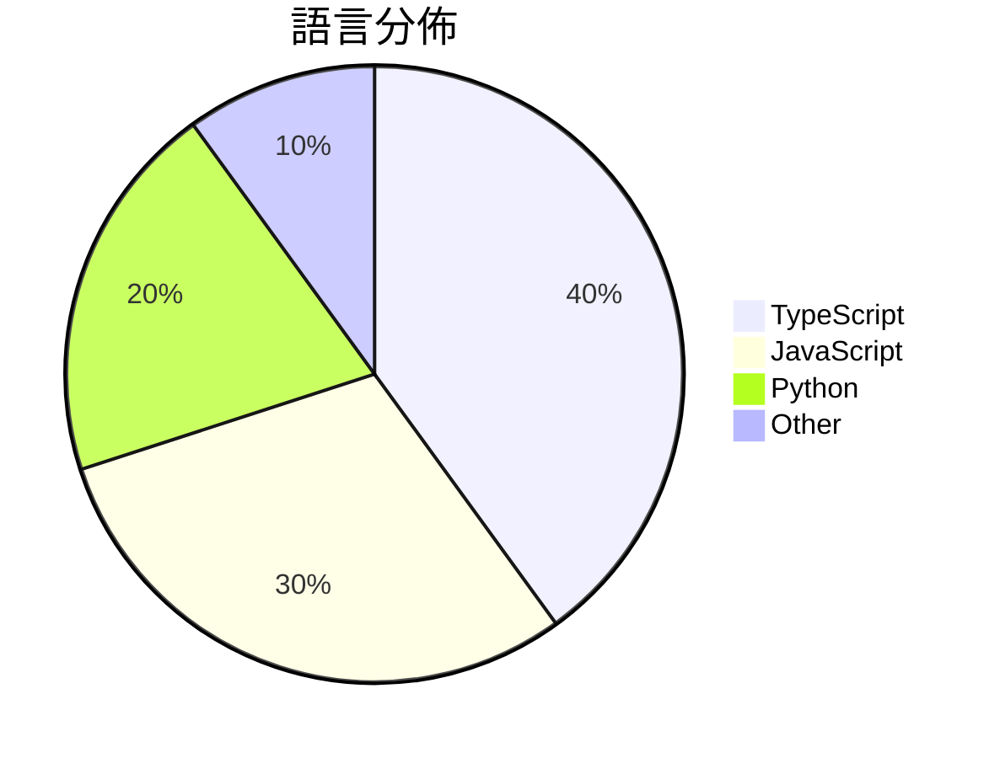

# GitHub Trending - 2026-06-23

> [!summary] 本日摘要
> 收錄 **10** 個新專案，合計 **9.1k** stars
> 語言分佈：TypeScript (4) · JavaScript (3) · Python (2) · Other (1)

> [!tip] 本週焦點
> **[[vercel--eve|vercel/eve]]** — 6 天內累積 2.3k stars（381 stars/天）
> 提供一個基於檔案系統的框架，讓開發者能夠輕鬆構建持久的 AI 代理。



---

## 收錄列表

| # | 專案 | 分類 | Stars | 速度 | 安裝 | 語言 | 用途 |
| :--: | --- | --- | ---: | ---: | --- | --- | --- |
| 1 | [[vercel--eve\|vercel/eve]] | 開發工具 | 2.3k | 381/天 | `medium` | TypeScript | 提供一個基於檔案系統的框架，讓開發者能夠輕鬆構建持久的 AI 代理。 |
| 2 | [[zhongerxin--Cowart\|zhongerxin/Cowart]] | 開發工具 | 2.0k | 499/天 | `medium` | JavaScript | 提供一個本地的無限畫布插件，讓 Codex 用戶能夠輕鬆生成和編輯圖片。 |
| 3 | [[rebel0789--codexpro\|rebel0789/codexpro]] | 開發工具 | 716 | 119/天 | `easy` | JavaScript | 將 ChatGPT 開發者模式作為本地代碼代理，輕鬆整合到你的代碼庫中。 |
| 4 | [[Forsy-AI--agent-apprenticeship\|Forsy-AI/agent-apprenticeship]] | AI/ML | 682 | 227/天 | `easy` | N/A | 讓 AI 代理透過實際工作學習，實現經濟價值的任務執行與知識共享。 |
| 5 | [[lyra81604--zhengxi-views\|lyra81604/zhengxi-views]] | AI/ML | 673 | 337/天 | `medium` | Python | 提供可溯源的郑希投资观点与方法，辅助研究学习。 |
| 6 | [[aidenybai--cnfast\|aidenybai/cnfast]] | 開發工具 | 664 | 221/天 | `easy` | TypeScript | 提供一個快速的 `cn` 替代方案，提升 Tailwind CSS 的性能。 |
| 7 | [[kanavtwtgg--birds.cafe\|kanavtwtgg/birds.cafe]] | 遊戲 | 550 | 550/天 | `easy` | JavaScript | 提供一個放鬆的鳥類模擬體驗，讓你在瀕臨海岸的天空中駕駛海鷗群。 |
| 8 | [[ngrok--webernetes\|ngrok/webernetes]] | 開發工具 | 541 | 90/天 | `easy` | TypeScript | 在瀏覽器中運行 Kubernetes 的模擬器。 |
| 9 | [[Plaer1--junction\|Plaer1/junction]] | 開發工具 | 525 | 105/天 | `medium` | TypeScript | 讓 VS Code 透過側邊欄連接本地 AI 編程代理，提升開發效率。 |
| 10 | [[baidu--Unlimited-OCR\|baidu/Unlimited-OCR]] | AI/ML | 481 | 120/天 | `medium` | Python | 提供一個高效的 OCR 解決方案，支持長文本的單次解析。 |

---

## 重點摘要

### 1. [[vercel--eve|vercel/eve]] `開發工具`

> 提供一個基於檔案系統的框架，讓開發者能夠輕鬆構建持久的 AI 代理。

**2.3k** stars · **381** stars/天 · TypeScript · `medium`

_建立 6 天就累積 2284 stars（381/天），forks 162（7.1%），這顯示出強勁的增長潛力。這個專案的主要貢獻者 ijjk 之前在 Vercel 的其他專案中有豐富經驗，這使得他們能夠針對開發者的需求設計出更符合實際使用的框架。eve 解決了許多開發者在構建 AI 代理時面臨的複雜性，特別是傳統框架的配置繁瑣和不直觀的問題。這個專案的推出正值 AI 代理需求上升的時期，讓開發者能夠更輕鬆地構建和管理代理。forks/stars 比率為 7.1%，顯示出有相當比例的用戶在實際修改和使用這個專案，而不是僅僅觀望。_

---

### 2. [[zhongerxin--Cowart|zhongerxin/Cowart]] `開發工具`

> 提供一個本地的無限畫布插件，讓 Codex 用戶能夠輕鬆生成和編輯圖片。

**2.0k** stars · **499** stars/天 · JavaScript · `medium`

_建立 4 天就累積 1994 stars（499/天），forks 154（7.7%），這顯示出用戶對於這個工具的高度興趣。作者 zhongerxin 擁有其他開源項目背景，這可能為其帶來了一定的信任度。Cowart 解決了 Codex 用戶在圖片生成過程中需要依賴雲端服務的痛點，提供了一個本地化的解決方案。這樣的設計不僅提高了效率，也降低了對網路連接的依賴。社群的反饋和需求也促進了這個工具的快速成長。_

---

### 3. [[rebel0789--codexpro|rebel0789/codexpro]] `開發工具`

> 將 ChatGPT 開發者模式作為本地代碼代理，輕鬆整合到你的代碼庫中。

**716** stars · **119** stars/天 · JavaScript · `easy`

_在建立 6 天內累積 716 stars（119/天），forks 63（8.8%），顯示出不錯的增長潛力。作者 rebel0789 和 Jasonzld 具備相關背景，這個工具解決了開發者在本地環境中無法有效利用 ChatGPT 的痛點，之前的解決方案往往需要依賴雲端服務，限制了靈活性。近期的推廣活動和社群討論也可能促進了這個專案的曝光，特別是在開發者社群中。這個工具的設計使得開發者能夠在本地環境中使用 ChatGPT，這在當前的開發生態中是相對新穎的。_

---

### 4. [[Forsy-AI--agent-apprenticeship|Forsy-AI/agent-apprenticeship]] `AI/ML`

> 讓 AI 代理透過實際工作學習，實現經濟價值的任務執行與知識共享。

**682** stars · **227** stars/天 · N/A · `easy`

_建立 3 天就累積 682 stars（227/天），forks 44（6.5%），這顯示出穩定的增長潛力。作者 ray-r-ren 在 AI 代理領域有豐富的經驗，之前的工作包括多個成功的開源專案。這個專案解決了 AI 代理在實際任務中學習的痛點，之前的方案往往缺乏有效的經驗共享和經濟價值評估。近期的推廣活動和社群討論也促進了其曝光度。隨著 AI 技術的快速發展，對於能夠有效學習和適應的代理需求日益增加，這使得 Agent Apprenticeship 的出現正好符合市場需求。forks/stars 比率適中，顯示出不少人對此專案有實際的修改和使用需求。_

---

### 5. [[lyra81604--zhengxi-views|lyra81604/zhengxi-views]] `AI/ML`

> 提供可溯源的郑希投资观点与方法，辅助研究学习。

**673** stars · **337** stars/天 · Python · `medium`

_建立 2 天就累積 673 stars（336.5/天），forks 84（12.5%），這顯示出強烈的社群興趣。作者 lyra81604 是一位專注於金融科技的開發者，這個專案解決了市場上許多投資工具缺乏可追溯性的痛點，讓用戶能夠依據真實的數據和觀點進行分析。這種透明度在投資決策中是非常重要的，特別是在目前資訊過載的環境中。社群的反應也顯示出對於這類工具的需求，尤其是在中國基金市場的研究領域。_

---

### 6. [[aidenybai--cnfast|aidenybai/cnfast]] `開發工具`

> 提供一個快速的 `cn` 替代方案，提升 Tailwind CSS 的性能。

**664** stars · **221** stars/天 · TypeScript · `easy`

_建立 3 天就累積 664 stars（221/天），forks 7（1.1%），這顯示出一定的關注度。作者 aidenybai 之前有開發過其他相關工具，這次針對 Tailwind CSS 的性能問題提供了解決方案，特別是在大型應用中，這個性能提升是非常關鍵的。社群中對於性能的需求和對於現有工具的痛點反應，使得這個專案迅速受到關注。效能的提升和簡單的遷移過程是其主要賣點，這讓開發者能夠輕鬆上手。_

---

### 7. [[kanavtwtgg--birds.cafe|kanavtwtgg/birds.cafe]] `遊戲`

> 提供一個放鬆的鳥類模擬體驗，讓你在瀕臨海岸的天空中駕駛海鷗群。

**550** stars · **550** stars/天 · JavaScript · `easy`

_建立 1 天就累積 550 stars（550/天），forks 0（0.0%），這顯示出其初期的吸引力。作者 kanavtwtgg 似乎是個新興開發者，這個專案提供了一個獨特的放鬆體驗，解決了傳統遊戲中的壓力問題。沒有明顯的觸發事件，但這種無壓力的模擬遊戲在當前的遊戲市場中是相對少見的。這個工具的成功可能與人們對於放鬆和簡單娛樂的需求有關。由於目前沒有 forks，顯示出用戶對於修改或擴展的興趣尚未形成。_

---

### 8. [[ngrok--webernetes|ngrok/webernetes]] `開發工具`

> 在瀏覽器中運行 Kubernetes 的模擬器。

**541** stars · **90** stars/天 · TypeScript · `easy`

_建立 6 天內累積 541 stars（90/天），forks 42（7.8%），顯示出強烈的社群興趣。這個專案的作者來自 ngrok，該公司以提供隧道服務聞名，這使得他們在開發這類工具時具備一定的技術背景。Webernetes 解決了在瀏覽器中無需後端的 Kubernetes 模擬需求，這在過去需要複雜的基礎設施支持。近期的推廣活動和社群討論可能也促進了這個專案的曝光度。這個工具的出現是因為現代瀏覽器的能力提升，使得在客戶端運行更複雜的應用成為可能。forks/stars 比率為 7.8%，顯示出有相當比例的用戶在積極修改和使用這個工具。_

---

### 9. [[Plaer1--junction|Plaer1/junction]] `開發工具`

> 讓 VS Code 透過側邊欄連接本地 AI 編程代理，提升開發效率。

**525** stars · **105** stars/天 · TypeScript · `medium`

_建立 5 天內累積 525 stars（105/天），forks 7（1.3%），這顯示出一定的關注度。作者 Plaer1 之前的開發經驗可能使其能夠快速推出這個工具，並解決了開發者在使用 AI 編程助手時需要多個後端的痛點。之前的解決方案往往需要切換不同的工具，這不僅浪費時間，也容易造成上下文的丟失。這個工具的出現正好填補了這個空白，提供了一個統一的介面來管理多個 AI 代理。社群的反應也表明，開發者對於這種集成的需求相當迫切。_

---

### 10. [[baidu--Unlimited-OCR|baidu/Unlimited-OCR]] `AI/ML`

> 提供一個高效的 OCR 解決方案，支持長文本的單次解析。

**481** stars · **120** stars/天 · Python · `medium`

_建立 4 天就累積 481 stars（120/天），forks 41（8.5%），這顯示出相對穩定的興趣增長。作者 MurphyYin 來自百度，過去在 OCR 領域有豐富的經驗，這使得該專案具備了技術深度。Unlimited-OCR 解決了傳統 OCR 工具在長文本解析上的不足，特別是在精度和靈活性方面。近期的推廣活動和社群討論也為其帶來了關注，特別是在專業論壇上。技術上，NVIDIA GPU 的普及使得這種高效的解析成為可能，並且該專案的 forks/stars 比率顯示出使用者對其進行實際修改的意願。_

---

## 今日到期複習

> [!tip] 根據間隔複習排程，今天該回顧的專案

```dataview
TABLE
  stars_per_day AS "Stars/天",
  category AS "分類",
  engagement AS "參與度"
FROM "Repos"
WHERE next_review AND date(next_review) <= date("2026-06-23") AND status != "archived"
SORT priority DESC
```

## 待處理

```dataviewjs
const pending = dv.pages('"Repos"').where(p => p.status === "to-review").length;
const unrated = dv.pages('"Repos"').where(p => p.status !== "archived" && p.status !== "to-review" && (p.my_rating || 0) === 0).length;
const noVerdict = dv.pages('"Repos"').where(p => p.status !== "archived" && (p.my_rating || 0) > 0 && (!p.verdict || p.verdict === "")).length;
const items = [];
if (pending > 0) items.push(`**${pending}** 個待分流`);
if (unrated > 0) items.push(`**${unrated}** 個已讀但未評分`);
if (noVerdict > 0) items.push(`**${noVerdict}** 個已評分但無結論`);
if (items.length > 0) dv.paragraph(items.join(" / "));
else dv.paragraph("所有專案都已處理完畢！");
```
