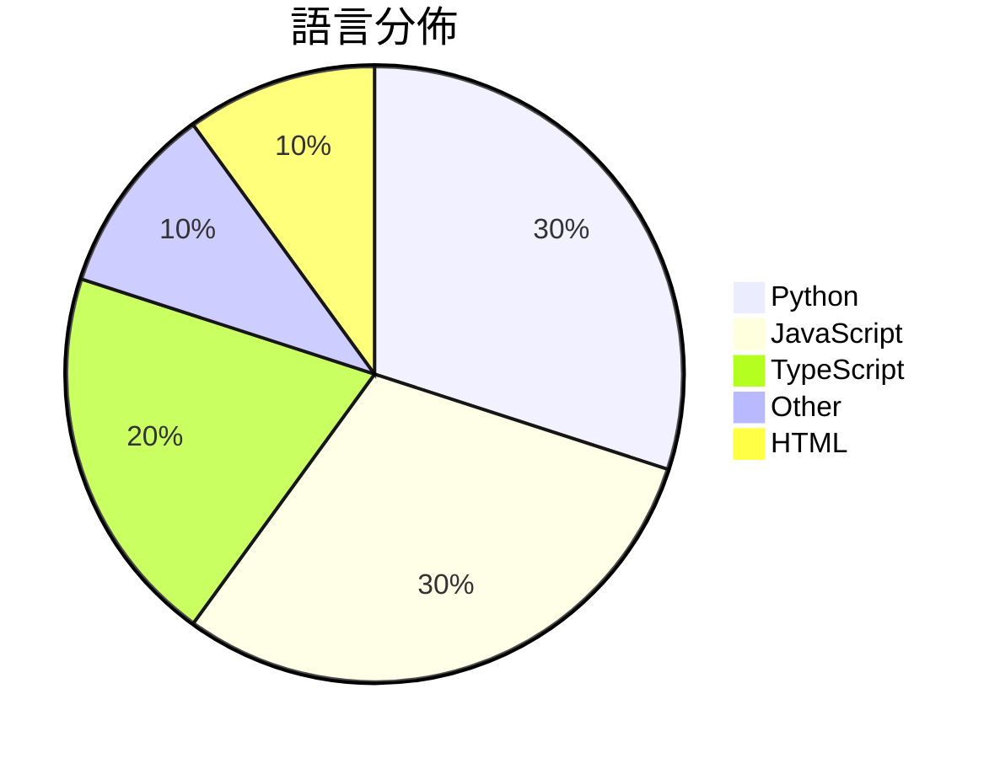

# GitHub Trending - 2026-06-24

> [!summary] 本日摘要
> 收錄 **10** 個新專案，合計 **11.4k** stars
> 語言分佈：Python (3) · JavaScript (3) · TypeScript (2) · Other (1) · HTML (1)

> [!tip] 本週焦點
> **[[baidu--Unlimited-OCR|baidu/Unlimited-OCR]]** — 5 天內累積 3.7k stars（738 stars/天）
> 提供高效的長文本解析，讓文件處理變得簡單。



---

## 收錄列表

| # | 專案 | 分類 | Stars | 速度 | 安裝 | 語言 | 用途 |
| :--: | --- | --- | ---: | ---: | --- | --- | --- |
| 1 | [[baidu--Unlimited-OCR\|baidu/Unlimited-OCR]] | AI/ML | 3.7k | 738/天 | `medium` | Python | 提供高效的長文本解析，讓文件處理變得簡單。 |
| 2 | [[zhongerxin--Cowart\|zhongerxin/Cowart]] | 開發工具 | 2.4k | 474/天 | `medium` | JavaScript | 提供一個本地的無限畫布插件，讓用戶能在 Codex 中進行可視化構思和圖片生成。 |
| 3 | [[lyra81604--zhengxi-views\|lyra81604/zhengxi-views]] | 開發工具 | 919 | 306/天 | `medium` | Python | 提供郑希的投资观点和方法，支持可溯源的问答和基金评分。 |
| 4 | [[Forsy-AI--agent-apprenticeship\|Forsy-AI/agent-apprenticeship]] | AI/ML | 859 | 215/天 | `easy` | N/A | 讓 AI 代理透過實際工作學習，實現重複使用的經驗和訓練信號交換。 |
| 5 | [[aidenybai--cnfast\|aidenybai/cnfast]] | 開發工具 | 790 | 198/天 | `easy` | TypeScript | 提供一個快速的 `cn` 替代方案，提升 Tailwind CSS 的性能。 |
| 6 | [[kanavtwtgg--birds.cafe\|kanavtwtgg/birds.cafe]] | 遊戲 | 717 | 359/天 | `easy` | JavaScript | 提供一個放鬆的瀏覽器鳥類模擬體驗，讓用戶駕駛海鷗在海上飛行。 |
| 7 | [[sums001--Windows-Copilot-API\|sums001/Windows-Copilot-API]] | AI/ML | 534 | 134/天 | `easy` | Python | 將 Windows Copilot 反向工程成 OpenAI 兼容的 API，無 |
| 8 | [[Plaer1--junction\|Plaer1/junction]] | 開發工具 | 532 | 89/天 | `medium` | TypeScript | 為 VS Code 提供一個連接本地 AI 編碼代理的聊天側邊欄。 |
| 9 | [[bozhouDev--codex-orange-book\|bozhouDev/codex-orange-book]] | 開發工具 | 528 | 528/天 | `easy` | HTML | 提供從安裝到實戰案例的全鏈路 Codex 使用指南，幫助開發者快速上手。 |
| 10 | [[cloudflare--security-audit-skill\|cloudflare/security-audit-skill]] | 安全 | 491 | 98/天 | `easy` | JavaScript | 讓你的代碼代理變成安全審計員，進行多階段的安全審計，並生成可機器讀取的結果。 |

---

## 重點摘要

### 1. [[baidu--Unlimited-OCR|baidu/Unlimited-OCR]] `AI/ML`

> 提供高效的長文本解析，讓文件處理變得簡單。

**3.7k** stars · **738** stars/天 · Python · `medium`

_建立 5 天就累積 3692 stars（738/天），forks 237（6.4%），這顯示出強勁的增長潛力。作者 MurphyYin 來自百度，擁有深厚的 AI 研究背景，這使得該專案在技術上具備優勢。Unlimited OCR 解決了傳統 OCR 工具在長文本解析上的不足，特別是對於需要高精度的商業應用。最近的推廣活動和社群的支持也促進了其快速擴散。技術生態的變化，如深度學習模型的進步，使得這個工具的實現成為可能。forks/stars 比率顯示出使用者對該工具的實際修改需求不高，可能是因為其功能已經滿足大多數需求。_

---

### 2. [[zhongerxin--Cowart|zhongerxin/Cowart]] `開發工具`

> 提供一個本地的無限畫布插件，讓用戶能在 Codex 中進行可視化構思和圖片生成。

**2.4k** stars · **474** stars/天 · JavaScript · `medium`

_建立 5 天內累積 2371 stars（474/天），forks 180（7.6%），這顯示出相對較高的社群關注度。作者 zhongerxin 之前在 AI 工具開發上有一定經驗，這次專案解決了 Codex 用戶在畫布處理上的需求，特別是本地化的數據存儲和處理。這樣的需求在現今對數據隱私和性能要求日益增加的背景下顯得尤為重要。社群的反饋和活躍的開發活動也促進了專案的快速成長。_

---

### 3. [[lyra81604--zhengxi-views|lyra81604/zhengxi-views]] `開發工具`

> 提供郑希的投资观点和方法，支持可溯源的问答和基金评分。

**919** stars · **306** stars/天 · Python · `medium`

_建立 3 天內累積 919 stars（306/天），forks 114（12.4%），顯示出強烈的使用者興趣。專案的作者 lyra81604 針對投資領域有深入的研究背景，這個工具解決了傳統模型生成不準確的痛點，提供了基於真實數據的可溯源分析。此專案的推出正好符合市場對於透明和可靠投資資訊的需求，尤其是在基金投資領域。社群的活躍度高，且目前沒有開放的問題，顯示出良好的維護狀態。_

---

### 4. [[Forsy-AI--agent-apprenticeship|Forsy-AI/agent-apprenticeship]] `AI/ML`

> 讓 AI 代理透過實際工作學習，實現重複使用的經驗和訓練信號交換。

**859** stars · **215** stars/天 · N/A · `easy`

_建立 4 天內累積 859 stars（215/天），forks 46（5.4%），顯示出穩定的增長趨勢。作者 ray-r-ren 以開源 AI 代理技術為背景，解決了 AI 代理在實際工作中學習的痛點，這在以往的工具中並未得到充分的關注。該專案的推出恰逢 AI 代理技術的快速發展，並且有助於用戶在實際應用中提升代理的學習效率。forks/stars 比率顯示出有一定的實際修改和使用需求，表明社群對此工具的興趣和參與度。_

---

### 5. [[aidenybai--cnfast|aidenybai/cnfast]] `開發工具`

> 提供一個快速的 `cn` 替代方案，提升 Tailwind CSS 的性能。

**790** stars · **198** stars/天 · TypeScript · `easy`

_建立 4 天就累積 790 stars（197.5/天），forks 8（1.0%），這顯示出其在開發者中的快速接受度。作者 aidenybai 之前在開源社群有過活躍的貢獻，這次專案解決了 `tailwind-merge` 在性能上的不足，特別是在需要高頻率渲染的場景中。此專案的推出引起了社群的廣泛關注，尤其是在對性能有高需求的開發者中。技術上，cnfast 利用 V8 引擎的優化特性，這使得其在現有的 JavaScript 生態中具備了更好的性能優勢。forks/stars 比率為 1.0%，顯示出使用者對此專案的興趣和實際修改的意願。_

---

### 6. [[kanavtwtgg--birds.cafe|kanavtwtgg/birds.cafe]] `遊戲`

> 提供一個放鬆的瀏覽器鳥類模擬體驗，讓用戶駕駛海鷗在海上飛行。

**717** stars · **359** stars/天 · JavaScript · `easy`

_建立 2 天就累積 717 stars（359/天），forks 1（0.1%），這顯示出用戶對這種放鬆體驗的興趣。作者 kanavtwtgg 可能是個獨立開發者，這個專案解決了市場上缺乏無壓力的模擬遊戲的痛點。沒有明顯的觸發事件，但這種獨特的遊戲體驗本身就吸引了不少人關注。技術上，WebGL 和 Three.js 的使用讓這個專案在瀏覽器中運行流暢，並且能夠呈現出色的視覺效果。forks/stars 比率低，顯示出目前大多數人是觀望狀態。_

---

### 7. [[sums001--Windows-Copilot-API|sums001/Windows-Copilot-API]] `AI/ML`

> 將 Windows Copilot 反向工程成 OpenAI 兼容的 API，無需 API 金鑰或計費即可訪問 GPT-4 和 GPT-5 模型。

**534** stars · **134** stars/天 · Python · `easy`

_建立 4 天內累積 534 stars（134/天），forks 199（37.3%），這顯示出強烈的社群興趣。作者 sums001 及 yurilopes 之前在開源社群中有一定的貢獻，這個專案解決了使用 Microsoft Copilot 進行開發時的高成本問題，讓開發者能夠在無需支付的情況下使用強大的 LLM。此專案的推出可能受到社群對於免費高效能 AI 工具需求上升的影響。高 forks/stars 比率顯示出許多開發者正在積極修改和使用這個工具，而不是單純觀望。_

---

### 8. [[Plaer1--junction|Plaer1/junction]] `開發工具`

> 為 VS Code 提供一個連接本地 AI 編碼代理的聊天側邊欄。

**532** stars · **89** stars/天 · TypeScript · `medium`

_建立 6 天就累積 532 stars（89/天），forks 8（1.5%），這顯示出一定的關注度。作者 Plaer1 之前的專案經驗可能為此專案的快速增長奠定了基礎。這個工具解決了開發者在使用本地 AI 編碼代理時的多重切換問題，提供了一個統一的接口，讓用戶能夠更高效地進行開發。社群的反饋和使用情況可能也促進了其快速成長。技術上，Junction 的多橋接架構和動畫效果在同類工具中具有一定的創新性，這使得它在市場上更具競爭力。_

---

### 9. [[bozhouDev--codex-orange-book|bozhouDev/codex-orange-book]] `開發工具`

> 提供從安裝到實戰案例的全鏈路 Codex 使用指南，幫助開發者快速上手。

**528** stars · **528** stars/天 · HTML · `easy`

_建立 1 天就累積 528 stars（528/天），forks 58（11.0%），這顯示出強烈的初期興趣。作者 bozhouDev 似乎在開源社群中有一定的影響力，這本指南解決了 Codex 使用者在快速上手過程中的痛點，特別是對於那些不熟悉 Codex 的開發者。由於 Codex 的功能和使用場景不斷變化，這本指南的及時更新也吸引了不少關注。社群對於 Codex 的需求和興趣隨著其功能的擴展而增長，這使得這個專案在短時間內獲得了大量的 stars。_

---

### 10. [[cloudflare--security-audit-skill|cloudflare/security-audit-skill]] `安全`

> 讓你的代碼代理變成安全審計員，進行多階段的安全審計，並生成可機器讀取的結果。

**491** stars · **98** stars/天 · JavaScript · `easy`

_建立 5 天就累積 491 stars（98/天），forks 41（8.4%），這顯示出強勁的增長潛力。作者 literally-dan 在安全領域有豐富經驗，這個專案解決了傳統安全審計工具缺乏自動化和可重複性的痛點。之前的工具往往只能提供靜態分析，無法進行動態測試和多角度攻擊，這使得發現漏洞的效率低下。社群對於這個工具的需求和興趣明顯，尤其是在安全性越來越受到重視的背景下。這個工具的設計理念和實作方式都反映了當前安全測試的需求，特別是在 CI/CD 流程中的整合。_

---

## 今日到期複習

> [!tip] 根據間隔複習排程，今天該回顧的專案

```dataview
TABLE
  stars_per_day AS "Stars/天",
  category AS "分類",
  engagement AS "參與度"
FROM "Repos"
WHERE next_review AND date(next_review) <= date("2026-06-24") AND status != "archived"
SORT priority DESC
```

## 待處理

```dataviewjs
const pending = dv.pages('"Repos"').where(p => p.status === "to-review").length;
const unrated = dv.pages('"Repos"').where(p => p.status !== "archived" && p.status !== "to-review" && (p.my_rating || 0) === 0).length;
const noVerdict = dv.pages('"Repos"').where(p => p.status !== "archived" && (p.my_rating || 0) > 0 && (!p.verdict || p.verdict === "")).length;
const items = [];
if (pending > 0) items.push(`**${pending}** 個待分流`);
if (unrated > 0) items.push(`**${unrated}** 個已讀但未評分`);
if (noVerdict > 0) items.push(`**${noVerdict}** 個已評分但無結論`);
if (items.length > 0) dv.paragraph(items.join(" / "));
else dv.paragraph("所有專案都已處理完畢！");
```
