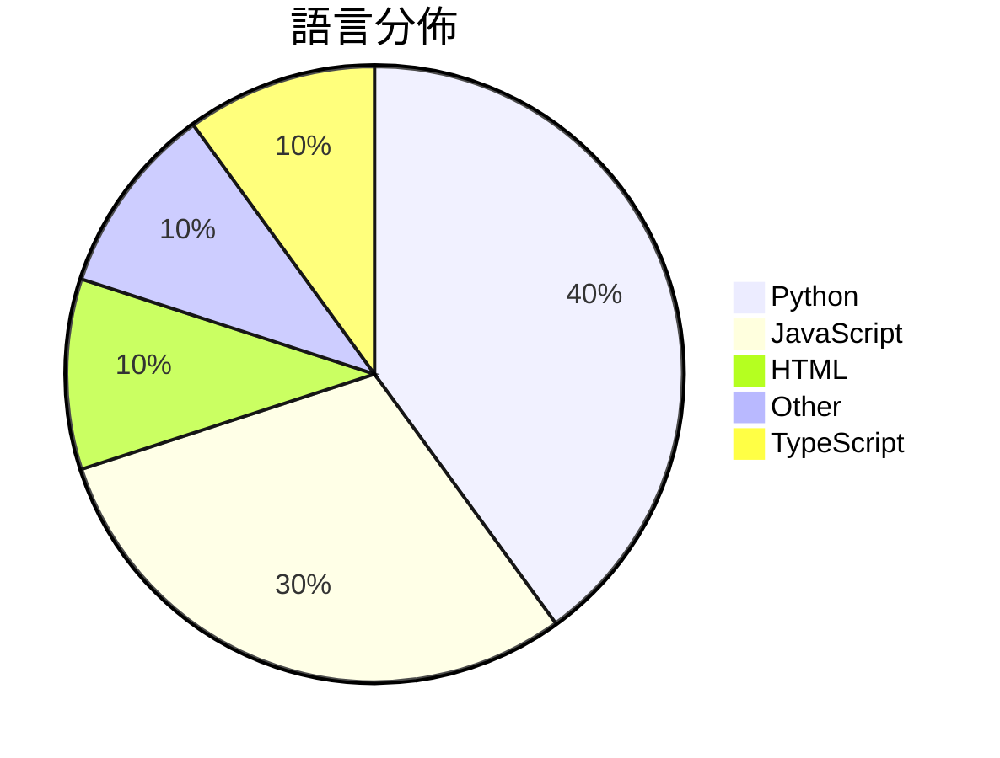

# GitHub Trending - 2026-06-25

> [!summary] 本日摘要
> 收錄 **10** 個新專案，合計 **16.0k** stars
> 語言分佈：Python (4) · JavaScript (3) · HTML (1) · Other (1) · TypeScript (1)

> [!tip] 本週焦點
> **[[baidu--Unlimited-OCR|baidu/Unlimited-OCR]]** — 6 天內累積 6.5k stars（1.1k stars/天）
> 提供一個強大的 OCR 解決方案，支持長文本和多頁面文檔的解析。



---

## 收錄列表

| # | 專案 | 分類 | Stars | 速度 | 安裝 | 語言 | 用途 |
| :--: | --- | --- | ---: | ---: | --- | --- | --- |
| 1 | [[baidu--Unlimited-OCR\|baidu/Unlimited-OCR]] | 開發工具 | 6.5k | 1.1k/天 | `medium` | Python | 提供一個強大的 OCR 解決方案，支持長文本和多頁面文檔的解析。 |
| 2 | [[zhongerxin--Cowart\|zhongerxin/Cowart]] | 開發工具 | 2.7k | 442/天 | `medium` | JavaScript | 提供一個本地的無限畫布插件，讓 Codex 用戶能夠輕鬆創建和生成圖片。 |
| 3 | [[bozhouDev--codex-orange-book\|bozhouDev/codex-orange-book]] | 開發工具 | 1.5k | 1.5k/天 | `medium` | HTML | 提供全面的 Codex 使用指南，從安裝到實戰案例，幫助開發者快速上手。 |
| 4 | [[lyra81604--zhengxi-views\|lyra81604/zhengxi-views]] | 其他 | 989 | 247/天 | `medium` | Python | 提供可溯源的郑希投资观点与方法，辅助研究学习。 |
| 5 | [[Forsy-AI--agent-apprenticeship\|Forsy-AI/agent-apprenticeship]] | AI/ML | 909 | 182/天 | `easy` | N/A | 讓 AI 代理透過實際工作學習，並在迭代工作流程中不斷提升。 |
| 6 | [[aidenybai--cnfast\|aidenybai/cnfast]] | 開發工具 | 880 | 176/天 | `easy` | TypeScript | 提供一個快速的 `cn` 替代方案，提升 Tailwind CSS 的性能。 |
| 7 | [[kanavtwtgg--birds.cafe\|kanavtwtgg/birds.cafe]] | 遊戲 | 767 | 256/天 | `easy` | JavaScript | 提供一個無壓力的瀏覽器飛鳥模擬體驗。 |
| 8 | [[cloudflare--security-audit-skill\|cloudflare/security-audit-skill]] | 安全 | 726 | 121/天 | `easy` | JavaScript | 將你的代理轉變為安全審計工具，進行多階段的安全審計。 |
| 9 | [[sums001--Windows-Copilot-API\|sums001/Windows-Copilot-API]] | AI/ML | 664 | 133/天 | `medium` | Python | 將 Windows Copilot 反向工程為 OpenAI 兼容的 API，無 |
| 10 | [[yo-WASSUP--Good-Badminton\|yo-WASSUP/Good-Badminton]] | 其他 | 479 | 120/天 | `medium` | Python | 提供基於計算機視覺的羽毛球比賽視頻分析工具，實現自動化的比賽數據統計與可視化。 |

---

## 重點摘要

### 1. [[baidu--Unlimited-OCR|baidu/Unlimited-OCR]] `開發工具`

> 提供一個強大的 OCR 解決方案，支持長文本和多頁面文檔的解析。

**6.5k** stars · **1.1k** stars/天 · Python · `medium`

_建立 6 天內累積 6459 stars（1077/天），forks 505（7.8%），顯示出強烈的社群興趣。這個專案的主要貢獻者 MurphyYin 在 OCR 領域有豐富經驗，之前的 Deepseek-OCR 也獲得過不錯的反響。Unlimited OCR 解決了長文本解析的痛點，之前的工具在處理此類文檔時常常效率不高或準確度不足。近期的推廣活動和社群支持也促進了其快速增長。這個工具的設計考慮到了現代文檔的需求，特別是在多頁面和高字數的情境下，提供了更好的解決方案。forks/stars 比率為 7.8%，顯示出許多人在實際修改和使用這個工具，而不是僅僅觀望。_

---

### 2. [[zhongerxin--Cowart|zhongerxin/Cowart]] `開發工具`

> 提供一個本地的無限畫布插件，讓 Codex 用戶能夠輕鬆創建和生成圖片。

**2.7k** stars · **442** stars/天 · JavaScript · `medium`

_建立 6 天就累積 2653 stars（442/天），forks 209（7.9%），這顯示出其快速增長的潛力。作者 zhongerxin 之前有過相關的開發經驗，這使得他能夠針對 Codex 的需求設計出這個工具。Cowart 解決了 Codex 用戶在本地創建和管理畫布的需求，之前的方案往往需要依賴雲端存儲或不夠靈活的設計。近期的社群討論和需求反饋也促進了這個工具的快速發展。技術上，tldraw 的使用讓這個工具在畫布操作上具備了良好的性能和可擴展性，這是其他工具所不具備的。forks/stars 比率為 7.9%，顯示出許多用戶對這個工具的實際修改和使用。_

---

### 3. [[bozhouDev--codex-orange-book|bozhouDev/codex-orange-book]] `開發工具`

> 提供全面的 Codex 使用指南，從安裝到實戰案例，幫助開發者快速上手。

**1.5k** stars · **1.5k** stars/天 · HTML · `medium`

_建立 1 天就累積 1453 stars（1453/天），forks 152（10.5%），這顯示出強烈的社群興趣。作者 Vink567 和 bozhouDev 在開源社群中有一定的影響力，這本指南填補了 Codex 使用上的空白，特別是對於新手來說，提供了清晰的安裝和使用流程。隨著 Codex 的普及，開發者對於如何有效使用這個工具的需求日益增加，這本指南正好滿足了這一需求。社群的反饋也顯示出對於指南內容的期待，尤其是針對實戰案例的需求。_

---

### 4. [[lyra81604--zhengxi-views|lyra81604/zhengxi-views]] `其他`

> 提供可溯源的郑希投资观点与方法，辅助研究学习。

**989** stars · **247** stars/天 · Python · `medium`

_建立 4 天就累積 989 stars（247/天），forks 123（12.4%），這顯示出強勁的增長潛力。專案的作者 lyra81604 似乎專注於金融領域的 AI 應用，這個專案解決了傳統投資分析中缺乏透明度的痛點，讓使用者能夠追溯到具體的原始資料，這在目前的市場上是相對少見的。由於專案剛剛推出，尚未有明顯的觸發事件，但其創新性和實用性吸引了不少使用者的注意。這個工具的出現反映了對於透明投資分析需求的增加，特別是在 AI 技術日益普及的背景下。forks/stars 比率為 12.4%，顯示出使用者對於這個工具的實際修改和使用意願較高。_

---

### 5. [[Forsy-AI--agent-apprenticeship|Forsy-AI/agent-apprenticeship]] `AI/ML`

> 讓 AI 代理透過實際工作學習，並在迭代工作流程中不斷提升。

**909** stars · **182** stars/天 · N/A · `easy`

_建立 5 天內累積 909 stars（182/天），forks 46（5.1%），顯示出穩定的增長潛力。作者 ray-r-ren 在 AI 領域有豐富的經驗，這個專案解決了 AI 代理在實際工作中學習的痛點，過去的解決方案往往缺乏可重用性和經濟價值評估。這個專案的推出引起了社群的廣泛關注，並且有潛在的市場需求。技術上，這個專案的設計使得 AI 代理能夠在多種環境中運行，並且能夠與多個模型提供者整合，這在當前的 AI 生態中是非常重要的。forks/stars 比率為 5.1%，顯示出使用者對於實際修改和使用的興趣。_

---

### 6. [[aidenybai--cnfast|aidenybai/cnfast]] `開發工具`

> 提供一個快速的 `cn` 替代方案，提升 Tailwind CSS 的性能。

**880** stars · **176** stars/天 · TypeScript · `easy`

_建立 5 天就累積 880 stars（176/天），forks 8（0.9%），這顯示出社群對於性能優化的需求。作者 aidenybai 之前在開源社群中活躍，這個專案解決了現有 `tailwind-merge` 在性能上的不足，特別是在需要頻繁重渲染的應用場景。最近的推廣活動和社群討論也促進了它的曝光率。技術上，隨著 V8 引擎的持續優化，這個工具的性能優勢變得更加明顯，吸引了許多開發者的注意。forks/stars 比率低於 5% 表示大部分用戶仍在觀望，尚未進行實際修改或使用。_

---

### 7. [[kanavtwtgg--birds.cafe|kanavtwtgg/birds.cafe]] `遊戲`

> 提供一個無壓力的瀏覽器飛鳥模擬體驗。

**767** stars · **256** stars/天 · JavaScript · `easy`

_建立 3 天就累積 767 stars（256/天），forks 1（0.1%），顯示出一定的關注度。這位開發者 kanavtwtgg 似乎專注於創造獨特的遊戲體驗，之前並未有類似的無壓力飛行模擬遊戲。這個專案的出現可能是因為人們對於放鬆和沉浸式體驗的需求日益增加。由於目前沒有明顯的競爭對手，這個專案的獨特性使其在短時間內獲得了不少關注。_

---

### 8. [[cloudflare--security-audit-skill|cloudflare/security-audit-skill]] `安全`

> 將你的代理轉變為安全審計工具，進行多階段的安全審計。

**726** stars · **121** stars/天 · JavaScript · `easy`

_建立 6 天內累積 726 stars（121/天），forks 56（7.7%），顯示出相對活躍的社群參與。這個專案由 Cloudflare 開發，旨在解決傳統安全審計中的多階段流程問題，提供一個自動化的解決方案。作者過去在安全工具開發方面有豐富經驗，這個工具的出現是因為現有的手動審計方法效率低下且容易出錯。社群的反饋和需求促使這個工具的快速成長，尤其是在安全性日益受到重視的背景下。forks/stars 比率為 7.7%，顯示出有相當比例的使用者在實際修改和使用這個工具。_

---

### 9. [[sums001--Windows-Copilot-API|sums001/Windows-Copilot-API]] `AI/ML`

> 將 Windows Copilot 反向工程為 OpenAI 兼容的 API，無需 API 金鑰或計費即可訪問 GPT-4 和 GPT-5 模型。

**664** stars · **133** stars/天 · Python · `medium`

_建立 5 天內累積 664 stars（133/天），forks 238（35.8%），顯示出強烈的社群興趣。這個專案的作者 sums001 和 yurilopes 之前在開源社群中有過其他貢獻，這使得他們的作品受到關注。它解決了使用 Microsoft Copilot 的高成本問題，讓開發者能夠免費使用這些強大的模型。最近的推廣活動和社群討論也促進了這個專案的曝光度。高比例的 forks 表明很多開發者對此專案進行了實際的修改和使用，顯示出其潛在的實用性。_

---

### 10. [[yo-WASSUP--Good-Badminton|yo-WASSUP/Good-Badminton]] `其他`

> 提供基於計算機視覺的羽毛球比賽視頻分析工具，實現自動化的比賽數據統計與可視化。

**479** stars · **120** stars/天 · Python · `medium`

_建立 4 天就累積 479 stars（120/天），forks 150（31.3%），顯示出強烈的社群興趣。作者 yo-WASSUP 是一位專注於運動分析的開發者，這個專案解決了傳統羽毛球比賽分析中手動標註的繁瑣問題，提供自動化的解決方案。近期的推廣活動和社交媒體的討論也可能促進了其曝光度。技術上，計算機視覺的進步使得這類工具的實現變得可行，尤其是在 GPU 加速的支持下，能夠快速處理高分辨率視頻。高 forks/stars 比率顯示出許多開發者對這個專案進行實際修改和使用，反映出其在社群中的活躍度。_

---

## 今日到期複習

> [!tip] 根據間隔複習排程，今天該回顧的專案

```dataview
TABLE
  stars_per_day AS "Stars/天",
  category AS "分類",
  engagement AS "參與度"
FROM "Repos"
WHERE next_review AND date(next_review) <= date("2026-06-25") AND status != "archived"
SORT priority DESC
```

## 待處理

```dataviewjs
const pending = dv.pages('"Repos"').where(p => p.status === "to-review").length;
const unrated = dv.pages('"Repos"').where(p => p.status !== "archived" && p.status !== "to-review" && (p.my_rating || 0) === 0).length;
const noVerdict = dv.pages('"Repos"').where(p => p.status !== "archived" && (p.my_rating || 0) > 0 && (!p.verdict || p.verdict === "")).length;
const items = [];
if (pending > 0) items.push(`**${pending}** 個待分流`);
if (unrated > 0) items.push(`**${unrated}** 個已讀但未評分`);
if (noVerdict > 0) items.push(`**${noVerdict}** 個已評分但無結論`);
if (items.length > 0) dv.paragraph(items.join(" / "));
else dv.paragraph("所有專案都已處理完畢！");
```
