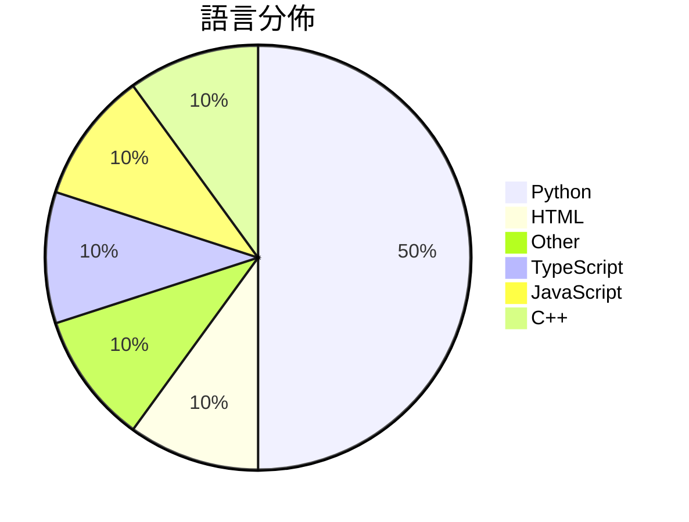

# GitHub Trending - 2026-06-26

> [!summary] 本日摘要
> 收錄 **10** 個新專案，合計 **8.4k** stars
> 語言分佈：Python (5) · HTML (1) · Other (1) · TypeScript (1) · JavaScript (1) · C++ (1)

> [!tip] 本週焦點
> **[[bozhouDev--codex-orange-book|bozhouDev/codex-orange-book]]** — 2 天內累積 2.0k stars（982 stars/天）
> 提供全面的 Codex 使用指南，涵蓋安裝、配置及實戰案例。



---

## 收錄列表

| # | 專案 | 分類 | Stars | 速度 | 安裝 | 語言 | 用途 |
| :--: | --- | --- | ---: | ---: | --- | --- | --- |
| 1 | [[bozhouDev--codex-orange-book\|bozhouDev/codex-orange-book]] | 其他 | 2.0k | 982/天 | `easy` | HTML | 提供全面的 Codex 使用指南，涵蓋安裝、配置及實戰案例。 |
| 2 | [[lyra81604--zhengxi-views\|lyra81604/zhengxi-views]] | 開發工具 | 1.0k | 207/天 | `medium` | Python | 提供郑希基金经理的可溯源投资观点与方法，支持基于真实数据进行基金评分与比较。 |
| 3 | [[Forsy-AI--agent-apprenticeship\|Forsy-AI/agent-apprenticeship]] | AI/ML | 941 | 157/天 | `easy` | N/A | 建立一個生態系統，讓 AI 代理透過實際工作學習並迭代改進。 |
| 4 | [[aidenybai--cnfast\|aidenybai/cnfast]] | 開發工具 | 933 | 156/天 | `easy` | TypeScript | 提供一個快速的 `cn` 替代方案，提升 Tailwind CSS 的性能。 |
| 5 | [[kanavtwtgg--birds.cafe\|kanavtwtgg/birds.cafe]] | 遊戲 | 788 | 197/天 | `easy` | JavaScript | 提供一個無壓力的鳥類模擬體驗，讓用戶在瀏覽器中駕駛海鷗飛翔。 |
| 6 | [[sums001--Windows-Copilot-API\|sums001/Windows-Copilot-API]] | AI/ML | 745 | 124/天 | `easy` | Python | 將 Windows Copilot 反向工程為 OpenAI 兼容的 API，無 |
| 7 | [[raiyanyahya--recall\|raiyanyahya/recall]] | 開發工具 | 543 | 91/天 | `easy` | Python | 為 Claude Code 提供持久的本地記憶，避免每次會話重複解釋專案。 |
| 8 | [[yo-WASSUP--Good-Badminton\|yo-WASSUP/Good-Badminton]] | 開發工具 | 517 | 103/天 | `medium` | Python | 提供基於計算機視覺的羽毛球比賽視頻分析工具，實現自動化的比賽數據統計與可視化。 |
| 9 | [[BohemiaInteractive--CWR\|BohemiaInteractive/CWR]] | 遊戲 | 494 | 165/天 | `medium` | C++ | 提供 Arma: Cold War Assault 的重製版引擎和遊戲源碼。 |
| 10 | [[QwenLM--Qwen-AgentWorld\|QwenLM/Qwen-AgentWorld]] | AI/ML | 488 | 163/天 | `medium` | Python | 提供一個原生語言世界模型，模擬多種代理環境，支持長鏈推理。 |

---

## 重點摘要

### 1. [[bozhouDev--codex-orange-book|bozhouDev/codex-orange-book]] `其他`

> 提供全面的 Codex 使用指南，涵蓋安裝、配置及實戰案例。

**2.0k** stars · **982** stars/天 · HTML · `easy`

_建立 2 天內累積 1963 stars（982/天），forks 198（10.1%），顯示出強勁的增長潛力。這本指南的作者 Vink567 及 bozhouDev 具有豐富的開發經驗，且專注於 AI 工具的實用性，解決了許多開發者在使用 Codex 時遇到的問題。Codex 的快速發展和普及使得這本指南的需求上升，尤其是在開發者社群中，對於如何有效利用 Codex 的需求愈發迫切。社群的活躍度也反映在熱門 Issues 中，顯示出使用者對於實際操作的關注。_

---

### 2. [[lyra81604--zhengxi-views|lyra81604/zhengxi-views]] `開發工具`

> 提供郑希基金经理的可溯源投资观点与方法，支持基于真实数据进行基金评分与比较。

**1.0k** stars · **207** stars/天 · Python · `medium`

_建立 5 天內累積 1037 stars（207/天），forks 124（12.0%），顯示出強勁的增長動能。作者 lyra81604 以其在金融和 AI 領域的背景，解決了過去投資工具中缺乏可追溯性和真實數據的痛點。這個專案的出現正好填補了市場上對於基於真實數據進行投資分析的需求，並且在社群中引發了廣泛的討論和關注。技術上，這個工具的可行性得益於 Python 生態系的成熟，特別是對於數據抓取和處理的強大支持。forks/stars 比率為 12.0%，顯示出有相當比例的用戶在實際修改和使用這個專案。_

---

### 3. [[Forsy-AI--agent-apprenticeship|Forsy-AI/agent-apprenticeship]] `AI/ML`

> 建立一個生態系統，讓 AI 代理透過實際工作學習並迭代改進。

**941** stars · **157** stars/天 · N/A · `easy`

_建立 6 天內累積 941 stars（157/天），forks 47（5.0%），顯示出穩定的增長潛力。作者 ray-r-ren 之前在 AI 代理領域有豐富的經驗，這個專案解決了 AI 代理在真實世界任務中學習的痛點，以往的方案往往缺乏有效的學習和經驗共享機制。最近的推廣活動和社群討論也促進了這個專案的曝光。技術上，AI 代理的發展和經濟價值的提升使得這個工具的需求日益增加，尤其是在專業領域的應用。forks/stars 比率為 5.0%，顯示出有一定數量的用戶在積極修改和使用這個工具。_

---

### 4. [[aidenybai--cnfast|aidenybai/cnfast]] `開發工具`

> 提供一個快速的 `cn` 替代方案，提升 Tailwind CSS 的性能。

**933** stars · **156** stars/天 · TypeScript · `easy`

_建立 6 天就累積 933 stars（155.5/天），forks 8（0.9%），這顯示出一定的使用者關注度。作者 aidenybai 之前有開發過其他相關工具，這次針對性能瓶頸提供了解決方案，特別是針對 tailwind-merge 的不足之處。這個工具的出現正好解決了開發者在高頻率 class 合併時的性能問題，讓許多開發者感受到實際的效能提升。社群的反應也表明了對於這個工具的需求，尤其是在大型應用中，性能的提升是非常關鍵的。_

---

### 5. [[kanavtwtgg--birds.cafe|kanavtwtgg/birds.cafe]] `遊戲`

> 提供一個無壓力的鳥類模擬體驗，讓用戶在瀏覽器中駕駛海鷗飛翔。

**788** stars · **197** stars/天 · JavaScript · `easy`

_建立 4 天就累積 788 stars（197/天），forks 2（0.3%），這顯示出用戶對這種放鬆體驗的興趣。作者 kanavtwtgg 可能是個熱愛創作的開發者，這個專案解決了人們在繁忙生活中缺乏放鬆的痛點，提供了一個無壓力的飛行體驗。雖然沒有明確的觸發事件，但這樣的獨特概念自然吸引了對於休閒遊戲感興趣的用戶。技術上，WebGL 和 Three.js 的使用讓這個專案在瀏覽器中運行流暢，這是之前許多類似專案無法達到的效果。forks/stars 比率低，顯示大多數用戶對此專案感興趣，但尚未進行修改。_

---

### 6. [[sums001--Windows-Copilot-API|sums001/Windows-Copilot-API]] `AI/ML`

> 將 Windows Copilot 反向工程為 OpenAI 兼容的 API，無需 API 金鑰或計費即可訪問 GPT-4 和 GPT-5 模型。

**745** stars · **124** stars/天 · Python · `easy`

_建立 6 天內累積 745 stars（124/天），forks 263（35.3%），這顯示出強烈的社群興趣。專案的主要貢獻者 sums001 和 yurilopes 都有過去的開源經驗，這使得專案的可信度提高。這個工具解決了許多開發者在使用 Microsoft Copilot 時需要 API 金鑰和計費的痛點，讓使用者能夠更便捷地接入 LLM。最近的推文和社群討論也促進了這個專案的曝光率。這種無需金鑰的設計使得它在開發者中迅速流行，特別是在需要快速原型開發的場景中。forks/stars 比率達到 35.3%，顯示出許多人在實際修改和使用這個專案。_

---

### 7. [[raiyanyahya--recall|raiyanyahya/recall]] `開發工具`

> 為 Claude Code 提供持久的本地記憶，避免每次會話重複解釋專案。

**543** stars · **91** stars/天 · Python · `easy`

_建立 6 天就累積 543 stars（90.5/天），forks 27（5.0%），這顯示出使用者對於本地記憶解決方案的需求。作者 raiyanyahya 之前在 AI 領域有豐富的經驗，這個專案解決了用戶在使用 Claude Code 時的冷啟動問題，避免了重複解釋專案的麻煩。最近的更新修復了 Windows 環境中的幾個關鍵問題，這也促進了使用者的參與和反饋。這個工具的可行性得益於本地計算能力的提升，讓用戶能夠在不依賴雲端服務的情況下，獲得持久的記憶功能。forks/stars 比率適中，顯示出有一定的實際使用和修改需求。_

---

### 8. [[yo-WASSUP--Good-Badminton|yo-WASSUP/Good-Badminton]] `開發工具`

> 提供基於計算機視覺的羽毛球比賽視頻分析工具，實現自動化的比賽數據統計與可視化。

**517** stars · **103** stars/天 · Python · `medium`

_建立 5 天內累積 517 stars（103/天），forks 161（31.1%），顯示出強烈的社群興趣。作者 yo-WASSUP 之前在計算機視覺領域有多個開源專案，這次專案解決了羽毛球比賽中數據收集的痛點，傳統上需要大量人力進行手動分析。近期在社交媒體上引起討論，特別是運動分析師和教練圈子中。技術上，計算機視覺和深度學習的進步使得這個工具能夠實現自動化分析，並且開源的特性吸引了許多開發者參與。forks/stars 比率達到 31.1%，顯示出許多人在實際修改和使用這個工具。_

---

### 9. [[BohemiaInteractive--CWR|BohemiaInteractive/CWR]] `遊戲`

> 提供 Arma: Cold War Assault 的重製版引擎和遊戲源碼。

**494** stars · **165** stars/天 · C++ · `medium`

_建立 3 天內累積 494 stars（165/天），forks 58（11.7%），顯示出強烈的社群興趣。這個專案由 Bohemia Interactive 提供，讓玩家和開發者能夠重溫經典遊戲並進行修改。過去，玩家只能依賴於官方的更新和擴展，這個專案提供了一個開放的平臺來進行創新。近期的社群討論和對於遊戲重製的期待也推動了這個專案的關注度。這個專案的開源性和社群驅動的特性使其在遊戲開發領域中具備了獨特的價值。_

---

### 10. [[QwenLM--Qwen-AgentWorld|QwenLM/Qwen-AgentWorld]] `AI/ML`

> 提供一個原生語言世界模型，模擬多種代理環境，支持長鏈推理。

**488** stars · **163** stars/天 · Python · `medium`

_建立 3 天內累積 488 stars（163/天），forks 47（9.6%），顯示出不錯的增長潛力。這個專案的主要貢獻者 hzhwcmhf 和 yuxinzuo 之前在相關領域有豐富的經驗，解決了傳統世界建模工具無法有效整合多種代理環境的痛點。近期的發布和討論也引起了社群的關注，可能是因為其獨特的原生建模方法和多領域的應用潛力。這樣的設計在當前的 AI 生態中顯得尤為重要，因為它能夠在多樣化的環境中進行有效的推理和學習。_

---

## 今日到期複習

> [!tip] 根據間隔複習排程，今天該回顧的專案

```dataview
TABLE
  stars_per_day AS "Stars/天",
  category AS "分類",
  engagement AS "參與度"
FROM "Repos"
WHERE next_review AND date(next_review) <= date("2026-06-26") AND status != "archived"
SORT priority DESC
```

## 待處理

```dataviewjs
const pending = dv.pages('"Repos"').where(p => p.status === "to-review").length;
const unrated = dv.pages('"Repos"').where(p => p.status !== "archived" && p.status !== "to-review" && (p.my_rating || 0) === 0).length;
const noVerdict = dv.pages('"Repos"').where(p => p.status !== "archived" && (p.my_rating || 0) > 0 && (!p.verdict || p.verdict === "")).length;
const items = [];
if (pending > 0) items.push(`**${pending}** 個待分流`);
if (unrated > 0) items.push(`**${unrated}** 個已讀但未評分`);
if (noVerdict > 0) items.push(`**${noVerdict}** 個已評分但無結論`);
if (items.length > 0) dv.paragraph(items.join(" / "));
else dv.paragraph("所有專案都已處理完畢！");
```
