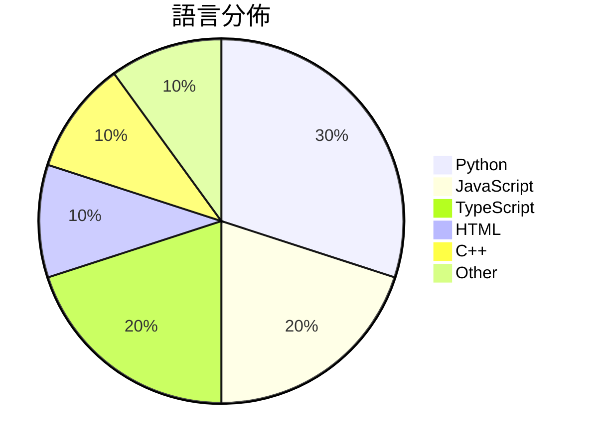

# GitHub Trending - 2026-06-27

> [!summary] 本日摘要
> 收錄 **10** 個新專案，合計 **7.5k** stars
> 語言分佈：Python (3) · JavaScript (2) · TypeScript (2) · HTML (1) · C++ (1) · Other (1)

> [!tip] 本週焦點
> **[[bozhouDev--codex-orange-book|bozhouDev/codex-orange-book]]** — 3 天內累積 2.1k stars（714 stars/天）
> 提供全面的 Codex 使用指南，涵蓋安裝到實戰案例的全鏈路。



---

## 收錄列表

| # | 專案 | 分類 | Stars | 速度 | 安裝 | 語言 | 用途 |
| :--: | --- | --- | ---: | ---: | --- | --- | --- |
| 1 | [[bozhouDev--codex-orange-book\|bozhouDev/codex-orange-book]] | 開發工具 | 2.1k | 714/天 | `medium` | HTML | 提供全面的 Codex 使用指南，涵蓋安裝到實戰案例的全鏈路。 |
| 2 | [[lyra81604--zhengxi-views\|lyra81604/zhengxi-views]] | 其他 | 1.1k | 177/天 | `medium` | Python | 提供郑希基金经理的可溯源投资观点与方法，助力研究与学习。 |
| 3 | [[kanavtwtgg--birds.cafe\|kanavtwtgg/birds.cafe]] | 遊戲 | 735 | 147/天 | `easy` | JavaScript | 提供一個放鬆的鳥類模擬體驗，讓用戶在瀏覽器中駕駛海鷗群飛行。 |
| 4 | [[BohemiaInteractive--CWR\|BohemiaInteractive/CWR]] | 其他 | 624 | 156/天 | `medium` | C++ | 提供《Arma: Cold War Assault》的引擎和遊戲源代碼，讓社群能 |
| 5 | [[QwenLM--Qwen-AgentWorld\|QwenLM/Qwen-AgentWorld]] | AI/ML | 568 | 142/天 | `easy` | Python | 提供一個原生的語言世界模型，能夠模擬多種代理環境，並支持長鏈思考推理。 |
| 6 | [[yo-WASSUP--Good-Badminton\|yo-WASSUP/Good-Badminton]] | AI/ML | 549 | 92/天 | `medium` | Python | 基於計算機視覺的羽毛球比賽視頻分析工具，提供自動球場邊界檢測和球員動作分析。 |
| 7 | [[benchflow-ai--awesome-evals\|benchflow-ai/awesome-evals]] | 其他 | 464 | 232/天 | `easy` | N/A | 提供建立和評估 AI 代理的最佳資源，包含論文、部落格、工具和基準。 |
| 8 | [[Yu9191--wloc\|Yu9191/wloc]] | 其他 | 457 | 229/天 | `medium` | JavaScript | 修改 Apple 网络定位返回坐标，支持多种代理工具和快捷指令设置。 |
| 9 | [[winsznx--theeleven\|winsznx/theeleven]] | DeFi | 457 | 457/天 | `medium` | TypeScript | 透過 AI 代理人即時開啟足球賽事的預測市場，無需支付手續費。 |
| 10 | [[HKUDS--AgentSpace\|HKUDS/AgentSpace]] | 開發工具 | 453 | 113/天 | `medium` | TypeScript | 提供人類與智能代理的協作工作空間，讓團隊能夠高效合作。 |

---

## 重點摘要

### 1. [[bozhouDev--codex-orange-book|bozhouDev/codex-orange-book]] `開發工具`

> 提供全面的 Codex 使用指南，涵蓋安裝到實戰案例的全鏈路。

**2.1k** stars · **714** stars/天 · HTML · `medium`

_建立 3 天就累積 2141 stars（714/天），forks 218（10.2%），這顯示出強烈的社群興趣。作者 Vink567 和 bozhouDev 具備開源項目經驗，這本指南填補了 Codex 使用上的空白，特別是針對新手的系統性學習需求。隨著 Codex 的快速更新，這份指南的實用性和時效性使其成為開發者的熱門選擇。_

---

### 2. [[lyra81604--zhengxi-views|lyra81604/zhengxi-views]] `其他`

> 提供郑希基金经理的可溯源投资观点与方法，助力研究与学习。

**1.1k** stars · **177** stars/天 · Python · `medium`

_建立 6 天就累積 1061 stars（177/天），forks 125（11.8%），這顯示出強勁的增長潛力。作者 lyra81604 是一位專注於金融科技的開發者，這個專案解決了投資者在查詢基金經理觀點時常遇到的資料不透明問題，過去的解決方案往往缺乏可追溯性。這個專案的出現正好填補了這一空白，並且在社群中引發了討論。技術上，這個工具的可行性得益於 Python 生態系的強大支持，特別是在數據抓取和處理方面。forks/stars 比率為 11.8%，顯示出許多人對這個工具進行了實際修改和使用，這是對專案實用性的肯定。_

---

### 3. [[kanavtwtgg--birds.cafe|kanavtwtgg/birds.cafe]] `遊戲`

> 提供一個放鬆的鳥類模擬體驗，讓用戶在瀏覽器中駕駛海鷗群飛行。

**735** stars · **147** stars/天 · JavaScript · `easy`

_建立 5 天內累積 735 stars（147/天），forks 2（0.3%），這顯示出一定的興趣增長。作者 kanavtwtgg 似乎專注於創造輕鬆的遊戲體驗，這個專案填補了市場上對於簡單、無壓力的模擬遊戲的需求。雖然沒有明顯的觸發事件，但其獨特的遊戲設計理念吸引了部分用戶的注意。這個工具的成功可能與 WebGL 和 Three.js 的普及有關，這使得瀏覽器遊戲的開發變得更容易。forks/stars 比率相對較低，顯示出大多數用戶仍在觀望。_

---

### 4. [[BohemiaInteractive--CWR|BohemiaInteractive/CWR]] `其他`

> 提供《Arma: Cold War Assault》的引擎和遊戲源代碼，讓社群能夠進行研究和開發。

**624** stars · **156** stars/天 · C++ · `medium`

_建立4天就累積624 stars（156/天），forks 71（11.4%），這顯示出社群對這個開源專案的興趣。Bohemia Interactive作為開發者，過去在遊戲開發上有豐富的經驗，這個專案的推出解決了玩家社群對於舊版遊戲源代碼的需求，讓他們能夠進行修改和創建。雖然目前沒有明顯的觸發事件，但這個專案的開放性和歷史背景吸引了不少關注。高達11.4%的forks/stars比率顯示出許多人對於這個專案的實際修改和使用，這是相對健康的社群參與指標。_

---

### 5. [[QwenLM--Qwen-AgentWorld|QwenLM/Qwen-AgentWorld]] `AI/ML`

> 提供一個原生的語言世界模型，能夠模擬多種代理環境，並支持長鏈思考推理。

**568** stars · **142** stars/天 · Python · `easy`

_建立 4 天就累積 568 stars（142/天），forks 51（9.0%），顯示出良好的社群反應。主要貢獻者 hzhwcmhf 和 yuxinzuo 在開源社群中有一定的影響力，這個專案解決了多領域代理環境模擬的需求，之前的模型多數無法有效整合多種環境。近期的發佈和技術報告引起了關注，尤其是在 Hugging Face 和 ModelScope 的支持下，讓更多開發者能夠輕鬆接入這個模型。這個工具的推出正好契合了對於高效能語言模型的需求，並且其設計理念與當前 AI 生態系的發展方向相符。forks/stars 比率為 9.0%，顯示出有相對較多的用戶在實際修改和使用這個專案。_

---

### 6. [[yo-WASSUP--Good-Badminton|yo-WASSUP/Good-Badminton]] `AI/ML`

> 基於計算機視覺的羽毛球比賽視頻分析工具，提供自動球場邊界檢測和球員動作分析。

**549** stars · **92** stars/天 · Python · `medium`

_建立 6 天內累積 549 stars（約 92 stars/天），forks 比率高達 31.0%（170 forks），顯示出強烈的社群參與。作者 yo-WASSUP 具備開源背景，這個專案填補了羽毛球比賽視頻分析的市場空白，提供了自動化的解決方案。社群對於雙打模式和多視角測量的需求顯示出潛在的擴展性。技術上，計算機視覺的進步使得這個工具的實現成為可能，並且在運動分析領域具有廣泛的應用潛力。_

---

### 7. [[benchflow-ai--awesome-evals|benchflow-ai/awesome-evals]] `其他`

> 提供建立和評估 AI 代理的最佳資源，包含論文、部落格、工具和基準。

**464** stars · **232** stars/天 · N/A · `easy`

_建立 2 天內就累積 464 stars（232/天），forks 33（7.1%），顯示出強烈的社群興趣。這個專案由 BenchFlow 團隊維護，成員在 AI 評估領域有豐富的經驗，解決了以往資源分散且缺乏質量控制的痛點。特別是在 AI 產品開發中，對於評估工具的需求日益增加，這使得這個專案的價值更加凸顯。社群的反饋和需求驅動了這個專案的快速成長，並且其獨特的資料整理方式吸引了許多開發者的注意。_

---

### 8. [[Yu9191--wloc|Yu9191/wloc]] `其他`

> 修改 Apple 网络定位返回坐标，支持多种代理工具和快捷指令设置。

**457** stars · **229** stars/天 · JavaScript · `medium`

_建立 2 天內累積 457 stars（229/天），forks 71（15.5%），顯示出強勁的增長潛力。作者 Yu9191 是一位活躍的開發者，專注於網絡定位技術，這個專案解決了 iOS 用戶在定位方面的痛點，特別是對於需要隱私保護的用戶。近期的推廣和社群討論也促進了其曝光率，特別是在 Telegram 和相關論壇上。這個工具的出現正好填補了市場上對於簡單易用的虛擬定位工具的需求，並且其開源特性也吸引了許多開發者的關注。_

---

### 9. [[winsznx--theeleven|winsznx/theeleven]] `DeFi`

> 透過 AI 代理人即時開啟足球賽事的預測市場，無需支付手續費。

**457** stars · **457** stars/天 · TypeScript · `medium`

_建立 1 天就累積 457 stars（457/天），forks 0（0.0%），這顯示出極高的初步興趣。作者 winsznx 是一位專注於 DeFi 和 AI 的開發者，這個專案解決了傳統預測市場的高手續費和延遲問題，提供了一種即時且無手續費的賭注方式。此專案的推出恰逢 2026 年世界杯的熱潮，吸引了大量關注。技術上，EIP-3009 的應用使得這個系統在當前的 DeFi 生態中顯得尤為突出，因為它能夠提供更好的用戶體驗。forks/stars 比率為 0% 表示目前還沒有其他開發者進行修改，可能是因為專案剛剛啟動，還在初期階段。_

---

### 10. [[HKUDS--AgentSpace|HKUDS/AgentSpace]] `開發工具`

> 提供人類與智能代理的協作工作空間，讓團隊能夠高效合作。

**453** stars · **113** stars/天 · TypeScript · `medium`

_建立 4 天就累積 453 stars（113/天），forks 48（10.6%），顯示出強勁的增長潛力。這個專案的主要貢獻者包括 TianyuFan0504 和 chaohuang-ai，他們在開源社群中有一定的影響力。AgentSpace 解決了現有代理工具無法支持團隊協作的痛點，提供了一個整合的工作空間，讓人類和代理能夠共同工作。最近的推廣活動和社群討論也可能促進了這個專案的曝光率。隨著企業對於數位轉型的需求增加，這種工具的需求也隨之上升。_

---

## 今日到期複習

> [!tip] 根據間隔複習排程，今天該回顧的專案

```dataview
TABLE
  stars_per_day AS "Stars/天",
  category AS "分類",
  engagement AS "參與度"
FROM "Repos"
WHERE next_review AND date(next_review) <= date("2026-06-27") AND status != "archived"
SORT priority DESC
```

## 待處理

```dataviewjs
const pending = dv.pages('"Repos"').where(p => p.status === "to-review").length;
const unrated = dv.pages('"Repos"').where(p => p.status !== "archived" && p.status !== "to-review" && (p.my_rating || 0) === 0).length;
const noVerdict = dv.pages('"Repos"').where(p => p.status !== "archived" && (p.my_rating || 0) > 0 && (!p.verdict || p.verdict === "")).length;
const items = [];
if (pending > 0) items.push(`**${pending}** 個待分流`);
if (unrated > 0) items.push(`**${unrated}** 個已讀但未評分`);
if (noVerdict > 0) items.push(`**${noVerdict}** 個已評分但無結論`);
if (items.length > 0) dv.paragraph(items.join(" / "));
else dv.paragraph("所有專案都已處理完畢！");
```
