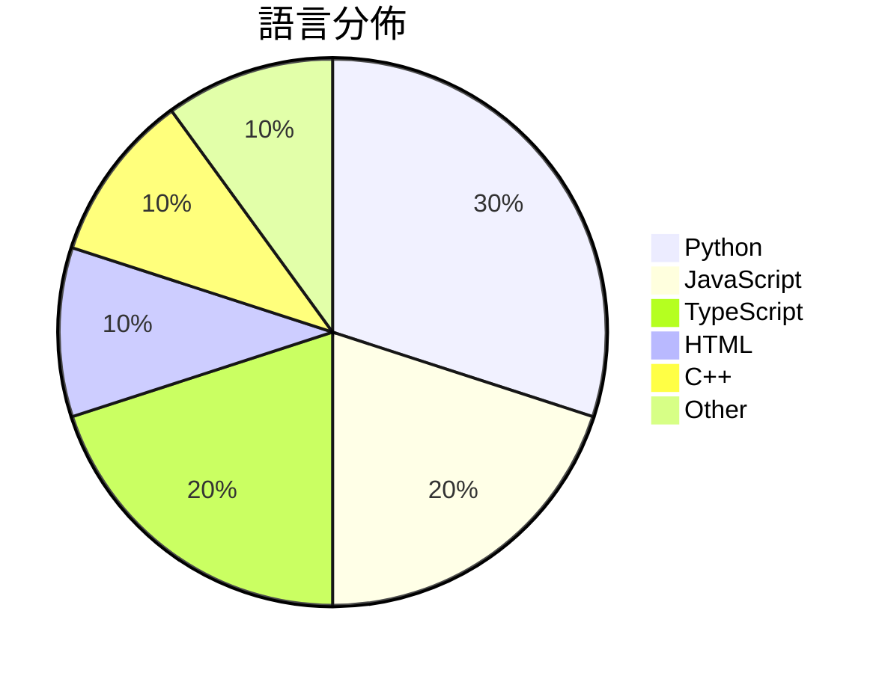

# GitHub Trending - 2026-06-28

> [!summary] 本日摘要
> 收錄 **10** 個新專案，合計 **9.1k** stars
> 語言分佈：Python (3) · JavaScript (2) · TypeScript (2) · HTML (1) · C++ (1) · Other (1)

> [!tip] 本週焦點
> **[[bozhouDev--codex-orange-book|bozhouDev/codex-orange-book]]** — 4 天內累積 2.2k stars（554 stars/天）
> 提供全面的 Codex 使用指南，從安裝到實戰案例，幫助開發者快速上手。



---

## 收錄列表

| # | 專案 | 分類 | Stars | 速度 | 安裝 | 語言 | 用途 |
| :--: | --- | --- | ---: | ---: | --- | --- | --- |
| 1 | [[bozhouDev--codex-orange-book\|bozhouDev/codex-orange-book]] | 開發工具 | 2.2k | 554/天 | `easy` | HTML | 提供全面的 Codex 使用指南，從安裝到實戰案例，幫助開發者快速上手。 |
| 2 | [[deepseek-ai--DeepSpec\|deepseek-ai/DeepSpec]] | AI/ML | 1.3k | 1.3k/天 | `medium` | Python | 提供訓練和評估推測解碼算法的完整代碼庫。 |
| 3 | [[bikini--exploitarium\|bikini/exploitarium]] | 安全 | 1.2k | 304/天 | `medium` | Python | 提供公開的漏洞 PoC 和研究報告的集中存檔，吸引更多人進入安全研究領域。 |
| 4 | [[kanavtwtgg--birds.cafe\|kanavtwtgg/birds.cafe]] | 遊戲 | 736 | 123/天 | `easy` | JavaScript | 提供一個無壓力的鳥類模擬體驗，讓用戶在瀏覽器中駕駛海鷗群飛翔。 |
| 5 | [[BohemiaInteractive--CWR\|BohemiaInteractive/CWR]] | 其他 | 662 | 132/天 | `medium` | C++ | 提供《Arma: Cold War Assault》的重製版引擎和遊戲源碼。 |
| 6 | [[Yu9191--wloc\|Yu9191/wloc]] | 其他 | 644 | 215/天 | `easy` | JavaScript | 修改 Apple 网络定位返回坐标，支持多种代理工具和快捷指令设置。 |
| 7 | [[winsznx--theeleven\|winsznx/theeleven]] | 其他 | 641 | 321/天 | `medium` | TypeScript | 讓 AI 自動開啟即時足球預測市場，無需支付手續費。 |
| 8 | [[QwenLM--Qwen-AgentWorld\|QwenLM/Qwen-AgentWorld]] | AI/ML | 595 | 119/天 | `easy` | Python | 提供一個原生的語言世界模型，模擬多種代理環境，支持長鏈思考推理。 |
| 9 | [[benchflow-ai--awesome-evals\|benchflow-ai/awesome-evals]] | 其他 | 532 | 177/天 | `easy` | N/A | 提供建立與評估 AI 代理的最佳資源，包含論文、部落格、工具與基準。 |
| 10 | [[HKUDS--AgentSpace\|HKUDS/AgentSpace]] | 生產力 | 479 | 96/天 | `medium` | TypeScript | 提供人類與代理之間的協作工作空間，讓團隊能夠高效合作。 |

---

## 重點摘要

### 1. [[bozhouDev--codex-orange-book|bozhouDev/codex-orange-book]] `開發工具`

> 提供全面的 Codex 使用指南，從安裝到實戰案例，幫助開發者快速上手。

**2.2k** stars · **554** stars/天 · HTML · `easy`

_建立 4 天就累積 2215 stars（554/天），forks 221（10.0%），這顯示出強勁的增長潛力。作者 Vink567 和 bozhouDev 具備相關背景，提供了一個在 Codex 使用上缺乏系統性文獻的解決方案。Codex 的快速更新和多樣化的使用場景使得這本指南成為開發者的必備資源。社群對於 Codex 的需求和興趣促使這個專案迅速獲得關注。_

---

### 2. [[deepseek-ai--DeepSpec|deepseek-ai/DeepSpec]] `AI/ML`

> 提供訓練和評估推測解碼算法的完整代碼庫。

**1.3k** stars · **1.3k** stars/天 · Python · `medium`

_建立 1 天就累積 1343 stars（1343/天），forks 113（8.4%），這顯示出相對高的使用興趣。這個專案的作者在推測解碼領域有一定的背景，並且解決了之前缺乏完整訓練和評估框架的痛點。此專案的出現正好填補了這一空白，特別是對於需要處理大規模數據的研究者來說。社群的反饋和需求也促進了這個專案的快速成長，特別是針對 Gemma4/Qwen3 的訓練需求。forks/stars 比率為 8.4%，顯示出有相當比例的使用者在進行實際的修改和使用，這表明了其實用性和潛在的擴展性。_

---

### 3. [[bikini--exploitarium|bikini/exploitarium]] `安全`

> 提供公開的漏洞 PoC 和研究報告的集中存檔，吸引更多人進入安全研究領域。

**1.2k** stars · **304** stars/天 · Python · `medium`

_建立 4 天就累積 1216 stars（304/天），forks 249（20.5%），顯示出強烈的社群興趣。作者 bikini 是一位有學術背景的安全研究者，過去發表過多篇有關模糊測試的方法論的論文。這個專案解決了許多安全研究者在尋找可用 PoC 時的困難，提供了一個集中且易於使用的資源。近期的推特和社群討論也引發了對這個專案的關注，進一步促進了其流行。這個工具的出現正好符合了當前對於安全研究資源的需求，並且其開放性質吸引了許多開發者的參與。_

---

### 4. [[kanavtwtgg--birds.cafe|kanavtwtgg/birds.cafe]] `遊戲`

> 提供一個無壓力的鳥類模擬體驗，讓用戶在瀏覽器中駕駛海鷗群飛翔。

**736** stars · **123** stars/天 · JavaScript · `easy`

_建立 6 天內累積 736 stars（123/天），forks 2（0.3%），顯示出這個專案的初步吸引力。作者 kanavtwtgg 似乎專注於創造獨特的網頁體驗，這個專案填補了市場上對於無壓力、放鬆類型遊戲的需求。這種非傳統遊戲的概念可能吸引了尋求新穎體驗的用戶。由於目前沒有類似的競爭者，這使得 birds.cafe 在特定用戶群中獲得了關注。_

---

### 5. [[BohemiaInteractive--CWR|BohemiaInteractive/CWR]] `其他`

> 提供《Arma: Cold War Assault》的重製版引擎和遊戲源碼。

**662** stars · **132** stars/天 · C++ · `medium`

_建立 5 天內累積 662 stars（132/天），forks 77（11.6%），顯示出不錯的社群反應。這個專案由 Bohemia Interactive 發起，旨在讓社群能夠繼續支持這款經典遊戲。過去，這款遊戲的源碼並未公開，開發者只能依賴於官方的更新和支持，這次開放源碼的舉措解決了這一痛點。社群對於能夠自由修改和擴展遊戲的期待也促進了專案的熱度。技術上，這個專案的開放性和現代化的編譯工具鏈使其在當前的遊戲開發生態中脫穎而出。_

---

### 6. [[Yu9191--wloc|Yu9191/wloc]] `其他`

> 修改 Apple 网络定位返回坐标，支持多种代理工具和快捷指令设置。

**644** stars · **215** stars/天 · JavaScript · `easy`

_建立 3 天內累積 644 stars（215/天），forks 91（14.1%），顯示出強勁的增長潛力。作者 Yu9191 是一位活躍的開發者，專注於網絡定位技術，這個專案解決了過去用戶在 iOS 上虛擬定位的困難，特別是對於需要隱私保護的用戶。近期的社群討論和問題反映出用戶對於虛擬定位的需求，並且有多個使用場景被提出，這進一步推動了專案的關注度。技術上，這個工具的出現是因為 Apple 對定位服務的強化，使得傳統的定位修改方法不再有效，WLOC 提供了一個新的解決方案。forks/stars 比率為 14.1%，顯示出有相當比例的用戶在實際修改和使用這個工具。_

---

### 7. [[winsznx--theeleven|winsznx/theeleven]] `其他`

> 讓 AI 自動開啟即時足球預測市場，無需支付手續費。

**641** stars · **321** stars/天 · TypeScript · `medium`

_建立 2 天內累積 641 stars（321/天），forks 2（0.3%），顯示出初期的關注度。作者 winsznx 在區塊鏈和 AI 領域有豐富的經驗，這個專案解決了傳統預測市場的高手續費問題，讓用戶能夠以更低的成本參與。近期的 OKX X Layer hackathon 也為這個專案帶來了曝光，促進了其快速成長。EIP-3009 的引入使得無手續費質押成為可能，這在現有的預測市場中是前所未有的。forks/stars 比率低於 5% 代表目前大多數人還在觀望階段。_

---

### 8. [[QwenLM--Qwen-AgentWorld|QwenLM/Qwen-AgentWorld]] `AI/ML`

> 提供一個原生的語言世界模型，模擬多種代理環境，支持長鏈思考推理。

**595** stars · **119** stars/天 · Python · `easy`

_建立 5 天內累積 595 stars（119/天），forks 53（8.9%），顯示出強烈的興趣和潛在的使用者基礎。這個專案由 hzhwcmhf 和 yuxinzuo 兩位貢獻者主導，他們在相關領域有豐富的經驗。Qwen-AgentWorld 解決了以往模型在多領域模擬上的不足，提供了一個統一的解決方案，這在當前的 AI 生態中是非常重要的。社群的活躍度和開放的問題也顯示出這個專案的潛力和未來發展的可能性。_

---

### 9. [[benchflow-ai--awesome-evals|benchflow-ai/awesome-evals]] `其他`

> 提供建立與評估 AI 代理的最佳資源，包含論文、部落格、工具與基準。

**532** stars · **177** stars/天 · N/A · `easy`

_建立 3 天內累積 532 stars（177/天），forks 39（7.3%），顯示出穩定的增長趨勢。這個專案由 BenchFlow 維護，該團隊在 AI 評估領域有豐富的經驗。它解決了以往資源庫中資料雜亂無章的問題，提供了一個經過篩選和驗證的資源集合。近期的推廣活動和社群討論也促進了其知名度。這個工具的高 fork/stars 比率顯示出使用者對其實用性的認可，並且許多人在實際使用中進行了修改和擴展。_

---

### 10. [[HKUDS--AgentSpace|HKUDS/AgentSpace]] `生產力`

> 提供人類與代理之間的協作工作空間，讓團隊能夠高效合作。

**479** stars · **96** stars/天 · TypeScript · `medium`

_建立 5 天內累積 479 stars（96/天），forks 53（11.1%），顯示出良好的社群反應。作者 TianyuFan0504 及其團隊在代理技術領域有豐富經驗，這個工具解決了現有代理工具無法有效協作的痛點。特別是，AgentSpace 提供的治理和審核功能是許多團隊所需但未被滿足的需求。社群的活躍度和開放的問題追蹤也顯示出這個專案的潛力和未來發展的可能性。_

---

## 今日到期複習

> [!tip] 根據間隔複習排程，今天該回顧的專案

```dataview
TABLE
  stars_per_day AS "Stars/天",
  category AS "分類",
  engagement AS "參與度"
FROM "Repos"
WHERE next_review AND date(next_review) <= date("2026-06-28") AND status != "archived"
SORT priority DESC
```

## 待處理

```dataviewjs
const pending = dv.pages('"Repos"').where(p => p.status === "to-review").length;
const unrated = dv.pages('"Repos"').where(p => p.status !== "archived" && p.status !== "to-review" && (p.my_rating || 0) === 0).length;
const noVerdict = dv.pages('"Repos"').where(p => p.status !== "archived" && (p.my_rating || 0) > 0 && (!p.verdict || p.verdict === "")).length;
const items = [];
if (pending > 0) items.push(`**${pending}** 個待分流`);
if (unrated > 0) items.push(`**${unrated}** 個已讀但未評分`);
if (noVerdict > 0) items.push(`**${noVerdict}** 個已評分但無結論`);
if (items.length > 0) dv.paragraph(items.join(" / "));
else dv.paragraph("所有專案都已處理完畢！");
```
