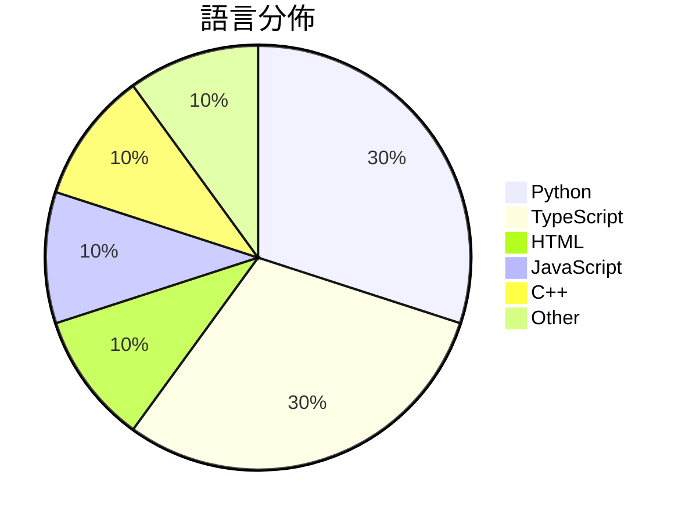

# GitHub Trending - 2026-06-29

> [!summary] 本日摘要
> 收錄 **10** 個新專案，合計 **11.4k** stars
> 語言分佈：Python (3) · TypeScript (3) · HTML (1) · JavaScript (1) · C++ (1) · Other (1)

> [!tip] 本週焦點
> **[[bozhouDev--codex-orange-book|bozhouDev/codex-orange-book]]** — 5 天內累積 2.3k stars（457 stars/天）
> 提供全面的 Codex 使用指南，從安裝到實戰案例，幫助開發者快速上手。



---

## 收錄列表

| # | 專案 | 分類 | Stars | 速度 | 安裝 | 語言 | 用途 |
| :--: | --- | --- | ---: | ---: | --- | --- | --- |
| 1 | [[bozhouDev--codex-orange-book\|bozhouDev/codex-orange-book]] | 教學資源 | 2.3k | 457/天 | `easy` | HTML | 提供全面的 Codex 使用指南，從安裝到實戰案例，幫助開發者快速上手。 |
| 2 | [[deepseek-ai--DeepSpec\|deepseek-ai/DeepSpec]] | AI/ML | 2.2k | 1.1k/天 | `medium` | Python | 提供訓練和評估推測解碼演算法的完整代碼庫。 |
| 3 | [[bikini--exploitarium\|bikini/exploitarium]] | 安全 | 2.2k | 433/天 | `medium` | Python | 提供公共漏洞 PoC 和研究寫作的單一檔案庫，吸引更多人進入安全研究領域。 |
| 4 | [[Yu9191--wloc\|Yu9191/wloc]] | 開發工具 | 1.1k | 273/天 | `medium` | JavaScript | 修改 Apple 网络定位返回坐标，支持多种代理工具和快捷指令一键设置。 |
| 5 | [[winsznx--theeleven\|winsznx/theeleven]] | DeFi | 695 | 232/天 | `medium` | TypeScript | 讓 AI 自動開啟即時足球賭盤市場，無需支付手續費。 |
| 6 | [[BohemiaInteractive--CWR\|BohemiaInteractive/CWR]] | 遊戲 | 688 | 115/天 | `medium` | C++ | 提供 Arma: Cold War Assault 的重製版源碼，讓玩家和開發者 |
| 7 | [[QwenLM--Qwen-AgentWorld\|QwenLM/Qwen-AgentWorld]] | AI/ML | 627 | 105/天 | `easy` | Python | 提供一個模擬多種環境的語言世界模型，支援多種代理任務。 |
| 8 | [[benchflow-ai--awesome-evals\|benchflow-ai/awesome-evals]] | 其他 | 564 | 141/天 | `easy` | N/A | 提供 AI 代理建構與評估的最佳資源，包含論文、部落格、工具等，並經過嚴格篩選與 |
| 9 | [[HKUDS--AgentSpace\|HKUDS/AgentSpace]] | 開發工具 | 524 | 87/天 | `medium` | TypeScript | 提供人類與智能代理的協作工作空間，讓團隊能夠高效合作。 |
| 10 | [[AlexandrosGounis--pdfx\|AlexandrosGounis/pdfx]] | 開發工具 | 489 | 122/天 | `medium` | TypeScript | 讓多個文件以單一 PDF 檔案儲存，並具備簡易的檢視器。 |

---

## 重點摘要

### 1. [[bozhouDev--codex-orange-book|bozhouDev/codex-orange-book]] `教學資源`

> 提供全面的 Codex 使用指南，從安裝到實戰案例，幫助開發者快速上手。

**2.3k** stars · **457** stars/天 · HTML · `easy`

_建立 5 天就累積 2284 stars（457/天），forks 228（10.0%），顯示出強烈的社群需求。作者 Vink567 和 bozhouDev 在開源社群中有一定影響力，這份指南填補了 Codex 使用上的空白，幫助開發者快速上手。近期的社群討論和問題反映了使用過程中的實際挑戰，進一步推動了這個專案的關注度。Codex 的快速更新和多功能性使其在開發者中受到青睞。_

---

### 2. [[deepseek-ai--DeepSpec|deepseek-ai/DeepSpec]] `AI/ML`

> 提供訓練和評估推測解碼演算法的完整代碼庫。

**2.2k** stars · **1.1k** stars/天 · Python · `medium`

_建立 2 天就累積 2226 stars（1113/天），forks 210（9.4%），顯示出強烈的社群興趣。這位作者來自 DeepSeek 團隊，過去在推測解碼領域有多項研究成果。DeepSpec 解決了以往推測解碼工具缺乏完整訓練和評估流程的痛點，讓研究者能夠更輕鬆地進行實驗。最近的推特討論和社群反饋也促進了這個專案的曝光。技術上，隨著深度學習框架的進步，這個工具的可行性大幅提升。forks/stars 比率在 9.4%，顯示出許多人對這個專案進行了實際修改和使用。_

---

### 3. [[bikini--exploitarium|bikini/exploitarium]] `安全`

> 提供公共漏洞 PoC 和研究寫作的單一檔案庫，吸引更多人進入安全研究領域。

**2.2k** stars · **433** stars/天 · Python · `medium`

_建立 5 天內累積 2165 stars（433/天），forks 504（23.3%），顯示出強勁的增長潛力。作者 bikini 在安全研究領域有一定的背景，並且以開放的方式分享漏洞研究，這在社群中引起了共鳴。這個專案填補了許多研究者在獲取漏洞資訊方面的需求，特別是對於新手來說，這是一個很好的入門資源。社群的活躍度和持續更新也吸引了更多的使用者關注。_

---

### 4. [[Yu9191--wloc|Yu9191/wloc]] `開發工具`

> 修改 Apple 网络定位返回坐标，支持多种代理工具和快捷指令一键设置。

**1.1k** stars · **273** stars/天 · JavaScript · `medium`

_建立 4 天就累積 1092 stars（273/天），forks 142（13.0%），這顯示出用戶對於虛擬定位需求的強烈興趣。作者 Yu9191 以往在開源社群中活躍，這次的工具解決了 iOS 用戶在定位上的痛點，特別是在需要隱私或地理限制的場景下。近期的推廣和討論也可能促進了這個專案的曝光。技術上，隨著 MITM 技術的普及，這種方法變得更加可行，且 forks/stars 比率顯示出許多人在實際修改和使用這個工具。_

---

### 5. [[winsznx--theeleven|winsznx/theeleven]] `DeFi`

> 讓 AI 自動開啟即時足球賭盤市場，無需支付手續費。

**695** stars · **232** stars/天 · TypeScript · `medium`

_建立 3 天內累積 695 stars（232/天），forks 僅 2（0.3%），顯示出相對較少的修改需求。作者 winsznx 之前參與過多個 DeFi 項目，這次專案解決了即時賭盤市場的高手續費問題，讓用戶可以無縫地參與賭博。這個專案的推出正值 2026 世界盃的前夕，吸引了不少關注。技術上，X Layer 的新興生態系統也為這個專案提供了良好的基礎。由於 forks/stars 比率低，顯示出大多數用戶是觀望而非實際修改使用。_

---

### 6. [[BohemiaInteractive--CWR|BohemiaInteractive/CWR]] `遊戲`

> 提供 Arma: Cold War Assault 的重製版源碼，讓玩家和開發者能夠研究、修改和擴展遊戲。

**688** stars · **115** stars/天 · C++ · `medium`

_建立 6 天內累積 688 stars（115/天），forks 83（12.1%），顯示出強烈的社群興趣。這個專案由 Bohemia Interactive 發起，旨在釋放經典遊戲的源碼，讓社群能夠進行研究和創作。之前，這類遊戲的源碼通常不對外開放，限制了玩家和開發者的創造力。此專案的推出正好填補了這一空白，並且吸引了大量的關注和反饋。社群的活躍度和對於開放源碼的需求也促進了這個專案的快速增長。_

---

### 7. [[QwenLM--Qwen-AgentWorld|QwenLM/Qwen-AgentWorld]] `AI/ML`

> 提供一個模擬多種環境的語言世界模型，支援多種代理任務。

**627** stars · **105** stars/天 · Python · `easy`

_建立 6 天內累積 627 stars（105/天），forks 57（9.1%），這顯示出相對穩定的增長。開發者 hzhwcmhf 和 yuxinzuo 具備相關背景，並且該模型解決了以往模型在環境模擬上的不足，特別是原生世界模型的設計。近期的發布和技術報告引起了社群的關注，並且有多個平台支持其使用，這使得它在技術生態中變得更加可行。高達 9.1% 的 forks/stars 比率顯示出使用者對於這個工具的實際修改和使用意願。_

---

### 8. [[benchflow-ai--awesome-evals|benchflow-ai/awesome-evals]] `其他`

> 提供 AI 代理建構與評估的最佳資源，包含論文、部落格、工具等，並經過嚴格篩選與驗證。

**564** stars · **141** stars/天 · N/A · `easy`

_建立 4 天內累積 564 stars（141/天），forks 42（7.4%），顯示出強烈的社群興趣。這個專案由 BenchFlow 團隊維護，該團隊在 AI 代理領域有相當的專業背景。它解決了許多開發者在尋找可靠資源時的痛點，因為現有的資源庫往往缺乏質量控制。這個專案的出現正好填補了這個空白，並且其高質量的內容吸引了許多使用者的注意。社群對於這個專案的反饋非常正面，顯示出它在實際應用中的價值。_

---

### 9. [[HKUDS--AgentSpace|HKUDS/AgentSpace]] `開發工具`

> 提供人類與智能代理的協作工作空間，讓團隊能夠高效合作。

**524** stars · **87** stars/天 · TypeScript · `medium`

_建立 6 天就累積 524 stars（87/天），forks 62（11.8%），顯示出強勁的增長潛力。主要貢獻者 TianyuFan0504 和其他成員在智能代理領域有豐富的經驗，這個專案解決了現有代理工具無法滿足團隊協作需求的痛點，提供了更好的治理和協作機制。近期的推廣活動和社群討論也可能促進了其快速增長。_

---

### 10. [[AlexandrosGounis--pdfx|AlexandrosGounis/pdfx]] `開發工具`

> 讓多個文件以單一 PDF 檔案儲存，並具備簡易的檢視器。

**489** stars · **122** stars/天 · TypeScript · `medium`

_建立 4 天就累積 489 stars（122/天），forks 52（10.6%），顯示出穩定的增長趨勢。這個專案由 Alexandros Gounis 主導，他在開源社區有一定的知名度，並且解決了傳統 PDF 檔案管理中的一個痛點：多文件的整合。過去，使用者通常需要依賴昂貴的商業軟體來處理多個 PDF 文件，而 PDFx 提供了一個免費且開放的解決方案。最近的推廣活動和社群討論也可能促進了這個專案的曝光率。其設計的靈活性和易用性使得它在多文件處理的需求中顯得尤為重要，特別是在教育和商業環境中。_

---

## 今日到期複習

> [!tip] 根據間隔複習排程，今天該回顧的專案

```dataview
TABLE
  stars_per_day AS "Stars/天",
  category AS "分類",
  engagement AS "參與度"
FROM "Repos"
WHERE next_review AND date(next_review) <= date("2026-06-29") AND status != "archived"
SORT priority DESC
```

## 待處理

```dataviewjs
const pending = dv.pages('"Repos"').where(p => p.status === "to-review").length;
const unrated = dv.pages('"Repos"').where(p => p.status !== "archived" && p.status !== "to-review" && (p.my_rating || 0) === 0).length;
const noVerdict = dv.pages('"Repos"').where(p => p.status !== "archived" && (p.my_rating || 0) > 0 && (!p.verdict || p.verdict === "")).length;
const items = [];
if (pending > 0) items.push(`**${pending}** 個待分流`);
if (unrated > 0) items.push(`**${unrated}** 個已讀但未評分`);
if (noVerdict > 0) items.push(`**${noVerdict}** 個已評分但無結論`);
if (items.length > 0) dv.paragraph(items.join(" / "));
else dv.paragraph("所有專案都已處理完畢！");
```
