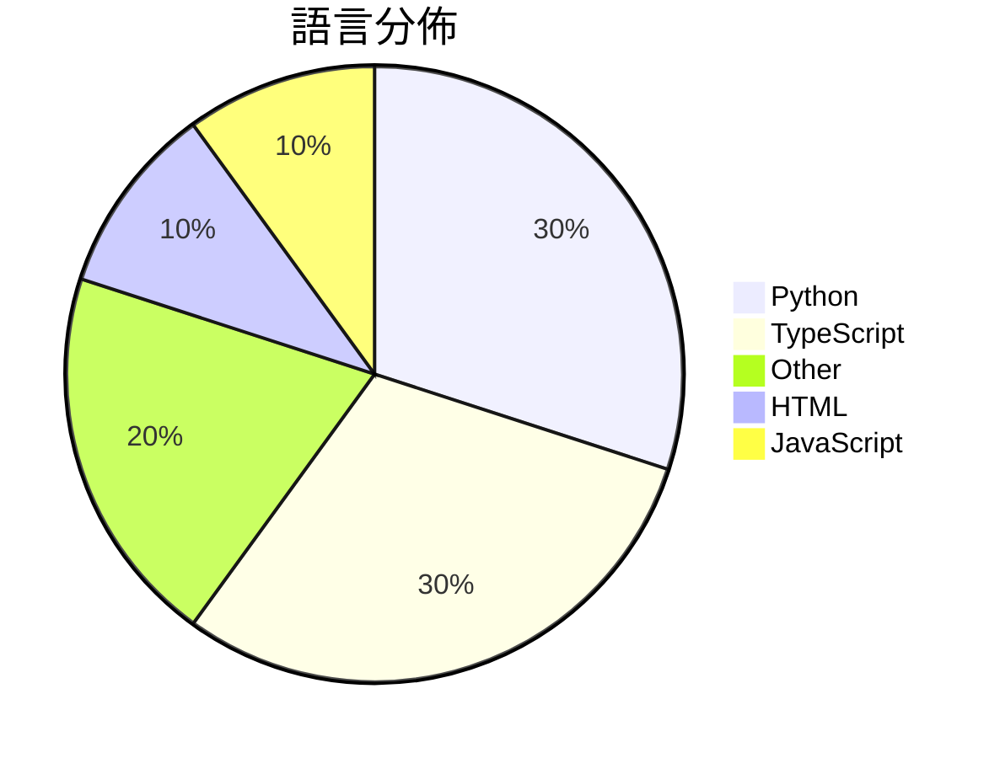

# GitHub Trending - 2026-06-30

> [!summary] 本日摘要
> 收錄 **10** 個新專案，合計 **12.2k** stars
> 語言分佈：Python (3) · TypeScript (3) · Other (2) · HTML (1) · JavaScript (1)

> [!tip] 本週焦點
> **[[deepseek-ai--DeepSpec|deepseek-ai/DeepSpec]]** — 3 天內累積 3.9k stars（1.3k stars/天）
> 提供一個完整的代碼庫來訓練和評估推測解碼演算法。



---

## 收錄列表

| # | 專案 | 分類 | Stars | 速度 | 安裝 | 語言 | 用途 |
| :--: | --- | --- | ---: | ---: | --- | --- | --- |
| 1 | [[deepseek-ai--DeepSpec\|deepseek-ai/DeepSpec]] | AI/ML | 3.9k | 1.3k/天 | `medium` | Python | 提供一個完整的代碼庫來訓練和評估推測解碼演算法。 |
| 2 | [[bozhouDev--codex-orange-book\|bozhouDev/codex-orange-book]] | 教學資源 | 2.4k | 394/天 | `medium` | HTML | 提供全面的 Codex 使用指南，從安裝到實戰案例，幫助開發者快速上手。 |
| 3 | [[Yu9191--wloc\|Yu9191/wloc]] | 開發工具 | 1.5k | 302/天 | `easy` | JavaScript | 修改 Apple 网络定位返回坐标，支持多种代理工具的虚拟定位。 |
| 4 | [[Krishnagangwal--CS-Fundamentals\|Krishnagangwal/CS-Fundamentals]] | 教學資源 | 957 | 957/天 | `easy` | N/A | 提供計算機科學基礎知識的精選資源，幫助求職準備。 |
| 5 | [[winsznx--theeleven\|winsznx/theeleven]] | 開發工具 | 714 | 179/天 | `medium` | TypeScript | 讓 AI 自動開啟即時足球預測市場，無需支付手續費。 |
| 6 | [[baairon--torlink\|baairon/torlink]] | CLI 工具 | 659 | 165/天 | `easy` | TypeScript | 在終端機中無需設置即可找到和下載 torrent。 |
| 7 | [[benchflow-ai--awesome-evals\|benchflow-ai/awesome-evals]] | 其他 | 589 | 118/天 | `easy` | N/A | 提供一個精選的資源庫，用於構建和評估 AI 代理，包括論文、部落格、工具和基準。 |
| 8 | [[AlexandrosGounis--pdfx\|AlexandrosGounis/pdfx]] | 開發工具 | 564 | 113/天 | `medium` | TypeScript | 將多個文件打包到單一 PDF 文件中，並保持向後兼容性。 |
| 9 | [[yynxxxxx--Codex-5.5-codex-instruct-5.5\|yynxxxxx/Codex-5.5-codex-instruct-5.5]] | 其他 | 507 | 507/天 | `easy` | Python | 一鍵注入 GPT-5.5 Codex CLI 的無限制模式指令，突破內容安全限制 |
| 10 | [[Pluviobyte--video-production-skills\|Pluviobyte/video-production-skills]] | 開發工具 | 444 | 148/天 | `easy` | Python | 提供可重複使用的 AI 視頻製作技能庫，涵蓋創作、復刻、動效設計等流程。 |

---

## 重點摘要

### 1. [[deepseek-ai--DeepSpec|deepseek-ai/DeepSpec]] `AI/ML`

> 提供一個完整的代碼庫來訓練和評估推測解碼演算法。

**3.9k** stars · **1.3k** stars/天 · Python · `medium`

_建立 3 天內累積 3876 stars（1292/天），forks 328（8.5%），顯示出強勁的增長勢頭。這個專案的主要貢獻者 Hannibal046 和 inisis 在開源社群中有一定的影響力，之前也有相關的開源專案。DeepSpec 解決了推測解碼演算法訓練和評估的複雜性問題，之前的工具往往缺乏完整的工作流程和數據準備功能。最近的推文和社群討論也引發了對此專案的關注，顯示出其在技術生態中的重要性。高達 8.5% 的 forks/stars 比率表明許多開發者正在實際修改和使用這個工具，顯示出其實用性和需求。_

---

### 2. [[bozhouDev--codex-orange-book|bozhouDev/codex-orange-book]] `教學資源`

> 提供全面的 Codex 使用指南，從安裝到實戰案例，幫助開發者快速上手。

**2.4k** stars · **394** stars/天 · HTML · `medium`

_建立 6 天就累積 2362 stars（394/天），forks 236（10.0%），這顯示出強勁的增長潛力。作者 Vink567 和 bozhouDev 在 AI 工具開發領域有一定的背景，這本指南填補了 Codex 使用上的知識空白，特別是針對開發者的實用性需求。近期的討論和需求表明，開發者對於 Codex 的使用案例和最佳實踐有著迫切的需求，這促進了該專案的快速成長。_

---

### 3. [[Yu9191--wloc|Yu9191/wloc]] `開發工具`

> 修改 Apple 网络定位返回坐标，支持多种代理工具的虚拟定位。

**1.5k** stars · **302** stars/天 · JavaScript · `easy`

_建立 5 天內累積 1508 stars（302/天），forks 195（12.9%），顯示出強烈的社群關注。作者 Yu9191 之前在開源社群有其他貢獻，這個專案解決了 iOS 用戶在定位上遇到的限制，特別是在需要經常修改定位的情境下。這個工具的出現恰好滿足了用戶對於簡單、高效虛擬定位的需求，並且在社群中引發了討論和分享。_

---

### 4. [[Krishnagangwal--CS-Fundamentals|Krishnagangwal/CS-Fundamentals]] `教學資源`

> 提供計算機科學基礎知識的精選資源，幫助求職準備。

**957** stars · **957** stars/天 · N/A · `easy`

_建立 1 天就累積 957 stars（957/天），forks 70（7.3%），這顯示出高需求和使用者的積極參與。作者 Krishnagangwal 是一位活躍的貢獻者，專注於教育資源的整理和分享。這個專案解決了求職者在準備面試時面臨的資料分散問題，之前的解決方案往往需要在多個網站之間切換，效率低下。這個專案的出現正好填補了這一空白，提供了一個集中式的資源庫。社群的反饋和使用者的需求促進了這個專案的快速增長，特別是在求職季節來臨之際。_

---

### 5. [[winsznx--theeleven|winsznx/theeleven]] `開發工具`

> 讓 AI 自動開啟即時足球預測市場，無需支付手續費。

**714** stars · **179** stars/天 · TypeScript · `medium`

_建立 4 天內累積 714 stars（179/天），forks 2（0.3%），這顯示出相對較高的關注度。作者 winsznx 是一位活躍的開發者，專注於 DeFi 和 AI 領域，這個專案解決了即時預測市場的需求，之前的解決方案如 Augur 和 Gnosis 在即時性和用戶體驗上有所不足。該專案的推出正值 2026 世界盃的前夕，吸引了大量關注。技術上，EIP-3009 的使用使得無手續費的押注成為可能，這在現有市場中是前所未有的。forks/stars 比率較低，顯示出目前大部分用戶仍在觀望階段。_

---

### 6. [[baairon--torlink|baairon/torlink]] `CLI 工具`

> 在終端機中無需設置即可找到和下載 torrent。

**659** stars · **165** stars/天 · TypeScript · `easy`

_建立 4 天就累積 659 stars（165/天），forks 38（5.8%），這顯示出用戶對於這個簡單易用的 torrent 工具的需求。作者 baairon 是一位活躍的開發者，過去在開源社區有多個貢獻。這個工具解決了用戶在尋找和下載 torrent 時的繁瑣流程，尤其是針對那些對於傳統 torrent 客戶端感到困惑的用戶。近期的推廣和社群的討論也促進了其曝光度，吸引了更多用戶的關注。這個工具的出現正好符合了對於簡化下載流程的需求，並且在技術上也能夠有效運行，這使得它在短時間內獲得了大量的關注。_

---

### 7. [[benchflow-ai--awesome-evals|benchflow-ai/awesome-evals]] `其他`

> 提供一個精選的資源庫，用於構建和評估 AI 代理，包括論文、部落格、工具和基準。

**589** stars · **118** stars/天 · N/A · `easy`

_建立 5 天就累積 589 stars（118/天），forks 42（7.1%），這顯示出穩定的增長趨勢。這個專案由 BenchFlow 維護，該團隊在 AI 代理評估領域有豐富的經驗。它解決了以往資源庫中資料過於雜亂、缺乏驗證的痛點，提供經過驗證的高品質資源。近期的推廣活動和社群討論也提升了它的曝光率。這個專案的 forks/stars 比率為 7.1%，顯示出使用者對於實際修改和使用的興趣相對較高。_

---

### 8. [[AlexandrosGounis--pdfx|AlexandrosGounis/pdfx]] `開發工具`

> 將多個文件打包到單一 PDF 文件中，並保持向後兼容性。

**564** stars · **113** stars/天 · TypeScript · `medium`

_建立 5 天內累積 564 stars（113/天），forks 64（11.3%），顯示出不錯的增長潛力。專案的主要貢獻者 Alexandros Gounis 具備相關經驗，過去的作品也集中在文檔處理領域。PDFx 解決了傳統 PDF 工具無法有效管理多文件的痛點，特別是在需要將多個文檔合併時，這在許多專業環境中是常見需求。社群的反饋和討論也顯示出對這個功能的需求，進一步促進了專案的曝光。這個工具的出現正好迎合了對於高效文檔管理的需求，尤其是在遠端工作和數位化轉型的背景下。_

---

### 9. [[yynxxxxx--Codex-5.5-codex-instruct-5.5|yynxxxxx/Codex-5.5-codex-instruct-5.5]] `其他`

> 一鍵注入 GPT-5.5 Codex CLI 的無限制模式指令，突破內容安全限制。

**507** stars · **507** stars/天 · Python · `easy`

_建立 1 天就累積 507 stars（507/天），forks 172（33.9%），顯示出強烈的社群興趣。作者 yynxxxxx 似乎專注於開發這類工具，解決了 GPT-5.5 在 Codex CLI 中的內容安全限制問題，這在過去的版本中並未有有效的解決方案。這個工具的出現可能是因為對於無限制模式的需求日益增加，尤其是在安全研究和滲透測試領域。由於其直接的破甲方式，吸引了不少開發者的目光，並促進了社群的討論。高比例的 forks 也顯示出使用者對於修改和自定義的需求。_

---

### 10. [[Pluviobyte--video-production-skills|Pluviobyte/video-production-skills]] `開發工具`

> 提供可重複使用的 AI 視頻製作技能庫，涵蓋創作、復刻、動效設計等流程。

**444** stars · **148** stars/天 · Python · `easy`

_建立 3 天內累積 444 stars（148/天），forks 54（12.2%），顯示出良好的初期反響。作者 Pluviobyte 之前有相關的視頻製作經驗，這個專案解決了視頻製作過程中缺乏可重用技能的痛點，提供了具體的技能庫來提升創作效率。近期的推廣活動和社群討論進一步提高了專案的可見度，吸引了對視頻製作有需求的開發者和創作者。這個工具的可行性也得益於 AI 技術的進步，使得視頻製作的自動化和標準化成為可能。forks/stars 比率為 12.2%，顯示出有不少用戶在實際使用和修改這個專案。_

---

## 今日到期複習

> [!tip] 根據間隔複習排程，今天該回顧的專案

```dataview
TABLE
  stars_per_day AS "Stars/天",
  category AS "分類",
  engagement AS "參與度"
FROM "Repos"
WHERE next_review AND date(next_review) <= date("2026-06-30") AND status != "archived"
SORT priority DESC
```

## 待處理

```dataviewjs
const pending = dv.pages('"Repos"').where(p => p.status === "to-review").length;
const unrated = dv.pages('"Repos"').where(p => p.status !== "archived" && p.status !== "to-review" && (p.my_rating || 0) === 0).length;
const noVerdict = dv.pages('"Repos"').where(p => p.status !== "archived" && (p.my_rating || 0) > 0 && (!p.verdict || p.verdict === "")).length;
const items = [];
if (pending > 0) items.push(`**${pending}** 個待分流`);
if (unrated > 0) items.push(`**${unrated}** 個已讀但未評分`);
if (noVerdict > 0) items.push(`**${noVerdict}** 個已評分但無結論`);
if (items.length > 0) dv.paragraph(items.join(" / "));
else dv.paragraph("所有專案都已處理完畢！");
```
