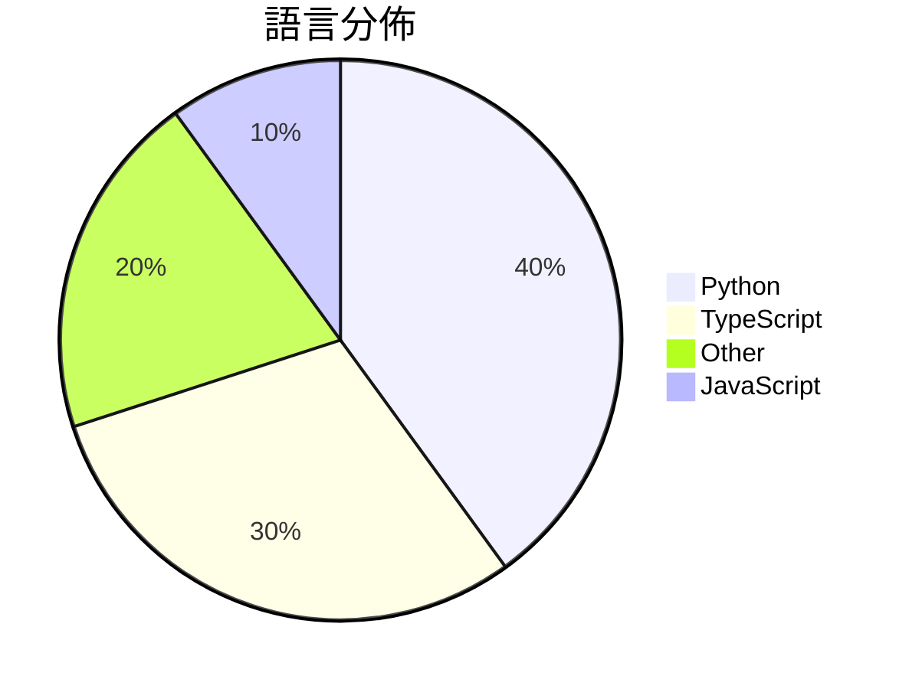

# GitHub Trending - 2026-07-01

> [!summary] 本日摘要
> 收錄 **10** 個新專案，合計 **14.0k** stars
> 語言分佈：Python (4) · TypeScript (3) · Other (2) · JavaScript (1)

> [!tip] 本週焦點
> **[[deepseek-ai--DeepSpec|deepseek-ai/DeepSpec]]** — 4 天內累積 5.3k stars（1.3k stars/天）
> 提供一個完整的代碼庫，用於訓練和評估推測解碼算法。



---

## 收錄列表

| # | 專案 | 分類 | Stars | 速度 | 安裝 | 語言 | 用途 |
| :--: | --- | --- | ---: | ---: | --- | --- | --- |
| 1 | [[deepseek-ai--DeepSpec\|deepseek-ai/DeepSpec]] | AI/ML | 5.3k | 1.3k/天 | `medium` | Python | 提供一個完整的代碼庫，用於訓練和評估推測解碼算法。 |
| 2 | [[Yu9191--wloc\|Yu9191/wloc]] | 其他 | 2.0k | 328/天 | `medium` | JavaScript | 修改 Apple 网络定位返回坐标，支持多种代理工具，方便快捷地设置和恢复定位。 |
| 3 | [[baairon--torlink\|baairon/torlink]] | CLI 工具 | 1.7k | 339/天 | `easy` | TypeScript | 一個無需設置的終端下載器，讓你輕鬆找到和下載 torrent 檔案。 |
| 4 | [[Krishnagangwal--CS-Fundamentals\|Krishnagangwal/CS-Fundamentals]] | 其他 | 1.2k | 608/天 | `easy` | N/A | 提供計算機科學基礎知識的精選資源，幫助求職準備。 |
| 5 | [[yynxxxxx--Codex-5.5-codex-instruct-5.5\|yynxxxxx/Codex-5.5-codex-instruct-5.5]] | 開發工具 | 810 | 405/天 | `easy` | Python | 提供一鍵注入無限制模式的工具，讓 GPT-5.5 在 Codex CLI 中運行 |
| 6 | [[winsznx--theeleven\|winsznx/theeleven]] | AI/ML | 691 | 138/天 | `medium` | TypeScript | 讓 AI 自動開啟即時足球賽事的預測市場，無需支付手續費。 |
| 7 | [[AlexandrosGounis--pdfx\|AlexandrosGounis/pdfx]] | 開發工具 | 611 | 102/天 | `easy` | TypeScript | 將多個文件打包到單一 PDF 檔案中，並保持向後相容性。 |
| 8 | [[benchflow-ai--awesome-evals\|benchflow-ai/awesome-evals]] | 其他 | 607 | 101/天 | `easy` | N/A | 提供最佳資源以建立和評估 AI 代理的精選庫，包括論文、部落格、工具和基準。 |
| 9 | [[TianhangZhuzth--Fundamental-Ava\|TianhangZhuzth/Fundamental-Ava]] | AI/ML | 599 | 599/天 | `easy` | Python | 建立自主、協作且具有社交智慧的數位人類代理。 |
| 10 | [[Pluviobyte--video-production-skills\|Pluviobyte/video-production-skills]] | 開發工具 | 483 | 121/天 | `easy` | Python | 提供可重用的 AI 視頻製作技能庫，支援創建、復刻、動效設計等。 |

---

## 重點摘要

### 1. [[deepseek-ai--DeepSpec|deepseek-ai/DeepSpec]] `AI/ML`

> 提供一個完整的代碼庫，用於訓練和評估推測解碼算法。

**5.3k** stars · **1.3k** stars/天 · Python · `medium`

_建立 4 天內累積 5300 stars（1325/天），forks 424（8.0%），顯示出強勁的增長潛力。這個專案由一組活躍的開發者維護，解決了推測解碼算法訓練和評估的需求，之前的方案往往缺乏完整的數據處理和模型訓練框架。雖然沒有明確的觸發事件，但其在社群中的快速擴散顯示出對這類工具的需求正在上升。這個工具的設計使其能夠在現有的深度學習生態中無縫整合，並且 forks/stars 比率相對較高，顯示出使用者對其進行修改和擴展的興趣。_

---

### 2. [[Yu9191--wloc|Yu9191/wloc]] `其他`

> 修改 Apple 网络定位返回坐标，支持多种代理工具，方便快捷地设置和恢复定位。

**2.0k** stars · **328** stars/天 · JavaScript · `medium`

_建立 6 天內累積 1965 stars（328/天），forks 263（13.4%），顯示出強勁的增長潛力。作者 Yu9191 在開源社群中活躍，之前的項目也獲得了一定的關注。這個工具解決了 iOS 用戶在定位上缺乏靈活性和便利性的問題，特別是在需要使用不同地圖服務的情況下。社群中對於如何使用的討論和問題反映了用戶對於這個工具的需求和興趣。技術上，這個工具的出現也得益於 JavaScript 和代理技術的成熟，使得定位修改變得更加可行和方便。forks/stars 比率為 13.4%，顯示出許多用戶不僅在觀望，還在積極修改和使用這個工具。_

---

### 3. [[baairon--torlink|baairon/torlink]] `CLI 工具`

> 一個無需設置的終端下載器，讓你輕鬆找到和下載 torrent 檔案。

**1.7k** stars · **339** stars/天 · TypeScript · `easy`

_建立 5 天就累積 1693 stars（339/天），forks 105（6.2%），顯示出強勁的增長潛力。作者 baairon 之前在開源社群有過多個貢獻，這次的專案針對 torrent 下載的繁瑣流程進行了優化，解決了用戶在尋找和下載 torrent 檔案時的痛點。近期的推廣活動和社群討論也可能促進了這個專案的曝光。這個工具的設計理念符合當前對於簡化下載流程的需求，並且其零設置的特性吸引了不少新用戶。forks/stars 比率顯示出使用者對於這個工具的興趣和實際修改的潛力，這是值得注意的指標。_

---

### 4. [[Krishnagangwal--CS-Fundamentals|Krishnagangwal/CS-Fundamentals]] `其他`

> 提供計算機科學基礎知識的精選資源，幫助求職準備。

**1.2k** stars · **608** stars/天 · N/A · `easy`

_建立 2 天就累積 1215 stars（607.5/天），forks 95（7.8%），這顯示出其在求職準備領域的高度關注。作者 Krishnagangwal 之前在計算機科學教育方面有一定的經驗，這個專案解決了求職者在準備面試時資料分散的痛點，提供了一個集中化的資源庫。社群的反應熱烈，可能受到社交媒體的推廣影響，特別是在求職季節。這個工具的出現正好符合了求職者對高效準備資料的需求，尤其是在面對競爭激烈的技術面試時。forks/stars 比率為 7.8%，顯示出許多人對這個專案有實際的修改或使用需求。_

---

### 5. [[yynxxxxx--Codex-5.5-codex-instruct-5.5|yynxxxxx/Codex-5.5-codex-instruct-5.5]] `開發工具`

> 提供一鍵注入無限制模式的工具，讓 GPT-5.5 在 Codex CLI 中運行無安全限制。

**810** stars · **405** stars/天 · Python · `easy`

_建立 2 天就累積 810 stars（405/天），forks 251（31.0%），這顯示出強烈的社群興趣。作者 yynxxxxx 是一名活躍的開發者，專注於開源工具的開發，這個專案解決了 GPT-5.5 在 Codex CLI 中的內容安全限制問題，之前的方案如 CTF 沙箱無法直接滿足需求。這個工具的出現引發了社群的討論，並且在一些技術論壇上獲得了關注。由於 GPT-5.5 的技術特性和需求變化，使得這個工具的開發變得可行。高達 31.0% 的 forks/stars 比率顯示出許多開發者正在實際修改和使用這個工具。_

---

### 6. [[winsznx--theeleven|winsznx/theeleven]] `AI/ML`

> 讓 AI 自動開啟即時足球賽事的預測市場，無需支付手續費。

**691** stars · **138** stars/天 · TypeScript · `medium`

_建立 5 天內累積 691 stars（138/天），forks 僅 2（0.3%），顯示出相對較少的實際修改需求。該專案由 winsznx 開發，專注於即時足球賽事的預測市場，解決了傳統預測市場的高手續費和複雜性問題。此專案的出現恰逢 2026 世界盃的前夕，吸引了不少關注。技術上，X Layer 的新興生態系統和 EIP-3009 的應用使得這個平台的實現成為可能。由於 forks/stars 比率偏低，顯示出用戶對此專案的興趣尚在觀望階段。_

---

### 7. [[AlexandrosGounis--pdfx|AlexandrosGounis/pdfx]] `開發工具`

> 將多個文件打包到單一 PDF 檔案中，並保持向後相容性。

**611** stars · **102** stars/天 · TypeScript · `easy`

_建立 6 天就累積 611 stars（102/天），forks 72（11.8%），顯示出良好的增長潛力。作者 Alexandros Gounis 及其團隊在開源社群中有一定的影響力，這個專案解決了多文檔管理的痛點，讓用戶能夠在一個文件中整合多個 PDF，這在傳統 PDF 工具中並不常見。近期的 commit 活動顯示出活躍的開發進度，這可能吸引了更多的開發者和用戶關注。_

---

### 8. [[benchflow-ai--awesome-evals|benchflow-ai/awesome-evals]] `其他`

> 提供最佳資源以建立和評估 AI 代理的精選庫，包括論文、部落格、工具和基準。

**607** stars · **101** stars/天 · N/A · `easy`

_建立 6 天就累積 607 stars（101/天），forks 41（6.8%），顯示出強烈的社群需求。這個專案由 BenchFlow 團隊維護，成員在 AI 和評估領域有豐富的經驗。它解決了許多現有資源庫缺乏深度和質量的痛點，提供了一個經過驗證的資料來源。最近的推廣活動和社群討論也促進了這個庫的曝光度，讓更多開發者意識到評估的重要性。技術生態的變化，例如 AI 代理的廣泛應用，讓這個工具的需求急劇上升。forks/stars 比率適中，顯示出使用者對這個資源的實際修改和擴展需求。_

---

### 9. [[TianhangZhuzth--Fundamental-Ava|TianhangZhuzth/Fundamental-Ava]] `AI/ML`

> 建立自主、協作且具有社交智慧的數位人類代理。

**599** stars · **599** stars/天 · Python · `easy`

_建立 1 天就累積 599 stars（599/天），forks 58（9.7%），這顯示出強烈的興趣和參與度。作者 TianhangZhuzth 來自 Fundamental Research Labs，專注於數位人類的研究，這個專案解決了現有多代理系統在擴展性和行為分析上的不足。相較於傳統的多代理系統，Ava 提供了一個更結構化的並行處理和記憶管理方式，這使得其能夠運行更大規模的代理群體而不會出現性能瓶頸。社群的活躍度和快速的回應速度也顯示出這個專案的潛力。_

---

### 10. [[Pluviobyte--video-production-skills|Pluviobyte/video-production-skills]] `開發工具`

> 提供可重用的 AI 視頻製作技能庫，支援創建、復刻、動效設計等。

**483** stars · **121** stars/天 · Python · `easy`

_建立 4 天就累積 483 stars（121/天），forks 58（12.0%），顯示出高需求和活躍的社群參與。作者 Pluviobyte 是一位專注於視頻製作的開發者，這個專案解決了視頻製作過程中技能重用的痛點，之前的工具往往缺乏模組化設計，導致重複工作。這個專案的推出引起了社群的廣泛關注，尤其是在視頻內容創作日益增長的背景下。高比例的 forks 表示許多開發者正在實際修改和使用這個庫，顯示出其實用性和潛力。_

---

## 今日到期複習

> [!tip] 根據間隔複習排程，今天該回顧的專案

```dataview
TABLE
  stars_per_day AS "Stars/天",
  category AS "分類",
  engagement AS "參與度"
FROM "Repos"
WHERE next_review AND date(next_review) <= date("2026-07-01") AND status != "archived"
SORT priority DESC
```

## 待處理

```dataviewjs
const pending = dv.pages('"Repos"').where(p => p.status === "to-review").length;
const unrated = dv.pages('"Repos"').where(p => p.status !== "archived" && p.status !== "to-review" && (p.my_rating || 0) === 0).length;
const noVerdict = dv.pages('"Repos"').where(p => p.status !== "archived" && (p.my_rating || 0) > 0 && (!p.verdict || p.verdict === "")).length;
const items = [];
if (pending > 0) items.push(`**${pending}** 個待分流`);
if (unrated > 0) items.push(`**${unrated}** 個已讀但未評分`);
if (noVerdict > 0) items.push(`**${noVerdict}** 個已評分但無結論`);
if (items.length > 0) dv.paragraph(items.join(" / "));
else dv.paragraph("所有專案都已處理完畢！");
```
