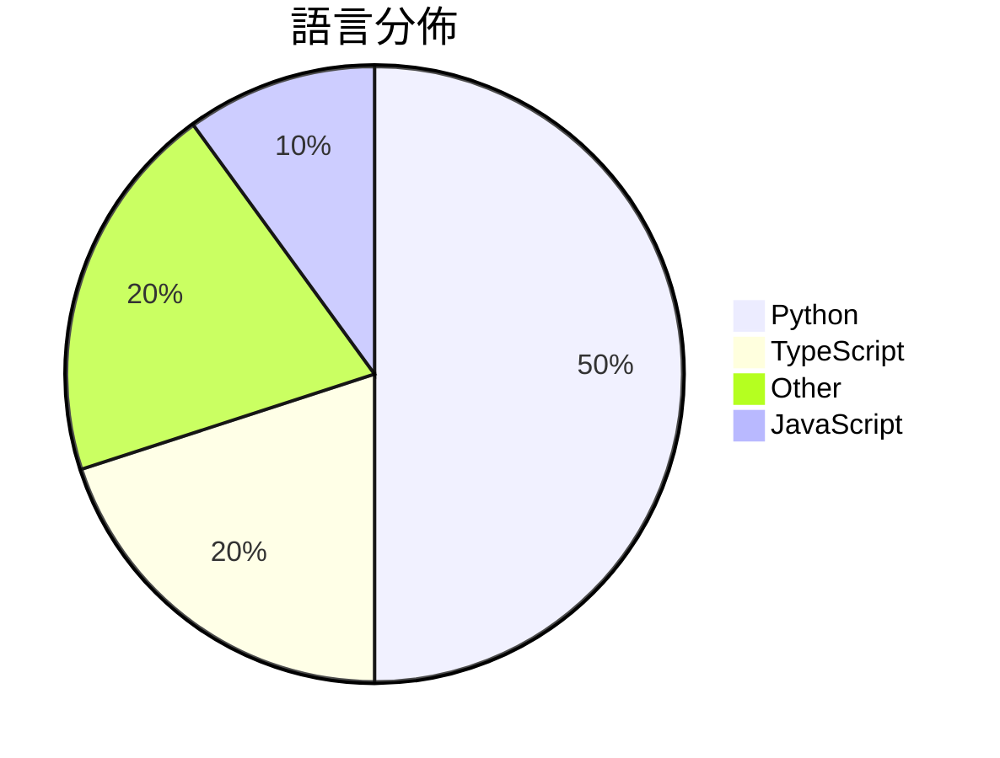

# GitHub Trending - 2026-07-02

> [!summary] 本日摘要
> 收錄 **10** 個新專案，合計 **14.3k** stars
> 語言分佈：Python (5) · TypeScript (2) · Other (2) · JavaScript (1)

> [!tip] 本週焦點
> **[[deepseek-ai--DeepSpec|deepseek-ai/DeepSpec]]** — 5 天內累積 5.8k stars（1.1k stars/天）
> 提供一個完整的代碼庫來訓練和評估推測解碼算法。



---

## 收錄列表

| # | 專案 | 分類 | Stars | 速度 | 安裝 | 語言 | 用途 |
| :--: | --- | --- | ---: | ---: | --- | --- | --- |
| 1 | [[deepseek-ai--DeepSpec\|deepseek-ai/DeepSpec]] | AI/ML | 5.8k | 1.1k/天 | `medium` | Python | 提供一個完整的代碼庫來訓練和評估推測解碼算法。 |
| 2 | [[baairon--torlink\|baairon/torlink]] | CLI 工具 | 2.3k | 386/天 | `easy` | TypeScript | 一個無需設置的終端 Torrent 搜尋和下載工具，讓你輕鬆找到並下載檔案。 |
| 3 | [[Krishnagangwal--CS-Fundamentals\|Krishnagangwal/CS-Fundamentals]] | 教學資源 | 1.3k | 444/天 | `easy` | N/A | 提供計算機科學基礎知識的精選資源，幫助求職者準備面試。 |
| 4 | [[yynxxxxx--Codex-5.5-codex-instruct-5.5\|yynxxxxx/Codex-5.5-codex-instruct-5.5]] | 開發工具 | 1.0k | 338/天 | `easy` | Python | 讓 GPT-5.5 在 Codex CLI 中運行無限制模式的工具。 |
| 5 | [[Kulaxyz--self-learning-skills\|Kulaxyz/self-learning-skills]] | 開發工具 | 748 | 249/天 | `easy` | N/A | 讓 AI 編碼代理自動學習並保存重複使用的技能，避免每次都從零開始。 |
| 6 | [[TianhangZhuzth--Fundamental-Ava\|TianhangZhuzth/Fundamental-Ava]] | AI/ML | 718 | 359/天 | `medium` | Python | 建立自主、協作和社交智能的數位人類代理。 |
| 7 | [[winsznx--bull-rush\|winsznx/bull-rush]] | 遊戲 | 681 | 114/天 | `medium` | TypeScript | 一款 3D 霓虹無盡跑者遊戲，結合 Hono API 和 Redis，讓玩家挑戰 |
| 8 | [[mekos2772--ios-location-spoofer\|mekos2772/ios-location-spoofer]] | 其他 | 670 | 670/天 | `medium` | JavaScript | 無需越獄即可偽造 iOS GPS 位置的獨立應用，支持多種代理工具。 |
| 9 | [[aquace--CVE-2026-41940-PoC\|aquace/CVE-2026-41940-PoC]] | 安全 | 571 | 190/天 | `easy` | Python | 提供 CVE-2026-41940 的驗證繞過漏洞利用工具。 |
| 10 | [[Pluviobyte--video-production-skills\|Pluviobyte/video-production-skills]] | 開發工具 | 492 | 98/天 | `easy` | Python | 提供可重用的 AI 視頻製作技能庫，幫助創建、重現和設計視頻動效。 |

---

## 重點摘要

### 1. [[deepseek-ai--DeepSpec|deepseek-ai/DeepSpec]] `AI/ML`

> 提供一個完整的代碼庫來訓練和評估推測解碼算法。

**5.8k** stars · **1.1k** stars/天 · Python · `medium`

_建立 5 天內累積 5750 stars（1150/天），forks 461（8.0%），顯示出強烈的社群興趣。作者團隊由多位活躍的開發者組成，過去在相關領域有豐富的經驗。這個專案解決了之前在推測解碼算法訓練和評估上的缺乏統一框架的痛點，讓研究者能夠更方便地進行實驗。近期的推廣活動和社群討論也促進了其曝光率，特別是在 AI 和機器學習的研究社群中。高 forks/stars 比率顯示出使用者對其功能的實際修改和擴展需求。_

---

### 2. [[baairon--torlink|baairon/torlink]] `CLI 工具`

> 一個無需設置的終端 Torrent 搜尋和下載工具，讓你輕鬆找到並下載檔案。

**2.3k** stars · **386** stars/天 · TypeScript · `easy`

_建立 6 天就累積 2315 stars（386/天），forks 152（6.6%），顯示出快速增長的潛力。作者 baairon 之前有開源經驗，這個專案解決了 Torrent 使用者在搜尋和下載檔案時的繁瑣過程，提供了一個簡單的終端解決方案。近期的推廣活動和社群討論也促進了這個專案的曝光。技術上，Node.js 和 WebTorrent 的組合讓這個工具在終端中運行流暢，並且能夠快速響應用戶請求。forks/stars 比率在中等範圍，顯示出一些用戶已經開始修改和使用這個專案。_

---

### 3. [[Krishnagangwal--CS-Fundamentals|Krishnagangwal/CS-Fundamentals]] `教學資源`

> 提供計算機科學基礎知識的精選資源，幫助求職者準備面試。

**1.3k** stars · **444** stars/天 · N/A · `easy`

_建立 3 天就累積 1331 stars（444/天），forks 107（8.0%），顯示出強烈的需求和興趣。這個專案的創建者 Krishnagangwal 之前可能有其他相關的資源或經驗，這使得他能夠針對求職者的需求進行精準的資源整理。此專案解決了求職者在準備面試時面臨的資料分散問題，之前的解決方案往往需要多個網站和資源來獲取所需的知識。這個專案的出現正好填補了這個空白，並且提供了一個集中的學習平台。由於其內容的全面性和組織性，這使得它在社群中迅速受到關注。_

---

### 4. [[yynxxxxx--Codex-5.5-codex-instruct-5.5|yynxxxxx/Codex-5.5-codex-instruct-5.5]] `開發工具`

> 讓 GPT-5.5 在 Codex CLI 中運行無限制模式的工具。

**1.0k** stars · **338** stars/天 · Python · `easy`

_建立 3 天就累積 1013 stars（338/天），forks 313（30.9%），顯示出強烈的社群需求。作者 yynxxxxx 在開源領域有一定的影響力，這個工具解決了 GPT-5.5 用戶在使用過程中面臨的內容安全限制問題，提供了一個簡單的解決方案。此專案的快速增長可能也受到社群對於無限制 AI 工具需求的推動。這個工具的設計使得使用者能夠在不違反使用條款的情況下，獲得更高的操作自由度，這在當前的技術環境中是相當重要的。_

---

### 5. [[Kulaxyz--self-learning-skills|Kulaxyz/self-learning-skills]] `開發工具`

> 讓 AI 編碼代理自動學習並保存重複使用的技能，避免每次都從零開始。

**748** stars · **249** stars/天 · N/A · `easy`

_建立 3 天內累積 748 stars（249/天），forks 7（0.9%），顯示出一定的關注度。這個專案由 Kulaxyz 開發，旨在解決 AI 編碼代理在重複任務中無法記住過去經驗的問題。之前的解決方案往往無法有效捕捉和重用這些知識。最近的推特和開發者社群討論也可能促進了這個工具的曝光。由於 forks/stars 比率偏低，顯示出目前使用者仍在觀望階段，尚未廣泛修改或使用。_

---

### 6. [[TianhangZhuzth--Fundamental-Ava|TianhangZhuzth/Fundamental-Ava]] `AI/ML`

> 建立自主、協作和社交智能的數位人類代理。

**718** stars · **359** stars/天 · Python · `medium`

_建立 2 天內累積 718 stars（359/天），forks 69（9.6%），顯示出相對活躍的社群參與。這個專案由 Fundamental Research Labs 開發，專注於數位人類的自主行為模擬，解決了傳統多代理系統在擴展性和行為觀察上的痛點。之前的解決方案往往無法有效處理大量代理的並發運行，Ava 的設計使得這一點得以改善。近期的推文和討論也可能促進了其曝光度，並吸引了開發者的興趣。高達 9.6% 的 forks/stars 比率顯示出使用者對這個專案的實際修改和應用潛力。_

---

### 7. [[winsznx--bull-rush|winsznx/bull-rush]] `遊戲`

> 一款 3D 霓虹無盡跑者遊戲，結合 Hono API 和 Redis，讓玩家挑戰全球排行榜。

**681** stars · **114** stars/天 · TypeScript · `medium`

_建立 6 天內累積 681 stars（114/天），forks 1（0.1%），顯示出穩定的增長。該專案由 winsznx 開發，專注於結合遊戲和加密貨幣的創新玩法，解決了傳統無盡跑者遊戲在社交分享和即時競爭上的不足。遊戲的獨特設計和技術架構吸引了不少玩家和開發者的關注。隨著 WebGL 和 React Three Fiber 的普及，這種結合的遊戲形式越來越受到青睞。forks/stars 比率低，顯示出目前使用者主要是觀望，尚未進行大規模修改。_

---

### 8. [[mekos2772--ios-location-spoofer|mekos2772/ios-location-spoofer]] `其他`

> 無需越獄即可偽造 iOS GPS 位置的獨立應用，支持多種代理工具。

**670** stars · **670** stars/天 · JavaScript · `medium`

_建立 1 天就累積 670 stars（670/天），forks 98（14.6%），顯示出強烈的使用需求。作者 mekos2772 是一位活躍的開發者，之前參與過多個開源專案，這次的工具解決了 iOS 用戶在不越獄的情況下偽造位置的需求，之前的解決方案多數需要複雜的設置或越獄。這個專案的推出引起了社群的廣泛關注，尤其是在隱私和定位需求日益增長的背景下。forks/stars 比率為 14.6%，顯示出許多用戶在實際修改和使用此工具。_

---

### 9. [[aquace--CVE-2026-41940-PoC|aquace/CVE-2026-41940-PoC]] `安全`

> 提供 CVE-2026-41940 的驗證繞過漏洞利用工具。

**571** stars · **190** stars/天 · Python · `easy`

_建立 3 天內累積 571 stars（190/天），forks 13（2.3%），這顯示出對安全研究者的強烈需求。作者 aquace 是一位專注於安全漏洞的開發者，這個工具解決了 cPanel 中的身份驗證繞過問題，之前的解決方案往往需要更複雜的設置或不夠直觀。這個工具的出現正好填補了這一空白，並且在社群中引起了廣泛的關注。技術上，這個工具利用了 HTTP 請求的特性，讓攻擊者能夠在不需要憑證的情況下獲取高權限操作。forks/stars 比率相對較低，顯示出使用者對這個工具的實際修改需求不高，可能是因為它已經提供了足夠的功能。_

---

### 10. [[Pluviobyte--video-production-skills|Pluviobyte/video-production-skills]] `開發工具`

> 提供可重用的 AI 視頻製作技能庫，幫助創建、重現和設計視頻動效。

**492** stars · **98** stars/天 · Python · `easy`

_建立 5 天內累積 492 stars（98/天），forks 59（12.0%），顯示出強勁的增長潛力。這個專案由 Pluviobyte 團隊發起，專注於視頻製作的重複性任務，解決了傳統視頻製作中動效重現的繁瑣問題。之前的解決方案通常缺乏靈活性和可重用性，而這個庫的出現填補了這一空白。社群對於視頻製作的需求不斷增長，尤其是在 AI 驅動的內容創作領域，這使得該專案的可行性大大提升。forks/stars 比率為 12.0%，顯示出許多人對此專案感興趣並進行實際修改。_

---

## 今日到期複習

> [!tip] 根據間隔複習排程，今天該回顧的專案

```dataview
TABLE
  stars_per_day AS "Stars/天",
  category AS "分類",
  engagement AS "參與度"
FROM "Repos"
WHERE next_review AND date(next_review) <= date("2026-07-02") AND status != "archived"
SORT priority DESC
```

## 待處理

```dataviewjs
const pending = dv.pages('"Repos"').where(p => p.status === "to-review").length;
const unrated = dv.pages('"Repos"').where(p => p.status !== "archived" && p.status !== "to-review" && (p.my_rating || 0) === 0).length;
const noVerdict = dv.pages('"Repos"').where(p => p.status !== "archived" && (p.my_rating || 0) > 0 && (!p.verdict || p.verdict === "")).length;
const items = [];
if (pending > 0) items.push(`**${pending}** 個待分流`);
if (unrated > 0) items.push(`**${unrated}** 個已讀但未評分`);
if (noVerdict > 0) items.push(`**${noVerdict}** 個已評分但無結論`);
if (items.length > 0) dv.paragraph(items.join(" / "));
else dv.paragraph("所有專案都已處理完畢！");
```
