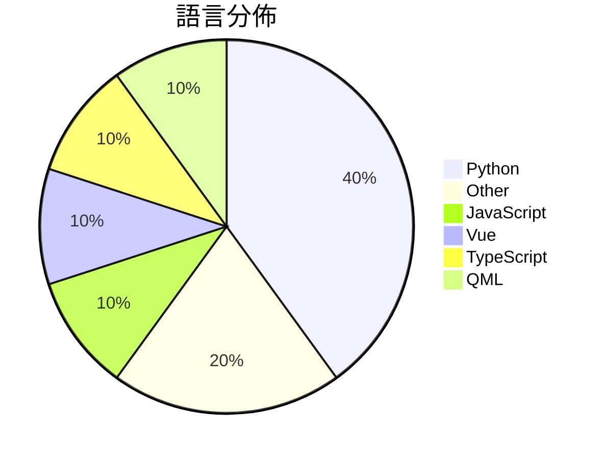

# GitHub Trending - 2026-07-03

> [!summary] 本日摘要
> 收錄 **10** 個新專案，合計 **13.4k** stars
> 語言分佈：Python (4) · Other (2) · JavaScript (1) · Vue (1) · TypeScript (1) · QML (1)

> [!tip] 本週焦點
> **[[deepseek-ai--DeepSpec|deepseek-ai/DeepSpec]]** — 6 天內累積 5.9k stars（983 stars/天）
> 提供一個完整的代碼庫來訓練和評估推測解碼算法。



---

## 收錄列表

| # | 專案 | 分類 | Stars | 速度 | 安裝 | 語言 | 用途 |
| :--: | --- | --- | ---: | ---: | --- | --- | --- |
| 1 | [[deepseek-ai--DeepSpec\|deepseek-ai/DeepSpec]] | AI/ML | 5.9k | 983/天 | `medium` | Python | 提供一個完整的代碼庫來訓練和評估推測解碼算法。 |
| 2 | [[Krishnagangwal--CS-Fundamentals\|Krishnagangwal/CS-Fundamentals]] | 其他 | 1.4k | 361/天 | `easy` | N/A | 提供計算機科學基礎知識的精選資源，幫助求職準備。 |
| 3 | [[mekos2772--ios-location-spoofer\|mekos2772/ios-location-spoofer]] | 其他 | 1.1k | 574/天 | `easy` | JavaScript | 無需越獄即可偽造 iOS GPS 位置的獨立應用程式。 |
| 4 | [[yynxxxxx--Codex-5.5-codex-instruct-5.5\|yynxxxxx/Codex-5.5-codex-instruct-5.5]] | 其他 | 1.1k | 282/天 | `easy` | Python | 提供一鍵注入無限制模式的 GPT-5.5 Codex CLI 破甲工具。 |
| 5 | [[Kulaxyz--self-learning-skills\|Kulaxyz/self-learning-skills]] | 開發工具 | 902 | 226/天 | `easy` | N/A | 讓 AI 編碼代理自動記錄和重用成功的工作流程，避免重複學習。 |
| 6 | [[TianhangZhuzth--Fundamental-Ava\|TianhangZhuzth/Fundamental-Ava]] | AI/ML | 756 | 252/天 | `medium` | Python | 建立自主、協作和社交智能的數位人類代理。 |
| 7 | [[aquace--CVE-2026-41940-PoC\|aquace/CVE-2026-41940-PoC]] | 安全 | 572 | 143/天 | `easy` | Python | 提供 CVE-2026-41940 漏洞的驗證繞過工具，讓攻擊者無需憑證即可獲得 |
| 8 | [[tryOpenRAM--OpenRAM\|tryOpenRAM/OpenRAM]] | 基礎設施 | 566 | 94/天 | `medium` | Vue | 提供一個無需帳號的 AI 計算市場，讓用戶可以透過 SOL 租用 GPU 和訪問 |
| 9 | [[CopilotKit--OpenTag\|CopilotKit/OpenTag]] | 開發工具 | 521 | 74/天 | `medium` | TypeScript | 讓使用者在 Slack 中自架 AI 代理，無需擔心使用費用或鎖定問題。 |
| 10 | [[diinki--linux-antiquity\|diinki/linux-antiquity]] | 其他 | 505 | 101/天 | `medium` | QML | 提供一個藝術風格的 Linux 主題，靈感來自於藝術新風格和古老的天文、科學及神 |

---

## 重點摘要

### 1. [[deepseek-ai--DeepSpec|deepseek-ai/DeepSpec]] `AI/ML`

> 提供一個完整的代碼庫來訓練和評估推測解碼算法。

**5.9k** stars · **983** stars/天 · Python · `medium`

_建立 6 天就累積 5895 stars（983/天），forks 482（8.2%），顯示出強勁的增長潛力。這個專案的主要貢獻者 Hannibal046 和 DaoyuanLi2816 在開源社群中有一定的知名度，之前的專案也涉及到類似的推測解碼技術。DeepSpec 解決了推測解碼算法訓練和評估過程中的繁瑣問題，提供了一個整合的解決方案，這在以往的工具中並不常見。近期的推廣活動和社群的討論也促進了其曝光度。高比例的 forks/stars 代表許多開發者在實際修改和使用這個工具，顯示出其實用性和需求。_

---

### 2. [[Krishnagangwal--CS-Fundamentals|Krishnagangwal/CS-Fundamentals]] `其他`

> 提供計算機科學基礎知識的精選資源，幫助求職準備。

**1.4k** stars · **361** stars/天 · N/A · `easy`

_建立 4 天內累積 1444 stars（361/天），forks 120（8.3%），顯示出相對高的興趣和活躍度。作者 Krishnagangwal 專注於求職準備，這個專案解決了求職者在面試準備時缺乏系統性資源的痛點，之前的解決方案往往是零散的資料或不夠全面的題庫。雖然沒有明確的觸發事件，但社群對於求職準備資源的需求持續增長。這個工具的可行性得益於數位學習資源的普及，並且在求職市場中，對於計算機科學基礎的掌握越來越受到重視。forks/stars 比率為 8.3%，顯示出相對較高的實際使用意圖。_

---

### 3. [[mekos2772--ios-location-spoofer|mekos2772/ios-location-spoofer]] `其他`

> 無需越獄即可偽造 iOS GPS 位置的獨立應用程式。

**1.1k** stars · **574** stars/天 · JavaScript · `easy`

_建立 2 天就累積 1148 stars（574/天），forks 164（14.3%），這顯示出強烈的用戶需求。作者 mekos2772 之前在開源社區有過其他貢獻，這次專案解決了 iOS 用戶在不越獄的情況下偽造 GPS 的痛點，之前的解決方案往往需要複雜的設置或不支持多平台。這個工具的推出正好填補了這一空白，並且在社群中引起了廣泛的討論和實測反饋。技術上，這個專案的成功也得益於 JavaScript 的跨平台特性，使得它能夠在多個代理工具中運行，這在之前的解決方案中並不常見。forks/stars 比率為 14.3%，顯示出許多用戶在實際修改和使用這個工具。_

---

### 4. [[yynxxxxx--Codex-5.5-codex-instruct-5.5|yynxxxxx/Codex-5.5-codex-instruct-5.5]] `其他`

> 提供一鍵注入無限制模式的 GPT-5.5 Codex CLI 破甲工具。

**1.1k** stars · **282** stars/天 · Python · `easy`

_建立 4 天就累積 1127 stars（282/天），forks 341（30.3%），這顯示出其在社群中的活躍度。作者 yynxxxxx 似乎專注於開發與 AI 相關的工具，這個專案解決了 GPT-5.5 的內容安全限制問題，讓開發者能夠更自由地使用 Codex。這樣的需求在安全研究和開發領域中是相當迫切的，特別是在需要進行滲透測試的情境下。社群的反應也表明了這個工具的實用性，特別是對於那些需要無限制功能的開發者。這個工具的出現，正好滿足了這一需求，並且其簡單的使用方式也吸引了大量的使用者。forks/stars 比率高達 30.3%，顯示出使用者對這個工具的實際修改和使用意圖。_

---

### 5. [[Kulaxyz--self-learning-skills|Kulaxyz/self-learning-skills]] `開發工具`

> 讓 AI 編碼代理自動記錄和重用成功的工作流程，避免重複學習。

**902** stars · **226** stars/天 · N/A · `easy`

_建立 4 天內累積 902 stars（226/天），forks 15（1.7%），顯示出穩定的增長潛力。作者 Kulaxyz 在 AI 代理領域有一定的經驗，這個專案解決了 AI 在重複任務中無法持續學習的痛點，之前的解決方案往往無法有效記錄失敗的經驗。近期的社群討論和需求增加也推動了這個專案的曝光率。技術上，這個工具利用了 Agent Skills 標準，讓它能夠與多種 AI 工具兼容，這是其受歡迎的原因之一。forks/stars 比率偏低，顯示出目前使用者對這個工具的實際修改需求不高，可能是因為它的功能已經能夠滿足大部分需求。_

---

### 6. [[TianhangZhuzth--Fundamental-Ava|TianhangZhuzth/Fundamental-Ava]] `AI/ML`

> 建立自主、協作和社交智能的數位人類代理。

**756** stars · **252** stars/天 · Python · `medium`

_建立 3 天內累積 756 stars（252/天），forks 78（10.3%），這顯示出相對活躍的開發者關注。作者 TianhangZhuzth 來自 Fundamental Research Labs，專注於數位人類的研究，之前的工作為這個專案奠定了基礎。這個專案解決了傳統多代理系統在擴展性和社會行為分析上的不足，提供了一個可擴展的框架來進行大規模的代理模擬。社群的活躍度和開發者的背景都為這個專案的成功提供了支持。_

---

### 7. [[aquace--CVE-2026-41940-PoC|aquace/CVE-2026-41940-PoC]] `安全`

> 提供 CVE-2026-41940 漏洞的驗證繞過工具，讓攻擊者無需憑證即可獲得 WHM 根級別訪問權限。

**572** stars · **143** stars/天 · Python · `easy`

_建立 4 天內累積 572 stars（143/天），forks 13（2.3%），顯示出相對活躍的關注度。作者 aquace 在安全領域有一定的經驗，這個工具解決了 cPanel 中存在的身份驗證繞過問題，之前的解決方案往往需要複雜的配置或無法針對特定漏洞。此工具的出現正好填補了這一空白。社群的反應也顯示出對這個工具的需求，尤其是在安全測試和漏洞研究領域。_

---

### 8. [[tryOpenRAM--OpenRAM|tryOpenRAM/OpenRAM]] `基礎設施`

> 提供一個無需帳號的 AI 計算市場，讓用戶可以透過 SOL 租用 GPU 和訪問多種 AI 模型。

**566** stars · **94** stars/天 · Vue · `medium`

_建立 6 天就累積 566 stars（94/天），forks 3（0.5%），顯示出穩定的增長潛力。這個專案的創始人 Simon He 之前在 AI 和區塊鏈領域有過豐富的經驗，解決了傳統 GPU 租用過程中的繁瑣和高門檻問題。之前，使用者通常需要面對多個供應商的帳號管理和支付流程，而 Open RAM 則透過區塊鏈技術簡化了這一過程。社群的反應熱烈，且目前沒有明顯的競爭對手，這使得它在市場中獲得了良好的曝光。_

---

### 9. [[CopilotKit--OpenTag|CopilotKit/OpenTag]] `開發工具`

> 讓使用者在 Slack 中自架 AI 代理，無需擔心使用費用或鎖定問題。

**521** stars · **74** stars/天 · TypeScript · `medium`

_建立 7 天內累積 521 stars（74/天），forks 63（12.1%），顯示出相對活躍的社群反應。作者是 CopilotKit 團隊，過去已經開發了多個相關的開源工具，這使得 OpenTag 能夠快速吸引使用者。這個專案解決了使用商業 AI 代理的高成本和鎖定問題，讓用戶能夠自架自己的解決方案。最近的推文和社群討論也增加了其曝光率，尤其是在 Slack 和 Discord 的開發者社群中。技術上，開源的趨勢和自我托管的需求也讓這個工具的可行性大大提升。forks/stars 比率為 12.1%，顯示出許多開發者對其進行實際修改和使用的意願。_

---

### 10. [[diinki--linux-antiquity|diinki/linux-antiquity]] `其他`

> 提供一個藝術風格的 Linux 主題，靈感來自於藝術新風格和古老的天文、科學及神話插圖。

**505** stars · **101** stars/天 · QML · `medium`

_建立 5 天內累積 505 stars（101/天），forks 10（2.0%），顯示出一定的關注度。作者 diinki 似乎專注於藝術風格的桌面主題，解決了市場上缺乏美學主題的痛點。這個專案的推出可能受到社群對於個性化桌面環境需求的驅動。forks/stars 比率低，顯示出使用者對於這個主題的實際修改意願不高，可能是因為它仍處於早期開發階段。_

---

## 今日到期複習

> [!tip] 根據間隔複習排程，今天該回顧的專案

```dataview
TABLE
  stars_per_day AS "Stars/天",
  category AS "分類",
  engagement AS "參與度"
FROM "Repos"
WHERE next_review AND date(next_review) <= date("2026-07-03") AND status != "archived"
SORT priority DESC
```

## 待處理

```dataviewjs
const pending = dv.pages('"Repos"').where(p => p.status === "to-review").length;
const unrated = dv.pages('"Repos"').where(p => p.status !== "archived" && p.status !== "to-review" && (p.my_rating || 0) === 0).length;
const noVerdict = dv.pages('"Repos"').where(p => p.status !== "archived" && (p.my_rating || 0) > 0 && (!p.verdict || p.verdict === "")).length;
const items = [];
if (pending > 0) items.push(`**${pending}** 個待分流`);
if (unrated > 0) items.push(`**${unrated}** 個已讀但未評分`);
if (noVerdict > 0) items.push(`**${noVerdict}** 個已評分但無結論`);
if (items.length > 0) dv.paragraph(items.join(" / "));
else dv.paragraph("所有專案都已處理完畢！");
```
