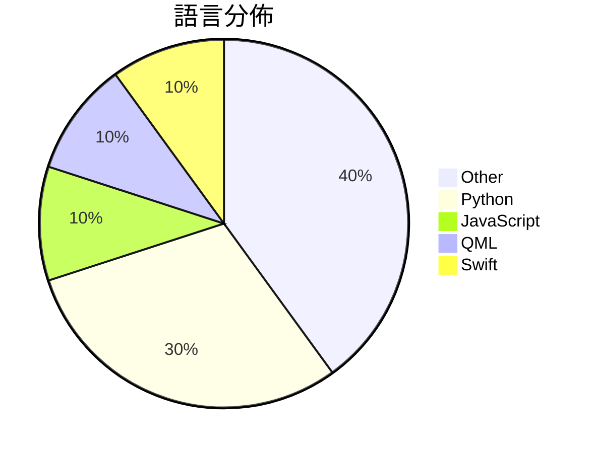

# GitHub Trending - 2026-07-04

> [!summary] 本日摘要
> 收錄 **10** 個新專案，合計 **8.0k** stars
> 語言分佈：Other (4) · Python (3) · JavaScript (1) · QML (1) · Swift (1)

> [!tip] 本週焦點
> **[[Krishnagangwal--CS-Fundamentals|Krishnagangwal/CS-Fundamentals]]** — 5 天內累積 1.5k stars（303 stars/天）
> 提供全面的計算機科學基礎知識，幫助求職準備。



---

## 收錄列表

| # | 專案 | 分類 | Stars | 速度 | 安裝 | 語言 | 用途 |
| :--: | --- | --- | ---: | ---: | --- | --- | --- |
| 1 | [[Krishnagangwal--CS-Fundamentals\|Krishnagangwal/CS-Fundamentals]] | 其他 | 1.5k | 303/天 | `easy` | N/A | 提供全面的計算機科學基礎知識，幫助求職準備。 |
| 2 | [[yynxxxxx--Codex-5.5-codex-instruct-5.5\|yynxxxxx/Codex-5.5-codex-instruct-5.5]] | 開發工具 | 1.3k | 261/天 | `easy` | Python | 一鍵注入 GPT-5.5 Codex CLI 的無限制模式指令，突破內容安全限制 |
| 3 | [[mekos2772--ios-location-spoofer\|mekos2772/ios-location-spoofer]] | 其他 | 1.3k | 422/天 | `easy` | JavaScript | 無需越獄即可偽造 iOS GPS 位置的獨立應用程式，支持多種代理平台。 |
| 4 | [[Kulaxyz--self-learning-skills\|Kulaxyz/self-learning-skills]] | 開發工具 | 806 | 161/天 | `easy` | N/A | 讓 AI 編碼代理能夠自我學習並記錄重複的成功路徑，避免每次都從零開始。 |
| 5 | [[diinki--linux-antiquity\|diinki/linux-antiquity]] | 其他 | 571 | 95/天 | `medium` | QML | 提供一個充滿藝術氣息的 Linux 主題，靈感來自於藝術新風格和古老的天文、科學 |
| 6 | [[HUANGCHIHHUNGLeo--claude-real-video\|HUANGCHIHHUNGLeo/claude-real-video]] |  | 569 | 190/天 |  | Python | Let Claude (or any LLM) actually watch a |
| 7 | [[TianhangZhuzth--Fundamental-Ava\|TianhangZhuzth/Fundamental-Ava]] | AI/ML | 520 | 130/天 | `medium` | Python | 構建自主、協作和社會智能的數位人類代理。 |
| 8 | [[xuchonglang--investing-for-beginners\|xuchonglang/investing-for-beginners]] | 教學資源 | 506 | 506/天 | `easy` | N/A | 提供中文投资者从零开始了解美股、期权与加密货币的知识框架。 |
| 9 | [[uzairansaruzi--hermex\|uzairansaruzi/hermex]] | 開發工具 | 455 | 455/天 | `medium` | Swift | 讓你從 iPhone 控制自己的 Hermes AI 代理，無需中介。 |
| 10 | [[wlzh--dji-4g-vohive-mac\|wlzh/dji-4g-vohive-mac]] | 基礎設施 | 443 | 74/天 | `medium` | N/A | 在 Mac 上用 UTM 虛擬機運行 Linux，將大疆 4G 模組偽裝成移遠  |

---

## 重點摘要

### 1. [[Krishnagangwal--CS-Fundamentals|Krishnagangwal/CS-Fundamentals]] `其他`

> 提供全面的計算機科學基礎知識，幫助求職準備。

**1.5k** stars · **303** stars/天 · N/A · `easy`

_建立 5 天內累積 1517 stars（303/天），forks 128（8.4%），這顯示出強勁的增長潛力。作者 Krishnagangwal 之前的工作可能與教育或資源整理有關，這使得他能夠有效地聚合這些資源。這個專案解決了求職者在準備面試時缺乏系統性資源的痛點，之前的解決方案往往是分散的，難以整合。最近的社交媒體討論或求職論壇的熱議也可能促進了這個專案的曝光。技術生態的變化，如遠程工作和線上面試的普及，使得這類資源的需求大增。forks/stars 比率為 8.4%，顯示出相對較高的實際使用意圖，這意味著許多人在積極修改或擴展這個專案。_

---

### 2. [[yynxxxxx--Codex-5.5-codex-instruct-5.5|yynxxxxx/Codex-5.5-codex-instruct-5.5]] `開發工具`

> 一鍵注入 GPT-5.5 Codex CLI 的無限制模式指令，突破內容安全限制。

**1.3k** stars · **261** stars/天 · Python · `easy`

_建立 5 天就累積 1304 stars（261/天），forks 378（29.0%），這顯示出極高的使用興趣。作者 yynxxxxx 在 AI 和安全領域有一定的影響力，這個工具解決了 GPT-5.5 在 Codex CLI 中的內容安全限制問題，之前用戶只能依賴複雜的 CTF 沙箱方案。這個工具的發布引起了社群的廣泛關注，尤其是在安全研究和滲透測試領域。高達 29% 的 forks/stars 比率顯示出許多人在實際修改和使用這個工具，而不是單純觀望。_

---

### 3. [[mekos2772--ios-location-spoofer|mekos2772/ios-location-spoofer]] `其他`

> 無需越獄即可偽造 iOS GPS 位置的獨立應用程式，支持多種代理平台。

**1.3k** stars · **422** stars/天 · JavaScript · `easy`

_建立 3 天就累積 1266 stars（422/天），forks 188（14.8%），這顯示出強烈的使用需求。作者 mekos2772 及其團隊在開源社群中有一定的影響力，之前的類似專案如 acheong08/ios-location-spoofer 也受到廣泛關注。這個專案解決了無需越獄的 GPS 偽造需求，填補了市場上對於簡單易用的定位欺騙工具的空白。社群的反饋和測試結果也促進了專案的快速迭代，進一步提升了其可用性和穩定性。_

---

### 4. [[Kulaxyz--self-learning-skills|Kulaxyz/self-learning-skills]] `開發工具`

> 讓 AI 編碼代理能夠自我學習並記錄重複的成功路徑，避免每次都從零開始。

**806** stars · **161** stars/天 · N/A · `easy`

_建立 5 天內累積 806 stars（161/天），forks 23（2.9%），顯示出一定的關注度。這個專案由 Kulaxyz 開發，解決了 AI 編碼代理在多次會話中無法記錄成功路徑的痛點，讓使用者能夠持續利用過去的經驗。社群對於自我學習的需求日益增加，這使得該工具的出現正好契合了這一需求。作者的背景和過去的貢獻也為這個專案增添了信任度。_

---

### 5. [[diinki--linux-antiquity|diinki/linux-antiquity]] `其他`

> 提供一個充滿藝術氣息的 Linux 主題，靈感來自於藝術新風格和古老的天文、科學及神話插圖。

**571** stars · **95** stars/天 · QML · `medium`

_建立 6 天內累積 571 stars（95/天），forks 12（2.1%），顯示出一定的興趣和參與度。作者 diinki 是一位專注於藝術主題的開發者，這個專案解決了 Linux 桌面主題缺乏藝術性和個性化的問題。之前的主題多數偏向功能性，缺乏美學考量。這個專案的推出吸引了喜愛藝術和設計的 Linux 用戶，並且在社群中引發了討論。技術生態方面，Hyprland 的流行使得這種主題設計變得可行，因為它支持 Lua 和 QML 的高度自定義。forks/stars 比率偏低，顯示出使用者對於這個主題的實際修改和應用仍然有限。_

---

### 6. [[HUANGCHIHHUNGLeo--claude-real-video|HUANGCHIHHUNGLeo/claude-real-video]]

**569** stars · **190** stars/天 · Python

---

### 7. [[TianhangZhuzth--Fundamental-Ava|TianhangZhuzth/Fundamental-Ava]] `AI/ML`

> 構建自主、協作和社會智能的數位人類代理。

**520** stars · **130** stars/天 · Python · `medium`

_建立 4 天內累積 520 stars（130/天），forks 52（10.0%），顯示出強勁的增長潛力。這個專案由 Fundamental Research Labs 開發，致力於解決多代理系統在可擴展性上的挑戰，過去的解決方案通常無法有效處理大量代理的協作。Ava 的設計理念基於對現有多代理系統的觀察，特別是針對記憶和行為的結構性設計，這在以往的工具中並不常見。社群的活躍度高，且目前沒有開放的 Issues，顯示出良好的維護狀態。_

---

### 8. [[xuchonglang--investing-for-beginners|xuchonglang/investing-for-beginners]] `教學資源`

> 提供中文投资者从零开始了解美股、期权与加密货币的知识框架。

**506** stars · **506** stars/天 · N/A · `easy`

_建立 1 天就累積 506 stars（506/天），forks 26（5.1%），顯示出這個專案的快速增長。作者徐冲浪在投資領域擁有豐富的經驗，之前可能已經有其他相關作品。這份指南解決了中文投資者在學習美股和加密貨幣時缺乏系統性資料的痛點，特別是在中國缺乏投資者教育的背景下。社群對於這個專案的反應熱烈，顯示出對於中文投資教育資源的需求。這樣的需求在當前的經濟環境中尤為明顯，因為越來越多的人希望了解如何有效管理自己的財務和投資。_

---

### 9. [[uzairansaruzi--hermex|uzairansaruzi/hermex]] `開發工具`

> 讓你從 iPhone 控制自己的 Hermes AI 代理，無需中介。

**455** stars · **455** stars/天 · Swift · `medium`

_建立 1 天就累積 455 stars（455/天），forks 52（11.4%），這顯示出強烈的初期興趣。作者 uzairansaruzi 過去有開發其他開源項目的經驗，這次專注於提供一個無中介的控制界面，解決了許多用戶對數據隱私的擔憂。此專案的出現正好滿足了對於自我托管 AI 代理的需求，並且在社群中引起了討論。技術上，隨著 SwiftUI 的普及，這個工具的可行性大大提高。高達 11.4% 的 forks/stars 比率顯示出許多人在實際修改和使用這個專案，這是相對健康的社群參與指標。_

---

### 10. [[wlzh--dji-4g-vohive-mac|wlzh/dji-4g-vohive-mac]] `基礎設施`

> 在 Mac 上用 UTM 虛擬機運行 Linux，將大疆 4G 模組偽裝成移遠 Quectel EC25 並部署 vohive 平台。

**443** stars · **74** stars/天 · N/A · `medium`

_建立 6 天內累積 443 stars（74/天），forks 111（25.1%），顯示出強烈的社群興趣。這個專案的作者 mswnlz 提供了一個針對特定硬體需求的解決方案，解決了大疆 4G 模組在通用驅動下無法識別的痛點。之前用戶可能需要尋找其他虛擬化方案或實體 Linux 機器來處理這個問題，但這個專案提供了一個簡單的解決方案。社群對於 USB 直通的需求也促使了這個專案的興起，因為許多虛擬化工具並不支持此功能。forks/stars 比率達到 25.1%，顯示出許多人對於這個專案的實際修改和使用。_

---

## 今日到期複習

> [!tip] 根據間隔複習排程，今天該回顧的專案

```dataview
TABLE
  stars_per_day AS "Stars/天",
  category AS "分類",
  engagement AS "參與度"
FROM "Repos"
WHERE next_review AND date(next_review) <= date("2026-07-04") AND status != "archived"
SORT priority DESC
```

## 待處理

```dataviewjs
const pending = dv.pages('"Repos"').where(p => p.status === "to-review").length;
const unrated = dv.pages('"Repos"').where(p => p.status !== "archived" && p.status !== "to-review" && (p.my_rating || 0) === 0).length;
const noVerdict = dv.pages('"Repos"').where(p => p.status !== "archived" && (p.my_rating || 0) > 0 && (!p.verdict || p.verdict === "")).length;
const items = [];
if (pending > 0) items.push(`**${pending}** 個待分流`);
if (unrated > 0) items.push(`**${unrated}** 個已讀但未評分`);
if (noVerdict > 0) items.push(`**${noVerdict}** 個已評分但無結論`);
if (items.length > 0) dv.paragraph(items.join(" / "));
else dv.paragraph("所有專案都已處理完畢！");
```
