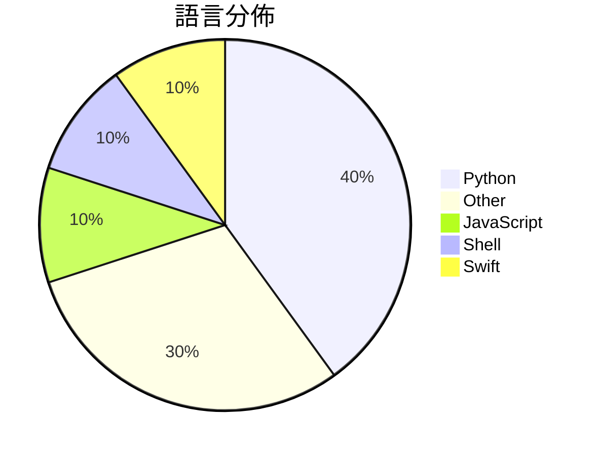

# GitHub Trending - 2026-07-05

> [!summary] 本日摘要
> 收錄 **10** 個新專案，合計 **9.0k** stars
> 語言分佈：Python (4) · Other (3) · JavaScript (1) · Shell (1) · Swift (1)

> [!tip] 本週焦點
> **[[Krishnagangwal--CS-Fundamentals|Krishnagangwal/CS-Fundamentals]]** — 6 天內累積 1.6k stars（264 stars/天）
> 提供全面的計算機科學基礎知識，幫助求職準備。



---

## 收錄列表

| # | 專案 | 分類 | Stars | 速度 | 安裝 | 語言 | 用途 |
| :--: | --- | --- | ---: | ---: | --- | --- | --- |
| 1 | [[Krishnagangwal--CS-Fundamentals\|Krishnagangwal/CS-Fundamentals]] | 教學資源 | 1.6k | 264/天 | `easy` | N/A | 提供全面的計算機科學基礎知識，幫助求職準備。 |
| 2 | [[yynxxxxx--Codex-5.5-codex-instruct-5.5\|yynxxxxx/Codex-5.5-codex-instruct-5.5]] | 其他 | 1.4k | 230/天 | `easy` | Python | 提供一鍵注入無限制模式的 GPT-5.5 Codex CLI 工具。 |
| 3 | [[mekos2772--ios-location-spoofer\|mekos2772/ios-location-spoofer]] | 其他 | 1.3k | 323/天 | `easy` | JavaScript | 無需越獄即可偽造 iOS GPS 位置的獨立應用程式。 |
| 4 | [[Kulaxyz--self-learning-skills\|Kulaxyz/self-learning-skills]] | 開發工具 | 827 | 138/天 | `easy` | N/A | 讓 AI 編碼代理學會自我改善技能，捕捉並重用過去的成功經驗。 |
| 5 | [[jamesob--local-llm\|jamesob/local-llm]] | AI/ML | 785 | 785/天 | `medium` | Shell | 提供在本地運行最新 LLM 的硬體配置與操作指南。 |
| 6 | [[HUANGCHIHHUNGLeo--claude-real-video\|HUANGCHIHHUNGLeo/claude-real-video]] | 開發工具 | 768 | 192/天 | `medium` | Python | 讓 Claude（或任何 LLM）實際觀看視頻，提供場景感知、去重幀和轉錄功能， |
| 7 | [[xuchonglang--investing-for-beginners\|xuchonglang/investing-for-beginners]] | 其他 | 665 | 333/天 | `easy` | N/A | 提供中文投资者从零开始学习美股、期权与加密货币的知识框架。 |
| 8 | [[jmerelnyc--Talos\|jmerelnyc/Talos]] | AI/ML | 601 | 301/天 | `easy` | Python | 讓你分享 GPU 資源並透過 Talos 網絡賺取收益。 |
| 9 | [[uzairansaruzi--hermex\|uzairansaruzi/hermex]] | 開發工具 | 562 | 281/天 | `medium` | Swift | 讓你的 iPhone 成為控制自架 Hermes agent 的工具。 |
| 10 | [[TianhangZhuzth--Fundamental-Ava\|TianhangZhuzth/Fundamental-Ava]] | AI/ML | 523 | 105/天 | `medium` | Python | 構建數位人類——自主、協作且具社交智能的代理。 |

---

## 重點摘要

### 1. [[Krishnagangwal--CS-Fundamentals|Krishnagangwal/CS-Fundamentals]] `教學資源`

> 提供全面的計算機科學基礎知識，幫助求職準備。

**1.6k** stars · **264** stars/天 · N/A · `easy`

_建立 6 天就累積 1586 stars（264/天），forks 137（8.6%），顯示出穩定的增長潛力。作者 Krishnagangwal 之前在計算機科學領域有豐富的經驗，這個專案解決了求職者在準備面試時資料分散的問題，提供一個集中化的資源庫。這樣的整合性在其他資源中並不常見，特別是針對特定主題的深度資料。社群的活躍度也表現在沒有開放的問題，顯示出良好的維護狀態。這個專案的成功可能與社交媒體上的推薦有關，吸引了許多學生和求職者的注意。_

---

### 2. [[yynxxxxx--Codex-5.5-codex-instruct-5.5|yynxxxxx/Codex-5.5-codex-instruct-5.5]] `其他`

> 提供一鍵注入無限制模式的 GPT-5.5 Codex CLI 工具。

**1.4k** stars · **230** stars/天 · Python · `easy`

_建立 6 天內累積 1382 stars（230/天），forks 392（28.4%），顯示出強烈的社群關注。作者 yynxxxxx 在開源社群中有一定的影響力，並且這個工具解決了 GPT-5.5 使用中的內容限制問題，之前的解決方案如 CTF 沙箱並不夠直接和有效。這個工具的出現正好滿足了開發者對於無限制使用 GPT-5.5 的需求，並且在社群中引發了廣泛討論。技術上，這個工具利用了 Codex 的配置機制，這在之前的版本中並未被充分利用，讓這個工具的可行性大幅提升。_

---

### 3. [[mekos2772--ios-location-spoofer|mekos2772/ios-location-spoofer]] `其他`

> 無需越獄即可偽造 iOS GPS 位置的獨立應用程式。

**1.3k** stars · **323** stars/天 · JavaScript · `easy`

_建立 4 天內累積 1291 stars（323/天），forks 192（14.9%），這顯示出強烈的用戶興趣。作者 mekos2772 及其團隊在開源社群中有一定的影響力，之前的專案也獲得了良好的反響。這個專案解決了無需越獄的 GPS 偽造需求，之前的方案多數需要較高的技術門檻或不夠靈活。最近的社交媒體討論和技術論壇的分享也促進了這個專案的曝光。隨著 iOS 安全性提升，這類工具的需求也隨之上升，特別是在開發和測試領域。forks/stars 比率達到 14.9%，顯示出許多用戶在實際修改和使用這個工具。_

---

### 4. [[Kulaxyz--self-learning-skills|Kulaxyz/self-learning-skills]] `開發工具`

> 讓 AI 編碼代理學會自我改善技能，捕捉並重用過去的成功經驗。

**827** stars · **138** stars/天 · N/A · `easy`

_建立 6 天就累積 827 stars（138/天），forks 24（2.9%），顯示出穩定的增長潛力。作者 Kulaxyz 在 AI 編碼領域有一定的背景，這個專案解決了以往 AI 代理在重複任務中無法記錄學習的痛點。之前的解決方案往往無法有效捕捉過程中的學習，導致每次都要從頭開始。這個專案的出現填補了這一空白，並且在社群中引起了討論，進一步推動了其流行。這個工具的設計理念與現今 AI 代理的需求相契合，讓使用者能夠更高效地利用 AI 進行編碼工作。_

---

### 5. [[jamesob--local-llm|jamesob/local-llm]] `AI/ML`

> 提供在本地運行最新 LLM 的硬體配置與操作指南。

**785** stars · **785** stars/天 · Shell · `medium`

_建立 1 天就累積 785 stars（785/天），forks 37（4.7%），這顯示出用戶對於在本地運行 LLM 的需求。作者 jamesob 在硬體配置和 LLM 運行方面有豐富的經驗，這個專案解決了許多用戶在本地運行大型模型時的配置困難。隨著對於 AI 模型本地運行的關注增加，這個專案提供了一個具體的解決方案。社群的反饋和需求也促進了這個專案的快速成長。_

---

### 6. [[HUANGCHIHHUNGLeo--claude-real-video|HUANGCHIHHUNGLeo/claude-real-video]] `開發工具`

> 讓 Claude（或任何 LLM）實際觀看視頻，提供場景感知、去重幀和轉錄功能，支持 URL 或本地文件。

**768** stars · **192** stars/天 · Python · `medium`

_建立 4 天就累積 768 stars（192/天），forks 38（4.9%），這顯示出相對穩定的關注度。作者 HUANGCHIHHUNGLeo 之前有相關的開源經驗，這個專案解決了 LLM 在處理視頻時的痛點，特別是固定間隔取樣導致的幀丟失問題。這個工具的出現是因為現有的視頻分析工具大多數無法有效提取關鍵幀，尤其是在快速剪接的視頻中。這個專案的設計使得 LLM 能夠更好地理解視頻內容，並且所有處理都在本地進行，這對於隱私保護來說是個加分項。forks/stars 比率為 4.9%，顯示出有一定的實際使用需求。_

---

### 7. [[xuchonglang--investing-for-beginners|xuchonglang/investing-for-beginners]] `其他`

> 提供中文投资者从零开始学习美股、期权与加密货币的知识框架。

**665** stars · **333** stars/天 · N/A · `easy`

_建立 2 天就累積 665 stars（332.5/天），forks 36（5.4%），這顯示出該專案受到廣泛關注。作者徐冲浪在投資領域有豐富的經驗，這份指南解決了許多普通人面對投資時缺乏知識的痛點。之前，許多投資者只能依賴不可靠的資訊來源，這份指南提供了結構化的學習資源。近期的社交媒體討論和投資教育需求的增加也促進了這個專案的流行。這個工具的成功也反映了對於中文投資教育資源的迫切需求，尤其是在加密貨幣和美股市場的興起下。forks/stars 比率顯示出使用者對這個專案的實際修改和使用意願。_

---

### 8. [[jmerelnyc--Talos|jmerelnyc/Talos]] `AI/ML`

> 讓你分享 GPU 資源並透過 Talos 網絡賺取收益。

**601** stars · **301** stars/天 · Python · `easy`

_建立 2 天就累積 601 stars（300.5/天），forks 12（2.0%），這顯示出初期的穩定增長。作者 jmerelnyc 是一位專注於 AI 和分散式計算的開發者，這個專案解決了 GPU 資源共享的痛點，讓用戶能夠輕鬆地將閒置的 GPU 資源轉化為收益。這個工具的出現正好符合當前對於高效能計算資源的需求，尤其是在 AI 模型推論方面。由於 Talos 直接與 Ollama 整合，這使得用戶能夠快速上手並開始使用。forks/stars 比率為 2.0%，顯示出用戶對於這個專案的興趣，但仍有許多用戶在觀望階段。_

---

### 9. [[uzairansaruzi--hermex|uzairansaruzi/hermex]] `開發工具`

> 讓你的 iPhone 成為控制自架 Hermes agent 的工具。

**562** stars · **281** stars/天 · Swift · `medium`

_建立 2 天內累積 562 stars（281/天），forks 56（10.0%），顯示出強勁的增長潛力。作者 uzairansaruzi 之前有開發過其他相關工具，這次的 Hermex 提供了一個更私密的解決方案，解決了許多用戶對於數據隱私的擔憂。這個工具的出現正好滿足了對於自架服務需求的上升，並且在社群中引起了討論，特別是在 Reddit 和 Hacker News 上。由於其獨特的設計和功能，吸引了許多對 AI agent 和自架服務感興趣的開發者。forks/stars 比率為 10.0%，顯示出有相當比例的用戶對此專案進行了實際修改和使用。_

---

### 10. [[TianhangZhuzth--Fundamental-Ava|TianhangZhuzth/Fundamental-Ava]] `AI/ML`

> 構建數位人類——自主、協作且具社交智能的代理。

**523** stars · **105** stars/天 · Python · `medium`

_建立 5 天內累積 523 stars（105/天），forks 53（10.1%），這顯示出強勁的增長潛力。作者 TianhangZhuzth 來自 Fundamental Research Labs，專注於數位人類的研究，這個專案解決了現有多代理系統在擴展性和記憶管理上的不足。先前的多代理系統通常無法有效處理大量代理的互動，而 Ava 的架構設計正好填補了這一空白。社群的活躍度也反映了對這一領域的需求，特別是在 AI 和多代理系統的研究中。這個專案的成功可能會吸引更多的研究者和開發者進一步探索數位人類的潛力。_

---

## 今日到期複習

> [!tip] 根據間隔複習排程，今天該回顧的專案

```dataview
TABLE
  stars_per_day AS "Stars/天",
  category AS "分類",
  engagement AS "參與度"
FROM "Repos"
WHERE next_review AND date(next_review) <= date("2026-07-05") AND status != "archived"
SORT priority DESC
```

## 待處理

```dataviewjs
const pending = dv.pages('"Repos"').where(p => p.status === "to-review").length;
const unrated = dv.pages('"Repos"').where(p => p.status !== "archived" && p.status !== "to-review" && (p.my_rating || 0) === 0).length;
const noVerdict = dv.pages('"Repos"').where(p => p.status !== "archived" && (p.my_rating || 0) > 0 && (!p.verdict || p.verdict === "")).length;
const items = [];
if (pending > 0) items.push(`**${pending}** 個待分流`);
if (unrated > 0) items.push(`**${unrated}** 個已讀但未評分`);
if (noVerdict > 0) items.push(`**${noVerdict}** 個已評分但無結論`);
if (items.length > 0) dv.paragraph(items.join(" / "));
else dv.paragraph("所有專案都已處理完畢！");
```
