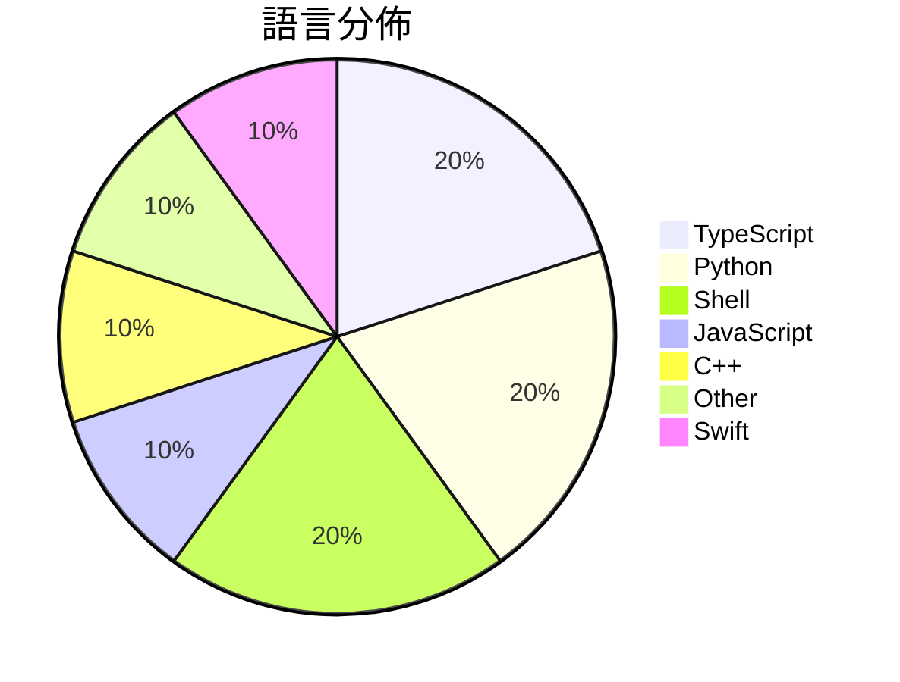

# GitHub Trending - 2026-07-06

> [!summary] 本日摘要
> 收錄 **10** 個新專案，合計 **9.1k** stars
> 語言分佈：TypeScript (2) · Python (2) · Shell (2) · JavaScript (1) · C++ (1) · Other (1) · Swift (1)

> [!tip] 本週焦點
> **[[elder-plinius--T3MP3ST|elder-plinius/T3MP3ST]]** — 3 天內累積 1.8k stars（611 stars/天）
> 一個自動化的紅隊平台，將 AI 編碼代理轉變為零日漏洞獵手。



---

## 收錄列表

| # | 專案 | 分類 | Stars | 速度 | 安裝 | 語言 | 用途 |
| :--: | --- | --- | ---: | ---: | --- | --- | --- |
| 1 | [[elder-plinius--T3MP3ST\|elder-plinius/T3MP3ST]] | 安全 | 1.8k | 611/天 | `easy` | TypeScript | 一個自動化的紅隊平台，將 AI 編碼代理轉變為零日漏洞獵手。 |
| 2 | [[mekos2772--ios-location-spoofer\|mekos2772/ios-location-spoofer]] | 其他 | 1.3k | 268/天 | `easy` | JavaScript | 無需越獄即可偽造 iOS GPS 位置的獨立應用程式。 |
| 3 | [[HUANGCHIHHUNGLeo--claude-real-video\|HUANGCHIHHUNGLeo/claude-real-video]] | 開發工具 | 1.0k | 206/天 | `medium` | Python | 讓 Claude（或任何 LLM）實際觀看視頻，提供場景感知、去重的幀和轉錄，支 |
| 4 | [[jamesob--local-llm\|jamesob/local-llm]] | 開發工具 | 934 | 467/天 | `medium` | Shell | 提供在本地運行最先進的 LLM 所需的硬體配置和 Docker 配置指南。 |
| 5 | [[ammaarreshi--Generals-Mac-iOS-iPad\|ammaarreshi/Generals-Mac-iOS-iPad]] | 遊戲 | 856 | 428/天 | `medium` | C++ | 讓 Command & Conquer Generals: Zero Hour  |
| 6 | [[xuchonglang--investing-for-beginners\|xuchonglang/investing-for-beginners]] | 教學資源 | 718 | 239/天 | `easy` | N/A | 提供中文投资者的美股、期权与加密货币知识框架，帮助初学者建立投资基础。 |
| 7 | [[jmerelnyc--Talos\|jmerelnyc/Talos]] | AI/ML | 683 | 228/天 | `easy` | Python | 讓用戶分享 GPU 資源並透過 Talos 網路賺取收入。 |
| 8 | [[uzairansaruzi--hermex\|uzairansaruzi/hermex]] | 開發工具 | 626 | 209/天 | `medium` | Swift | 讓你在 iPhone 上控制自己的 Hermes agent，無需中介。 |
| 9 | [[Kulaxyz--token-diet\|Kulaxyz/token-diet]] | 開發工具 | 590 | 295/天 | `easy` | Shell | 為編碼代理提供持續的 token 效率提升，平均降低 31% 的費用，且不損失正 |
| 10 | [[LinXiaoTao--FuckClaude\|LinXiaoTao/FuckClaude]] | 其他 | 536 | 179/天 | `easy` | TypeScript | 檢測你的瀏覽器環境是否會被 Claude 標記為中國用戶。 |

---

## 重點摘要

### 1. [[elder-plinius--T3MP3ST|elder-plinius/T3MP3ST]] `安全`

> 一個自動化的紅隊平台，將 AI 編碼代理轉變為零日漏洞獵手。

**1.8k** stars · **611** stars/天 · TypeScript · `easy`

_建立 3 天就累積 1834 stars（611/天），forks 456（24.9%），這顯示出極高的興趣和活躍度。這個專案的主要貢獻者包括多位在安全領域有經驗的開發者，解決了傳統紅隊工具需要高昂成本和複雜配置的痛點，讓更多人能夠進行安全測試。近期的社群討論和推廣活動也促進了這個專案的曝光度。由於 AI 技術的進步，使得這種自動化的紅隊工具成為可能，並且在現有的安全生態中找到了切入點。高達 24.9% 的 forks/stars 比率顯示出許多使用者正在實際修改和使用這個工具，這是其受歡迎的證據。_

---

### 2. [[mekos2772--ios-location-spoofer|mekos2772/ios-location-spoofer]] `其他`

> 無需越獄即可偽造 iOS GPS 位置的獨立應用程式。

**1.3k** stars · **268** stars/天 · JavaScript · `easy`

_建立 5 天就累積 1342 stars（268/天），forks 200（14.9%），這顯示出相當高的使用興趣。作者 mekos2772 之前在開源社群有過其他貢獻，這次專案解決了 iOS 用戶在不越獄的情況下偽造位置的需求，填補了市場上類似工具的空白。這個工具的出現正好符合了用戶對於隱私和位置偽裝的需求，並且在社群中引發了熱烈討論。相對於其他工具，這個專案的易用性和多平台支持使其更具吸引力。_

---

### 3. [[HUANGCHIHHUNGLeo--claude-real-video|HUANGCHIHHUNGLeo/claude-real-video]] `開發工具`

> 讓 Claude（或任何 LLM）實際觀看視頻，提供場景感知、去重的幀和轉錄，支援 URL 或本地文件。

**1.0k** stars · **206** stars/天 · Python · `medium`

_建立 5 天就累積 1029 stars（206/天），forks 62（6.0%），顯示出相對穩定的增長。作者 HUANGCHIHHUNGLeo 過去在開源社群中活躍，這個專案解決了 LLM 在處理視頻時的視覺理解問題，之前的方案往往只能依賴轉錄文本，無法捕捉視頻中的細節。這個工具的推出恰逢對視頻分析需求增加的時期，特別是在 AI 研究和開發中。forks/stars 比率顯示出使用者對這個工具的興趣，並且有不少人開始進行實際修改和使用。_

---

### 4. [[jamesob--local-llm|jamesob/local-llm]] `開發工具`

> 提供在本地運行最先進的 LLM 所需的硬體配置和 Docker 配置指南。

**934** stars · **467** stars/天 · Shell · `medium`

_建立 2 天內累積 934 stars（467/天），forks 54（5.8%），顯示出強烈的興趣和需求。作者 jamesob 在本地運行 LLM 的領域有豐富的經驗，這個專案解決了許多開發者在雲端運行 LLM 的高成本和性能瓶頸問題。特別是對於需要高性能計算的用戶，這個方案提供了一個可行的替代方案。社群的反應熱烈，顯示出對於本地運行 LLM 的需求正在上升。_

---

### 5. [[ammaarreshi--Generals-Mac-iOS-iPad|ammaarreshi/Generals-Mac-iOS-iPad]] `遊戲`

> 讓 Command & Conquer Generals: Zero Hour 在 macOS、iPhone 和 iPad 上原生運行，無需模擬。

**856** stars · **428** stars/天 · C++ · `medium`

_建立 2 天就累積 856 stars（428/天），forks 57（6.7%），這顯示出強烈的興趣。這個專案的主要貢獻者來自於多個開源社群，他們在遊戲移植方面有豐富的經驗。這個專案解決了在 iOS 上運行舊遊戲的痛點，因為過去的方案大多依賴於模擬器，導致性能不佳。近期的社交媒體討論和遊戲論壇的熱烈反應也促進了這個專案的曝光。隨著 Apple 硬體性能的提升，這樣的原生移植變得更加可行，並且能夠提供更好的遊戲體驗。forks/stars 比率為 6.7%，顯示出有相當一部分使用者在進行實際修改和使用。_

---

### 6. [[xuchonglang--investing-for-beginners|xuchonglang/investing-for-beginners]] `教學資源`

> 提供中文投资者的美股、期权与加密货币知识框架，帮助初学者建立投资基础。

**718** stars · **239** stars/天 · N/A · `easy`

_建立 3 天就累積 718 stars（239/天），forks 38（5.3%），顯示出穩定的增長趨勢。作者徐冲浪在投資教育領域有豐富的經驗，這份指南填補了中文市場對於投資知識的空白，特別是在美股和加密貨幣方面。沒有類似的高質量中文資源，讓許多初學者在尋找學習材料時感到困難。這份指南的推出正好滿足了這一需求，並且在社群中引起了廣泛的關注。作者的背景和對市場的深入理解，使得這份指南具有很高的實用性和參考價值。_

---

### 7. [[jmerelnyc--Talos|jmerelnyc/Talos]] `AI/ML`

> 讓用戶分享 GPU 資源並透過 Talos 網路賺取收入。

**683** stars · **228** stars/天 · Python · `easy`

_建立 3 天就累積 683 stars（228/天），forks 12（1.8%），這顯示出相對穩定的興趣增長。作者 jmerelnyc 是一位專注於 AI 和分散式計算的開發者，這個專案解決了用戶在閒置 GPU 資源的情況下如何獲得收益的痛點。之前用戶可能需要手動管理 GPU 資源，效率低下且難以獲得報酬。這個專案的出現使得用戶能夠輕鬆地將其 GPU 資源分享給需要的用戶，並獲得相應的收益。技術上，隨著 WebSocket 和 Ollama 的使用，這個工具能夠實現即時的任務分配和狀態更新，這在過去的解決方案中並不常見。forks/stars 比率低於 5% 代表目前使用者主要是觀望者，未來是否會有更多實際應用仍需觀察。_

---

### 8. [[uzairansaruzi--hermex|uzairansaruzi/hermex]] `開發工具`

> 讓你在 iPhone 上控制自己的 Hermes agent，無需中介。

**626** stars · **209** stars/天 · Swift · `medium`

_建立 3 天內累積 626 stars（209/天），forks 66（10.5%），顯示出穩定的增長潛力。作者 uzairansaruzi 之前有開發其他開源專案，這次專注於提供一個無中介的 AI agent 控制方案，解決了許多用戶對隱私和數據安全的擔憂。這個專案的推出引起了社群的注意，尤其是在自我託管和隱私保護日益重要的背景下。forks/stars 比率為 10.5%，表明許多用戶對這個專案有實際的修改需求，顯示出活躍的開發者社群。_

---

### 9. [[Kulaxyz--token-diet|Kulaxyz/token-diet]] `開發工具`

> 為編碼代理提供持續的 token 效率提升，平均降低 31% 的費用，且不損失正確性。

**590** stars · **295** stars/天 · Shell · `easy`

_建立 2 天就累積 590 stars（295/天），forks 1（0.2%），這顯示出穩定的增長潛力。作者 Kulaxyz 之前在開源社群有過多個貢獻，這個工具解決了編碼代理在高頻使用時的費用問題，之前的方案往往無法有效控制 token 消耗。近期的推廣活動和社群討論也可能促進了這個專案的曝光。技術上，這個工具的設計充分利用了 session hooks，這在過去的工具中並不常見，讓它能夠持續運行而不需要用戶干預。forks/stars 比率低於 5%，顯示目前使用者主要是觀望者，未來需要更多實際使用者的反饋來驗證其效果。_

---

### 10. [[LinXiaoTao--FuckClaude|LinXiaoTao/FuckClaude]] `其他`

> 檢測你的瀏覽器環境是否會被 Claude 標記為中國用戶。

**536** stars · **179** stars/天 · TypeScript · `easy`

_建立 3 天內累積 536 stars（179/天），forks 50（9.3%），顯示出良好的增長潛力。作者 LinXiaoTao 針對 Claude Code 的中國用戶識別問題提出了這個工具，解決了用戶在使用 Claude 時可能面臨的風險判定過高的問題。這個工具的出現正好填補了用戶對於隱私保護的需求，並且在社交媒體上引起了討論，特別是針對中國用戶的風險評估。其技術架構的選擇使得這個工具在性能和易用性上都有不錯的表現。_

---

## 今日到期複習

> [!tip] 根據間隔複習排程，今天該回顧的專案

```dataview
TABLE
  stars_per_day AS "Stars/天",
  category AS "分類",
  engagement AS "參與度"
FROM "Repos"
WHERE next_review AND date(next_review) <= date("2026-07-06") AND status != "archived"
SORT priority DESC
```

## 待處理

```dataviewjs
const pending = dv.pages('"Repos"').where(p => p.status === "to-review").length;
const unrated = dv.pages('"Repos"').where(p => p.status !== "archived" && p.status !== "to-review" && (p.my_rating || 0) === 0).length;
const noVerdict = dv.pages('"Repos"').where(p => p.status !== "archived" && (p.my_rating || 0) > 0 && (!p.verdict || p.verdict === "")).length;
const items = [];
if (pending > 0) items.push(`**${pending}** 個待分流`);
if (unrated > 0) items.push(`**${unrated}** 個已讀但未評分`);
if (noVerdict > 0) items.push(`**${noVerdict}** 個已評分但無結論`);
if (items.length > 0) dv.paragraph(items.join(" / "));
else dv.paragraph("所有專案都已處理完畢！");
```
