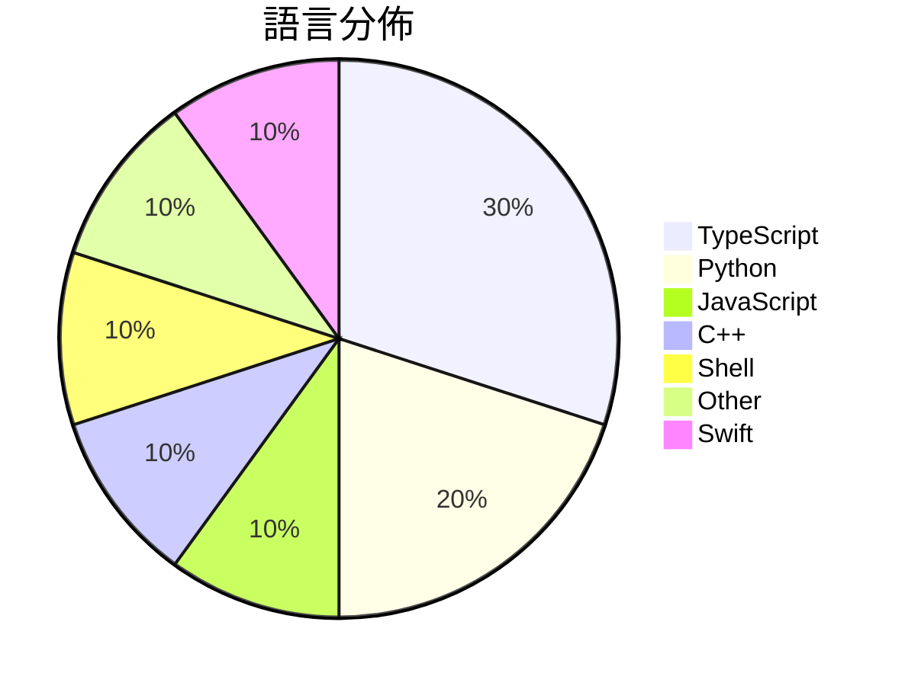

# GitHub Trending - 2026-07-07

> [!summary] 本日摘要
> 收錄 **10** 個新專案，合計 **11.3k** stars
> 語言分佈：TypeScript (3) · Python (2) · JavaScript (1) · C++ (1) · Shell (1) · Other (1) · Swift (1)

> [!tip] 本週焦點
> **[[elder-plinius--T3MP3ST|elder-plinius/T3MP3ST]]** — 4 天內累積 2.7k stars（682 stars/天）
> 提供一個自動化的紅隊平台，讓 AI 編碼代理成為零日漏洞獵手。



---

## 收錄列表

| # | 專案 | 分類 | Stars | 速度 | 安裝 | 語言 | 用途 |
| :--: | --- | --- | ---: | ---: | --- | --- | --- |
| 1 | [[elder-plinius--T3MP3ST\|elder-plinius/T3MP3ST]] | 安全 | 2.7k | 682/天 | `medium` | TypeScript | 提供一個自動化的紅隊平台，讓 AI 編碼代理成為零日漏洞獵手。 |
| 2 | [[mekos2772--ios-location-spoofer\|mekos2772/ios-location-spoofer]] | 其他 | 1.5k | 243/天 | `easy` | JavaScript | 無需越獄即可偽造 iOS GPS 位置的獨立應用，支持多種代理平台。 |
| 3 | [[HUANGCHIHHUNGLeo--claude-real-video\|HUANGCHIHHUNGLeo/claude-real-video]] |  | 1.3k | 213/天 |  | Python | Let Claude (or any LLM) actually watch a |
| 4 | [[ammaarreshi--Generals-Mac-iOS-iPad\|ammaarreshi/Generals-Mac-iOS-iPad]] | 遊戲 | 1.2k | 392/天 | `medium` | C++ | 讓 Command & Conquer Generals: Zero Hour  |
| 5 | [[jamesob--local-llm\|jamesob/local-llm]] | AI/ML | 1.1k | 362/天 | `medium` | Shell | 提供在本地運行最新 LLM 的硬體配置和配置指南。 |
| 6 | [[synthetic-sciences--openscience\|synthetic-sciences/openscience]] | 開發工具 | 852 | 284/天 | `easy` | TypeScript | 提供一個 AI 工作平台，讓科學研究自動化進行文獻回顧、實驗和結果撰寫。 |
| 7 | [[xuchonglang--investing-for-beginners\|xuchonglang/investing-for-beginners]] | 教學資源 | 741 | 185/天 | `easy` | N/A | 幫助中文投資者從零開始了解美股、期權和加密貨幣的知識框架。 |
| 8 | [[jmerelnyc--Talos\|jmerelnyc/Talos]] | AI/ML | 722 | 181/天 | `easy` | Python | 讓用戶分享 GPU 資源並透過 Talos 網絡賺取收益。 |
| 9 | [[uzairansaruzi--hermex\|uzairansaruzi/hermex]] | 開發工具 | 661 | 165/天 | `medium` | Swift | 讓你能從 iPhone 控制自架的 Hermes agent，無需中介。 |
| 10 | [[LinXiaoTao--FuckClaude\|LinXiaoTao/FuckClaude]] | 開發工具 | 617 | 154/天 | `easy` | TypeScript | 檢測你的瀏覽器環境是否會被 Claude 標記為中國用戶。 |

---

## 重點摘要

### 1. [[elder-plinius--T3MP3ST|elder-plinius/T3MP3ST]] `安全`

> 提供一個自動化的紅隊平台，讓 AI 編碼代理成為零日漏洞獵手。

**2.7k** stars · **682** stars/天 · TypeScript · `medium`

_建立 4 天內累積 2729 stars（682/天），forks 644（23.6%），顯示出強烈的社群興趣。作者 elder-plinius 及其團隊專注於攻擊安全領域，提供了一個之前缺乏的自動化紅隊解決方案。這個專案的推出正好滿足了對於簡化和自動化安全測試的需求，特別是在 AI 技術日益普及的背景下。高達 23.6% 的 forks/stars 比率顯示出許多開發者對此專案進行實際修改和使用的意願，這是個強烈的信號，表明這個工具在實際應用中引起了廣泛的關注。_

---

### 2. [[mekos2772--ios-location-spoofer|mekos2772/ios-location-spoofer]] `其他`

> 無需越獄即可偽造 iOS GPS 位置的獨立應用，支持多種代理平台。

**1.5k** stars · **243** stars/天 · JavaScript · `easy`

_建立 6 天就累積 1458 stars（243/天），forks 226（15.5%），顯示出強勁的增長勢頭。作者 mekos2772 之前有相關的開源經驗，這個專案解決了無需越獄即可偽造 GPS 位置的需求，填補了市場上類似工具的空白。近期的推廣活動和社群討論也提升了曝光率，吸引了大量用戶關注。高比例的 forks/stars（15.5%）顯示出許多使用者對此工具進行了實際修改和使用，代表著活躍的開發者社群。_

---

### 3. [[HUANGCHIHHUNGLeo--claude-real-video|HUANGCHIHHUNGLeo/claude-real-video]]

**1.3k** stars · **213** stars/天 · Python

---

### 4. [[ammaarreshi--Generals-Mac-iOS-iPad|ammaarreshi/Generals-Mac-iOS-iPad]] `遊戲`

> 讓 Command & Conquer Generals: Zero Hour 在 macOS、iPhone 和 iPad 上原生運行。

**1.2k** stars · **392** stars/天 · C++ · `medium`

_建立 3 天內累積 1177 stars（392/天），forks 85（7.2%），顯示出強勁的增長潛力。作者 xezon 和 fbraz3 之前在遊戲移植方面有豐富的經驗，這使得這個專案能夠有效解決 iOS 環境下的技術挑戰。這個專案填補了在 Apple 生態系統中缺乏原生 RTS 遊戲的空白，並且在社群中引發了廣泛的討論。移植過程中的技術挑戰和解決方案吸引了許多開發者的興趣，特別是在遊戲開發和移植領域。這些因素共同促成了這個專案的快速增長。_

---

### 5. [[jamesob--local-llm|jamesob/local-llm]] `AI/ML`

> 提供在本地運行最新 LLM 的硬體配置和配置指南。

**1.1k** stars · **362** stars/天 · Shell · `medium`

_建立 3 天內累積 1085 stars（362/天），forks 64（5.9%），顯示出強烈的使用者興趣。作者 jamesob 是一位對本地 LLM 運行有深入研究的開發者，提供了詳細的硬體配置和運行指南，填補了市場上對於本地 LLM 運行的需求。這個專案的出現正值 LLM 技術快速發展之際，許多開發者希望能在本地環境中運行這些模型以降低成本和提高安全性。高比例的 forks/stars 表示許多人在實際修改和使用這個專案，顯示出其實用性和需求。_

---

### 6. [[synthetic-sciences--openscience|synthetic-sciences/openscience]] `開發工具`

> 提供一個 AI 工作平台，讓科學研究自動化進行文獻回顧、實驗和結果撰寫。

**852** stars · **284** stars/天 · TypeScript · `easy`

_建立 3 天就累積 852 stars（284/天），forks 109（12.8%），顯示出相對活躍的社群參與。開發者來自 Synthetic Sciences，這是一個專注於 AI 和科學研究的團隊，之前有多個相關專案。這個工具解決了科學研究中自動化流程的痛點，特別是在文獻回顧和實驗執行方面，之前的工具往往無法提供完整的研究循環。社群的反饋和需求也促進了這個專案的快速發展，特別是對於開源 AI 工具的需求日益增加。forks/stars 比率為 12.8%，顯示出不少用戶在實際修改和使用這個工具。_

---

### 7. [[xuchonglang--investing-for-beginners|xuchonglang/investing-for-beginners]] `教學資源`

> 幫助中文投資者從零開始了解美股、期權和加密貨幣的知識框架。

**741** stars · **185** stars/天 · N/A · `easy`

_建立 4 天內累積 741 stars（185/天），forks 39（5.3%），顯示出穩定的增長潛力。作者徐冲浪在投資教育領域有一定的影響力，這份指南填補了中文市場對於美股和加密貨幣投資知識的空白。隨著越來越多的普通人開始關注投資，這份指南提供了系統性的學習資源，幫助他們理解複雜的金融產品和市場機制。社群對於投資教育的需求也促進了這個專案的快速增長，尤其是在缺乏相關資源的中文市場中。forks/stars 比率顯示出使用者對於這份指南的實際應用意願，反映出其在社群中的影響力。_

---

### 8. [[jmerelnyc--Talos|jmerelnyc/Talos]] `AI/ML`

> 讓用戶分享 GPU 資源並透過 Talos 網絡賺取收益。

**722** stars · **181** stars/天 · Python · `easy`

_建立 4 天內累積 722 stars（181/天），forks 13（1.8%），顯示出一定的關注度。作者 jmerelnyc 是一位活躍的開發者，專注於 AI 和分散式計算領域。Talos 解決了用戶在閒置 GPU 資源的情況下，如何有效利用這些資源來賺取收益的痛點，這在目前的市場上並沒有太多成熟的解決方案。該專案的快速增長可能與其簡單易用的設計和實用的功能有關，特別是在 GPU 資源日益稀缺的背景下。forks/stars 比率較低，顯示出使用者主要是觀望，尚未進行實際修改。_

---

### 9. [[uzairansaruzi--hermex|uzairansaruzi/hermex]] `開發工具`

> 讓你能從 iPhone 控制自架的 Hermes agent，無需中介。

**661** stars · **165** stars/天 · Swift · `medium`

_建立 4 天就累積 661 stars（165/天），forks 71（10.7%），顯示出強勁的增長潛力。作者 uzairansaruzi 之前有開發過多個開源專案，這次專注於提供一個無中介的解決方案，解決了用戶對數據隱私的擔憂。這個專案的出現正好滿足了對自我控制和隱私的需求，特別是在 AI agent 使用日益普及的背景下。社群的反饋也顯示出對這個工具的需求，尤其是對於直接連接伺服器的支持需求。這些因素共同推動了 Hermex 的快速成長。_

---

### 10. [[LinXiaoTao--FuckClaude|LinXiaoTao/FuckClaude]] `開發工具`

> 檢測你的瀏覽器環境是否會被 Claude 標記為中國用戶。

**617** stars · **154** stars/天 · TypeScript · `easy`

_建立 4 天內累積 617 stars（154/天），forks 63（10.2%），顯示出強烈的社群興趣。作者 LinXiaoTao 針對 Claude 的中國用戶檢測需求進行了反向工程，解決了用戶在使用 Claude 時可能遇到的風險識別問題。此專案的出現正好填補了市場上對於隱私檢測工具的需求，特別是在中國用戶面臨的風控問題上。_

---

## 今日到期複習

> [!tip] 根據間隔複習排程，今天該回顧的專案

```dataview
TABLE
  stars_per_day AS "Stars/天",
  category AS "分類",
  engagement AS "參與度"
FROM "Repos"
WHERE next_review AND date(next_review) <= date("2026-07-07") AND status != "archived"
SORT priority DESC
```

## 待處理

```dataviewjs
const pending = dv.pages('"Repos"').where(p => p.status === "to-review").length;
const unrated = dv.pages('"Repos"').where(p => p.status !== "archived" && p.status !== "to-review" && (p.my_rating || 0) === 0).length;
const noVerdict = dv.pages('"Repos"').where(p => p.status !== "archived" && (p.my_rating || 0) > 0 && (!p.verdict || p.verdict === "")).length;
const items = [];
if (pending > 0) items.push(`**${pending}** 個待分流`);
if (unrated > 0) items.push(`**${unrated}** 個已讀但未評分`);
if (noVerdict > 0) items.push(`**${noVerdict}** 個已評分但無結論`);
if (items.length > 0) dv.paragraph(items.join(" / "));
else dv.paragraph("所有專案都已處理完畢！");
```
