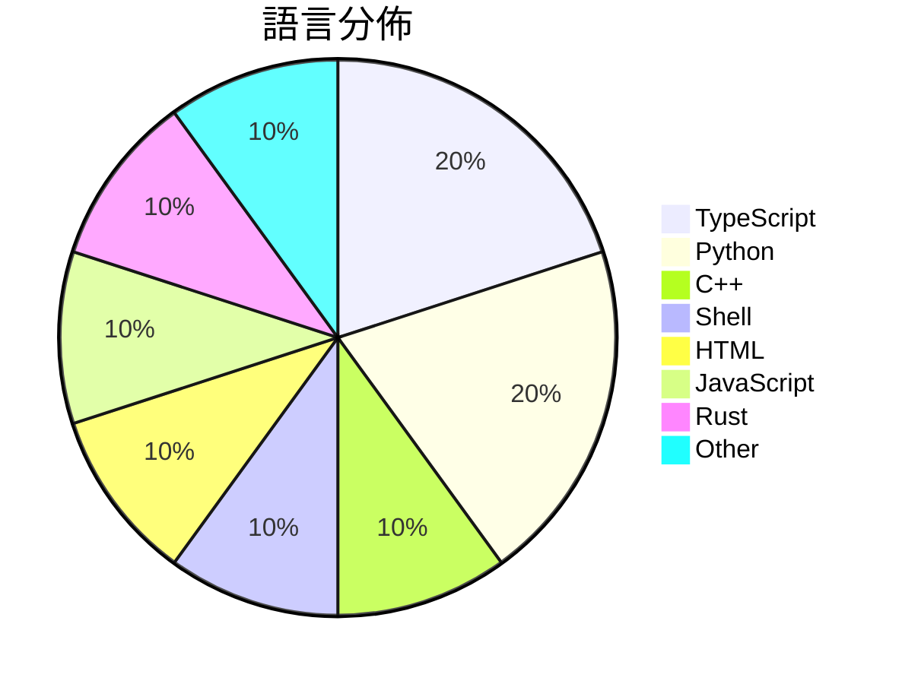

# GitHub Trending - 2026-07-08

> [!summary] 本日摘要
> 收錄 **10** 個新專案，合計 **13.2k** stars
> 語言分佈：TypeScript (2) · Python (2) · C++ (1) · Shell (1) · HTML (1) · JavaScript (1) · Rust (1) · Other (1)

> [!tip] 本週焦點
> **[[elder-plinius--T3MP3ST|elder-plinius/T3MP3ST]]** — 5 天內累積 3.4k stars（673 stars/天）
> 一個自主的紅隊平台，將 AI 編碼代理轉變為零日漏洞獵手。



---

## 收錄列表

| # | 專案 | 分類 | Stars | 速度 | 安裝 | 語言 | 用途 |
| :--: | --- | --- | ---: | ---: | --- | --- | --- |
| 1 | [[elder-plinius--T3MP3ST\|elder-plinius/T3MP3ST]] | 安全 | 3.4k | 673/天 | `medium` | TypeScript | 一個自主的紅隊平台，將 AI 編碼代理轉變為零日漏洞獵手。 |
| 2 | [[synthetic-sciences--openscience\|synthetic-sciences/openscience]] | 開發工具 | 1.4k | 358/天 | `easy` | TypeScript | 提供一個開源的 AI 工作平台，協助科學研究的各個階段。 |
| 3 | [[ammaarreshi--Generals-Mac-iOS-iPad\|ammaarreshi/Generals-Mac-iOS-iPad]] | 遊戲 | 1.3k | 325/天 | `medium` | C++ | 讓《指揮官與征服：將軍：零時刻》在 macOS、iPhone 和 iPad 上原 |
| 4 | [[jamesob--local-llm\|jamesob/local-llm]] | AI/ML | 1.2k | 300/天 | `medium` | Shell | 提供在本地運行最先進的 LLM 的硬體配置和配置指南。 |
| 5 | [[isjiamu--gzh-design-skill\|isjiamu/gzh-design-skill]] | 開發工具 | 1.2k | 196/天 | `easy` | HTML | 將 Markdown 一鍵排版為可直接粘貼進微信公眾號的精美 HTML。 |
| 6 | [[Shpigford--knockoff\|Shpigford/knockoff]] | 開發工具 | 1.1k | 1.1k/天 | `easy` | JavaScript | 過濾亞馬遜上的偽品牌產品，讓你能夠購買真正的知名品牌。 |
| 7 | [[MaximeRivest--riddle\|MaximeRivest/riddle]] | 其他 | 1.1k | 538/天 | `medium` | Rust | 讓你在 reMarkable Paper Pro 上用筆寫日記，並且日記會以流暢 |
| 8 | [[x4gKing--X4G\|x4gKing/X4G]] | 基礎設施 | 1.0k | 335/天 | `medium` | Python | 提供一個快速現代的 VLESS 隧道服務，支持 WebSocket 和 HTTP |
| 9 | [[xuchonglang--investing-for-beginners\|xuchonglang/investing-for-beginners]] | 其他 | 853 | 171/天 | `easy` | N/A | 為中文投資者提供美股、期權與加密貨幣的入門知識框架。 |
| 10 | [[jmerelnyc--Talos\|jmerelnyc/Talos]] | AI/ML | 724 | 145/天 | `easy` | Python | 分享你的 GPU 賺取收益，並透過 WebSocket 提供開放模型推論服務。 |

---

## 重點摘要

### 1. [[elder-plinius--T3MP3ST|elder-plinius/T3MP3ST]] `安全`

> 一個自主的紅隊平台，將 AI 編碼代理轉變為零日漏洞獵手。

**3.4k** stars · **673** stars/天 · TypeScript · `medium`

_建立 5 天內累積 3367 stars（673/天），forks 765（22.7%），顯示出強烈的社群參與。這個專案的作者們在開源社群中有相當的影響力，過去的專案也都與安全測試相關，這使得 T3MP3ST 能夠吸引到關注。它解決了以往紅隊工具需要高昂成本和複雜配置的痛點，提供了一個更為簡單且高效的解決方案。社群的活躍度和對於功能的需求推動了這個專案的快速增長。forks/stars 比率為 22.7%，顯示出很多人對這個專案進行了實際的修改和使用。_

---

### 2. [[synthetic-sciences--openscience|synthetic-sciences/openscience]] `開發工具`

> 提供一個開源的 AI 工作平台，協助科學研究的各個階段。

**1.4k** stars · **358** stars/天 · TypeScript · `easy`

_建立 4 天內累積 1431 stars（358/天），forks 199（13.9%），顯示出強勁的增長潛力。這個專案由 Synthetic Sciences 團隊開發，目的是解決科學研究過程中的繁瑣和低效問題。之前的工具通常無法整合完整的研究流程，導致研究者需要使用多個工具來完成各個階段的工作。這個專案的推出填補了這一空白，並且在社群中引起了廣泛的討論和關注，特別是在科學研究和 AI 應用的交集領域。其開源性質和強大的功能吸引了許多開發者和研究者的參與。_

---

### 3. [[ammaarreshi--Generals-Mac-iOS-iPad|ammaarreshi/Generals-Mac-iOS-iPad]] `遊戲`

> 讓《指揮官與征服：將軍：零時刻》在 macOS、iPhone 和 iPad 上原生運行，無需模擬器。

**1.3k** stars · **325** stars/天 · C++ · `medium`

_建立 4 天就累積 1300 stars（325/天），forks 104（8.0%），這顯示出強烈的社群興趣。專案的主要貢獻者來自於活躍的開源社群，過去有成功的移植經驗，像是GeneralsX和其他Unix移植。這個專案解決了在iOS平台上運行舊款RTS遊戲的需求，因為之前並沒有原生的解決方案，玩家只能依賴Wine等工具，這些工具的性能和穩定性都不如原生移植。社群的討論和反饋也促進了專案的快速發展。這種需求的增加和開源社群的活躍使得這個專案迅速受到關注。_

---

### 4. [[jamesob--local-llm|jamesob/local-llm]] `AI/ML`

> 提供在本地運行最先進的 LLM 的硬體配置和配置指南。

**1.2k** stars · **300** stars/天 · Shell · `medium`

_建立 4 天就累積 1199 stars（299.75/天），forks 72（6.0%），顯示出一定的社群關注度。作者 jamesob 是一位對本地 LLM 運行有深入研究的開發者，提供了詳細的硬體選擇和配置指南，解決了許多用戶在本地運行 LLM 時的困惑。這個專案的出現正好填補了市場上缺乏針對本地高效能 LLM 運行的詳細資源的空白。社群的反應和需求也促使了這個專案的快速成長。_

---

### 5. [[isjiamu--gzh-design-skill|isjiamu/gzh-design-skill]] `開發工具`

> 將 Markdown 一鍵排版為可直接粘貼進微信公眾號的精美 HTML。

**1.2k** stars · **196** stars/天 · HTML · `easy`

_建立 6 天就累積 1176 stars（196/天），forks 132（11.2%），這顯示出強勁的增長勢頭。作者 isjiamu 在 AI Agent 和排版工具方面有豐富的經驗，這個工具解決了微信公眾號排版的痛點，之前的解決方案往往無法保證格式不丟失。這個專案的推出恰逢微信內容創作需求上升，吸引了大量使用者的注意。高比例的 forks 表示社群對這個工具的實際修改和使用興趣，顯示出其在開發者中的受歡迎程度。_

---

### 6. [[Shpigford--knockoff|Shpigford/knockoff]] `開發工具`

> 過濾亞馬遜上的偽品牌產品，讓你能夠購買真正的知名品牌。

**1.1k** stars · **1.1k** stars/天 · JavaScript · `easy`

_建立 1 天就累積 1078 stars（1078/天），forks 29（2.7%），這顯示出強烈的用戶興趣。這位開發者 Shpigford 過去曾經開發過其他受歡迎的擴展，這次專案解決了亞馬遜上偽品牌氾濫的問題，讓消費者能夠更安全地購物。這個問題在亞馬遜上普遍存在，許多用戶都面臨選擇困難。擴展的簡單安裝和即時效果吸引了大量用戶，並且社群對於品牌的報告機制也促進了參與感。這種社區驅動的更新方式使得工具能夠快速適應市場變化，進一步提升了其吸引力。_

---

### 7. [[MaximeRivest--riddle|MaximeRivest/riddle]] `其他`

> 讓你在 reMarkable Paper Pro 上用筆寫日記，並且日記會以流暢的手寫回覆。

**1.1k** stars · **538** stars/天 · Rust · `medium`

_建立 2 天就累積 1076 stars（538/天），forks 76（7.1%），這顯示出強烈的興趣和參與度。作者 MaximeRivest 之前有開發過其他與 reMarkable 相關的工具，這使得他在這個領域有一定的知名度。這個專案解決了用戶在數位書寫中缺乏即時回饋的痛點，之前的解決方案通常需要依賴於屏幕或鍵盤，無法提供如此自然的書寫體驗。最近的推廣活動和社群討論也可能促進了這個專案的曝光度。技術上，這個工具的實現依賴於 reMarkable 的 SDK，這使得它能夠直接與設備的 e-ink 引擎互動，提供即時的手寫回覆。forks/stars 比率為 7.1%，顯示出許多人對這個專案的實際修改和使用。_

---

### 8. [[x4gKing--X4G|x4gKing/X4G]] `基礎設施`

> 提供一個快速現代的 VLESS 隧道服務，支持 WebSocket 和 HTTP Proxy，並具備流量限制管理功能。

**1.0k** stars · **335** stars/天 · Python · `medium`

_建立 3 天內累積 1005 stars（335/天），forks 2253（224.2%），這顯示出極高的興趣和參與度。作者 x4gKing 似乎在這個領域有一定的經驗，這個工具解決了以往 VLESS 隧道服務在流量管理上的不足，提供了更直觀的管理界面。近期的推廣活動可能也促進了其快速增長，特別是在社群平台上引起討論。高 forks/stars 比率（224.2%）表明許多人在實際修改和使用這個工具，而不僅僅是觀望。_

---

### 9. [[xuchonglang--investing-for-beginners|xuchonglang/investing-for-beginners]] `其他`

> 為中文投資者提供美股、期權與加密貨幣的入門知識框架。

**853** stars · **171** stars/天 · N/A · `easy`

_建立 5 天內累積 853 stars（171/天），forks 41（4.8%），顯示出穩定的增長潛力。作者徐冲浪在投資教育領域有一定的影響力，這份指南填補了中文投資者在美股和加密貨幣領域的知識空白。之前的資源多數針對專業人士，缺乏針對初學者的系統性介紹。這份指南的出現正好解決了這一痛點，並且其內容結構清晰，易於理解，吸引了大量初學者的關注。社群的活躍度和開放性也促進了其快速成長。_

---

### 10. [[jmerelnyc--Talos|jmerelnyc/Talos]] `AI/ML`

> 分享你的 GPU 賺取收益，並透過 WebSocket 提供開放模型推論服務。

**724** stars · **145** stars/天 · Python · `easy`

_建立 5 天內累積 724 stars（144.8/天），forks 13（1.8%），顯示出穩定的增長。作者 jmerelnyc 是一位活躍的開發者，專注於 AI 和分散式計算領域。Talos 解決了 GPU 資源共享的痛點，讓使用者能夠輕鬆賺取收益，這在過去的工具中並不常見。社群的反饋和需求促進了這個專案的快速成長，並且目前沒有明顯的競爭對手。這個工具的出現正好契合了當前對於分散式計算和 GPU 資源利用的需求。_

---

## 今日到期複習

> [!tip] 根據間隔複習排程，今天該回顧的專案

```dataview
TABLE
  stars_per_day AS "Stars/天",
  category AS "分類",
  engagement AS "參與度"
FROM "Repos"
WHERE next_review AND date(next_review) <= date("2026-07-08") AND status != "archived"
SORT priority DESC
```

## 待處理

```dataviewjs
const pending = dv.pages('"Repos"').where(p => p.status === "to-review").length;
const unrated = dv.pages('"Repos"').where(p => p.status !== "archived" && p.status !== "to-review" && (p.my_rating || 0) === 0).length;
const noVerdict = dv.pages('"Repos"').where(p => p.status !== "archived" && (p.my_rating || 0) > 0 && (!p.verdict || p.verdict === "")).length;
const items = [];
if (pending > 0) items.push(`**${pending}** 個待分流`);
if (unrated > 0) items.push(`**${unrated}** 個已讀但未評分`);
if (noVerdict > 0) items.push(`**${noVerdict}** 個已評分但無結論`);
if (items.length > 0) dv.paragraph(items.join(" / "));
else dv.paragraph("所有專案都已處理完畢！");
```
