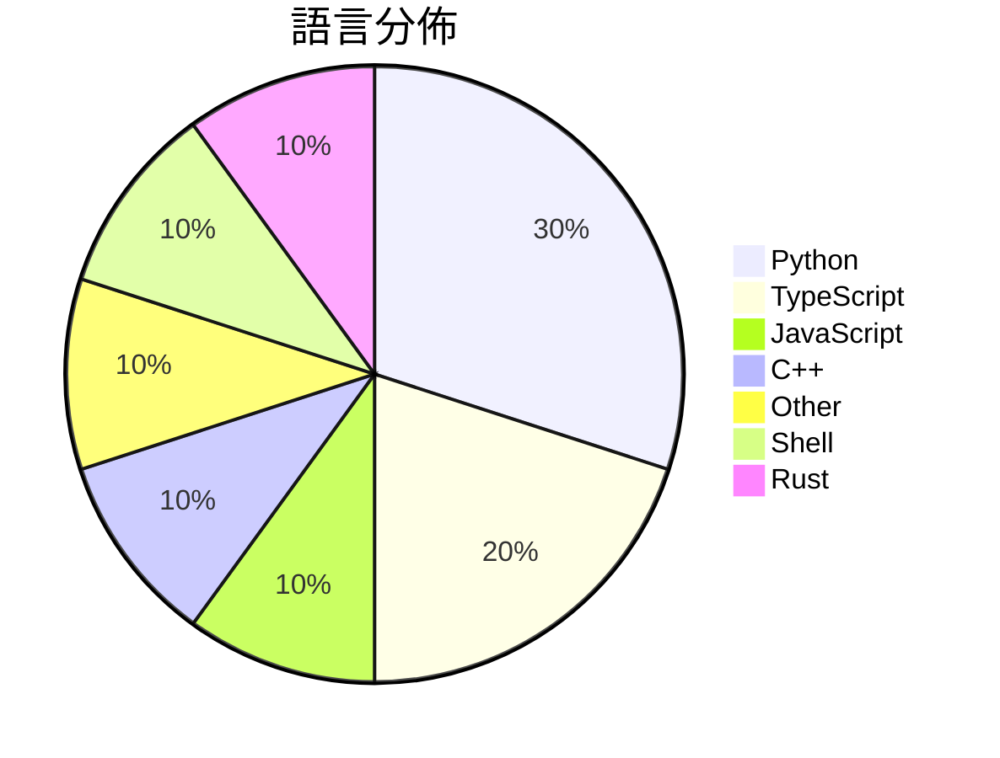

# GitHub Trending - 2026-07-09

> [!summary] 本日摘要
> 收錄 **10** 個新專案，合計 **16.5k** stars
> 語言分佈：Python (3) · TypeScript (2) · JavaScript (1) · C++ (1) · Other (1) · Shell (1) · Rust (1)

> [!tip] 本週焦點
> **[[elder-plinius--T3MP3ST|elder-plinius/T3MP3ST]]** — 6 天內累積 3.9k stars（653 stars/天）
> 一個自主的紅隊平台，將 AI 編碼代理轉變為零日漏洞獵手。



---

## 收錄列表

| # | 專案 | 分類 | Stars | 速度 | 安裝 | 語言 | 用途 |
| :--: | --- | --- | ---: | ---: | --- | --- | --- |
| 1 | [[elder-plinius--T3MP3ST\|elder-plinius/T3MP3ST]] | 安全 | 3.9k | 653/天 | `easy` | TypeScript | 一個自主的紅隊平台，將 AI 編碼代理轉變為零日漏洞獵手。 |
| 2 | [[x4gKing--X4G\|x4gKing/X4G]] | 基礎設施 | 2.5k | 630/天 | `easy` | Python | 提供快速現代的 VLESS 隧道服務，支持 WebSocket 和 HTTP P |
| 3 | [[synthetic-sciences--openscience\|synthetic-sciences/openscience]] | 開發工具 | 1.8k | 361/天 | `easy` | TypeScript | 提供一個開源的 AI 工作平台，協助科學研究者進行文獻回顧、實驗設計及結果撰寫。 |
| 4 | [[Shpigford--knockoff\|Shpigford/knockoff]] | 開發工具 | 1.4k | 714/天 | `easy` | JavaScript | 過濾亞馬遜上的偽品牌產品，讓你購買真正的知名品牌。 |
| 5 | [[ammaarreshi--Generals-Mac-iOS-iPad\|ammaarreshi/Generals-Mac-iOS-iPad]] | 遊戲 | 1.4k | 274/天 | `medium` | C++ | 讓 Command & Conquer Generals: Zero Hour  |
| 6 | [[xuchonglang--investing-for-beginners\|xuchonglang/investing-for-beginners]] | 其他 | 1.3k | 221/天 | `easy` | N/A | 提供中文投资者从零开始了解美股、期权与加密货币的知识框架。 |
| 7 | [[jamesob--local-llm\|jamesob/local-llm]] | AI/ML | 1.3k | 256/天 | `medium` | Shell | 提供在本地運行最新 LLM 的硬體配置和配置指南。 |
| 8 | [[MaximeRivest--riddle\|MaximeRivest/riddle]] | 生產力 | 1.2k | 405/天 | `medium` | Rust | 讓 reMarkable Paper Pro 的使用者能夠用筆書寫，並從日記中獲 |
| 9 | [[anthropics--jacobian-lens\|anthropics/jacobian-lens]] | AI/ML | 891 | 149/天 | `easy` | Python | 提供一個可解釋的模型內部激活的工具，幫助理解語言模型的運作方式。 |
| 10 | [[jmerelnyc--Talos\|jmerelnyc/Talos]] | AI/ML | 788 | 131/天 | `easy` | Python | 讓你分享 GPU 資源並透過 Talos 網路賺取收入。 |

---

## 重點摘要

### 1. [[elder-plinius--T3MP3ST|elder-plinius/T3MP3ST]] `安全`

> 一個自主的紅隊平台，將 AI 編碼代理轉變為零日漏洞獵手。

**3.9k** stars · **653** stars/天 · TypeScript · `easy`

_建立 6 天內累積 3916 stars（653/天），forks 848（21.7%），顯示出強烈的社群興趣。這位開發者 elder-plinius 在攻擊安全領域有一定的背景，這個專案解決了以往紅隊工具需要高昂成本和複雜配置的痛點，讓更多人能夠參與紅隊測試。近期的推廣和社群討論可能也促進了其快速增長。高達 21.7% 的 forks/stars 比率顯示出許多開發者對此專案進行了實際的修改和使用，這是一個健康的社群信號。_

---

### 2. [[x4gKing--X4G|x4gKing/X4G]] `基礎設施`

> 提供快速現代的 VLESS 隧道服務，支持 WebSocket 和 HTTP Proxy，並具備流量限制功能。

**2.5k** stars · **630** stars/天 · Python · `easy`

_建立 4 天就累積 2519 stars（630/天），forks 4887（194%），這顯示出極高的用戶參與度。作者 x4gKing 似乎專注於提供高效的隧道解決方案，解決了傳統 VLESS 隧道配置繁瑣的問題。之前的方案往往需要複雜的伺服器設置，而 X4G 透過簡化的部署流程和即時管理功能，讓用戶能夠快速上手。這個專案的流行可能也受到社群對於隧道服務需求增加的影響，尤其是在隱私和網絡安全日益受到重視的背景下。高達 194% 的 forks/stars 比率顯示出許多開發者正在進行實際修改和使用，這表明社群對於這個工具的實際應用有著濃厚的興趣。_

---

### 3. [[synthetic-sciences--openscience|synthetic-sciences/openscience]] `開發工具`

> 提供一個開源的 AI 工作平台，協助科學研究者進行文獻回顧、實驗設計及結果撰寫。

**1.8k** stars · **361** stars/天 · TypeScript · `easy`

_建立 5 天內累積 1806 stars（361/天），forks 257（14.2%），顯示出強勁的成長潛力。主要貢獻者包括多位活躍的開發者，且該專案解決了科學研究中自動化流程的痛點，這在過去的工具中往往需要手動進行。特別是對於需要整合多種數據來源和模型的研究者，OpenScience 提供了一個無需賬戶的靈活解決方案。社群的活躍度和開發頻率也顯示出其潛在的長期支持和更新。這些因素共同促進了其快速增長。_

---

### 4. [[Shpigford--knockoff|Shpigford/knockoff]] `開發工具`

> 過濾亞馬遜上的偽品牌產品，讓你購買真正的知名品牌。

**1.4k** stars · **714** stars/天 · JavaScript · `easy`

_建立 2 天內累積 1427 stars（714/天），forks 43（3.0%），顯示出穩定的增長趨勢。這個專案的作者 Shpigford 之前有開發過其他擴展，並且對於用戶在亞馬遜上購物的痛點有深刻的理解。這個工具解決了用戶在面對大量偽品牌時的困擾，之前的解決方案往往依賴於用戶的主觀判斷，並且缺乏有效的過濾機制。近期的推廣活動和社群的討論也促進了這個專案的曝光。隨著網路購物的普及，這種過濾工具的需求越來越大，特別是在亞馬遜這樣的平台上，這使得 Knockoff 成為一個實用的解決方案。forks/stars 比率為 3.0%，顯示出用戶對於這個工具的實際應用有一定的興趣。_

---

### 5. [[ammaarreshi--Generals-Mac-iOS-iPad|ammaarreshi/Generals-Mac-iOS-iPad]] `遊戲`

> 讓 Command & Conquer Generals: Zero Hour 在 macOS、iPhone 和 iPad 上原生運行，無需模擬器。

**1.4k** stars · **274** stars/天 · C++ · `medium`

_建立 5 天就累積 1369 stars（274/天），forks 111（8.1%），這顯示出社群對於這個專案的高度興趣。主要貢獻者包括 xezon 和 fbraz3，他們在遊戲移植領域有豐富的經驗。這個專案解決了在 iOS 環境中運行舊遊戲的痛點，因為過去的解決方案往往依賴於模擬器，導致性能不佳。最近的推文和討論也引發了對這個專案的關注，並且隨著 Apple Silicon 的普及，這個專案的需求也在上升。forks/stars 比率為 8.1%，顯示出許多人對於這個專案的實際修改和使用。_

---

### 6. [[xuchonglang--investing-for-beginners|xuchonglang/investing-for-beginners]] `其他`

> 提供中文投资者从零开始了解美股、期权与加密货币的知识框架。

**1.3k** stars · **221** stars/天 · N/A · `easy`

_建立 6 天就累積 1328 stars（221/天），forks 85（6.4%），顯示出穩定的增長潛力。作者徐冲浪在投資教育領域有一定的影響力，這份指南填補了中文市場對於投資知識的空白，特別是針對美股和加密貨幣的系統性學習需求。隨著越來越多的普通人開始關注投資，這份指南的實用性和針對性使其受到廣泛關注。社群對於投資教育的渴望，促使這份指南迅速成為熱門資源。_

---

### 7. [[jamesob--local-llm|jamesob/local-llm]] `AI/ML`

> 提供在本地運行最新 LLM 的硬體配置和配置指南。

**1.3k** stars · **256** stars/天 · Shell · `medium`

_建立 5 天內累積 1280 stars（256/天），forks 79（6.2%），顯示出穩定的增長潛力。作者 jamesob 是一位對 LLM 和高效能計算有深入了解的開發者，提供了實用的本地運行指南，解決了許多用戶對於雲端服務的依賴問題。這個專案的出現正好滿足了對於本地運行 LLM 的需求，特別是在硬體成本逐漸降低的情況下。社群對於本地運行 LLM 的興趣持續增長，這使得該專案在 GitHub 上受到關注。_

---

### 8. [[MaximeRivest--riddle|MaximeRivest/riddle]] `生產力`

> 讓 reMarkable Paper Pro 的使用者能夠用筆書寫，並從日記中獲得流暢的手寫回覆。

**1.2k** stars · **405** stars/天 · Rust · `medium`

_建立 3 天內累積 1215 stars（405/天），forks 92（7.6%），顯示出強烈的興趣和活躍度。作者 MaximeRivest 以其對 reMarkable 硬體的深刻理解和開發經驗而聞名，這使得 Riddle 成為一個解決手寫筆記與 AI 互動的創新方案。此專案的出現填補了市場上對於高效能手寫日記應用的需求，特別是在 reMarkable 硬體上。社群的反饋和討論也促進了其快速成長，並且在 GitHub 上的活躍度顯示出使用者對於其功能的期待。_

---

### 9. [[anthropics--jacobian-lens|anthropics/jacobian-lens]] `AI/ML`

> 提供一個可解釋的模型內部激活的工具，幫助理解語言模型的運作方式。

**891** stars · **149** stars/天 · Python · `easy`

_建立 6 天內累積 891 stars（149/天），forks 131（14.7%），這顯示出強烈的社群興趣。這個專案的主要貢獻者 mntss 之前在語言模型解釋性方面有過研究，這使得他們對於如何設計這個工具有深刻的理解。這個工具解決了在大型語言模型中，如何有效地解釋和可視化內部激活的問題，這在過去的研究中缺乏有效的解決方案。社群對於這個工具的需求可能來自於對於模型透明度的關注，尤其是在 AI 應用日益普及的背景下。forks/stars 比率 14.7% 表示許多人對這個工具進行了實際的修改和使用，顯示出其實用性。_

---

### 10. [[jmerelnyc--Talos|jmerelnyc/Talos]] `AI/ML`

> 讓你分享 GPU 資源並透過 Talos 網路賺取收入。

**788** stars · **131** stars/天 · Python · `easy`

_建立 6 天內累積 788 stars（131/天），forks 13（1.6%），這顯示出一定的關注度。作者 jmerelnyc 具備開發背景，解決了 GPU 資源共享的痛點，讓使用者能夠輕鬆賺取收入。這個工具的流行可能受到社群對於開放模型推論需求上升的影響，並且與 Ollama 的整合使得使用者能夠快速部署模型。forks/stars 比率較低，顯示大多數用戶仍在觀望階段。_

---

## 今日到期複習

> [!tip] 根據間隔複習排程，今天該回顧的專案

```dataview
TABLE
  stars_per_day AS "Stars/天",
  category AS "分類",
  engagement AS "參與度"
FROM "Repos"
WHERE next_review AND date(next_review) <= date("2026-07-09") AND status != "archived"
SORT priority DESC
```

## 待處理

```dataviewjs
const pending = dv.pages('"Repos"').where(p => p.status === "to-review").length;
const unrated = dv.pages('"Repos"').where(p => p.status !== "archived" && p.status !== "to-review" && (p.my_rating || 0) === 0).length;
const noVerdict = dv.pages('"Repos"').where(p => p.status !== "archived" && (p.my_rating || 0) > 0 && (!p.verdict || p.verdict === "")).length;
const items = [];
if (pending > 0) items.push(`**${pending}** 個待分流`);
if (unrated > 0) items.push(`**${unrated}** 個已讀但未評分`);
if (noVerdict > 0) items.push(`**${noVerdict}** 個已評分但無結論`);
if (items.length > 0) dv.paragraph(items.join(" / "));
else dv.paragraph("所有專案都已處理完畢！");
```
