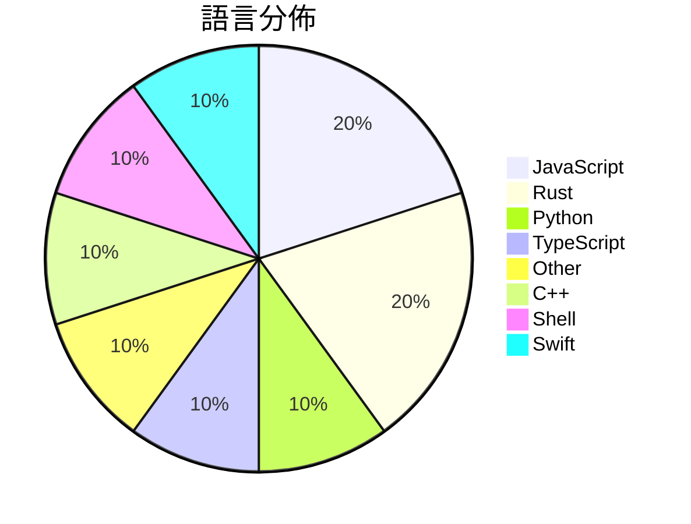

# GitHub Trending - 2026-07-10

> [!summary] 本日摘要
> 收錄 **10** 個新專案，合計 **15.7k** stars
> 語言分佈：JavaScript (2) · Rust (2) · Python (1) · TypeScript (1) · Other (1) · C++ (1) · Shell (1) · Swift (1)

> [!tip] 本週焦點
> **[[x4gKing--X4G|x4gKing/X4G]]** — 5 天內累積 3.4k stars（686 stars/天）
> 提供一個現代化的 VLESS 隧道解決方案，支持多種傳輸協議和管理功能。



---

## 收錄列表

| # | 專案 | 分類 | Stars | 速度 | 安裝 | 語言 | 用途 |
| :--: | --- | --- | ---: | ---: | --- | --- | --- |
| 1 | [[x4gKing--X4G\|x4gKing/X4G]] | 基礎設施 | 3.4k | 686/天 | `medium` | Python | 提供一個現代化的 VLESS 隧道解決方案，支持多種傳輸協議和管理功能。 |
| 2 | [[synthetic-sciences--openscience\|synthetic-sciences/openscience]] | 開發工具 | 2.0k | 328/天 | `medium` | TypeScript | 提供一個開源的 AI 工作平台，幫助科學研究自動化整個研究過程。 |
| 3 | [[xuchonglang--investing-for-beginners\|xuchonglang/investing-for-beginners]] | 其他 | 1.7k | 237/天 | `easy` | N/A | 提供中文投资者从零开始了解美股、期权与加密货币的知识框架。 |
| 4 | [[Shpigford--knockoff\|Shpigford/knockoff]] | 開發工具 | 1.6k | 527/天 | `easy` | JavaScript | 過濾 Amazon 上的偽品牌商品，幫助用戶購買真正的知名品牌。 |
| 5 | [[withmarbleapp--os-taxonomy\|withmarbleapp/os-taxonomy]] | 其他 | 1.5k | 1.5k/天 | `easy` | JavaScript | 提供一個開放的學習主題結構，幫助理解兒童在小學階段的學習內容。 |
| 6 | [[ammaarreshi--Generals-Mac-iOS-iPad\|ammaarreshi/Generals-Mac-iOS-iPad]] | 遊戲 | 1.4k | 233/天 | `medium` | C++ | 在 macOS、iPhone 和 iPad 上原生運行《Command & Co |
| 7 | [[jamesob--local-llm\|jamesob/local-llm]] | AI/ML | 1.3k | 217/天 | `medium` | Shell | 提供在本地運行最先進的 LLM 的硬體配置和配置指南。 |
| 8 | [[MaximeRivest--riddle\|MaximeRivest/riddle]] | 其他 | 1.3k | 322/天 | `medium` | Rust | 讓你在 reMarkable Paper Pro 上用筆寫作，日記會回覆你的文字 |
| 9 | [[514-labs--dnsglobe\|514-labs/dnsglobe]] | CLI 工具 | 774 | 155/天 | `medium` | Rust | 在終端上查看 DNS 記錄在全球 34 個公共解析器中的傳播情況。 |
| 10 | [[wouterdebie--davit\|wouterdebie/davit]] | 開發工具 | 743 | 149/天 | `easy` | Swift | 提供一個原生的 macOS UI 來管理 Apple 的容器平台，讓使用者輕鬆操 |

---

## 重點摘要

### 1. [[x4gKing--X4G|x4gKing/X4G]] `基礎設施`

> 提供一個現代化的 VLESS 隧道解決方案，支持多種傳輸協議和管理功能。

**3.4k** stars · **686** stars/天 · Python · `medium`

_建立 5 天內累積 3428 stars（686/天），forks 6509（189.9%），這顯示出極高的用戶興趣。作者 x4gKing 在這個領域有過去的開發經驗，這個專案解決了 VLESS 隧道管理的複雜性問題，之前的方案往往缺乏直觀的管理界面和功能。近期的推廣活動可能吸引了大量的開發者關注，特別是在 Telegram 社群中。高達 189.9% 的 forks/stars 比率顯示出許多用戶正在積極修改和使用這個專案，這是非常健康的社群互動指標。_

---

### 2. [[synthetic-sciences--openscience|synthetic-sciences/openscience]] `開發工具`

> 提供一個開源的 AI 工作平台，幫助科學研究自動化整個研究過程。

**2.0k** stars · **328** stars/天 · TypeScript · `medium`

_建立 6 天就累積 1970 stars（328/天），forks 282（14.3%），顯示出強烈的社群興趣。開發者是 Synthetic Sciences，專注於科學研究的自動化，這個專案解決了傳統研究流程中效率低下的痛點。之前的工具往往無法整合多種模型和數據源，使用者需要手動處理多個步驟。這個專案的推出引起了社群的廣泛討論，尤其是在科學研究和 AI 的交集領域。隨著開源文化的興起，這種工具的需求也在不斷增加，顯示出其潛在的市場價值。_

---

### 3. [[xuchonglang--investing-for-beginners|xuchonglang/investing-for-beginners]] `其他`

> 提供中文投资者从零开始了解美股、期权与加密货币的知识框架。

**1.7k** stars · **237** stars/天 · N/A · `easy`

_建立 7 天內累積 1658 stars（237/天），forks 99（6.0%），顯示出穩定的增長。這個專案由徐冲浪創建，旨在填補中文投資者對於美股和加密貨幣的教育空白，特別是在缺乏相關資源的背景下。這份指南的出現正好解決了許多初學者對於如何開始投資的困惑，並提供了系統化的學習路徑。社群對於這份指南的反應熱烈，顯示出對於中文投資教育需求的迫切性。這份指南的設計理念是讓普通人能夠理解投資的基本概念，這在當前的金融環境中尤為重要。_

---

### 4. [[Shpigford--knockoff|Shpigford/knockoff]] `開發工具`

> 過濾 Amazon 上的偽品牌商品，幫助用戶購買真正的知名品牌。

**1.6k** stars · **527** stars/天 · JavaScript · `easy`

_建立 3 天內累積 1582 stars（527/天），forks 50（3.2%），顯示出強勁的增長潛力。這個專案的創始人 Shpigford 之前在開發其他擴展上有豐富經驗，Knockoff 解決了用戶在 Amazon 上面對偽品牌的痛點，這在過去的購物經驗中是個普遍問題。近期的媒體報導也讓這個工具獲得了更多的曝光，吸引了大量的使用者關注。這個工具的設計充分利用了社群的力量，讓用戶能夠共同維護品牌清單，這在其他類似工具中並不常見。Forks/stars 比率顯示出使用者對這個專案的實際修改意圖，表明社群參與度不低。_

---

### 5. [[withmarbleapp--os-taxonomy|withmarbleapp/os-taxonomy]] `其他`

> 提供一個開放的學習主題結構，幫助理解兒童在小學階段的學習內容。

**1.5k** stars · **1.5k** stars/天 · JavaScript · `easy`

_建立1天就累積1542 stars（1542/天），forks 284（18.4%），這顯示出強烈的社群興趣。這個專案由Marble團隊開發，旨在解決傳統課程標準數據的靜態與封閉問題，提供一個動態的學習圖譜。隨著教育科技的發展，對於開放和結構化學習數據的需求日益增加，這使得該專案的出現恰逢其時。社群的反饋和活躍度也顯示出使用者對於這個工具的期待和需求。_

---

### 6. [[ammaarreshi--Generals-Mac-iOS-iPad|ammaarreshi/Generals-Mac-iOS-iPad]] `遊戲`

> 在 macOS、iPhone 和 iPad 上原生運行《Command & Conquer Generals: Zero Hour》。

**1.4k** stars · **233** stars/天 · C++ · `medium`

_建立 6 天內累積 1395 stars（233/天），forks 110（7.9%），顯示出強大的社群興趣。這個專案的主要貢獻者來自於多個開源社群，之前的工作為這個專案奠定了基礎，特別是針對 iOS 的移植挑戰。這個專案解決了在 iOS 上運行舊遊戲的困難，因為過去的解決方案通常依賴於模擬器，導致性能不佳。社群的反饋和需求推動了這個專案的快速成長。_

---

### 7. [[jamesob--local-llm|jamesob/local-llm]] `AI/ML`

> 提供在本地運行最先進的 LLM 的硬體配置和配置指南。

**1.3k** stars · **217** stars/天 · Shell · `medium`

_建立 6 天內累積 1300 stars（217/天），forks 80（6.2%），顯示出強勁的增長潛力。作者 jamesob 以其對本地 LLM 運行的深入理解，提供了詳細的硬體配置和運行指南，解決了許多用戶在雲端服務中面臨的數據隱私和性能瓶頸問題。這個專案的出現正好填補了市場上對於本地高效能 LLM 運行的需求，特別是在硬體成本逐漸降低的背景下。社群對這個專案的反應也相當積極，儘管目前有一些未解決的問題，但這些都在持續更新中。_

---

### 8. [[MaximeRivest--riddle|MaximeRivest/riddle]] `其他`

> 讓你在 reMarkable Paper Pro 上用筆寫作，日記會回覆你的文字，並記住對話內容。

**1.3k** stars · **322** stars/天 · Rust · `medium`

_建立 4 天就累積 1289 stars（322/天），forks 102（7.9%），顯示出強勁的增長潛力。作者 MaximeRivest 以開發 reMarkable 的工具而聞名，此專案解決了傳統筆記方式的缺陷，提供了更直觀的書寫體驗。這個工具的獨特性在於其能夠實現即時的手寫回覆，這在現有的數位筆記工具中是少見的。社群對於這個創新的互動方式表現出濃厚的興趣，並且在 GitHub 上的討論也逐漸增多。這個專案的成功也反映了對於手寫輸入和自然互動的需求日益增加。_

---

### 9. [[514-labs--dnsglobe|514-labs/dnsglobe]] `CLI 工具`

> 在終端上查看 DNS 記錄在全球 34 個公共解析器中的傳播情況。

**774** stars · **155** stars/天 · Rust · `medium`

_建立 5 天內累積 774 stars（155/天），forks 20（2.6%），顯示出相對穩定的增長。這個專案由一群活躍的開發者維護，提供了一個之前缺乏的工具，讓用戶能夠在終端中方便地檢查 DNS 傳播情況。之前的解決方案多數是基於網頁的，無法提供這樣的即時更新和視覺化效果。社群對這個工具的需求顯而易見，特別是在需要快速檢查 DNS 記錄的情境下。_

---

### 10. [[wouterdebie--davit|wouterdebie/davit]] `開發工具`

> 提供一個原生的 macOS UI 來管理 Apple 的容器平台，讓使用者輕鬆操作容器。

**743** stars · **149** stars/天 · Swift · `easy`

_建立 5 天內累積 743 stars（149/天），forks 9（1.2%），顯示出對原生 macOS 應用的需求。作者 wouterdebie 之前有開發相關的工具，這次專注於提供一個無需 CLI 的容器管理界面，解決了用戶在使用 Docker Desktop 時的複雜性。最近的推廣活動和社群的討論也可能促進了這個專案的曝光。由於 Apple silicon 的普及，這個工具的需求隨之上升，尤其是在開發者社群中。forks/stars 比率相對較低，顯示出使用者對於這個工具的初步觀望。_

---

## 今日到期複習

> [!tip] 根據間隔複習排程，今天該回顧的專案

```dataview
TABLE
  stars_per_day AS "Stars/天",
  category AS "分類",
  engagement AS "參與度"
FROM "Repos"
WHERE next_review AND date(next_review) <= date("2026-07-10") AND status != "archived"
SORT priority DESC
```

## 待處理

```dataviewjs
const pending = dv.pages('"Repos"').where(p => p.status === "to-review").length;
const unrated = dv.pages('"Repos"').where(p => p.status !== "archived" && p.status !== "to-review" && (p.my_rating || 0) === 0).length;
const noVerdict = dv.pages('"Repos"').where(p => p.status !== "archived" && (p.my_rating || 0) > 0 && (!p.verdict || p.verdict === "")).length;
const items = [];
if (pending > 0) items.push(`**${pending}** 個待分流`);
if (unrated > 0) items.push(`**${unrated}** 個已讀但未評分`);
if (noVerdict > 0) items.push(`**${noVerdict}** 個已評分但無結論`);
if (items.length > 0) dv.paragraph(items.join(" / "));
else dv.paragraph("所有專案都已處理完畢！");
```
