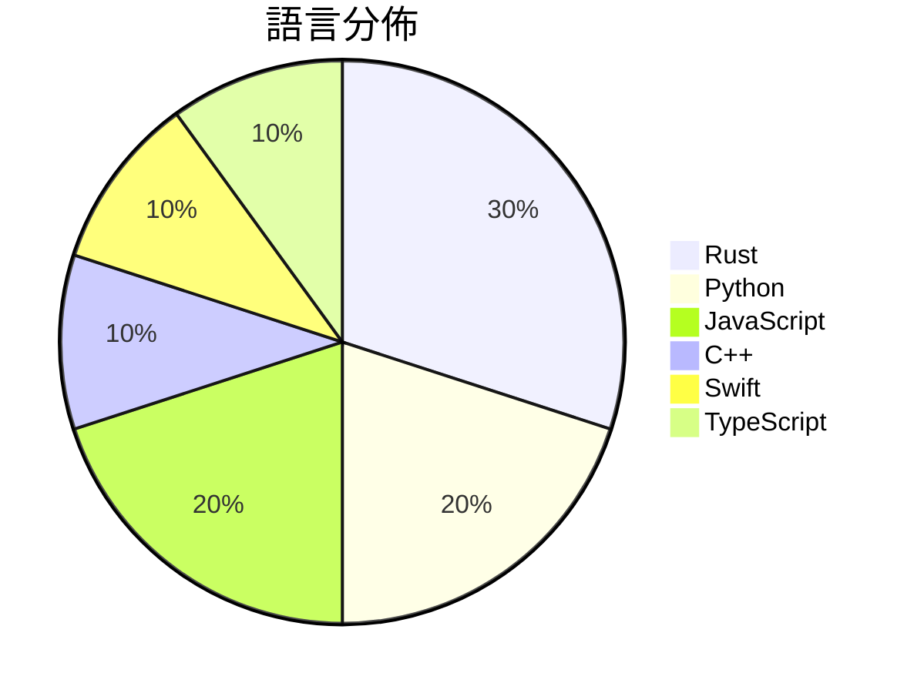

# GitHub Trending - 2026-07-11

> [!summary] 本日摘要
> 收錄 **10** 個新專案，合計 **14.5k** stars
> 語言分佈：Rust (3) · Python (2) · JavaScript (2) · C++ (1) · Swift (1) · TypeScript (1)

> [!tip] 本週焦點
> **[[x4gKing--X4G|x4gKing/X4G]]** — 6 天內累積 4.1k stars（677 stars/天）
> 提供快速且現代的 VLESS 隧道解決方案，支持多種傳輸協議和管理功能。



---

## 收錄列表

| # | 專案 | 分類 | Stars | 速度 | 安裝 | 語言 | 用途 |
| :--: | --- | --- | ---: | ---: | --- | --- | --- |
| 1 | [[x4gKing--X4G\|x4gKing/X4G]] | 基礎設施 | 4.1k | 677/天 | `medium` | Python | 提供快速且現代的 VLESS 隧道解決方案，支持多種傳輸協議和管理功能。 |
| 2 | [[withmarbleapp--os-taxonomy\|withmarbleapp/os-taxonomy]] | 其他 | 2.2k | 1.1k/天 | `easy` | JavaScript | 提供一個開放的、結構化的學習分類法，幫助理解兒童在基礎教育階段學習的內容。 |
| 3 | [[Shpigford--knockoff\|Shpigford/knockoff]] | 開發工具 | 1.7k | 428/天 | `easy` | JavaScript | 過濾亞馬遜上的偽品牌商品，讓你能夠購買真正的知名品牌。 |
| 4 | [[ammaarreshi--Generals-Mac-iOS-iPad\|ammaarreshi/Generals-Mac-iOS-iPad]] | 遊戲 | 1.4k | 201/天 | `medium` | C++ | 讓 Command & Conquer Generals: Zero Hour  |
| 5 | [[MaximeRivest--riddle\|MaximeRivest/riddle]] | 開發工具 | 1.3k | 269/天 | `medium` | Rust | 讓 reMarkable Paper Pro 的使用者能夠以手寫方式與 AI 進 |
| 6 | [[wouterdebie--davit\|wouterdebie/davit]] | 開發工具 | 814 | 136/天 | `easy` | Swift | 提供原生 macOS 界面來管理 Apple 的容器平台，讓使用者輕鬆操作輕量級 |
| 7 | [[514-labs--dnsglobe\|514-labs/dnsglobe]] | CLI 工具 | 798 | 133/天 | `easy` | Rust | 全球 DNS 傳播檢查工具，讓你在終端機上查看 DNS 記錄在 34 個公共解析 |
| 8 | [[yynxxxxx--Codex-X\|yynxxxxx/Codex-X]] | 開發工具 | 760 | 109/天 | `medium` | Rust | 提供 Codex CLI 的可視化管理，簡化提示詞與 API 供應商的切換。 |
| 9 | [[Robbyant--lingbot-world-v2\|Robbyant/lingbot-world-v2]] | AI/ML | 709 | 355/天 | `medium` | Python | 提供無限互動世界的高效能模型，讓用戶能夠進行多樣化的互動。 |
| 10 | [[simonlin1212--Vibe-Research\|simonlin1212/Vibe-Research]] | 其他 | 687 | 137/天 | `medium` | TypeScript | 提供 A 股、美股和港股的個人投研 Agent，整合數據與功能，讓用戶自行驅動投 |

---

## 重點摘要

### 1. [[x4gKing--X4G|x4gKing/X4G]] `基礎設施`

> 提供快速且現代的 VLESS 隧道解決方案，支持多種傳輸協議和管理功能。

**4.1k** stars · **677** stars/天 · Python · `medium`

_建立 6 天內累積 4062 stars（677/天），forks 7700（189.6%），顯示出極高的使用者興趣。作者 x4gKing 似乎專注於提供高效的隧道解決方案，過去的項目經驗可能使其能夠快速迭代功能。這個工具解決了傳統隧道工具在配置和管理上的繁瑣問題，特別是對於需要快速部署和管理的用戶群體。社群的反饋和需求驅動了這個工具的快速增長，特別是在 Telegram 機器人管理的需求上。forks/stars 比率高達 189.6%，顯示出許多人在實際修改和使用這個工具。_

---

### 2. [[withmarbleapp--os-taxonomy|withmarbleapp/os-taxonomy]] `其他`

> 提供一個開放的、結構化的學習分類法，幫助理解兒童在基礎教育階段學習的內容。

**2.2k** stars · **1.1k** stars/天 · JavaScript · `easy`

_建立 2 天就累積 2181 stars（1091/天），forks 393（18%），顯示出強烈的社群興趣。這個專案由 Marble 團隊開發，專注於解決傳統課程標準的局限性，提供一個結構化且可互動的學習資源。之前的課程資料往往是靜態的清單，無法有效展示學習之間的關聯性。這個專案的推出正好填補了這一空白，並且在社群中引發了討論和關注。社群的反饋和需求促進了這個專案的快速成長，特別是在教育領域的應用上。forks/stars 比率達到 18%，顯示出許多開發者對於這個專案的實際修改和使用。_

---

### 3. [[Shpigford--knockoff|Shpigford/knockoff]] `開發工具`

> 過濾亞馬遜上的偽品牌商品，讓你能夠購買真正的知名品牌。

**1.7k** stars · **428** stars/天 · JavaScript · `easy`

_建立 4 天就累積 1711 stars（428/天），forks 54（3.2%），這顯示出用戶對於改善亞馬遜購物體驗的需求。作者 Shpigford 過去有開發其他相關工具的經驗，這次專案針對亞馬遜上偽品牌的問題提供了一個有效的解決方案。這個工具的推出正好符合了用戶對於品牌信譽的重視，並且在社交媒體上獲得了一定的關注。隨著越來越多的消費者對於購物安全的重視，這個工具的需求也隨之上升。forks/stars 比率在 3.2% 屬於中等，顯示出一些用戶在積極修改和使用這個工具。_

---

### 4. [[ammaarreshi--Generals-Mac-iOS-iPad|ammaarreshi/Generals-Mac-iOS-iPad]] `遊戲`

> 讓 Command & Conquer Generals: Zero Hour 在 macOS、iPhone 和 iPad 上原生運行，無需模擬。

**1.4k** stars · **201** stars/天 · C++ · `medium`

_建立 7 天內累積 1407 stars（201/天），forks 118（8.4%），顯示出強烈的社群興趣。這個專案由 xezon 和其他幾位貢獻者共同開發，他們在遊戲移植方面有豐富的經驗。它解決了在 Apple 設備上運行 Command & Conquer Generals 的難題，這在過去是通過模擬器來實現的，但模擬器的性能和兼容性往往不理想。社群對於這個專案的反應熱烈，特別是在 iOS 平台上，因為這是一個相對少見的原生遊戲移植案例。_

---

### 5. [[MaximeRivest--riddle|MaximeRivest/riddle]] `開發工具`

> 讓 reMarkable Paper Pro 的使用者能夠以手寫方式與 AI 進行互動，並獲得流暢的回覆。

**1.3k** stars · **269** stars/天 · Rust · `medium`

_建立 5 天內累積 1346 stars（269/天），forks 111（8.2%），顯示出強烈的社群興趣。作者 MaximeRivest 之前有開發其他與 reMarkable 相關的工具，這次的專案解決了手寫與 AI 互動的需求，讓使用者能夠以更自然的方式進行交流。該專案的推出也引起了社群的討論，特別是在 Twitter 上的展示引起了廣泛關注。技術上，這個工具的設計利用了 reMarkable 的硬體特性，並且提供了一種全新的使用體驗，這在目前的市場上是相對獨特的。forks/stars 比率為 8.2%，顯示出許多人對這個專案的實際修改和使用興趣。_

---

### 6. [[wouterdebie--davit|wouterdebie/davit]] `開發工具`

> 提供原生 macOS 界面來管理 Apple 的容器平台，讓使用者輕鬆操作輕量級虛擬機。

**814** stars · **136** stars/天 · Swift · `easy`

_建立 6 天內累積 814 stars（136/天），forks 12（1.5%），顯示出穩定的增長。作者 wouterdebie 之前有開發過其他 macOS 應用，這次專注於 Apple 的容器平台，解決了 macOS 用戶在使用 Docker 等工具時的繁瑣操作。這個工具的出現正好填補了 Apple Silicon 用戶的需求，因為傳統的 Docker Desktop 在這些設備上表現不佳。社群的反應熱烈，顯示出對這個工具的需求和期待。_

---

### 7. [[514-labs--dnsglobe|514-labs/dnsglobe]] `CLI 工具`

> 全球 DNS 傳播檢查工具，讓你在終端機上查看 DNS 記錄在 34 個公共解析器中的傳播情況。

**798** stars · **133** stars/天 · Rust · `easy`

_建立 6 天就累積 798 stars（133/天），forks 20（2.5%），顯示出一定的關注度。這個專案由 514-labs 團隊開發，成員在開源社群中有一定的知名度，過去也有其他成功的專案。dnsglobe 解決了傳統 DNS 查詢工具無法即時監控傳播狀態的痛點，提供了更為直觀的視覺化界面。近期的推文和社群討論也引發了更多的關注。技術上，隨著 Rust 語言的流行，這個工具的開發變得更加高效且安全。forks/stars 比率相對較低，顯示出大部分用戶對於這個工具的使用仍然處於觀望階段。_

---

### 8. [[yynxxxxx--Codex-X|yynxxxxx/Codex-X]] `開發工具`

> 提供 Codex CLI 的可視化管理，簡化提示詞與 API 供應商的切換。

**760** stars · **109** stars/天 · Rust · `medium`

_建立 7 天內累積 760 stars（109/天），forks 124（16.3%），顯示出良好的社群反響。作者 yynxxxxx 是一位活躍的開發者，專注於開源工具的開發，這個專案解決了 Codex CLI 用戶在配置和管理上的痛點，提供了一個可視化的解決方案。隨著 Codex 的使用逐漸增多，對於管理工具的需求也隨之上升，這使得 Codex-X 的出現恰逢其時。社群的反饋和需求推動了這個專案的快速成長，特別是在逆向工程和安全測試領域的應用。_

---

### 9. [[Robbyant--lingbot-world-v2|Robbyant/lingbot-world-v2]] `AI/ML`

> 提供無限互動世界的高效能模型，讓用戶能夠進行多樣化的互動。

**709** stars · **355** stars/天 · Python · `medium`

_建立 2 天就累積 709 stars（354.5/天），forks 21（3.0%），顯示出一定的興趣增長。作者團隊來自 Robbyant，專注於互動模型的開發，這個專案解決了以往互動模型在反應速度和多樣性上的不足。近期的技術報告釋出和多平台支持也可能吸引了更多的使用者關注。這個工具的可行性得益於深度學習技術的進步，特別是在多 GPU 訓練和因果推理方面。forks/stars 比率中等，顯示出部分用戶正在實際修改和使用這個工具。_

---

### 10. [[simonlin1212--Vibe-Research|simonlin1212/Vibe-Research]] `其他`

> 提供 A 股、美股和港股的個人投研 Agent，整合數據與功能，讓用戶自行驅動投資研究。

**687** stars · **137** stars/天 · TypeScript · `medium`

_建立 5 天就累積 687 stars（137/天），forks 131（19.1%），顯示出相對較高的用戶參與度。作者 Simonlin1212 之前有開發其他金融相關工具，這次專案解決了市場上缺乏靈活且個性化的投研工具的痛點，讓用戶能夠根據自己的需求進行深度分析。近期的推廣活動和社群討論也促進了這個專案的曝光率。技術生態的變化，如 AI 技術的普及，使得這種個性化的投研工具變得更加可行。高達 19.1% 的 forks/stars 比率表明許多用戶正在實際修改和使用這個工具，顯示出其實用性和靈活性。_

---

## 今日到期複習

> [!tip] 根據間隔複習排程，今天該回顧的專案

```dataview
TABLE
  stars_per_day AS "Stars/天",
  category AS "分類",
  engagement AS "參與度"
FROM "Repos"
WHERE next_review AND date(next_review) <= date("2026-07-11") AND status != "archived"
SORT priority DESC
```

## 待處理

```dataviewjs
const pending = dv.pages('"Repos"').where(p => p.status === "to-review").length;
const unrated = dv.pages('"Repos"').where(p => p.status !== "archived" && p.status !== "to-review" && (p.my_rating || 0) === 0).length;
const noVerdict = dv.pages('"Repos"').where(p => p.status !== "archived" && (p.my_rating || 0) > 0 && (!p.verdict || p.verdict === "")).length;
const items = [];
if (pending > 0) items.push(`**${pending}** 個待分流`);
if (unrated > 0) items.push(`**${unrated}** 個已讀但未評分`);
if (noVerdict > 0) items.push(`**${noVerdict}** 個已評分但無結論`);
if (items.length > 0) dv.paragraph(items.join(" / "));
else dv.paragraph("所有專案都已處理完畢！");
```
