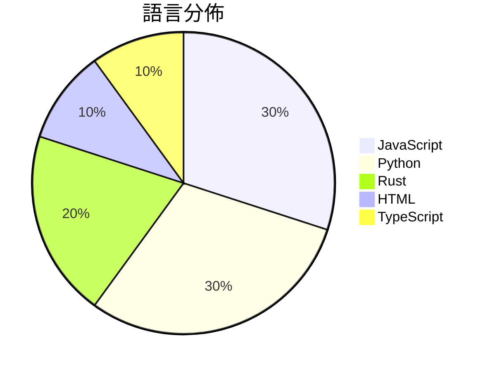

# GitHub Trending - 2026-07-12

> [!summary] 本日摘要
> 收錄 **10** 個新專案，合計 **11.1k** stars
> 語言分佈：JavaScript (3) · Python (3) · Rust (2) · HTML (1) · TypeScript (1)

> [!tip] 本週焦點
> **[[withmarbleapp--os-taxonomy|withmarbleapp/os-taxonomy]]** — 3 天內累積 2.5k stars（819 stars/天）
> 提供一個開放的、結構化的學習分類法，幫助追蹤小孩在基礎教育階段的學習進度。



---

## 收錄列表

| # | 專案 | 分類 | Stars | 速度 | 安裝 | 語言 | 用途 |
| :--: | --- | --- | ---: | ---: | --- | --- | --- |
| 1 | [[withmarbleapp--os-taxonomy\|withmarbleapp/os-taxonomy]] | 教育資源 | 2.5k | 819/天 | `easy` | JavaScript | 提供一個開放的、結構化的學習分類法，幫助追蹤小孩在基礎教育階段的學習進度。 |
| 2 | [[Shpigford--knockoff\|Shpigford/knockoff]] | 開發工具 | 1.8k | 356/天 | `easy` | JavaScript | 過濾 Amazon 上的偽品牌商品，讓你能夠購買真正的知名品牌。 |
| 3 | [[MaximeRivest--riddle\|MaximeRivest/riddle]] | 其他 | 1.4k | 236/天 | `medium` | Rust | 讓你在 reMarkable Paper Pro 上用筆寫日記，日記會回覆你的文 |
| 4 | [[oso95--scroll-world\|oso95/scroll-world]] | 開發工具 | 916 | 183/天 | `medium` | JavaScript | 將任何品牌轉換為可滾動的 3D 世界，提供沉浸式體驗。 |
| 5 | [[514-labs--dnsglobe\|514-labs/dnsglobe]] | CLI 工具 | 818 | 117/天 | `easy` | Rust | 全球 DNS 傳播檢查器，讓你在終端上觀察 DNS 記錄在 34 個公共解析器中 |
| 6 | [[Robbyant--lingbot-world-v2\|Robbyant/lingbot-world-v2]] | AI/ML | 811 | 270/天 | `medium` | Python | 提供無限互動世界的高效能 AI 模型。 |
| 7 | [[x4gKing--3x-ui-Upgrade\|x4gKing/3x-ui-Upgrade]] | 基礎設施 | 803 | 268/天 | `easy` | HTML | 提供一個整合的 Heimdall 面板，透過單一端口在 Railway 上運行。 |
| 8 | [[simonlin1212--Vibe-Research\|simonlin1212/Vibe-Research]] | 開發工具 | 731 | 122/天 | `medium` | TypeScript | 打造個人化的股市投研助手，整合 A 股、美股、港股的數據與功能，讓 AI 驅動你 |
| 9 | [[Robbyant--lingbot-video\|Robbyant/lingbot-video]] | AI/ML | 684 | 228/天 | `medium` | Python | 提供一個開源的大規模 MoE 視頻生成模型，專注於具身智能的應用。 |
| 10 | [[Robbyant--lingbot-vision\|Robbyant/lingbot-vision]] | AI/ML | 638 | 128/天 | `medium` | Python | 提供自我監督學習的視覺編碼器，專注於密集空間感知。 |

---

## 重點摘要

### 1. [[withmarbleapp--os-taxonomy|withmarbleapp/os-taxonomy]] `教育資源`

> 提供一個開放的、結構化的學習分類法，幫助追蹤小孩在基礎教育階段的學習進度。

**2.5k** stars · **819** stars/天 · JavaScript · `easy`

_建立 3 天就累積 2458 stars（819/天），forks 458（18.6%），這顯示出強烈的社群興趣。這個專案的主要貢獻者是 lauramionel 和 guillaumeboniface，他們在教育技術領域有豐富的經驗。這個工具解決了傳統課程數據的不足，提供了一個結構化且可互動的學習圖譜，這在以往的工具中並不常見。社群對於如何利用這個分類法進行工具開發的討論也引發了關注，顯示出潛在的應用場景。技術上，這個工具的設計使得它能夠輕鬆整合到現有的教育平台中，這也是其受歡迎的原因之一。forks/stars 比率為 18.6%，顯示出許多人正在實際修改和使用這個工具。_

---

### 2. [[Shpigford--knockoff|Shpigford/knockoff]] `開發工具`

> 過濾 Amazon 上的偽品牌商品，讓你能夠購買真正的知名品牌。

**1.8k** stars · **356** stars/天 · JavaScript · `easy`

_建立 5 天內累積 1779 stars（356/天），forks 59（3.3%），這顯示出用戶對於過濾偽品牌商品的需求正在快速增長。作者 Shpigford 之前有開發其他相關工具，這次的專案解決了消費者在 Amazon 上面對大量偽品牌的痛點，讓用戶能夠更安心地購物。近期的媒體報導也讓這個工具獲得了更多的曝光，進一步推動了它的使用率。這個工具的設計也反映了當前消費者對於品牌信任的重視，特別是在網路購物日益普及的情況下。_

---

### 3. [[MaximeRivest--riddle|MaximeRivest/riddle]] `其他`

> 讓你在 reMarkable Paper Pro 上用筆寫日記，日記會回覆你的文字，並記住內容。

**1.4k** stars · **236** stars/天 · Rust · `medium`

_建立 6 天內累積 1414 stars（236 stars/天），forks 118（8.3%），顯示出穩定的增長潛力。這個專案由 MaximeRivest 開發，他在開源社群中有一定的知名度，過去也有其他成功的專案。Riddle 解決了傳統日記應用缺乏互動性和沉浸感的痛點，讓使用者能夠以更自然的方式進行書寫和回覆。這個工具的推出正好契合了對於數位筆記和手寫體驗的需求，並且在社群中引發了討論和分享。forks/stars 比率為 8.3%，顯示出許多人對這個專案的興趣，並有意進行修改或擴展。_

---

### 4. [[oso95--scroll-world|oso95/scroll-world]] `開發工具`

> 將任何品牌轉換為可滾動的 3D 世界，提供沉浸式體驗。

**916** stars · **183** stars/天 · JavaScript · `medium`

_建立 5 天內累積 916 stars（183/天），forks 98（10.7%），這顯示出相當高的興趣和參與度。作者 oso95 之前的經歷和專案背景不詳，但這個專案解決了品牌展示中的沉浸式體驗問題，之前的方案往往缺乏流暢性和互動性。近期的推廣活動可能吸引了開發者的注意，特別是在社交媒體上分享的效果。技術上，Higgsfield 的進步使得這種 3D 展示變得可行，並且其框架無關的特性降低了使用門檻。forks/stars 比率為 10.7%，顯示出有不少開發者在實際修改和使用這個工具。_

---

### 5. [[514-labs--dnsglobe|514-labs/dnsglobe]] `CLI 工具`

> 全球 DNS 傳播檢查器，讓你在終端上觀察 DNS 記錄在 34 個公共解析器中的傳播情況。

**818** stars · **117** stars/天 · Rust · `easy`

_建立 7 天就累積 818 stars（117/天），forks 23（2.8%），這顯示出相對穩定的關注度。作者 callicles 及其團隊在開源社群中有一定的影響力，並且這個工具解決了傳統 DNS 查詢工具無法即時顯示多個解析器回應的痛點。之前的解決方案往往依賴於網頁介面，無法在終端環境中靈活使用。近期的推廣活動和社群討論也可能促進了這個工具的曝光率。這個工具的設計充分利用了 Rust 的性能優勢，使得它能夠在高並發的情況下保持穩定性，這在 DNS 查詢中是非常重要的。_

---

### 6. [[Robbyant--lingbot-world-v2|Robbyant/lingbot-world-v2]] `AI/ML`

> 提供無限互動世界的高效能 AI 模型。

**811** stars · **270** stars/天 · Python · `medium`

_建立 3 天內累積 811 stars（270/天），forks 34（4.2%），顯示出一定的關注度。作者團隊來自 Robbyant，過去在 AI 模型開發上有豐富經驗。這個專案解決了現有互動模型在反應速度和多樣性上的不足，提供了一個更為靈活的解決方案。近期的技術報告和模型釋出也吸引了不少開發者的注意。技術生態的進步，特別是 GPU 性能的提升，使得這類高效能模型的實現成為可能。forks/stars 比率顯示出使用者對於這個專案的實際修改需求不高，可能是因為其功能已經滿足大多數需求。_

---

### 7. [[x4gKing--3x-ui-Upgrade|x4gKing/3x-ui-Upgrade]] `基礎設施`

> 提供一個整合的 Heimdall 面板，透過單一端口在 Railway 上運行。

**803** stars · **268** stars/天 · HTML · `easy`

_建立 3 天內累積 803 stars（267.7/天），forks 1645（204.9%），這顯示出極高的使用興趣。作者 x4gKing 在這個領域有一定的經驗，這個專案解決了在 Railway 上部署 Heimdall 面板的需求，之前的解決方案往往需要多個端口或複雜的配置。這個專案的簡化流程和單一端口設計吸引了許多開發者的注意，尤其是在社群中引發了討論。技術上，Docker 和 Nginx 的組合使得這個工具在現有生態中非常實用，特別是對於需要快速部署的開發者來說。forks/stars 比率高達 204.9%，顯示出許多人在積極修改和使用這個專案。_

---

### 8. [[simonlin1212--Vibe-Research|simonlin1212/Vibe-Research]] `開發工具`

> 打造個人化的股市投研助手，整合 A 股、美股、港股的數據與功能，讓 AI 驅動你的投資研究。

**731** stars · **122** stars/天 · TypeScript · `medium`

_建立 6 天就累積 731 stars（122/天），forks 145（19.8%），這顯示出相對較高的社群參與度。作者 Simonlin1212 是獨立開發者，專注於金融科技領域，之前也有相關的開源專案。這個工具解決了投資者在數據整合和分析上的痛點，特別是在 A 股市場中，許多現有工具缺乏靈活性和客觀性。近期的推廣活動和社群討論也可能促進了其快速增長。技術上，使用 FastAPI 和 React 的選擇使得這個專案能夠快速迭代和擴展，適應不斷變化的市場需求。forks/stars 比率接近 20%，顯示出許多開發者對此專案的興趣，並可能在進行實際修改和使用。_

---

### 9. [[Robbyant--lingbot-video|Robbyant/lingbot-video]] `AI/ML`

> 提供一個開源的大規模 MoE 視頻生成模型，專注於具身智能的應用。

**684** stars · **228** stars/天 · Python · `medium`

_建立 3 天內累積 684 stars（228/天），forks 24（3.5%），顯示出相對穩定的關注度。作者 Jiangbonadia 之前在視頻生成領域有豐富的經驗，這個專案解決了現有視頻生成工具在具身智能應用中的不足，尤其是對於大規模數據的處理能力。最近的推文和社群討論也引起了不少關注，尤其是對於其訓練代碼的需求。隨著對於 AI 生成內容的需求增加，這個工具的出現正好填補了市場的空白。forks/stars 比率相對較低，顯示大多數用戶仍在觀望階段。_

---

### 10. [[Robbyant--lingbot-vision|Robbyant/lingbot-vision]] `AI/ML`

> 提供自我監督學習的視覺編碼器，專注於密集空間感知。

**638** stars · **128** stars/天 · Python · `medium`

_建立 5 天內累積 638 stars（128/天），forks 20（3.1%），顯示出一定的社群興趣。作者團隊包括多位在自我監督學習和計算機視覺領域有經驗的研究者，解決了密集空間感知中對邊界和形狀的學習需求。這個專案的推出正值自我監督學習技術逐漸成熟的時期，並且有助於提升現有模型在複雜場景中的表現。forks/stars 比率顯示出使用者對於這個工具的實際修改和應用有一定的興趣，這可能意味著該專案在未來會有更多的實際應用案例。_

---

## 今日到期複習

> [!tip] 根據間隔複習排程，今天該回顧的專案

```dataview
TABLE
  stars_per_day AS "Stars/天",
  category AS "分類",
  engagement AS "參與度"
FROM "Repos"
WHERE next_review AND date(next_review) <= date("2026-07-12") AND status != "archived"
SORT priority DESC
```

## 待處理

```dataviewjs
const pending = dv.pages('"Repos"').where(p => p.status === "to-review").length;
const unrated = dv.pages('"Repos"').where(p => p.status !== "archived" && p.status !== "to-review" && (p.my_rating || 0) === 0).length;
const noVerdict = dv.pages('"Repos"').where(p => p.status !== "archived" && (p.my_rating || 0) > 0 && (!p.verdict || p.verdict === "")).length;
const items = [];
if (pending > 0) items.push(`**${pending}** 個待分流`);
if (unrated > 0) items.push(`**${unrated}** 個已讀但未評分`);
if (noVerdict > 0) items.push(`**${noVerdict}** 個已評分但無結論`);
if (items.length > 0) dv.paragraph(items.join(" / "));
else dv.paragraph("所有專案都已處理完畢！");
```
