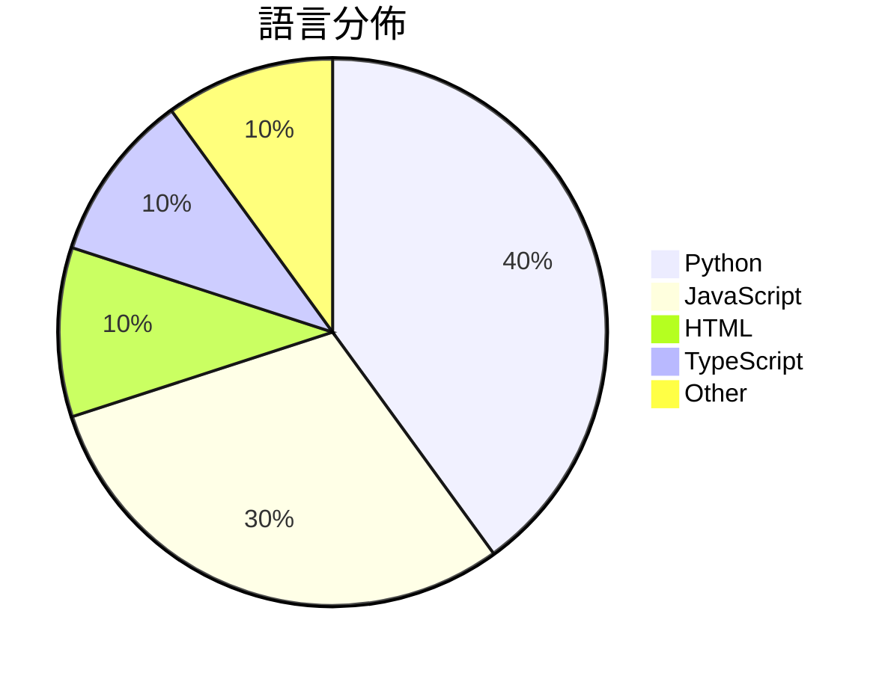

# GitHub Trending - 2026-07-13

> [!summary] 本日摘要
> 收錄 **10** 個新專案，合計 **11.1k** stars
> 語言分佈：Python (4) · JavaScript (3) · HTML (1) · TypeScript (1) · Other (1)

> [!tip] 本週焦點
> **[[withmarbleapp--os-taxonomy|withmarbleapp/os-taxonomy]]** — 4 天內累積 2.7k stars（687 stars/天）
> 提供一個開放的學習分類結構，幫助理解兒童在小學階段的學習內容。



---

## 收錄列表

| # | 專案 | 分類 | Stars | 速度 | 安裝 | 語言 | 用途 |
| :--: | --- | --- | ---: | ---: | --- | --- | --- |
| 1 | [[withmarbleapp--os-taxonomy\|withmarbleapp/os-taxonomy]] | 教育資源 | 2.7k | 687/天 | `easy` | JavaScript | 提供一個開放的學習分類結構，幫助理解兒童在小學階段的學習內容。 |
| 2 | [[Shpigford--knockoff\|Shpigford/knockoff]] | 開發工具 | 1.8k | 305/天 | `easy` | JavaScript | 過濾亞馬遜上的偽品牌商品，幫助用戶購買真正的知名品牌。 |
| 3 | [[oso95--scroll-world\|oso95/scroll-world]] | 開發工具 | 1.3k | 220/天 | `medium` | JavaScript | 將任何品牌轉換為可滾動的 3D 世界，提供沉浸式的網頁體驗。 |
| 4 | [[Robbyant--lingbot-world-v2\|Robbyant/lingbot-world-v2]] | AI/ML | 951 | 238/天 | `medium` | Python | 提供無限互動世界的模型，支持多樣化的互動行為。 |
| 5 | [[x4gKing--3x-ui-Upgrade\|x4gKing/3x-ui-Upgrade]] | 基礎設施 | 894 | 224/天 | `easy` | HTML | 提供一個簡單的方式在 Railway 上運行 Heimdall 面板，並通過單一 |
| 6 | [[Robbyant--lingbot-video\|Robbyant/lingbot-video]] | AI/ML | 717 | 179/天 | `medium` | Python | 提供一個開源的 Mixture-of-Experts 視頻生成模型，專注於具身智 |
| 7 | [[Robbyant--lingbot-vision\|Robbyant/lingbot-vision]] | AI/ML | 690 | 115/天 | `medium` | Python | 提供自我監督學習的視覺編碼器，專注於密集空間感知。 |
| 8 | [[vinhhien112--Three.js-Object-Sculptor-Codex-Plugin\|vinhhien112/Three.js-Object-Sculptor-Codex-Plugin]] | 開發工具 | 672 | 224/天 | `medium` | Python | 將附加的物件圖片轉換為僅包含代碼的、準備動畫的程序性 Three.js 模型。 |
| 9 | [[mereyabdenbekuly-ctrl--clodex-ide\|mereyabdenbekuly-ctrl/clodex-ide]] | 開發工具 | 641 | 641/天 | `medium` | TypeScript | 提供一個本地優先的零信任開發環境，專為可驗證的自動化軟體開發而設計。 |
| 10 | [[op7418--guizang-material-illustration\|op7418/guizang-material-illustration]] | 開發工具 | 598 | 120/天 | `easy` | N/A | 生成带中文标签的材质插画，解决社交卡片和文档中的配图需求。 |

---

## 重點摘要

### 1. [[withmarbleapp--os-taxonomy|withmarbleapp/os-taxonomy]] `教育資源`

> 提供一個開放的學習分類結構，幫助理解兒童在小學階段的學習內容。

**2.7k** stars · **687** stars/天 · JavaScript · `easy`

_建立 4 天就累積 2749 stars（687/天），forks 501（18.2%），顯示出強烈的社群關注。主要貢獻者 lauramionel 和 guillaumeboniface 在教育技術領域有豐富的經驗，之前的專案也獲得了良好的反響。這個專案解決了傳統課程資料的靜態性問題，提供了一個動態且可互動的學習圖譜，讓教師能夠更有效地追蹤學生的學習進度。社群的反饋也顯示出對於這種開放式學習資源的需求，特別是在教育科技快速發展的背景下。_

---

### 2. [[Shpigford--knockoff|Shpigford/knockoff]] `開發工具`

> 過濾亞馬遜上的偽品牌商品，幫助用戶購買真正的知名品牌。

**1.8k** stars · **305** stars/天 · JavaScript · `easy`

_建立 6 天就累積 1827 stars（305/天），forks 59（3.2%），顯示出穩定的增長趨勢。這個專案的作者 Shpigford 之前有開發過其他與網路相關的工具，這使得他在這個領域有一定的經驗。Knockoff 解決了亞馬遜上偽品牌商品泛濫的問題，這在過去是個難以解決的痛點，因為用戶通常無法辨別品牌的真實性。最近的媒體報導也為這個專案帶來了更多的曝光，進一步促進了其使用。隨著用戶對網路購物安全性的重視，這個工具的需求也隨之上升。forks/stars 比率在 3.2% 屬於中等，顯示出一些用戶對其進行了實際的修改和使用。_

---

### 3. [[oso95--scroll-world|oso95/scroll-world]] `開發工具`

> 將任何品牌轉換為可滾動的 3D 世界，提供沉浸式的網頁體驗。

**1.3k** stars · **220** stars/天 · JavaScript · `medium`

_建立 6 天內累積 1319 stars（220/天），forks 176（13.3%），顯示出相對活躍的使用者基礎。這個專案的作者 oso95 之前有開發其他與 AI 相關的工具，這次的專案解決了品牌展示頁面生成的痛點，讓使用者能夠輕鬆創建沉浸式的網頁體驗。近期的推廣可能來自於社交媒體的分享或開發者社群的討論。技術上，Higgsfield 的進步使得這種藝術生成變得可行，並且提供了高質量的視覺效果。forks/stars 比率為 13.3%，顯示出許多使用者在實際修改和使用這個工具。_

---

### 4. [[Robbyant--lingbot-world-v2|Robbyant/lingbot-world-v2]] `AI/ML`

> 提供無限互動世界的模型，支持多樣化的互動行為。

**951** stars · **238** stars/天 · Python · `medium`

_建立 4 天內累積 951 stars（238/天），forks 49（5.2%），顯示出穩定的增長潛力。這個專案的主要貢獻者來自 Robbyant 團隊，過去在 AI 和互動模型領域有豐富經驗。LingBot-World 2.0 解決了先前版本在互動性和反應速度上的不足，提供了一個更為強大的互動平台。近期的技術報告和模型釋出也引起了社群的關注，進一步推動了專案的曝光度。這些因素共同促成了其快速的成長。_

---

### 5. [[x4gKing--3x-ui-Upgrade|x4gKing/3x-ui-Upgrade]] `基礎設施`

> 提供一個簡單的方式在 Railway 上運行 Heimdall 面板，並通過單一端口管理 VLESS/WebSocket 連接。

**894** stars · **224** stars/天 · HTML · `easy`

_建立 4 天就累積 894 stars（224/天），forks 1858（207.8%），這顯示出極高的使用興趣。作者 x4gKing 在開源社群中活躍，這個專案解決了在 Railway 上運行 Heimdall 的需求，之前的解決方案通常需要多個端口配置，使用者反映不便。此專案的簡化部署流程和單一端口設計吸引了許多開發者的注意，尤其是在社群討論中引發了熱烈反響。技術上，Docker 的普及和 Railway 的易用性使得這個工具的實現變得可行，並且 forks/stars 比率高達 207.8%，顯示出許多開發者在實際修改和使用。_

---

### 6. [[Robbyant--lingbot-video|Robbyant/lingbot-video]] `AI/ML`

> 提供一個開源的 Mixture-of-Experts 視頻生成模型，專注於具身智能的預訓練。

**717** stars · **179** stars/天 · Python · `medium`

_建立 4 天內累積 717 stars（179/天），forks 26（3.6%），顯示出穩定的增長潛力。作者 Jiang Bonadia 具備相關背景，專注於視頻生成和具身智能的研究。LingBot-Video 解決了現有視頻生成模型在推理速度和數據整合上的不足，特別是對於具身智能的應用場景。最近的技術報告和模型釋出引起了社群的關注，並且在 Hugging Face 上的討論也顯示出其潛在的應用價值。這些因素共同推動了其快速的增長。_

---

### 7. [[Robbyant--lingbot-vision|Robbyant/lingbot-vision]] `AI/ML`

> 提供自我監督學習的視覺編碼器，專注於密集空間感知。

**690** stars · **115** stars/天 · Python · `medium`

_建立 6 天內累積 690 stars（115/天），forks 23（3.3%），顯示出穩定的增長潛力。主要貢獻者包括 cherubicXN 和 TakuLingFu，他們在自我監督學習和計算機視覺領域有豐富的經驗。LingBot-Vision 解決了傳統模型在處理邊界和形狀識別時的不足，特別是在密集空間感知任務中，這是之前的模型難以達成的。社群對於未來支持 Transformers 的計畫表示關注，這可能會進一步提升其功能性。整體來看，這個工具的流行是因為其在技術上的創新和實用性。_

---

### 8. [[vinhhien112--Three.js-Object-Sculptor-Codex-Plugin|vinhhien112/Three.js-Object-Sculptor-Codex-Plugin]] `開發工具`

> 將附加的物件圖片轉換為僅包含代碼的、準備動畫的程序性 Three.js 模型。

**672** stars · **224** stars/天 · Python · `medium`

_建立 3 天內累積 672 stars（224/天），forks 83（12.4%），顯示出相對較高的使用興趣。作者 vinhhien112 之前可能有其他相關的開發經驗，這個插件解決了在 3D 建模中自動化生成的痛點，特別是對於需要快速生成動畫準備模型的開發者。沒有明顯的觸發事件，但這種自動化工具的需求隨著遊戲和互動媒體的增長而上升。forks/stars 比率為 12.4%，顯示出相對較高的實際修改和使用意圖。_

---

### 9. [[mereyabdenbekuly-ctrl--clodex-ide|mereyabdenbekuly-ctrl/clodex-ide]] `開發工具`

> 提供一個本地優先的零信任開發環境，專為可驗證的自動化軟體開發而設計。

**641** stars · **641** stars/天 · TypeScript · `medium`

_建立 1 天就累積 641 stars（641/天），forks 137（21.4%），顯示出強烈的社群興趣。作者是一位獨立研究者，專注於零信任 AI 基礎設施，這樣的背景使得 Clodex 在安全性和可驗證性上有獨特的優勢。這個專案解決了傳統 IDE 在安全性和持續性上的不足，尤其是在自動化和 AI 驅動的開發環境中。社群的反饋和早期測試可能促使了這一快速增長的趨勢。技術上，這個專案的出現與對開發安全性需求的上升有關，尤其是在 AI 和自動化日益普及的背景下。forks/stars 比率達到 21.4%，顯示出許多開發者對這個專案的實際修改和使用。_

---

### 10. [[op7418--guizang-material-illustration|op7418/guizang-material-illustration]] `開發工具`

> 生成带中文标签的材质插画，解决社交卡片和文档中的配图需求。

**598** stars · **120** stars/天 · N/A · `easy`

_建立 5 天內累積 598 stars（120/天），forks 64（10.7%），顯示出不錯的增長潛力。作者過去的專案如 `guizang-social-card-skill` 提供了良好的基礎，這次專案解決了在社交媒體和文檔中需要有效插圖的痛點。這個技能的出現是因為對於可視化內容的需求日益增加，尤其是在教育和商業報告中。forks/stars 比率為 10.7%，顯示出不少用戶對此專案有實際的修改和使用需求。_

---

## 今日到期複習

> [!tip] 根據間隔複習排程，今天該回顧的專案

```dataview
TABLE
  stars_per_day AS "Stars/天",
  category AS "分類",
  engagement AS "參與度"
FROM "Repos"
WHERE next_review AND date(next_review) <= date("2026-07-13") AND status != "archived"
SORT priority DESC
```

## 待處理

```dataviewjs
const pending = dv.pages('"Repos"').where(p => p.status === "to-review").length;
const unrated = dv.pages('"Repos"').where(p => p.status !== "archived" && p.status !== "to-review" && (p.my_rating || 0) === 0).length;
const noVerdict = dv.pages('"Repos"').where(p => p.status !== "archived" && (p.my_rating || 0) > 0 && (!p.verdict || p.verdict === "")).length;
const items = [];
if (pending > 0) items.push(`**${pending}** 個待分流`);
if (unrated > 0) items.push(`**${unrated}** 個已讀但未評分`);
if (noVerdict > 0) items.push(`**${noVerdict}** 個已評分但無結論`);
if (items.length > 0) dv.paragraph(items.join(" / "));
else dv.paragraph("所有專案都已處理完畢！");
```
