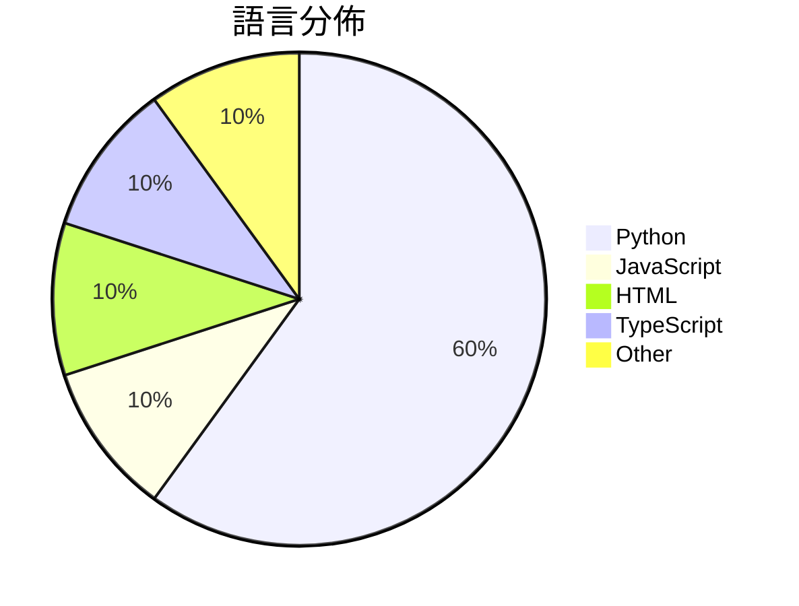

# GitHub Trending - 2026-07-14

> [!summary] 本日摘要
> 收錄 **10** 個新專案，合計 **10.0k** stars
> 語言分佈：Python (6) · JavaScript (1) · HTML (1) · TypeScript (1) · Other (1)

> [!tip] 本週焦點
> **[[withmarbleapp--os-taxonomy|withmarbleapp/os-taxonomy]]** — 5 天內累積 2.9k stars（589 stars/天）
> 提供一個開放的學習分類結構，幫助理解小孩在基礎教育階段的學習內容。



---

## 收錄列表

| # | 專案 | 分類 | Stars | 速度 | 安裝 | 語言 | 用途 |
| :--: | --- | --- | ---: | ---: | --- | --- | --- |
| 1 | [[withmarbleapp--os-taxonomy\|withmarbleapp/os-taxonomy]] | 其他 | 2.9k | 589/天 | `easy` | JavaScript | 提供一個開放的學習分類結構，幫助理解小孩在基礎教育階段的學習內容。 |
| 2 | [[Robbyant--lingbot-world-v2\|Robbyant/lingbot-world-v2]] | AI/ML | 1.0k | 210/天 | `medium` | Python | 提供無限互動的虛擬世界，並支援多樣化的互動元素。 |
| 3 | [[x4gKing--3x-ui-Upgrade\|x4gKing/3x-ui-Upgrade]] | 基礎設施 | 964 | 193/天 | `easy` | HTML | 提供一個簡化的 Heimdall 面板，透過單一端口在 Railway 上運行。 |
| 4 | [[vinhhien112--Three.js-Object-Sculptor-Codex-Plugin\|vinhhien112/Three.js-Object-Sculptor-Codex-Plugin]] | 開發工具 | 881 | 220/天 | `medium` | Python | 將附加的物件圖片轉換為僅包含代碼的、準備好動畫的程序性 Three.js 模型。 |
| 5 | [[Robbyant--lingbot-video\|Robbyant/lingbot-video]] | AI/ML | 765 | 153/天 | `medium` | Python | 提供一個開源的大規模混合專家視頻生成模型，專注於體現智能。 |
| 6 | [[MDX-Tom--gpt-5.6-instruct\|MDX-Tom/gpt-5.6-instruct]] | 其他 | 743 | 372/天 | `easy` | Python | 提供針對 gpt-5.6 系列的 Codex CLI 破甲提示詞與測試包，幫助進 |
| 7 | [[littledivy--mimic\|littledivy/mimic]] | 開發工具 | 730 | 730/天 | `easy` | Python | 讓你能夠攔截任何應用程式，並像使用庫一樣從 Python 調用它。 |
| 8 | [[mereyabdenbekuly-ctrl--clodex-ide\|mereyabdenbekuly-ctrl/clodex-ide]] | 開發工具 | 698 | 698/天 | `medium` | TypeScript | 提供可驗證的自主軟體開發的本地優先、零信任的智能 IDE。 |
| 9 | [[op7418--guizang-material-illustration\|op7418/guizang-material-illustration]] | 開發工具 | 637 | 106/天 | `easy` | N/A | 生成带中文标签的材质插画，解决社交卡片和文档中的配图需求。 |
| 10 | [[William-Lu-stack--LuxyAI\|William-Lu-stack/LuxyAI]] | 基礎設施 | 564 | 188/天 | `medium` | Python | 為 Kubernetes 和雲基礎設施提供自動化運維解決方案。 |

---

## 重點摘要

### 1. [[withmarbleapp--os-taxonomy|withmarbleapp/os-taxonomy]] `其他`

> 提供一個開放的學習分類結構，幫助理解小孩在基礎教育階段的學習內容。

**2.9k** stars · **589** stars/天 · JavaScript · `easy`

_建立 5 天內累積 2946 stars（589/天），forks 523（17.8%），顯示出強烈的社群關注。這個專案由 Marble 團隊開發，旨在解決傳統課程資料的局限性，提供一個結構化且開放的學習分類系統。過去的課程資料多為靜態且難以互動，而這個系統則提供了互動式的學習圖譜，讓教育者能夠更有效地追蹤學習進度。社群的反應也反映了對於教育資源開放和共享的需求。_

---

### 2. [[Robbyant--lingbot-world-v2|Robbyant/lingbot-world-v2]] `AI/ML`

> 提供無限互動的虛擬世界，並支援多樣化的互動元素。

**1.0k** stars · **210** stars/天 · Python · `medium`

_建立 5 天內累積 1048 stars（210/天），forks 60（5.7%），顯示出穩定的增長潛力。這個專案由 Robbyant 團隊開發，團隊成員在虛擬世界和互動模型方面有豐富的經驗。LingBot-World 2.0 解決了以往虛擬世界模型在互動性和性能上的不足，提供了一個更為靈活和高效的解決方案。近期的發布和技術報告引起了社群的關注，尤其是對於其在 Hugging Face 上的模型發布。這個專案的成功也得益於現今對於即時互動和虛擬環境需求的增加，讓其成為一個可行的選擇。forks/stars 比率為 5.7%，顯示出有一定的實際修改和使用需求。_

---

### 3. [[x4gKing--3x-ui-Upgrade|x4gKing/3x-ui-Upgrade]] `基礎設施`

> 提供一個簡化的 Heimdall 面板，透過單一端口在 Railway 上運行。

**964** stars · **193** stars/天 · HTML · `easy`

_建立 5 天內累積 964 stars（192.8/天），forks 1972（204.6%），顯示出強烈的社群興趣。作者 x4gKing 之前在開源社群有過其他貢獻，這個專案解決了在 Railway 上部署 Heimdall 面板的複雜性，之前使用者需要手動配置多個端口。這個專案的推出引起了開發者的關注，特別是在社交媒體上有不少討論。Docker 和 Nginx 的組合使得這個工具在現有的技術生態中更具可行性，特別是對於希望簡化部署流程的開發者。高達 204.6% 的 forks/stars 比率顯示出許多人在實際修改和使用這個專案。_

---

### 4. [[vinhhien112--Three.js-Object-Sculptor-Codex-Plugin|vinhhien112/Three.js-Object-Sculptor-Codex-Plugin]] `開發工具`

> 將附加的物件圖片轉換為僅包含代碼的、準備好動畫的程序性 Three.js 模型。

**881** stars · **220** stars/天 · Python · `medium`

_建立 4 天就累積 881 stars（220/天），forks 102（11.6%），顯示出強烈的社群興趣。作者 vinhhien112 之前在 3D 和 Codex 領域有過相關經驗，這個插件解決了傳統 3D 建模工具在快速生成和資源需求上的痛點，特別是對於小型開發團隊來說。最近的推廣活動和社群討論也可能促進了這個插件的曝光度。技術上，隨著 Codex 的進步，這個插件能夠利用 AI 生成高質量的 3D 模型，這在過去是難以實現的。高達 11.6% 的 forks/stars 比率顯示出許多開發者對這個工具的實際修改和使用，顯示出其潛在的實用性和靈活性。_

---

### 5. [[Robbyant--lingbot-video|Robbyant/lingbot-video]] `AI/ML`

> 提供一個開源的大規模混合專家視頻生成模型，專注於體現智能。

**765** stars · **153** stars/天 · Python · `medium`

_建立 5 天內累積 765 stars（153/天），forks 30（3.9%），顯示出一定的社群關注度。作者 Jiang Bonadia 在視頻生成和體現智能領域有豐富的經驗，這個專案解決了以往視頻生成模型在物理理解上的不足。此專案的推出正值對視頻生成技術需求上升的時期，特別是在 AI 應用中。forks/stars 比率為 3.9%，顯示出使用者對此專案的實際修改和應用意願。_

---

### 6. [[MDX-Tom--gpt-5.6-instruct|MDX-Tom/gpt-5.6-instruct]] `其他`

> 提供針對 gpt-5.6 系列的 Codex CLI 破甲提示詞與測試包，幫助進行安全研究與逆向工程。

**743** stars · **372** stars/天 · Python · `easy`

_建立 2 天內累積 743 stars（371.5/天），forks 170（22.9%），顯示出相對活躍的社群參與。作者 MDX-Tom 在開源社群中有一定的影響力，這個專案解決了在 gpt-5.6 系列中缺乏有效的破甲提示詞的痛點，特別是在安全研究和逆向工程領域。近期的社群討論和測試結果也引起了廣泛關注，促進了專案的快速成長。_

---

### 7. [[littledivy--mimic|littledivy/mimic]] `開發工具`

> 讓你能夠攔截任何應用程式，並像使用庫一樣從 Python 調用它。

**730** stars · **730** stars/天 · Python · `easy`

_建立 1 天就累積 730 stars（730/天），forks 25（3.4%），這顯示出相對較高的使用者興趣。作者 Divy Srivastava 之前的經驗和專業背景可能使得這個專案能夠快速吸引注意。mimic 解決了開發者在調用 API 時需要手動編寫客戶端的痛點，這在許多現有工具中並不常見。社群的反饋和使用者的需求也可能促進了這個專案的快速增長。由於其自動化的特性，這個工具在開發生態中具有明顯的優勢，尤其是在快速迭代和測試的場景下。_

---

### 8. [[mereyabdenbekuly-ctrl--clodex-ide|mereyabdenbekuly-ctrl/clodex-ide]] `開發工具`

> 提供可驗證的自主軟體開發的本地優先、零信任的智能 IDE。

**698** stars · **698** stars/天 · TypeScript · `medium`

_建立 1 天就累積 698 stars（698/天），forks 148（21.2%），顯示出極高的社群關注度。這個專案由獨立研究者開發，專注於零信任 AI 基礎設施，解決了傳統 IDE 在安全性和任務管理上的不足。Clodex 提供的持久任務和證據支持的記憶體是市場上少見的功能，這吸引了對安全開發有需求的開發者。社群的活躍度和早期測試的反饋也促進了其快速成長。_

---

### 9. [[op7418--guizang-material-illustration|op7418/guizang-material-illustration]] `開發工具`

> 生成带中文标签的材质插画，解决社交卡片和文档中的配图需求。

**637** stars · **106** stars/天 · N/A · `easy`

_建立 6 天就累積 637 stars（106/天），forks 64（10.0%），這顯示出強烈的初期興趣。作者在插畫和 AI 圖像生成領域有一定的背景，這個專案解決了以往社交媒體和文檔中缺乏有效插畫的痛點，特別是針對中文內容的需求。近期的推廣活動和社群反饋也促進了這個專案的曝光率。高 forks/stars 比率顯示出使用者對這個工具的實際修改和應用需求。_

---

### 10. [[William-Lu-stack--LuxyAI|William-Lu-stack/LuxyAI]] `基礎設施`

> 為 Kubernetes 和雲基礎設施提供自動化運維解決方案。

**564** stars · **188** stars/天 · Python · `medium`

_建立 3 天內累積 564 stars（188/天），forks 78（13.8%），顯示出良好的社群關注度。作者 William-Lu-stack 是一位專注於雲基礎設施的開發者，這個專案解決了傳統運維工具無法有效整合多種資源和操作的痛點。Flawless 提供的 AgenticOps 循環使得運維過程更為自動化和可控，這在當前雲端運維需求日益增長的背景下尤為重要。社群的反饋和活躍度也顯示出這個專案的潛力。_

---

## 今日到期複習

> [!tip] 根據間隔複習排程，今天該回顧的專案

```dataview
TABLE
  stars_per_day AS "Stars/天",
  category AS "分類",
  engagement AS "參與度"
FROM "Repos"
WHERE next_review AND date(next_review) <= date("2026-07-14") AND status != "archived"
SORT priority DESC
```

## 待處理

```dataviewjs
const pending = dv.pages('"Repos"').where(p => p.status === "to-review").length;
const unrated = dv.pages('"Repos"').where(p => p.status !== "archived" && p.status !== "to-review" && (p.my_rating || 0) === 0).length;
const noVerdict = dv.pages('"Repos"').where(p => p.status !== "archived" && (p.my_rating || 0) > 0 && (!p.verdict || p.verdict === "")).length;
const items = [];
if (pending > 0) items.push(`**${pending}** 個待分流`);
if (unrated > 0) items.push(`**${unrated}** 個已讀但未評分`);
if (noVerdict > 0) items.push(`**${noVerdict}** 個已評分但無結論`);
if (items.length > 0) dv.paragraph(items.join(" / "));
else dv.paragraph("所有專案都已處理完畢！");
```
