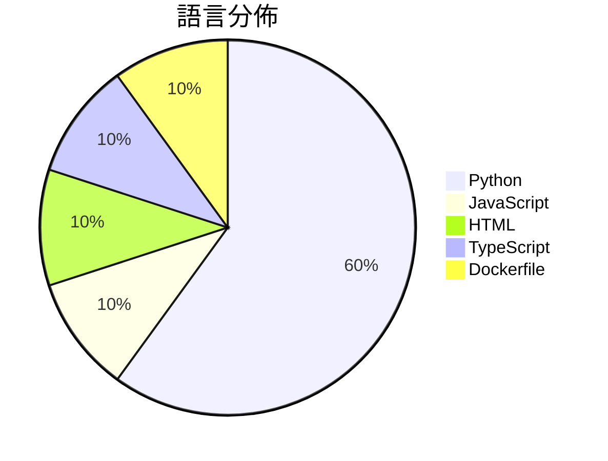

# GitHub Trending - 2026-07-15

> [!summary] 本日摘要
> 收錄 **10** 個新專案，合計 **11.1k** stars
> 語言分佈：Python (6) · JavaScript (1) · HTML (1) · TypeScript (1) · Dockerfile (1)

> [!tip] 本週焦點
> **[[withmarbleapp--os-taxonomy|withmarbleapp/os-taxonomy]]** — 6 天內累積 3.1k stars（510 stars/天）
> 提供一個開放的學習分類法，幫助追蹤小孩在基礎教育階段的學習進度。



---

## 收錄列表

| # | 專案 | 分類 | Stars | 速度 | 安裝 | 語言 | 用途 |
| :--: | --- | --- | ---: | ---: | --- | --- | --- |
| 1 | [[withmarbleapp--os-taxonomy\|withmarbleapp/os-taxonomy]] | 教育資源 | 3.1k | 510/天 | `easy` | JavaScript | 提供一個開放的學習分類法，幫助追蹤小孩在基礎教育階段的學習進度。 |
| 2 | [[Robbyant--lingbot-world-v2\|Robbyant/lingbot-world-v2]] | 其他 | 1.1k | 187/天 | `medium` | Python | 提供無限互動的虛擬世界，讓用戶能夠體驗多樣化的互動元素。 |
| 3 | [[MDX-Tom--gpt-5.6-instruct\|MDX-Tom/gpt-5.6-instruct]] | 開發工具 | 1.1k | 353/天 | `easy` | Python | 提供 gpt-5.6 系列的 Codex CLI 破甲提示词与测试包，專注於安全 |
| 4 | [[x4gKing--3x-ui-Upgrade\|x4gKing/3x-ui-Upgrade]] | 基礎設施 | 1.0k | 171/天 | `easy` | HTML | 提供一個整合 Heimdall 的面板，透過單一端口在 Railway 上運行  |
| 5 | [[vinhhien112--Three.js-Object-Sculptor-Codex-Plugin\|vinhhien112/Three.js-Object-Sculptor-Codex-Plugin]] | 開發工具 | 971 | 194/天 | `medium` | Python | 將附加的物體圖像轉換為僅代碼的、準備動畫的程序化 Three.js 模型。 |
| 6 | [[littledivy--mimic\|littledivy/mimic]] | 開發工具 | 912 | 912/天 | `easy` | Python | 透過攔截應用程式流量，讓你能像使用庫一樣在 Python 中調用它。 |
| 7 | [[mereyabdenbekuly-ctrl--clodex-ide\|mereyabdenbekuly-ctrl/clodex-ide]] | 開發工具 | 801 | 401/天 | `medium` | TypeScript | 提供一個本地優先、零信任的自主 IDE，以支持可驗證的自動化軟體開發。 |
| 8 | [[Robbyant--lingbot-video\|Robbyant/lingbot-video]] | AI/ML | 789 | 132/天 | `medium` | Python | 提供一個開源的大規模混合專家視頻生成模型，專注於體現智能。 |
| 9 | [[AlephAITech--WorkBuddyGuide\|AlephAITech/WorkBuddyGuide]] | 開發工具 | 720 | 180/天 | `medium` | Python | 提供實用的開源指南，幫助用戶通過真實工作流程掌握 WorkBuddy。 |
| 10 | [[x4gKing--Marzban-Panel\|x4gKing/Marzban-Panel]] | 基礎設施 | 672 | 336/天 | `easy` | Dockerfile | 提供一個簡化的 Marzban 部署面板，透過 Docker 自動獲取最新源碼。 |

---

## 重點摘要

### 1. [[withmarbleapp--os-taxonomy|withmarbleapp/os-taxonomy]] `教育資源`

> 提供一個開放的學習分類法，幫助追蹤小孩在基礎教育階段的學習進度。

**3.1k** stars · **510** stars/天 · JavaScript · `easy`

_建立 6 天內累積 3060 stars（510/天），forks 532（17.4%），顯示出強烈的社群興趣。這個專案由 Marble 團隊開發，專注於提供一個開放的學習分類法，解決了傳統課程資料的靜態和封閉問題。之前的解決方案往往是平面的標準列表，無法有效展示學習主題之間的關聯。這個專案的推出正好填補了這一空白，並且在社群中引發了討論和興趣。作者的背景和先前的工作經驗也為這個專案的成功奠定了基礎。_

---

### 2. [[Robbyant--lingbot-world-v2|Robbyant/lingbot-world-v2]] `其他`

> 提供無限互動的虛擬世界，讓用戶能夠體驗多樣化的互動元素。

**1.1k** stars · **187** stars/天 · Python · `medium`

_建立 6 天就累積 1122 stars（187/天），forks 65（5.8%），這顯示出相對穩定的興趣增長。主要貢獻者包括 zelingao98 和 pPetrichor，他們在開源社群中有一定的影響力。這個專案解決了以往虛擬世界互動的延遲問題，並提供了多樣化的互動元素，這在現有工具中並不常見。近期的技術報告發佈和模型釋出也吸引了更多開發者的注意。技術生態的進步，特別是在 GPU 加速和深度學習模型的發展，使得這個工具的實現變得可行。forks/stars 比率顯示出使用者對於修改和擴展的興趣，這意味著社群活躍度較高。_

---

### 3. [[MDX-Tom--gpt-5.6-instruct|MDX-Tom/gpt-5.6-instruct]] `開發工具`

> 提供 gpt-5.6 系列的 Codex CLI 破甲提示词与测试包，專注於安全研究和逆向工程。

**1.1k** stars · **353** stars/天 · Python · `easy`

_建立 3 天內累積 1060 stars（353/天），forks 209（19.7%），這顯示出強烈的社群興趣。作者 MDX-Tom 以往在開源領域有豐富經驗，這個專案解決了之前缺乏針對 gpt-5.6 系列的有效破甲提示詞的痛點，讓使用者能夠更方便地進行安全研究和逆向工程。近期的技術討論和社群反饋也促進了這個專案的曝光率。這些因素共同推動了它的快速增長。_

---

### 4. [[x4gKing--3x-ui-Upgrade|x4gKing/3x-ui-Upgrade]] `基礎設施`

> 提供一個整合 Heimdall 的面板，透過單一端口在 Railway 上運行 VLESS/WebSocket 服務。

**1.0k** stars · **171** stars/天 · HTML · `easy`

_建立 6 天就累積 1028 stars（171/天），forks 2102（204.5%），這顯示出極高的使用興趣。作者 x4gKing 似乎專注於簡化 VLESS/WebSocket 的部署，這在當前需要簡單解決方案的環境中非常受歡迎。這個專案解決了以往需要多端口配置的複雜性，提供了一個更為簡單的替代方案。社群的反應也顯示出對於這種簡化流程的需求，特別是在 Railway 這樣的平台上。forks/stars 比率高達 204.5%，顯示出許多人在實際修改和使用這個專案。_

---

### 5. [[vinhhien112--Three.js-Object-Sculptor-Codex-Plugin|vinhhien112/Three.js-Object-Sculptor-Codex-Plugin]] `開發工具`

> 將附加的物體圖像轉換為僅代碼的、準備動畫的程序化 Three.js 模型。

**971** stars · **194** stars/天 · Python · `medium`

_建立 5 天就累積 971 stars（194/天），forks 113（11.6%），顯示出穩定的增長潛力。作者 vinhhien112 在開源社群中活躍，這個插件解決了從圖像生成高質量 3D 模型的需求，尤其是在遊戲和動畫領域。這個工具的出現填補了市場上對於程序化生成模型的需求，特別是在需要自定義和動畫準備的場景中。社群的反應顯示出對於這種創新的需求，並且目前只有少數幾個工具能夠提供類似的功能。forks/stars 比率顯示出許多人在實際修改和使用這個工具，這意味著它不僅僅是觀望，而是有實際的應用場景。_

---

### 6. [[littledivy--mimic|littledivy/mimic]] `開發工具`

> 透過攔截應用程式流量，讓你能像使用庫一樣在 Python 中調用它。

**912** stars · **912** stars/天 · Python · `easy`

_建立 1 天就累積 912 stars（912/天），forks 33（3.6%），這顯示出其受到開發者的快速關注。作者 littledivy 是一位活躍的開發者，過去有其他開源專案經驗。這個專案解決了開發者在調用 API 時的繁瑣手動編碼問題，通過自動生成客戶端來簡化流程。此工具的出現恰逢開發者對於快速開發和測試 API 的需求上升。forks/stars 比率相對較低，顯示出目前使用者主要是觀望，尚未進行大量修改。_

---

### 7. [[mereyabdenbekuly-ctrl--clodex-ide|mereyabdenbekuly-ctrl/clodex-ide]] `開發工具`

> 提供一個本地優先、零信任的自主 IDE，以支持可驗證的自動化軟體開發。

**801** stars · **401** stars/天 · TypeScript · `medium`

_建立 2 天就累積 801 stars（401/天），forks 148（18.5%），這顯示出相對較高的社群參與度。作者 mereyabdenbekuly-ctrl 是一位專注於自主開發環境的開發者，這個專案解決了傳統 IDE 在安全性和持久性上的不足。由於 Clodex 提供了明確的政策和用戶控制的審核，這在當前對安全性要求日益提高的開發環境中顯得尤為重要。社群的活躍度和對於早期測試的需求可能是促使其快速增長的原因之一。_

---

### 8. [[Robbyant--lingbot-video|Robbyant/lingbot-video]] `AI/ML`

> 提供一個開源的大規模混合專家視頻生成模型，專注於體現智能。

**789** stars · **132** stars/天 · Python · `medium`

_建立 6 天內累積 789 stars（132/天），forks 30（3.8%），顯示出穩定的增長。這個專案的主要貢獻者是 jiangbonadia，過去在視頻生成和體現智能領域有豐富經驗。LingBot-Video 解決了現有視頻生成模型在體現智能方面的不足，特別是在多任務和長期操作的能力上。最近的技術報告和模型釋出可能吸引了開發者的注意，進一步推動了其受歡迎程度。與此同時，技術生態的進步，如更強大的 GPU 和深度學習框架，讓這種模型的實現變得可行。forks/stars 比率顯示出用戶對該專案的實際修改和使用意願相對較低，可能仍在觀望階段。_

---

### 9. [[AlephAITech--WorkBuddyGuide|AlephAITech/WorkBuddyGuide]] `開發工具`

> 提供實用的開源指南，幫助用戶通過真實工作流程掌握 WorkBuddy。

**720** stars · **180** stars/天 · Python · `medium`

_建立 4 天內累積 720 stars（180/天），forks 100（13.9%），顯示出強勁的增長潛力。這個專案的主要貢獻者來自於活躍的開源社群，並且他們在 AI 和自動化領域有著豐富的經驗。這本指南解決了用戶在使用 WorkBuddy 時缺乏實用案例的痛點，之前用戶只能依賴官方文檔，但往往難以應用到實際工作中。近期的推廣活動和社群討論也增加了專案的曝光率。技術上，這個專案的出現與 Node.js 和前端框架的成熟密切相關，這使得它能夠快速構建和部署。forks/stars 比率為 13.9%，顯示出有相當比例的用戶在積極修改和使用這個專案，這是社群參與度的良好指標。_

---

### 10. [[x4gKing--Marzban-Panel|x4gKing/Marzban-Panel]] `基礎設施`

> 提供一個簡化的 Marzban 部署面板，透過 Docker 自動獲取最新源碼。

**672** stars · **336** stars/天 · Dockerfile · `easy`

_建立 2 天內累積 672 stars（336/天），forks 1174（174.7%），這顯示出極高的使用興趣。作者 x4gKing 以簡化部署流程為目標，解決了傳統手動更新的繁瑣問題，這在開發者社群中引起了廣泛關注。由於其自動獲取最新源碼的特性，讓許多開發者感受到便利，特別是在快速迭代的環境中。這個專案的成功也反映了現代開發中對於自動化和簡化流程的需求。_

---

## 今日到期複習

> [!tip] 根據間隔複習排程，今天該回顧的專案

```dataview
TABLE
  stars_per_day AS "Stars/天",
  category AS "分類",
  engagement AS "參與度"
FROM "Repos"
WHERE next_review AND date(next_review) <= date("2026-07-15") AND status != "archived"
SORT priority DESC
```

## 待處理

```dataviewjs
const pending = dv.pages('"Repos"').where(p => p.status === "to-review").length;
const unrated = dv.pages('"Repos"').where(p => p.status !== "archived" && p.status !== "to-review" && (p.my_rating || 0) === 0).length;
const noVerdict = dv.pages('"Repos"').where(p => p.status !== "archived" && (p.my_rating || 0) > 0 && (!p.verdict || p.verdict === "")).length;
const items = [];
if (pending > 0) items.push(`**${pending}** 個待分流`);
if (unrated > 0) items.push(`**${unrated}** 個已讀但未評分`);
if (noVerdict > 0) items.push(`**${noVerdict}** 個已評分但無結論`);
if (items.length > 0) dv.paragraph(items.join(" / "));
else dv.paragraph("所有專案都已處理完畢！");
```
