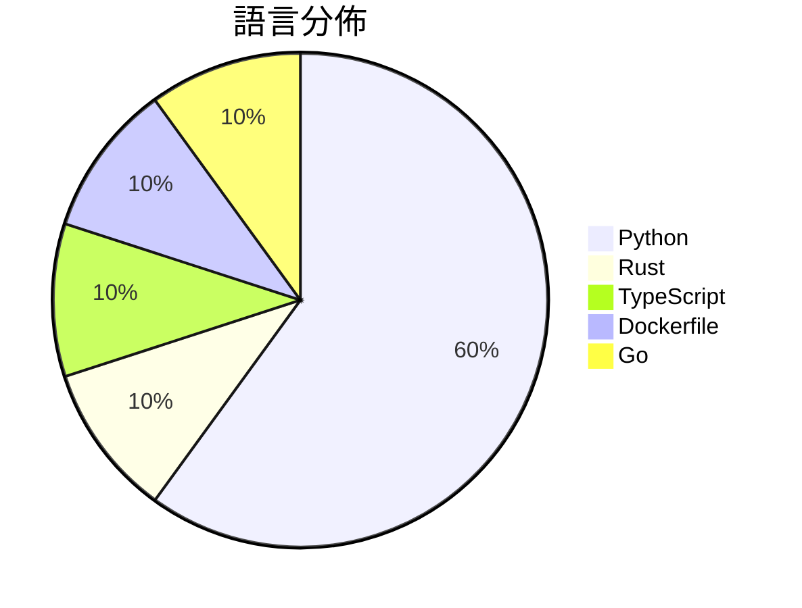

# GitHub Trending - 2026-07-16

> [!summary] 本日摘要
> 收錄 **10** 個新專案，合計 **13.2k** stars
> 語言分佈：Python (6) · Rust (1) · TypeScript (1) · Dockerfile (1) · Go (1)

> [!tip] 本週焦點
> **[[xai-org--grok-build|xai-org/grok-build]]** — 1 天內累積 5.3k stars（5.3k stars/天）
> 提供一個終端機界面的 AI 編碼代理，支持互動式編輯和任務管理。



---

## 收錄列表

| # | 專案 | 分類 | Stars | 速度 | 安裝 | 語言 | 用途 |
| :--: | --- | --- | ---: | ---: | --- | --- | --- |
| 1 | [[xai-org--grok-build\|xai-org/grok-build]] | 開發工具 | 5.3k | 5.3k/天 | `medium` | Rust | 提供一個終端機界面的 AI 編碼代理，支持互動式編輯和任務管理。 |
| 2 | [[MDX-Tom--gpt-5.6-instruct\|MDX-Tom/gpt-5.6-instruct]] | 開發工具 | 1.4k | 352/天 | `easy` | Python | 提供针对 gpt-5.6 系列的 Codex CLI 破甲提示词与测试包。 |
| 3 | [[littledivy--mimic\|littledivy/mimic]] | 開發工具 | 1.0k | 517/天 | `easy` | Python | 透過攔截應用程式流量，讓 Python 像使用庫一樣呼叫它。 |
| 4 | [[vinhhien112--Three.js-Object-Sculptor-Codex-Plugin\|vinhhien112/Three.js-Object-Sculptor-Codex-Plugin]] | 開發工具 | 1.0k | 170/天 | `medium` | Python | 將附加的物件圖片轉換為僅包含代碼的、準備好動畫的程序化 Three.js 模型。 |
| 5 | [[AlephAITech--WorkBuddyGuide\|AlephAITech/WorkBuddyGuide]] | 開發工具 | 837 | 167/天 | `easy` | Python | 提供實用的開源指南，幫助用戶透過真實工作流掌握 WorkBuddy。 |
| 6 | [[mereyabdenbekuly-ctrl--clodex-ide\|mereyabdenbekuly-ctrl/clodex-ide]] | 開發工具 | 812 | 271/天 | `medium` | TypeScript | 提供一個本地優先的零信任開發環境，支援可驗證的自動化軟體開發。 |
| 7 | [[x4gKing--Marzban-Panel\|x4gKing/Marzban-Panel]] | 基礎設施 | 776 | 259/天 | `easy` | Dockerfile | 提供一個簡化的 Marzban 控制面板部署方式，透過 Docker 自動獲取最 |
| 8 | [[Kappaemme-git--codex-first-customer-finder-skill\|Kappaemme-git/codex-first-customer-finder-skill]] | 開發工具 | 712 | 237/天 | `easy` | Python | 幫助創業公司找到潛在的第一批客戶，基於公開信號進行證據支持的分析。 |
| 9 | [[cosmtrek--mindwalk\|cosmtrek/mindwalk]] | 開發工具 | 706 | 118/天 | `easy` | Go | 在 3D 地圖上重播編碼代理會話，讓你可視化代碼庫的操作過程。 |
| 10 | [[pengchujin--jzsub\|pengchujin/jzsub]] | 開發工具 | 683 | 137/天 | `medium` | Python | 自動交付最高畫質的視頻、封面和雙語字幕 MP4。 |

---

## 重點摘要

### 1. [[xai-org--grok-build|xai-org/grok-build]] `開發工具`

> 提供一個終端機界面的 AI 編碼代理，支持互動式編輯和任務管理。

**5.3k** stars · **5.3k** stars/天 · Rust · `medium`

_建立 1 天就累積 5254 stars（5254/天），forks 778（14.8%），顯示出強烈的社群興趣。作者 grokkybara 是一個活躍的貢獻者，這個專案解決了現有編碼工具在互動性和可擴展性上的不足。之前的工具多數缺乏靈活的 TUI 界面，無法有效支持長時間任務的管理。這個專案的推出引起了社群的關注，尤其是在開源開發者中。技術上，Rust 的使用讓這個工具在性能上有了保障，並且能夠在多平台上運行。forks/stars 比率 14.8% 表示許多人對其進行了實際修改和使用，顯示出良好的社群活躍度。_

---

### 2. [[MDX-Tom--gpt-5.6-instruct|MDX-Tom/gpt-5.6-instruct]] `開發工具`

> 提供针对 gpt-5.6 系列的 Codex CLI 破甲提示词与测试包。

**1.4k** stars · **352** stars/天 · Python · `easy`

_建立 4 天就累積 1407 stars（352/天），forks 274（19.5%），這顯示出相對高的使用興趣。作者 MDX-Tom 在開源社群中活躍，過去的項目也涉及類似的安全研究領域。這個專案解決了之前缺乏有效提示詞的痛點，讓使用者能夠更方便地進行安全測試。近期的社群討論和需求也促進了這個工具的快速增長，特別是在安全研究和逆向工程的需求上。forks/stars 比率為 19.5%，顯示出許多人在實際使用和修改這個工具。_

---

### 3. [[littledivy--mimic|littledivy/mimic]] `開發工具`

> 透過攔截應用程式流量，讓 Python 像使用庫一樣呼叫它。

**1.0k** stars · **517** stars/天 · Python · `easy`

_建立 2 天就累積 1034 stars（517/天），forks 43（4.2%），這顯示出強勁的增長潛力。作者 Divy Srivastava 過去在開源社群中活躍，這個專案解決了開發者在與 API 互動時的繁瑣流程，特別是自動生成客戶端的功能，讓開發者能夠更專注於業務邏輯而非底層實現。這樣的需求在當前快速變化的開發環境中非常迫切，尤其是對於移動應用的開發者來說。社群對於這個專案的反應熱烈，顯示出其潛在的市場需求。_

---

### 4. [[vinhhien112--Three.js-Object-Sculptor-Codex-Plugin|vinhhien112/Three.js-Object-Sculptor-Codex-Plugin]] `開發工具`

> 將附加的物件圖片轉換為僅包含代碼的、準備好動畫的程序化 Three.js 模型。

**1.0k** stars · **170** stars/天 · Python · `medium`

_建立 6 天就累積 1020 stars（170/天），forks 115（11.3%），顯示出強勁的增長潛力。作者 vinhhien112 之前有開發其他與 Codex 相關的工具，這次的插件解決了傳統 3D 建模工具在處理圖片轉換時的不足，特別是在程序化生成方面。這個插件的推出正好填補了市場上對於高效能、動畫準備的 3D 模型生成工具的需求。社群的反應熱烈，可能是因為它提供了一種全新的工作流程，讓開發者能夠更快速地生成可用的 3D 模型。_

---

### 5. [[AlephAITech--WorkBuddyGuide|AlephAITech/WorkBuddyGuide]] `開發工具`

> 提供實用的開源指南，幫助用戶透過真實工作流掌握 WorkBuddy。

**837** stars · **167** stars/天 · Python · `easy`

_建立 5 天就累積 837 stars（167/天），forks 118（14.1%），這顯示出強烈的社群興趣。專案的主要貢獻者來自於多位活躍的開發者，這保證了專案的持續更新和維護。它解決了許多用戶在使用 WorkBuddy 時面臨的實際問題，提供了真實的工作流案例，這在其他指南中並不常見。社群的活躍度和對實際案例的需求推動了這個專案的快速成長。_

---

### 6. [[mereyabdenbekuly-ctrl--clodex-ide|mereyabdenbekuly-ctrl/clodex-ide]] `開發工具`

> 提供一個本地優先的零信任開發環境，支援可驗證的自動化軟體開發。

**812** stars · **271** stars/天 · TypeScript · `medium`

_建立 3 天內累積 812 stars（271/天），forks 148（18.2%），顯示出強烈的社群興趣。作者是 mereyabdenbekuly-ctrl，專注於開發安全的開源工具。Clodex 解決了傳統 IDE 在安全性和可驗證性上的不足，提供了一個可以持久化任務的環境。這種設計在當前對於安全和透明度要求日益增加的背景下，顯得尤為重要。社群的反饋和需求可能促進了這個專案的快速增長。_

---

### 7. [[x4gKing--Marzban-Panel|x4gKing/Marzban-Panel]] `基礎設施`

> 提供一個簡化的 Marzban 控制面板部署方式，透過 Docker 自動獲取最新版本。

**776** stars · **259** stars/天 · Dockerfile · `easy`

_建立 3 天內累積 776 stars（259/天），forks 1408（181.4%），顯示出極高的社群參與度。作者 x4gKing 之前可能有其他成功的專案，這次專案解決了用戶在部署 Marzban 時的繁瑣過程，提供了一個即時更新的解決方案。社群對於這種簡化部署的需求顯然存在，特別是在 DevOps 環境中，這樣的工具能夠顯著提高工作效率。_

---

### 8. [[Kappaemme-git--codex-first-customer-finder-skill|Kappaemme-git/codex-first-customer-finder-skill]] `開發工具`

> 幫助創業公司找到潛在的第一批客戶，基於公開信號進行證據支持的分析。

**712** stars · **237** stars/天 · Python · `easy`

_建立 3 天就累積 712 stars（237/天），forks 68（9.6%），顯示出相對活躍的社群參與。作者 Kappaemme-git 和 a692570 似乎在創業工具領域有一定的背景，這個專案解決了早期客戶發掘的痛點，特別是針對初創企業的需求。這個工具的出現正好迎合了市場對於證據支持的客戶發掘需求，並且避免了自動化聯繫的風險。社群的反應也顯示出對於手動聯繫的需求，這可能是因為目前市場上缺乏類似的解決方案。forks/stars 比率為 9.6%，顯示出有相當比例的用戶在實際修改或使用這個工具。_

---

### 9. [[cosmtrek--mindwalk|cosmtrek/mindwalk]] `開發工具`

> 在 3D 地圖上重播編碼代理會話，讓你可視化代碼庫的操作過程。

**706** stars · **118** stars/天 · Go · `easy`

_建立 6 天就累積 706 stars（118/天），forks 42（5.9%），顯示出良好的增長潛力。作者 cosmtrek 是一位活躍的開發者，過去有多個開源貢獻。mindwalk 解決了傳統日誌記錄無法提供上下文的痛點，讓開發者能夠更直觀地理解代理的行為。最近的推廣活動和社群討論也為其吸引了注意。隨著開源生態的發展，這類可視化工具的需求逐漸上升，特別是在代碼複雜度增加的情況下。forks/stars 比率在中等範圍，顯示出一些用戶正在實際修改和使用此工具。_

---

### 10. [[pengchujin--jzsub|pengchujin/jzsub]] `開發工具`

> 自動交付最高畫質的視頻、封面和雙語字幕 MP4。

**683** stars · **137** stars/天 · Python · `medium`

_建立 5 天就累積 683 stars（137/天），forks 74（10.8%），這顯示出穩定的增長趨勢。作者 pengchujin 之前有開發過其他視頻處理相關工具，這次的 JZSub 解決了視頻下載和字幕生成的痛點，特別是對於需要雙語字幕的用戶。這個工具的推出正好符合了對高品質視頻內容需求的增長，並且在社交媒體上獲得了一定的討論。技術上，隨著 Python 生態系統的成熟，這樣的工具變得越來越可行，且 forks/stars 比率顯示出許多用戶對其進行了實際修改和使用。_

---

## 今日到期複習

> [!tip] 根據間隔複習排程，今天該回顧的專案

```dataview
TABLE
  stars_per_day AS "Stars/天",
  category AS "分類",
  engagement AS "參與度"
FROM "Repos"
WHERE next_review AND date(next_review) <= date("2026-07-16") AND status != "archived"
SORT priority DESC
```

## 待處理

```dataviewjs
const pending = dv.pages('"Repos"').where(p => p.status === "to-review").length;
const unrated = dv.pages('"Repos"').where(p => p.status !== "archived" && p.status !== "to-review" && (p.my_rating || 0) === 0).length;
const noVerdict = dv.pages('"Repos"').where(p => p.status !== "archived" && (p.my_rating || 0) > 0 && (!p.verdict || p.verdict === "")).length;
const items = [];
if (pending > 0) items.push(`**${pending}** 個待分流`);
if (unrated > 0) items.push(`**${unrated}** 個已讀但未評分`);
if (noVerdict > 0) items.push(`**${noVerdict}** 個已評分但無結論`);
if (items.length > 0) dv.paragraph(items.join(" / "));
else dv.paragraph("所有專案都已處理完畢！");
```
