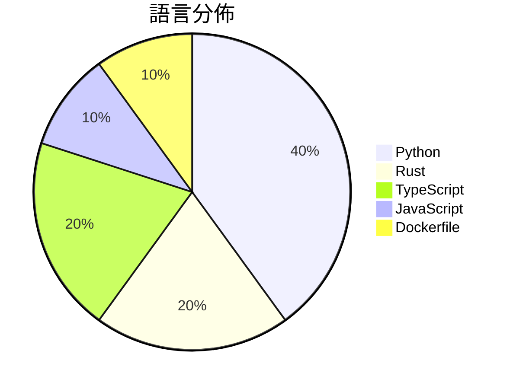

# GitHub Trending - 2026-07-17

> [!summary] 本日摘要
> 收錄 **10** 個新專案，合計 **27.6k** stars
> 語言分佈：Python (4) · Rust (2) · TypeScript (2) · JavaScript (1) · Dockerfile (1)

> [!tip] 本週焦點
> **[[xai-org--grok-build|xai-org/grok-build]]** — 2 天內累積 13.0k stars（6.5k stars/天）
> 提供一個全螢幕的終端互動式 AI 編碼代理，能夠編輯檔案、執行命令和管理長期任務。



---

## 收錄列表

| # | 專案 | 分類 | Stars | 速度 | 安裝 | 語言 | 用途 |
| :--: | --- | --- | ---: | ---: | --- | --- | --- |
| 1 | [[xai-org--grok-build\|xai-org/grok-build]] | 開發工具 | 13.0k | 6.5k/天 | `medium` | Rust | 提供一個全螢幕的終端互動式 AI 編碼代理，能夠編輯檔案、執行命令和管理長期任務 |
| 2 | [[Fei-Away--Codex-Dream-Skin\|Fei-Away/Codex-Dream-Skin]] | 開發工具 | 6.4k | 6.4k/天 | `medium` | JavaScript | 為 Codex 桌面端提供可互動的主題換膚工具，讓使用者能夠自定義界面風格。 |
| 3 | [[MDX-Tom--gpt-5.6-instruct\|MDX-Tom/gpt-5.6-instruct]] | 開發工具 | 1.7k | 344/天 | `easy` | Python | 提供針對 gpt-5.6 系列的 Codex CLI 破甲提示詞與測試包，助力安 |
| 4 | [[littledivy--mimic\|littledivy/mimic]] | 開發工具 | 1.1k | 369/天 | `easy` | Python | 讓你能夠攔截任何應用程式，並像使用函式庫一樣從 Python 調用它。 |
| 5 | [[pixel-point--aval\|pixel-point/aval]] | 開發工具 | 1.1k | 356/天 | `medium` | TypeScript | 提供一種新的互動視頻格式，支持狀態機、精確過渡和透明度。 |
| 6 | [[AlephAITech--WorkBuddyGuide\|AlephAITech/WorkBuddyGuide]] | 開發工具 | 1.0k | 168/天 | `medium` | Python | 提供實用的開源指南，幫助用戶掌握 WorkBuddy 的實際工作流程。 |
| 7 | [[CluvexStudio--Aether\|CluvexStudio/Aether]] | 安全 | 941 | 471/天 | `medium` | Rust | 提供一個用於繞過網路審查的用戶空間代理客戶端。 |
| 8 | [[x4gKing--Marzban-Panel\|x4gKing/Marzban-Panel]] | 基礎設施 | 847 | 212/天 | `easy` | Dockerfile | 提供一個簡化的 Marzban 面板部署方式，透過 Docker 自動獲取最新源 |
| 9 | [[mereyabdenbekuly-ctrl--clodex-ide\|mereyabdenbekuly-ctrl/clodex-ide]] | 開發工具 | 829 | 207/天 | `medium` | TypeScript | 提供一個本地優先、零信任的自動化 IDE，讓軟體開發過程可驗證且自主。 |
| 10 | [[Kappaemme-git--codex-first-customer-finder-skill\|Kappaemme-git/codex-first-customer-finder-skill]] | 開發工具 | 761 | 190/天 | `easy` | Python | 透過公共信號找到潛在的第一批客戶，幫助新創公司進行客戶發掘。 |

---

## 重點摘要

### 1. [[xai-org--grok-build|xai-org/grok-build]] `開發工具`

> 提供一個全螢幕的終端互動式 AI 編碼代理，能夠編輯檔案、執行命令和管理長期任務。

**13.0k** stars · **6.5k** stars/天 · Rust · `medium`

_建立 2 天內累積 12986 stars（6493/天），forks 2315（17.8%），這顯示出其快速增長的潛力。主要貢獻者 grokkybara[bot] 來自 SpaceXAI，該團隊在 AI 和編碼代理領域有豐富的經驗。Grok Build 解決了傳統編碼工具缺乏互動性和即時反饋的痛點，讓開發者能夠更有效率地進行代碼編輯和測試。隨著 AI 技術的進步，這個工具在開發流程中的應用變得越來越重要。forks/stars 比率為 17.8%，顯示出許多開發者對其進行實際修改和使用。_

---

### 2. [[Fei-Away--Codex-Dream-Skin|Fei-Away/Codex-Dream-Skin]] `開發工具`

> 為 Codex 桌面端提供可互動的主題換膚工具，讓使用者能夠自定義界面風格。

**6.4k** stars · **6.4k** stars/天 · JavaScript · `medium`

_建立 1 天就累積 6371 stars（6371/天），forks 724（11.4%），這顯示出強烈的用戶興趣。主要貢獻者來自不同背景，顯示出社群的多樣性。這個工具解決了 Codex 用戶在界面美化上的需求，之前的解決方案往往需要修改官方文件，這使得使用者面臨安全風險。近期的推廣活動和社交媒體的討論也可能促進了其快速增長。此工具的設計理念符合當前對界面美學和用戶體驗的重視，讓使用者能夠在不影響功能的情況下，提升使用的愉悅感。_

---

### 3. [[MDX-Tom--gpt-5.6-instruct|MDX-Tom/gpt-5.6-instruct]] `開發工具`

> 提供針對 gpt-5.6 系列的 Codex CLI 破甲提示詞與測試包，助力安全研究與逆向工程。

**1.7k** stars · **344** stars/天 · Python · `easy`

_建立 5 天就累積 1718 stars（344/天），forks 330（19.2%），這顯示出強烈的社群參與。作者 MDX-Tom 之前的專案積累了豐富的經驗，這次專案解決了在安全研究和逆向工程中，對於高效提示詞的需求，尤其是在面對 gpt-5.6 系列模型時。社群對於安全研究的關注和需求也促進了這個專案的快速成長。此專案的設計使得用戶能夠更容易地進行安全測試，並提高了測試的成功率，這是之前工具所無法達到的。_

---

### 4. [[littledivy--mimic|littledivy/mimic]] `開發工具`

> 讓你能夠攔截任何應用程式，並像使用函式庫一樣從 Python 調用它。

**1.1k** stars · **369** stars/天 · Python · `easy`

_建立 3 天就累積 1108 stars（369/天），forks 57（5.1%），這顯示出相當高的興趣。作者 littledivy 是一位活躍的開發者，過去在開源社群中有多個貢獻。這個工具解決了開發者在調用 API 時的繁瑣流程，特別是自動生成客戶端的功能，讓開發者能夠更專注於業務邏輯而非 API 的細節。最近的推文和社群討論也引發了對這個工具的關注。隨著對 API 整合需求的增加，這個工具的實用性愈發凸顯。forks/stars 比率適中，顯示出使用者對其進行修改的潛力。_

---

### 5. [[pixel-point--aval|pixel-point/aval]] `開發工具`

> 提供一種新的互動視頻格式，支持狀態機、精確過渡和透明度。

**1.1k** stars · **356** stars/天 · TypeScript · `medium`

_建立 3 天內累積 1069 stars（356/天），forks 62（5.8%），顯示出強烈的興趣。作者 lnikell 之前在開源領域有一定的貢獻，這個專案解決了互動視頻格式在網頁應用中的不足，特別是對於狀態機和透明度的支持。雖然目前的問題解決率為 0%，但這也反映出專案仍在早期階段，開發者可能需要耐心等待改進。這個工具的出現正好契合了現代網頁應用對於高效能視頻處理的需求，特別是在互動性和用戶體驗上。_

---

### 6. [[AlephAITech--WorkBuddyGuide|AlephAITech/WorkBuddyGuide]] `開發工具`

> 提供實用的開源指南，幫助用戶掌握 WorkBuddy 的實際工作流程。

**1.0k** stars · **168** stars/天 · Python · `medium`

_建立 6 天就累積 1010 stars（168/天），forks 136（13.5%），這是相對活躍的增長。主要貢獻者來自於開源社群，過去參與過多個相關專案。這個專案解決了用戶在使用 WorkBuddy 時缺乏實用指南的痛點，以前用戶只能依賴官方文檔，缺乏實際案例的支持。近期的社群討論和推廣活動也提升了其曝光率。技術上，Node.js 的使用使其在前端開發上具備了良好的兼容性，這也是其受歡迎的原因之一。forks/stars 比率較高，顯示出許多人在實際修改和使用中，這意味著社群對該專案的參與度較高。_

---

### 7. [[CluvexStudio--Aether|CluvexStudio/Aether]] `安全`

> 提供一個用於繞過網路審查的用戶空間代理客戶端。

**941** stars · **471** stars/天 · Rust · `medium`

_建立 2 天內累積 941 stars（471/天），forks 45（4.8%），顯示出強烈的社群關注。開發者 CluvexStudio 以其在網路安全和隱私保護領域的專業知識而聞名，這個專案解決了在高風險網路環境中連接的痛點，特別是對於需要繞過審查的用戶。最近的推特和社群討論也促進了其曝光率。技術上，MASQUE 和 WireGuard 的支持使得 Aether 在現有的 VPN 解決方案中脫穎而出，尤其是在需要高效能和隱私的情境下。forks/stars 比率為 4.8%，顯示出許多開發者對其進行了實際修改和使用。_

---

### 8. [[x4gKing--Marzban-Panel|x4gKing/Marzban-Panel]] `基礎設施`

> 提供一個簡化的 Marzban 面板部署方式，透過 Docker 自動獲取最新源碼。

**847** stars · **212** stars/天 · Dockerfile · `easy`

_建立 4 天就累積 847 stars（212/天），forks 1574（185.8%），顯示出極高的使用興趣。作者 x4gKing 似乎專注於簡化開發流程，這個專案解決了傳統部署過程繁瑣的痛點，讓開發者能快速上手。雖然目前沒有明顯的觸發事件，但這種自動化的部署方式在開發者社群中引起了廣泛關注。高比例的 forks/stars（185.8%）顯示出許多人對此專案進行了實際的修改和使用，這是相當活躍的社群指標。_

---

### 9. [[mereyabdenbekuly-ctrl--clodex-ide|mereyabdenbekuly-ctrl/clodex-ide]] `開發工具`

> 提供一個本地優先、零信任的自動化 IDE，讓軟體開發過程可驗證且自主。

**829** stars · **207** stars/天 · TypeScript · `medium`

_建立 4 天內累積 829 stars（207/天），forks 148（17.9%），這顯示出強烈的社群興趣。該專案由 mereyabdenbekuly-ctrl 主導，他在開源領域有一定的背景。Clodex 解決了傳統 IDE 在持久性任務和自動化執行方面的不足，提供了一種新的開發模式。最近的推廣活動和社群討論也可能促進了其曝光率。高 forks/stars 比率顯示出許多人在實際修改和使用這個工具，表明其潛在的實用性。_

---

### 10. [[Kappaemme-git--codex-first-customer-finder-skill|Kappaemme-git/codex-first-customer-finder-skill]] `開發工具`

> 透過公共信號找到潛在的第一批客戶，幫助新創公司進行客戶發掘。

**761** stars · **190** stars/天 · Python · `easy`

_建立 4 天就累積 761 stars（190/天），forks 79（10.4%），這顯示出相對活躍的關注度。作者 Kappaemme-git 似乎專注於開發 Codex 相關的技能，這個專案解決了新創公司在客戶發掘上缺乏有效工具的痛點，之前的解決方案往往無法提供具體的客戶名單和證據支持的分析。最近的推廣活動可能吸引了不少早期使用者的注意，並促進了社群的討論。這個工具的設計也符合當前對於數據隱私的重視，避免了對私密資料的依賴，這在市場上具有一定的競爭優勢。_

---

## 今日到期複習

> [!tip] 根據間隔複習排程，今天該回顧的專案

```dataview
TABLE
  stars_per_day AS "Stars/天",
  category AS "分類",
  engagement AS "參與度"
FROM "Repos"
WHERE next_review AND date(next_review) <= date("2026-07-17") AND status != "archived"
SORT priority DESC
```

## 待處理

```dataviewjs
const pending = dv.pages('"Repos"').where(p => p.status === "to-review").length;
const unrated = dv.pages('"Repos"').where(p => p.status !== "archived" && p.status !== "to-review" && (p.my_rating || 0) === 0).length;
const noVerdict = dv.pages('"Repos"').where(p => p.status !== "archived" && (p.my_rating || 0) > 0 && (!p.verdict || p.verdict === "")).length;
const items = [];
if (pending > 0) items.push(`**${pending}** 個待分流`);
if (unrated > 0) items.push(`**${unrated}** 個已讀但未評分`);
if (noVerdict > 0) items.push(`**${noVerdict}** 個已評分但無結論`);
if (items.length > 0) dv.paragraph(items.join(" / "));
else dv.paragraph("所有專案都已處理完畢！");
```
