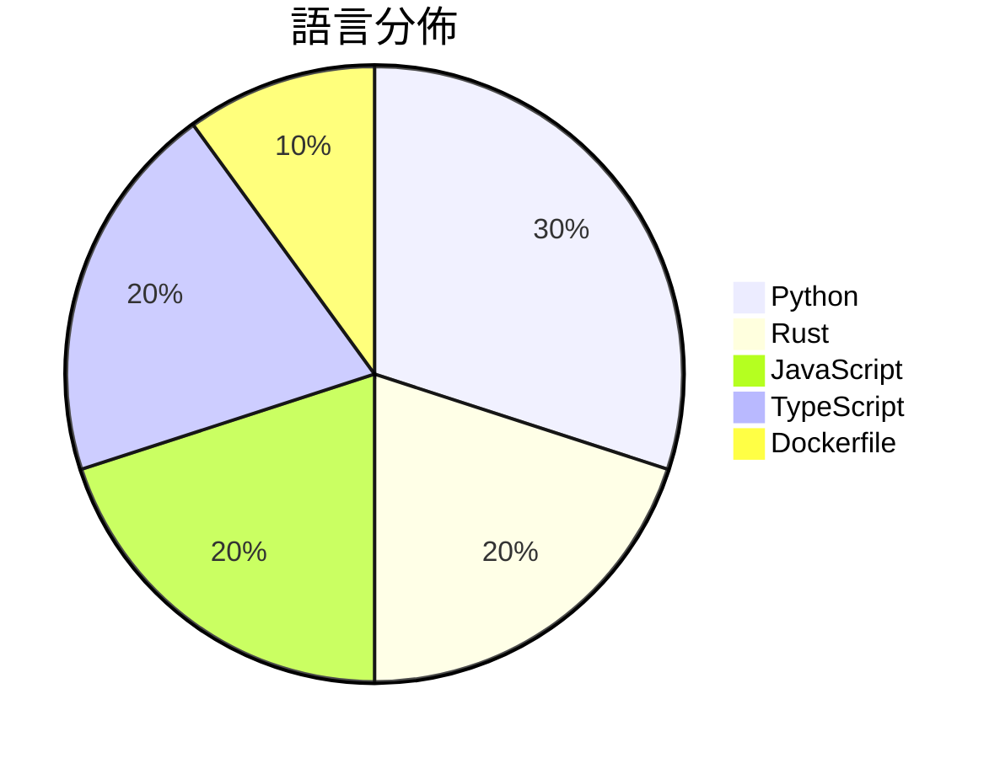

# GitHub Trending - 2026-07-18

> [!summary] 本日摘要
> 收錄 **10** 個新專案，合計 **34.5k** stars
> 語言分佈：Python (3) · Rust (2) · JavaScript (2) · TypeScript (2) · Dockerfile (1)

> [!tip] 本週焦點
> **[[xai-org--grok-build|xai-org/grok-build]]** — 3 天內累積 16.8k stars（5.6k stars/天）
> 提供一個全螢幕的終端 AI 編碼代理，能夠互動式編輯代碼、執行命令及管理任務。



---

## 收錄列表

| # | 專案 | 分類 | Stars | 速度 | 安裝 | 語言 | 用途 |
| :--: | --- | --- | ---: | ---: | --- | --- | --- |
| 1 | [[xai-org--grok-build\|xai-org/grok-build]] | 開發工具 | 16.8k | 5.6k/天 | `medium` | Rust | 提供一個全螢幕的終端 AI 編碼代理，能夠互動式編輯代碼、執行命令及管理任務。 |
| 2 | [[Fei-Away--Codex-Dream-Skin\|Fei-Away/Codex-Dream-Skin]] | 開發工具 | 8.9k | 4.4k/天 | `medium` | JavaScript | 為 Codex 桌面端提供可自定義的主題換膚工具，增強使用者界面的氛圍感。 |
| 3 | [[MDX-Tom--gpt-5.6-instruct\|MDX-Tom/gpt-5.6-instruct]] | 開發工具 | 1.9k | 317/天 | `easy` | Python | 提供針對 gpt-5.6 系列的 Codex CLI 破甲提示詞與測試包。 |
| 4 | [[pixel-point--aval\|pixel-point/aval]] | 開發工具 | 1.2k | 293/天 | `medium` | TypeScript | 提供一種新的互動視頻格式，支持精確的狀態機和透明度處理。 |
| 5 | [[littledivy--mimic\|littledivy/mimic]] | 開發工具 | 1.1k | 287/天 | `easy` | Python | 讓你能夠攔截任何應用程式，並像使用函式庫一樣從 Python 調用它。 |
| 6 | [[CluvexStudio--Aether\|CluvexStudio/Aether]] | 基礎設施 | 1.1k | 382/天 | `medium` | Rust | 提供一個用於穿越網路審查的 SOCKS5 代理客戶端。 |
| 7 | [[x4gKing--Marzban-Panel\|x4gKing/Marzban-Panel]] | 基礎設施 | 910 | 182/天 | `easy` | Dockerfile | 提供一個自動化的 Marzban 控制面板，簡化部署和更新過程。 |
| 8 | [[tandpfun--wardrobe\|tandpfun/wardrobe]] | 開發工具 | 909 | 909/天 | `medium` | JavaScript | 透過 gpt-image 提取和組織你的衣物。 |
| 9 | [[mereyabdenbekuly-ctrl--clodex-ide\|mereyabdenbekuly-ctrl/clodex-ide]] | 開發工具 | 833 | 167/天 | `medium` | TypeScript | 提供一個本地優先、零信任的智能 IDE，專注於可驗證的自主軟體開發。 |
| 10 | [[Kappaemme-git--codex-first-customer-finder-skill\|Kappaemme-git/codex-first-customer-finder-skill]] | 開發工具 | 792 | 158/天 | `easy` | Python | 透過公開信號找到潛在的第一批客戶，幫助新創公司進行客戶開發。 |

---

## 重點摘要

### 1. [[xai-org--grok-build|xai-org/grok-build]] `開發工具`

> 提供一個全螢幕的終端 AI 編碼代理，能夠互動式編輯代碼、執行命令及管理任務。

**16.8k** stars · **5.6k** stars/天 · Rust · `medium`

_建立 3 天就累積 16802 stars（5601/天），forks 3085（18.4%），顯示出極高的使用興趣。這個專案由 SpaceXAI 團隊開發，解決了開發者在編碼過程中需要多工具協作的痛點，提供了一個集成化的解決方案。近期的推廣活動和社群討論也促進了其知名度的提升。技術上，Rust 的使用使得這個工具在效能和安全性上都有所保障，這也是其受歡迎的原因之一。forks/stars 比率較高，顯示出許多開發者對其進行了實際修改和使用。_

---

### 2. [[Fei-Away--Codex-Dream-Skin|Fei-Away/Codex-Dream-Skin]] `開發工具`

> 為 Codex 桌面端提供可自定義的主題換膚工具，增強使用者界面的氛圍感。

**8.9k** stars · **4.4k** stars/天 · JavaScript · `medium`

_建立 2 天就累積 8857 stars（4429/天），forks 938（10.6%），顯示出強烈的社群興趣。作者 Fei-Away 和其他貢獻者在開源社群中有一定的影響力，這個專案解決了 Codex 使用者對於界面個性化的需求，之前的解決方案往往需要修改官方文件，這樣的做法風險較高。近期的推廣活動和社群反饋也促進了這個專案的快速增長，特別是在開發者社群中引起了關注。_

---

### 3. [[MDX-Tom--gpt-5.6-instruct|MDX-Tom/gpt-5.6-instruct]] `開發工具`

> 提供針對 gpt-5.6 系列的 Codex CLI 破甲提示詞與測試包。

**1.9k** stars · **317** stars/天 · Python · `easy`

_建立 6 天內累積 1900 stars（317/天），forks 356（18.7%），這顯示出強烈的社群興趣。MDX-Tom 是這個專案的主要貢獻者，過去在開源社群中有一定的影響力。這個專案解決了在安全研究和逆向工程中，模型常常拒絕提供敏感資訊的痛點，之前的工具無法有效應對這些需求。最近的推廣活動和社群討論也促進了其曝光度。技術上，這個工具的設計使其能夠在多種場景中靈活應用，並且在測試中表現出色，這使得它在同類工具中脫穎而出。_

---

### 4. [[pixel-point--aval|pixel-point/aval]] `開發工具`

> 提供一種新的互動視頻格式，支持精確的狀態機和透明度處理。

**1.2k** stars · **293** stars/天 · TypeScript · `medium`

_建立 4 天內累積 1170 stars（293/天），forks 63（5.4%），顯示出強烈的興趣。作者 lnikell 具備豐富的開源經驗，過去參與多個相關專案。AVAL 解決了傳統視頻格式在互動性和狀態管理上的不足，讓開發者能夠更靈活地創建動畫。最近的推廣活動可能吸引了更多開發者的注意，尤其是在社交媒體上的討論。技術生態的變化，如瀏覽器對新格式的支持，讓這個工具的實用性大幅提升。forks/stars 比率顯示出一定的實際修改意圖，表明開發者對該專案的興趣不僅限於觀望。_

---

### 5. [[littledivy--mimic|littledivy/mimic]] `開發工具`

> 讓你能夠攔截任何應用程式，並像使用函式庫一樣從 Python 調用它。

**1.1k** stars · **287** stars/天 · Python · `easy`

_建立 4 天內累積 1149 stars（287/天），forks 67（5.8%），這顯示出強烈的興趣和需求。作者 Divy Srivastava 過去在開源社群活躍，這個工具解決了開發者在調用 API 時的繁瑣流程，特別是自動生成客戶端的功能，讓開發者能夠專注於業務邏輯而非底層實現。最近的推文和討論也引發了更多的關注，顯示出這個工具在開發者社群中的潛在價值。技術上，隨著 API 使用的普及，這樣的工具變得越來越重要，特別是在快速開發和迭代的環境中。forks/stars 比率顯示出相對較高的實際修改需求，這意味著許多開發者正在積極探索和使用這個工具。_

---

### 6. [[CluvexStudio--Aether|CluvexStudio/Aether]] `基礎設施`

> 提供一個用於穿越網路審查的 SOCKS5 代理客戶端。

**1.1k** stars · **382** stars/天 · Rust · `medium`

_建立 3 天內累積 1146 stars（382/天），forks 65（5.7%），顯示出強烈的社群興趣。這個專案由 CluvexStudio 開發，解決了在受限網路中無法安全上網的痛點，特別是針對深度封包檢測和協議指紋識別的環境。隨著網路審查的加劇，這種工具的需求日益增加。社群對於其功能的需求也反映在熱門 Issues 中，例如對於詳細調試日誌和版本顯示的請求。這些因素共同促成了 Aether 的快速增長。_

---

### 7. [[x4gKing--Marzban-Panel|x4gKing/Marzban-Panel]] `基礎設施`

> 提供一個自動化的 Marzban 控制面板，簡化部署和更新過程。

**910** stars · **182** stars/天 · Dockerfile · `easy`

_建立 5 天內累積 910 stars（182/天），forks 1692（185.9%），這顯示出極高的興趣。作者 x4gKing 似乎專注於簡化部署流程，這解決了許多開發者在使用 Marzban 時遇到的繁瑣問題。這個專案的出現恰逢對於簡化雲端部署的需求上升，特別是在 Docker 和 CI/CD 流程的普及下。高達 185.9% 的 forks/stars 比率顯示許多人在實際修改和使用這個專案，表明其實用性和潛在的社群支持。_

---

### 8. [[tandpfun--wardrobe|tandpfun/wardrobe]] `開發工具`

> 透過 gpt-image 提取和組織你的衣物。

**909** stars · **909** stars/天 · JavaScript · `medium`

_建立 1 天就累積 909 stars（909/天），forks 132（14.5%），顯示出強烈的市場需求。作者 tandpfun 之前有開發相關的 AI 工具，這個專案解決了用戶在管理衣物時的繁瑣流程，特別是在數位化和搭配方面。近期的社交媒體推廣可能也促進了這個專案的曝光。技術上，隨著 OpenAI API 的普及，這個工具的可行性大幅提升。高達 14.5% 的 forks/stars 比率顯示出許多人對這個專案的興趣，可能會進行實際的修改和使用。_

---

### 9. [[mereyabdenbekuly-ctrl--clodex-ide|mereyabdenbekuly-ctrl/clodex-ide]] `開發工具`

> 提供一個本地優先、零信任的智能 IDE，專注於可驗證的自主軟體開發。

**833** stars · **167** stars/天 · TypeScript · `medium`

_建立 5 天內累積 833 stars（166.6/天），forks 149（17.9%），顯示出一定的社群關注度。開發者 mereyabdenbekuly-ctrl 過去專注於開源項目，這個專案解決了傳統 IDE 在自主開發和治理執行上的不足。社群對於可驗證和零信任的開發環境有著日益增長的需求，這使得 Clodex 的出現恰逢其時。雖然目前還沒有明確的觸發事件，但其設計理念和功能吸引了開發者的注意。forks/stars 比率為 17.9%，顯示出有相當比例的用戶在進行實際修改和使用。_

---

### 10. [[Kappaemme-git--codex-first-customer-finder-skill|Kappaemme-git/codex-first-customer-finder-skill]] `開發工具`

> 透過公開信號找到潛在的第一批客戶，幫助新創公司進行客戶開發。

**792** stars · **158** stars/天 · Python · `easy`

_建立 5 天內累積 792 stars（158/天），forks 81（10.2%），顯示出穩定的增長潛力。這個專案的作者 Kappaemme-git 之前在開源社群中活躍，這次專案解決了新創公司在尋找早期客戶時的痛點，特別是缺乏有效的客戶開發工具。該工具的設計使得使用者能夠依賴公開資料進行客戶探索，而不是依賴昂貴的市場調查服務。這種方法的可行性在於現今數據的可獲取性和社交媒體的普及，讓這個工具在市場上具備了競爭力。_

---

## 今日到期複習

> [!tip] 根據間隔複習排程，今天該回顧的專案

```dataview
TABLE
  stars_per_day AS "Stars/天",
  category AS "分類",
  engagement AS "參與度"
FROM "Repos"
WHERE next_review AND date(next_review) <= date("2026-07-18") AND status != "archived"
SORT priority DESC
```

## 待處理

```dataviewjs
const pending = dv.pages('"Repos"').where(p => p.status === "to-review").length;
const unrated = dv.pages('"Repos"').where(p => p.status !== "archived" && p.status !== "to-review" && (p.my_rating || 0) === 0).length;
const noVerdict = dv.pages('"Repos"').where(p => p.status !== "archived" && (p.my_rating || 0) > 0 && (!p.verdict || p.verdict === "")).length;
const items = [];
if (pending > 0) items.push(`**${pending}** 個待分流`);
if (unrated > 0) items.push(`**${unrated}** 個已讀但未評分`);
if (noVerdict > 0) items.push(`**${noVerdict}** 個已評分但無結論`);
if (items.length > 0) dv.paragraph(items.join(" / "));
else dv.paragraph("所有專案都已處理完畢！");
```
