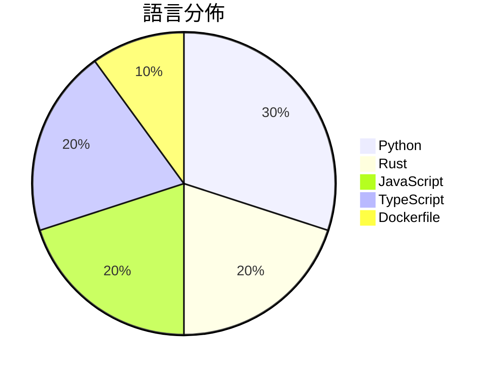

# GitHub Trending - 2026-07-19

> [!summary] 本日摘要
> 收錄 **10** 個新專案，合計 **37.0k** stars
> 語言分佈：Python (3) · Rust (2) · JavaScript (2) · TypeScript (2) · Dockerfile (1)

> [!tip] 本週焦點
> **[[xai-org--grok-build|xai-org/grok-build]]** — 4 天內累積 19.1k stars（4.8k stars/天）
> 提供一個全螢幕的終端 AI 編碼代理，能夠互動式編輯代碼和執行命令。



---

## 收錄列表

| # | 專案 | 分類 | Stars | 速度 | 安裝 | 語言 | 用途 |
| :--: | --- | --- | ---: | ---: | --- | --- | --- |
| 1 | [[xai-org--grok-build\|xai-org/grok-build]] | 開發工具 | 19.1k | 4.8k/天 | `easy` | Rust | 提供一個全螢幕的終端 AI 編碼代理，能夠互動式編輯代碼和執行命令。 |
| 2 | [[Fei-Away--Codex-Dream-Skin\|Fei-Away/Codex-Dream-Skin]] | 開發工具 | 9.8k | 3.3k/天 | `easy` | JavaScript | 為 Codex 桌面端提供可自定義的主題和外觀。 |
| 3 | [[CluvexStudio--Aether\|CluvexStudio/Aether]] | 安全 | 1.3k | 315/天 | `medium` | Rust | 提供一個用於繞過網路審查的用戶空間代理客戶端。 |
| 4 | [[pixel-point--aval\|pixel-point/aval]] | 其他 | 1.2k | 243/天 | `medium` | TypeScript | 提供一種新的開源互動視頻格式，具備內建狀態機、精確的幀過渡和透明度處理。 |
| 5 | [[littledivy--mimic\|littledivy/mimic]] | 開發工具 | 1.2k | 236/天 | `medium` | Python | 透過攔截應用程式流量，讓你可以像使用函式庫一樣從 Python 調用它。 |
| 6 | [[tandpfun--wardrobe\|tandpfun/wardrobe]] | 開發工具 | 1.1k | 532/天 | `medium` | JavaScript | 透過 gpt-image 提取並組織你的衣物。 |
| 7 | [[x4gKing--Marzban-Panel\|x4gKing/Marzban-Panel]] | 基礎設施 | 877 | 146/天 | `easy` | Dockerfile | 提供一個簡化的 Marzban 面板部署方式，透過 Docker 自動獲取最新源 |
| 8 | [[mereyabdenbekuly-ctrl--clodex-ide\|mereyabdenbekuly-ctrl/clodex-ide]] | 開發工具 | 840 | 140/天 | `medium` | TypeScript | 提供一個本地優先、零信任的自動化 IDE，專為可驗證的自主軟體開發而設計。 |
| 9 | [[oil-oil--beautify-github-readme\|oil-oil/beautify-github-readme]] | 開發工具 | 828 | 166/天 | `easy` | Python | 讓 GitHub README 更清晰且具主題性，使用 SVG 標題、實際證明和 |
| 10 | [[Kappaemme-git--codex-first-customer-finder-skill\|Kappaemme-git/codex-first-customer-finder-skill]] | 開發工具 | 817 | 136/天 | `easy` | Python | 幫助新創公司從公開信號中找到潛在的第一批客戶。 |

---

## 重點摘要

### 1. [[xai-org--grok-build|xai-org/grok-build]] `開發工具`

> 提供一個全螢幕的終端 AI 編碼代理，能夠互動式編輯代碼和執行命令。

**19.1k** stars · **4.8k** stars/天 · Rust · `easy`

_建立 4 天內累積 19096 stars（4774/天），forks 3444（18.0%），這顯示出極高的關注度。該專案由 SpaceXAI 團隊開發，旨在解決傳統編碼環境中缺乏互動性的問題。之前的工具往往無法提供良好的用戶體驗，Grok Build 的出現正好填補了這一空白。社群的熱烈反應和快速增長的 stars 數量顯示出開發者對這種新型工具的需求。這個工具的可行性得益於 Rust 語言的高效能和安全性，並且其設計理念符合當前開發者對於高效能和可擴展性的需求。_

---

### 2. [[Fei-Away--Codex-Dream-Skin|Fei-Away/Codex-Dream-Skin]] `開發工具`

> 為 Codex 桌面端提供可自定義的主題和外觀。

**9.8k** stars · **3.3k** stars/天 · JavaScript · `easy`

_建立 3 天內累積 9838 stars（3279/天），forks 1025（10.4%），顯示出極高的使用者興趣。這個專案的主要貢獻者 Fei-Away 和其他幾位開發者在開源社群中有良好的聲譽，過去曾參與多個成功的開源專案。Codex Dream Skin 解決了 Codex 使用者對於主題化和個性化的需求，之前的方案往往需要修改官方安裝包，存在安全風險。這個專案的推出正好填補了這一空白，讓使用者能夠在不影響原有功能的情況下進行主題切換。社群的活躍度也反映在熱門問題上，顯示出使用者對於功能的期待和改進的需求。_

---

### 3. [[CluvexStudio--Aether|CluvexStudio/Aether]] `安全`

> 提供一個用於繞過網路審查的用戶空間代理客戶端。

**1.3k** stars · **315** stars/天 · Rust · `medium`

_建立 4 天內累積 1258 stars（315/天），forks 76（6.0%），顯示出相對穩定的增長。開發者 CluvexStudio 針對網路審查的需求提供了一個新解決方案，特別是在許多傳統 VPN 無法有效運作的環境中。這個專案的推出恰逢全球對隱私和網路自由的關注增加，吸引了不少使用者的興趣。社群中對於其功能的需求和反饋也促進了其快速迭代。由於其獨特的功能設計，Aether 在同類工具中脫穎而出，特別是在需要繞過網路限制的情境下。_

---

### 4. [[pixel-point--aval|pixel-point/aval]] `其他`

> 提供一種新的開源互動視頻格式，具備內建狀態機、精確的幀過渡和透明度處理。

**1.2k** stars · **243** stars/天 · TypeScript · `medium`

_建立 5 天內累積 1217 stars（243/天），forks 65（5.3%），這顯示出對於新興互動視頻格式的需求。作者 lnikell 之前在開源社群中活躍，這次推出的 AVAL 針對現有視頻格式的限制提供了新的解決方案，特別是在互動性和狀態管理方面。這個專案的推出也可能受到社群對於更靈活視頻格式需求的推動，特別是在網頁應用中。高達 5.3% 的 forks/stars 比率顯示出不少開發者已經開始實際修改和使用這個專案，顯示出其實用性和潛力。_

---

### 5. [[littledivy--mimic|littledivy/mimic]] `開發工具`

> 透過攔截應用程式流量，讓你可以像使用函式庫一樣從 Python 調用它。

**1.2k** stars · **236** stars/天 · Python · `medium`

_建立 5 天內累積 1178 stars（236 stars/天），forks 75（6.4%），這顯示出強勁的增長潛力。作者 Divy Srivastava 過去在開源社群中活躍，這個專案解決了開發者在調用 API 時的繁瑣流程，之前的工具往往需要手動編寫客戶端代碼，效率低下。這個專案的推出正好滿足了開發者對於自動化的需求，並且在社群中引起了討論。技術上，mitmproxy 的使用使得流量捕獲變得簡單，而 AI 的介入則提升了生成代碼的效率。forks/stars 比率在中等範圍，顯示出有一定的實際應用需求。_

---

### 6. [[tandpfun--wardrobe|tandpfun/wardrobe]] `開發工具`

> 透過 gpt-image 提取並組織你的衣物。

**1.1k** stars · **532** stars/天 · JavaScript · `medium`

_建立 2 天內累積 1064 stars（532/天），forks 159（14.9%），顯示出強烈的社群興趣。這個專案的作者 tandpfun 先前有其他開源項目，這次專案解決了用戶在衣物管理上的痛點，特別是對於需要快速搭配建議的時尚愛好者。近期的社交媒體討論也促進了它的曝光。技術上，OpenAI 的圖像處理能力的提升使得這個工具的實現變得可行。高達 14.9% 的 forks/stars 比率顯示出許多開發者對此專案有實際修改和使用的意圖。_

---

### 7. [[x4gKing--Marzban-Panel|x4gKing/Marzban-Panel]] `基礎設施`

> 提供一個簡化的 Marzban 面板部署方式，透過 Docker 自動獲取最新源碼。

**877** stars · **146** stars/天 · Dockerfile · `easy`

_建立 6 天內累積 877 stars（146/天），forks 1640（187.0%），顯示出極高的興趣和需求。作者 x4gKing 是一位活躍的開發者，這個專案解決了用戶在部署 Marzban 時的繁瑣過程，通過自動化克隆最新源碼來簡化操作。這種方法在過去並不常見，因為許多用戶仍依賴手動更新和管理源碼。社群的反饋和 Fork 數量顯示出這個工具的潛力，並且在短時間內獲得了大量關注。_

---

### 8. [[mereyabdenbekuly-ctrl--clodex-ide|mereyabdenbekuly-ctrl/clodex-ide]] `開發工具`

> 提供一個本地優先、零信任的自動化 IDE，專為可驗證的自主軟體開發而設計。

**840** stars · **140** stars/天 · TypeScript · `medium`

_建立 6 天就累積 840 stars（140/天），forks 152（18.1%），這顯示出強烈的社群參與。這個專案的作者是 mereyabdenbekuly-ctrl，過去的經驗可能使他能夠針對開發者的需求設計這款工具。CLODEx 解決了傳統 AI 編碼接口的不足，讓用戶能夠在一個持久的工作環境中進行開發，而不是依賴於一次性的聊天記錄。這樣的設計使得開發者能夠更有效率地管理任務和代碼，特別是在多文件和多步驟的開發過程中。社群的活躍度和對新功能的需求可能促進了這個專案的快速增長。_

---

### 9. [[oil-oil--beautify-github-readme|oil-oil/beautify-github-readme]] `開發工具`

> 讓 GitHub README 更清晰且具主題性，使用 SVG 標題、實際證明和可維護的 Markdown。

**828** stars · **166** stars/天 · Python · `easy`

_建立 5 天內累積 828 stars（166/天），forks 47（5.7%），顯示出穩定的增長趨勢。作者 oil-oil 和 moesix 在 GitHub 上有其他相關專案，這使得他們在這個領域有一定的影響力。這個專案解決了許多開發者在設計 README 時面臨的問題，特別是如何有效地展示項目內容和價值。之前的方案往往缺乏靈活性和可維護性，這使得這個工具在需求上有明顯的優勢。社群的反應也很積極，顯示出對這種工具的需求。forks/stars 比率適中，顯示出有一定的實際使用者在修改和改進這個工具。_

---

### 10. [[Kappaemme-git--codex-first-customer-finder-skill|Kappaemme-git/codex-first-customer-finder-skill]] `開發工具`

> 幫助新創公司從公開信號中找到潛在的第一批客戶。

**817** stars · **136** stars/天 · Python · `easy`

_建立 6 天內累積 817 stars（136/天），forks 88（10.8%），顯示出其快速增長的潛力。作者 Kappaemme-git 及 a692570 具備相關背景，專注於創業和客戶開發領域，這使得他們能夠針對市場需求設計出有效的解決方案。這個工具解決了新創公司在尋找早期客戶時缺乏有效方法的痛點，之前的解決方案往往無法提供具體的客戶名單或聯繫方式。近期的社群討論和需求也促進了這個工具的曝光，讓更多人關注到它的實用性。相對於其他工具，這個專案的 forks/stars 比率顯示出使用者對其實用性的認可，意味著有不少人正在實際修改和使用這個工具。_

---

## 今日到期複習

> [!tip] 根據間隔複習排程，今天該回顧的專案

```dataview
TABLE
  stars_per_day AS "Stars/天",
  category AS "分類",
  engagement AS "參與度"
FROM "Repos"
WHERE next_review AND date(next_review) <= date("2026-07-19") AND status != "archived"
SORT priority DESC
```

## 待處理

```dataviewjs
const pending = dv.pages('"Repos"').where(p => p.status === "to-review").length;
const unrated = dv.pages('"Repos"').where(p => p.status !== "archived" && p.status !== "to-review" && (p.my_rating || 0) === 0).length;
const noVerdict = dv.pages('"Repos"').where(p => p.status !== "archived" && (p.my_rating || 0) > 0 && (!p.verdict || p.verdict === "")).length;
const items = [];
if (pending > 0) items.push(`**${pending}** 個待分流`);
if (unrated > 0) items.push(`**${unrated}** 個已讀但未評分`);
if (noVerdict > 0) items.push(`**${noVerdict}** 個已評分但無結論`);
if (items.length > 0) dv.paragraph(items.join(" / "));
else dv.paragraph("所有專案都已處理完畢！");
```
