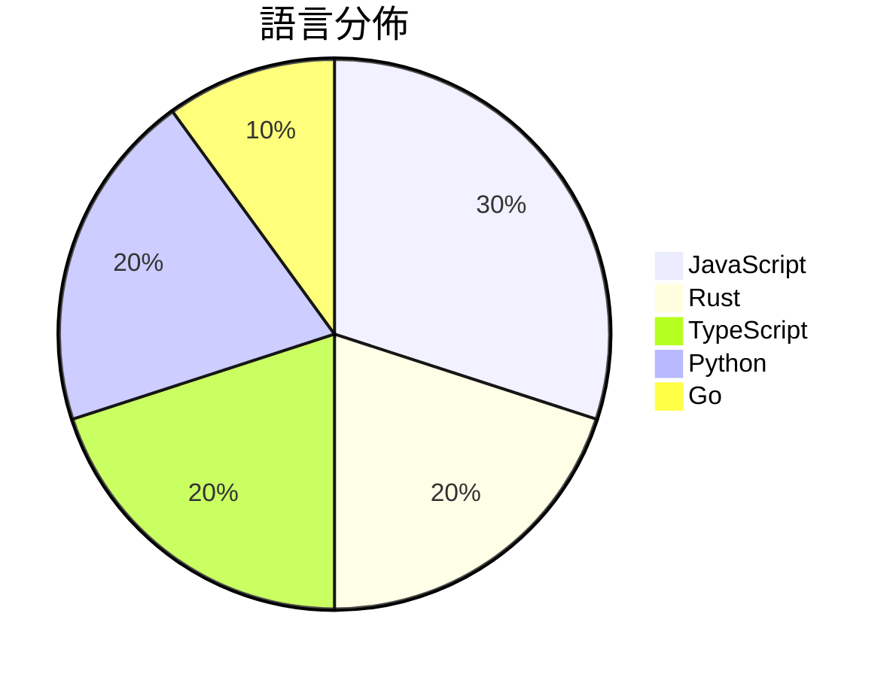

# GitHub Trending - 2026-07-20

> [!summary] 本日摘要
> 收錄 **10** 個新專案，合計 **38.9k** stars
> 語言分佈：JavaScript (3) · Rust (2) · TypeScript (2) · Python (2) · Go (1)

> [!tip] 本週焦點
> **[[xai-org--grok-build|xai-org/grok-build]]** — 5 天內累積 20.3k stars（4.1k stars/天）
> 提供一個全螢幕的終端 AI 編碼代理，能夠互動式編輯代碼和執行命令。



---

## 收錄列表

| # | 專案 | 分類 | Stars | 速度 | 安裝 | 語言 | 用途 |
| :--: | --- | --- | ---: | ---: | --- | --- | --- |
| 1 | [[xai-org--grok-build\|xai-org/grok-build]] | 開發工具 | 20.3k | 4.1k/天 | `easy` | Rust | 提供一個全螢幕的終端 AI 編碼代理，能夠互動式編輯代碼和執行命令。 |
| 2 | [[Fei-Away--Codex-Dream-Skin\|Fei-Away/Codex-Dream-Skin]] | 開發工具 | 10.5k | 2.6k/天 | `medium` | JavaScript | 為 Codex 桌面端提供可自定義的主題和皮膚，增強使用體驗。 |
| 3 | [[CluvexStudio--Aether\|CluvexStudio/Aether]] | 安全 | 1.3k | 264/天 | `medium` | Rust | 提供一個用於繞過網路審查的用戶空間代理客戶端。 |
| 4 | [[pixel-point--aval\|pixel-point/aval]] | 開發工具 | 1.2k | 207/天 | `medium` | TypeScript | 提供一種新的互動視頻格式，具備內建狀態機、精確的幀轉換和透明度處理。 |
| 5 | [[littledivy--mimic\|littledivy/mimic]] | 開發工具 | 1.2k | 203/天 | `medium` | Python | 攔截任何應用程式，然後像使用函式庫一樣從 Python 調用它。 |
| 6 | [[tandpfun--wardrobe\|tandpfun/wardrobe]] | 開發工具 | 1.2k | 388/天 | `medium` | JavaScript | 讓你的衣物透過 gpt-image 被提取並組織起來。 |
| 7 | [[oil-oil--beautify-github-readme\|oil-oil/beautify-github-readme]] | 開發工具 | 869 | 145/天 | `easy` | Python | 設計清晰的 GitHub README 首頁，使用 SVG 標題、真實證明和可維 |
| 8 | [[nethical6--conversation-steganography\|nethical6/conversation-steganography]] | 安全 | 829 | 415/天 | `medium` | Go | 使用 LLM 在正常對話中隱藏消息，實現私密通訊。 |
| 9 | [[pablostanley--yoinks\|pablostanley/yoinks]] | CLI 工具 | 776 | 259/天 | `easy` | TypeScript | 從終端機下載視頻，無廣告、無惡意重定向。 |
| 10 | [[KubeezMedia--kubeez-scroll-world-video\|KubeezMedia/kubeez-scroll-world-video]] | Web 應用 | 660 | 110/天 | `easy` | JavaScript | 透過滾動滑鼠來控制相機，實現一個無縫的迷你漢堡世界飛行演示。 |

---

## 重點摘要

### 1. [[xai-org--grok-build|xai-org/grok-build]] `開發工具`

> 提供一個全螢幕的終端 AI 編碼代理，能夠互動式編輯代碼和執行命令。

**20.3k** stars · **4.1k** stars/天 · Rust · `easy`

_建立 5 天就累積 20258 stars（4052/天），forks 3690（18.2%），這顯示出極高的使用興趣。作者 SpaceXAI 以其在 AI 領域的影響力和技術背景，為這個專案提供了強大的支持。這個工具解決了開發者在編碼過程中需要一個強大的互動式環境的痛點，特別是在需要快速測試和迭代的情境下。近期的推廣活動和社群討論也促進了其曝光率。技術上，Rust 的使用使得這個工具在效能和安全性上有了良好的表現，這也是其受歡迎的原因之一。_

---

### 2. [[Fei-Away--Codex-Dream-Skin|Fei-Away/Codex-Dream-Skin]] `開發工具`

> 為 Codex 桌面端提供可自定義的主題和皮膚，增強使用體驗。

**10.5k** stars · **2.6k** stars/天 · JavaScript · `medium`

_建立 4 天就累積 10545 stars（2636/天），forks 1089（10.3%），這顯示出強烈的社群需求。作者 Fei-Away 和其他貢獻者在開源社群中活躍，之前有過多個成功的專案。這個工具解決了 Codex 用戶在界面自定義上的痛點，因為大多數主題工具都需要修改官方文件，這樣會帶來穩定性和安全性問題。近期的社交媒體討論和技術論壇的熱議也推動了這個專案的曝光率。高 forks/stars 比率顯示出許多開發者正在實際使用和修改這個工具，這是其受歡迎的另一個指標。_

---

### 3. [[CluvexStudio--Aether|CluvexStudio/Aether]] `安全`

> 提供一個用於繞過網路審查的用戶空間代理客戶端。

**1.3k** stars · **264** stars/天 · Rust · `medium`

_建立 5 天內累積 1319 stars（264/天），forks 78（5.9%），顯示出穩定的增長潛力。開發者 CluvexStudio 及其團隊在網路安全領域有豐富經驗，這個專案解決了在高度受限環境中安全上網的需求。之前的解決方案如傳統 VPN 在深度包檢查下常常失效，而 Aether 提供了一個更為可靠的替代方案。社群對於這個工具的需求顯而易見，尤其是在某些國家和地區，網路審查日益嚴重。隨著對隱私和安全的重視，這個工具的受歡迎程度也在上升。_

---

### 4. [[pixel-point--aval|pixel-point/aval]] `開發工具`

> 提供一種新的互動視頻格式，具備內建狀態機、精確的幀轉換和透明度處理。

**1.2k** stars · **207** stars/天 · TypeScript · `medium`

_建立 6 天就累積 1241 stars（207/天），forks 67（5.4%），這顯示出開發者對這個新工具的興趣。主要貢獻者 lnikell 之前在視頻編碼領域有豐富經驗，這使得 AVAL 能夠解決傳統視頻格式在互動性和狀態管理上的不足。近期的推廣活動和社群討論也可能促進了這個專案的曝光度。由於 AVAL 提供了簡化的視頻創建流程，這在當前互動內容需求日益增長的背景下顯得尤為重要。forks/stars 比率為 5.4%，顯示出有一定數量的開發者在進行實際修改和使用。_

---

### 5. [[littledivy--mimic|littledivy/mimic]] `開發工具`

> 攔截任何應用程式，然後像使用函式庫一樣從 Python 調用它。

**1.2k** stars · **203** stars/天 · Python · `medium`

_建立 6 天內累積 1216 stars（203/天），forks 79（6.5%），這顯示出穩定的增長潛力。作者 Divy Srivastava 之前在開源社群中活躍，這個專案解決了開發者在調用 API 時的繁瑣過程，特別是對於移動應用的需求。這個專案的出現恰好填補了市場上對於自動化 API 客戶端生成的需求，並且在社群中引起了一定的討論。技術上，mitmproxy 的使用使得攔截和重放請求變得更加簡單，這在過去是需要手動處理的繁瑣過程。forks/stars 比率為 6.5%，顯示出有相當一部分使用者對此專案進行了實際修改和使用。_

---

### 6. [[tandpfun--wardrobe|tandpfun/wardrobe]] `開發工具`

> 讓你的衣物透過 gpt-image 被提取並組織起來。

**1.2k** stars · **388** stars/天 · JavaScript · `medium`

_建立 3 天內累積 1164 stars（388/天），forks 169（14.5%），這顯示出強烈的使用者興趣。這個專案的作者 tandpfun 之前有過多個開源專案，這次的 Wardrobe 解決了衣物管理的痛點，特別是針對需要私密處理的使用者。最近的社交媒體討論也引起了關注，讓更多人知道這個工具。技術上，隨著 OpenAI API 的普及，這個工具的可行性大幅提升。forks/stars 比率相對較高，顯示出有不少使用者在實際修改和使用這個專案。_

---

### 7. [[oil-oil--beautify-github-readme|oil-oil/beautify-github-readme]] `開發工具`

> 設計清晰的 GitHub README 首頁，使用 SVG 標題、真實證明和可維護的 Markdown。

**869** stars · **145** stars/天 · Python · `easy`

_建立 6 天就累積 869 stars（145/天），forks 49（5.6%），這顯示出穩定的增長。這個專案的主要貢獻者 oil-oil 和 moesix 之前有多個相關專案，顯示出他們在這個領域的經驗和專業。這個工具解決了許多開發者在設計 README 時面臨的問題，特別是如何有效地展示專案的價值和證明。之前的解決方案往往缺乏靈活性和可維護性，這使得這個工具的出現非常及時。最近的推廣活動和社群反饋也促進了其快速增長。forks/stars 比率相對較低，顯示出目前使用者主要是觀望，還在評估這個工具的實用性。_

---

### 8. [[nethical6--conversation-steganography|nethical6/conversation-steganography]] `安全`

> 使用 LLM 在正常對話中隱藏消息，實現私密通訊。

**829** stars · **415** stars/天 · Go · `medium`

_建立 2 天內累積 829 stars（415/天），forks 48（5.8%），顯示出不錯的增長潛力。開發者 nethical6 針對隱私通訊的需求提出了創新的解決方案，特別是在政府監控日益嚴格的背景下。這個專案提供了一種新的方式來隱藏信息，避免傳統加密方法的風險。社群對於這種隱私保護工具的需求也在上升，尤其是在數位隱私意識提高的情況下。這些因素共同推動了其快速增長。_

---

### 9. [[pablostanley--yoinks|pablostanley/yoinks]] `CLI 工具`

> 從終端機下載視頻，無廣告、無惡意重定向。

**776** stars · **259** stars/天 · TypeScript · `easy`

_建立 3 天就累積 776 stars（259/天），forks 81（10.4%），顯示出相當高的使用者興趣。作者 Pablo Stanley 在開源社區有一定的影響力，並且過去有多個成功的專案。這個工具解決了用戶在終端機下載視頻時的繁瑣流程，提供了一個簡單而直觀的解決方案。近期的推廣活動和社群討論可能也促進了其知名度，特別是在開發者中。高比例的 forks 表示許多人在積極修改或使用這個工具，顯示出其實用性和潛力。_

---

### 10. [[KubeezMedia--kubeez-scroll-world-video|KubeezMedia/kubeez-scroll-world-video]] `Web 應用`

> 透過滾動滑鼠來控制相機，實現一個無縫的迷你漢堡世界飛行演示。

**660** stars · **110** stars/天 · JavaScript · `easy`

_建立 6 天內累積 660 stars（110/天），forks 4（0.6%），這顯示出一定的關注度。作者 MeepCastana 之前可能有其他相關經驗，這個專案解決了傳統網頁滾動的單調性，提供了一種更具互動性的展示方式。雖然沒有明確的觸發事件，但這種新穎的交互方式吸引了不少開發者的目光。技術上，隨著 Kubeez 平台的成熟，這個工具的可行性提高，讓開發者能夠輕鬆生成高品質的視覺內容。forks/stars 比率較低，顯示大多數人仍在觀望。_

---

## 今日到期複習

> [!tip] 根據間隔複習排程，今天該回顧的專案

```dataview
TABLE
  stars_per_day AS "Stars/天",
  category AS "分類",
  engagement AS "參與度"
FROM "Repos"
WHERE next_review AND date(next_review) <= date("2026-07-20") AND status != "archived"
SORT priority DESC
```

## 待處理

```dataviewjs
const pending = dv.pages('"Repos"').where(p => p.status === "to-review").length;
const unrated = dv.pages('"Repos"').where(p => p.status !== "archived" && p.status !== "to-review" && (p.my_rating || 0) === 0).length;
const noVerdict = dv.pages('"Repos"').where(p => p.status !== "archived" && (p.my_rating || 0) > 0 && (!p.verdict || p.verdict === "")).length;
const items = [];
if (pending > 0) items.push(`**${pending}** 個待分流`);
if (unrated > 0) items.push(`**${unrated}** 個已讀但未評分`);
if (noVerdict > 0) items.push(`**${noVerdict}** 個已評分但無結論`);
if (items.length > 0) dv.paragraph(items.join(" / "));
else dv.paragraph("所有專案都已處理完畢！");
```
