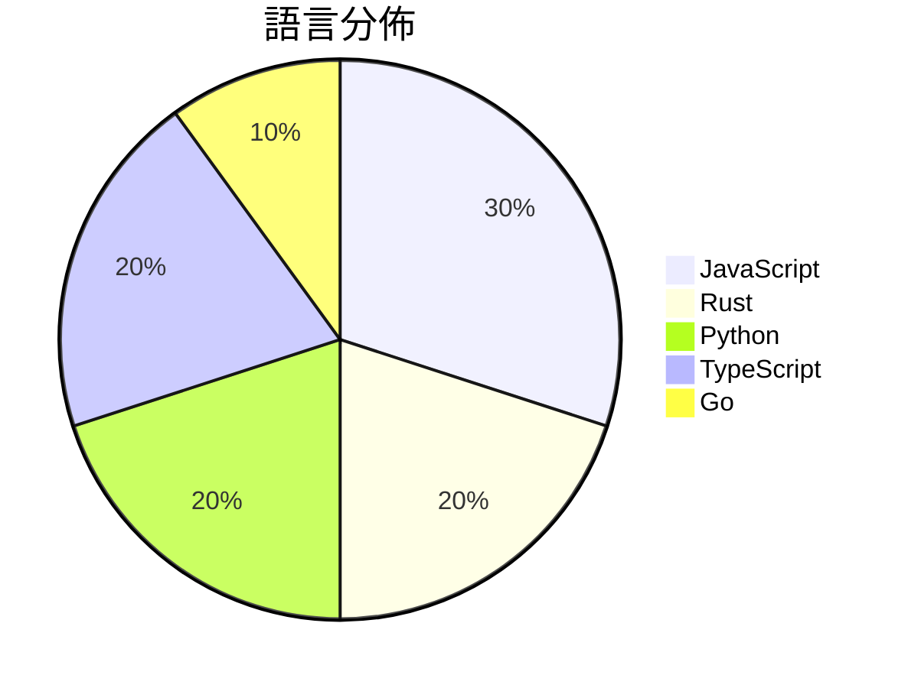

# GitHub Trending - 2026-07-21

> [!summary] 本日摘要
> 收錄 **10** 個新專案，合計 **39.8k** stars
> 語言分佈：JavaScript (3) · Rust (2) · Python (2) · TypeScript (2) · Go (1)

> [!tip] 本週焦點
> **[[xai-org--grok-build|xai-org/grok-build]]** — 6 天內累積 20.9k stars（3.5k stars/天）
> 提供一個全螢幕的終端式 AI 編碼代理，能夠互動式編輯、執行命令及管理任務。



---

## 收錄列表

| # | 專案 | 分類 | Stars | 速度 | 安裝 | 語言 | 用途 |
| :--: | --- | --- | ---: | ---: | --- | --- | --- |
| 1 | [[xai-org--grok-build\|xai-org/grok-build]] | 開發工具 | 20.9k | 3.5k/天 | `medium` | Rust | 提供一個全螢幕的終端式 AI 編碼代理，能夠互動式編輯、執行命令及管理任務。 |
| 2 | [[Fei-Away--Codex-Dream-Skin\|Fei-Away/Codex-Dream-Skin]] | 開發工具 | 11.2k | 2.2k/天 | `easy` | JavaScript | 為 Codex 桌面端提供可自定義的主題換膚工具，增強使用者體驗。 |
| 3 | [[CluvexStudio--Aether\|CluvexStudio/Aether]] | 基礎設施 | 1.4k | 233/天 | `easy` | Rust | 提供用戶在受限網路中繞過審查的代理客戶端。 |
| 4 | [[tandpfun--wardrobe\|tandpfun/wardrobe]] | 開發工具 | 1.2k | 306/天 | `medium` | JavaScript | 透過 gpt-image 提取並組織你的衣物。 |
| 5 | [[hoainho--img2threejs\|hoainho/img2threejs]] | 開發工具 | 1.1k | 183/天 | `easy` | Python | 將參考圖像中的物體重建為僅用代碼生成的程序化 Three.js 模型。 |
| 6 | [[nethical6--conversation-steganography\|nethical6/conversation-steganography]] | 安全 | 884 | 295/天 | `medium` | Go | 透過正常對話隱藏秘密訊息，實現私密通訊。 |
| 7 | [[pablostanley--yoinks\|pablostanley/yoinks]] | CLI 工具 | 878 | 220/天 | `easy` | TypeScript | 從終端機下載任何影片，無廣告干擾。 |
| 8 | [[lopopolo--harness-engineering\|lopopolo/harness-engineering]] | 開發工具 | 868 | 434/天 | `medium` | Python | 提升代理輸出，透過塑造環境來改善代理的運作。 |
| 9 | [[MatinSenPai--Aether-GUI\|MatinSenPai/Aether-GUI]] | 其他 | 669 | 112/天 | `medium` | TypeScript | 提供一鍵式桌面 GUI 以便於使用 Aether 反審查隧道，免去命令行操作的麻 |
| 10 | [[Blueturboguy07--cue\|Blueturboguy07/cue]] | 生產力 | 666 | 133/天 | `easy` | JavaScript | 提供隱形的 AI 助手，協助你在會議中即時獲得建議，並隱藏於螢幕分享之外。 |

---

## 重點摘要

### 1. [[xai-org--grok-build|xai-org/grok-build]] `開發工具`

> 提供一個全螢幕的終端式 AI 編碼代理，能夠互動式編輯、執行命令及管理任務。

**20.9k** stars · **3.5k** stars/天 · Rust · `medium`

_建立 6 天就累積 20930 stars（3488/天），forks 3864（18.5%），顯示出強烈的社群關注。作者 SpaceXAI 以其在 AI 領域的專業背景，提供了一個之前缺乏的高效編碼工具。這個工具的出現正好填補了終端式 AI 編碼代理的空白，特別是在需要長期任務管理的情境中。社群的反饋和活躍的開發活動也促進了這個專案的快速增長，顯示出其未來的潛力。_

---

### 2. [[Fei-Away--Codex-Dream-Skin|Fei-Away/Codex-Dream-Skin]] `開發工具`

> 為 Codex 桌面端提供可自定義的主題換膚工具，增強使用者體驗。

**11.2k** stars · **2.2k** stars/天 · JavaScript · `easy`

_建立 5 天內累積 11177 stars（2235/天），forks 1146（10.3%），顯示出強大的增長潛力。作者 Fei-Away 和其他貢獻者在開源社群中有一定的聲譽，之前也有多個成功的項目。這個工具解決了 Codex 用戶對於界面個性化的需求，之前的解決方案往往需要修改官方文件，存在安全風險。最近的社群討論和推廣活動也引起了更多開發者的注意，促進了這個專案的快速增長。這個工具的設計使得用戶能夠在不影響原有功能的情況下，享受更美觀的界面，這在開發者中引起了共鳴。_

---

### 3. [[CluvexStudio--Aether|CluvexStudio/Aether]] `基礎設施`

> 提供用戶在受限網路中繞過審查的代理客戶端。

**1.4k** stars · **233** stars/天 · Rust · `easy`

_建立 6 天內累積 1395 stars（233/天），forks 85（6.1%），顯示出強勁的增長潛力。作者 CluvexStudio 專注於網路安全和隱私，Aether 解決了在高強度審查環境中安全連接的需求，這在傳統 VPN 工具中往往無法有效實現。近期的社群討論和需求增加也促進了其受歡迎程度。技術上，MASQUE 和 WireGuard 的結合使得 Aether 能夠在面對各種網路檢查時保持穩定性，這在當前的網路環境中尤為重要。forks/stars 比率顯示出使用者對該工具的實際修改和應用，這是其社群活躍度的指標。_

---

### 4. [[tandpfun--wardrobe|tandpfun/wardrobe]] `開發工具`

> 透過 gpt-image 提取並組織你的衣物。

**1.2k** stars · **306** stars/天 · JavaScript · `medium`

_這個專案在建立 4 天內累積了 1222 stars（306 stars/天），forks 數量為 175（14.3%），顯示出相對高的使用者參與度。作者 tandpfun 是一位活躍的開發者，這個專案解決了衣物管理的痛點，特別是對於需要快速整理衣物的使用者。過去，這類功能往往依賴於繁瑣的手動操作或不夠智能的應用程式，Wardrobe 的出現提供了一個更智能的解決方案。此專案的快速增長可能也受到社交媒體的推廣影響，特別是對於時尚和個人風格有興趣的群體。forks/stars 比率為 14.3%，顯示出許多使用者對這個專案有實際的修改和使用需求。_

---

### 5. [[hoainho--img2threejs|hoainho/img2threejs]] `開發工具`

> 將參考圖像中的物體重建為僅用代碼生成的程序化 Three.js 模型。

**1.1k** stars · **183** stars/天 · Python · `easy`

_建立 6 天就累積 1098 stars（183/天），forks 92（8.4%），顯示出強勁的增長潛力。作者 hoainho 之前在 3D 和生成藝術領域有豐富經驗，這個專案解決了傳統3D建模過程中的繁瑣問題，特別是對於需要快速生成3D模型的場景。近期的社群討論和需求反饋促進了這個專案的快速成長，特別是對於程序化生成和動畫準備的需求。這個工具的出現恰好滿足了開發者對於高效、靈活的3D建模解決方案的需求，並且在技術生態中提供了一個新的選擇。forks/stars 比率在 8.4%，顯示出有相當比例的使用者對其進行了實際的修改和使用。_

---

### 6. [[nethical6--conversation-steganography|nethical6/conversation-steganography]] `安全`

> 透過正常對話隱藏秘密訊息，實現私密通訊。

**884** stars · **295** stars/天 · Go · `medium`

_建立 3 天內累積 884 stars（295/天），forks 53（6.0%），顯示出一定的使用興趣。作者 nethical6 是一位年輕開發者，這個專案展示了 LLM 基於隱寫術的實用案例，解決了傳統加密訊息可能被監控的痛點。這個專案的出現正值人們對私密通訊需求增加的時期，並且有可能受到社交媒體和即時通訊的廣泛討論影響。forks/stars 比率為 6.0%，顯示出有相當比例的使用者對此工具進行修改和實驗。_

---

### 7. [[pablostanley--yoinks|pablostanley/yoinks]] `CLI 工具`

> 從終端機下載任何影片，無廣告干擾。

**878** stars · **220** stars/天 · TypeScript · `easy`

_建立 4 天內累積 878 stars（220/天），forks 94（10.7%），顯示出強烈的興趣增長。作者 Pablo Stanley 之前有過多個開源專案，這次的 yoinks 解決了用戶在下載影片時常遇到的廣告和假按鈕問題。這個工具的簡單性和高效性吸引了許多使用者，特別是在社群中分享後，迅速引起關注。技術上，Node.js 的普及和 yt-dlp 的強大功能使得這個工具的實現變得可行。高達 10.7% 的 forks/stars 比率顯示出許多人對這個工具進行實際修改和使用。_

---

### 8. [[lopopolo--harness-engineering|lopopolo/harness-engineering]] `開發工具`

> 提升代理輸出，透過塑造環境來改善代理的運作。

**868** stars · **434** stars/天 · Python · `medium`

_建立 2 天就累積 868 stars（434/天），forks 47（5.4%），顯示出不錯的關注度。Ryan Lopopolo 是該領域的專家，過去在代理技術方面有豐富的經驗，這個專案解決了如何有效整合代理與環境的痛點，之前的方案往往無法充分利用組織內部的知識。近期的推廣和討論可能也促進了其曝光度，尤其是在代理技術日益受到重視的背景下。forks/stars 比率顯示出使用者對於修改和實驗的興趣，這可能會促進社群的活躍度。_

---

### 9. [[MatinSenPai--Aether-GUI|MatinSenPai/Aether-GUI]] `其他`

> 提供一鍵式桌面 GUI 以便於使用 Aether 反審查隧道，免去命令行操作的麻煩。

**669** stars · **112** stars/天 · TypeScript · `medium`

_建立 6 天內累積 669 stars（112/天），forks 30（4.5%），顯示出穩定的增長潛力。這個專案由 MatinSenPai 和其他幾位貢獻者共同開發，解決了用戶在使用 Aether 時需要手動操作命令行的痛點。之前的解決方案多數依賴於命令行工具，對於不熟悉技術的用戶來說，使用門檻較高。這個專案的推出，讓更多人能夠輕鬆使用 Aether 進行反審查，並且在社群中引起了討論，進一步推動了其流行。技術上，Tauri 框架的使用讓這個桌面應用變得輕量且高效，適合在各種平台上運行。_

---

### 10. [[Blueturboguy07--cue|Blueturboguy07/cue]] `生產力`

> 提供隱形的 AI 助手，協助你在會議中即時獲得建議，並隱藏於螢幕分享之外。

**666** stars · **133** stars/天 · JavaScript · `easy`

_建立 5 天內累積 666 stars（133/天），forks 144（21.6%），顯示出強烈的社群興趣。作者團隊由多位貢獻者組成，顯示出良好的協作能力。這個工具解決了在會議中需要即時幫助但又不想被他人看到的需求，之前的解決方案如 Cluely 需要依賴雲端服務，並且不支持自我托管。最近的推文和討論也引發了關注，讓更多人認識到這個工具的潛力。隨著遠端工作和虛擬會議的普及，這種工具的需求也隨之增加。_

---

## 今日到期複習

> [!tip] 根據間隔複習排程，今天該回顧的專案

```dataview
TABLE
  stars_per_day AS "Stars/天",
  category AS "分類",
  engagement AS "參與度"
FROM "Repos"
WHERE next_review AND date(next_review) <= date("2026-07-21") AND status != "archived"
SORT priority DESC
```

## 待處理

```dataviewjs
const pending = dv.pages('"Repos"').where(p => p.status === "to-review").length;
const unrated = dv.pages('"Repos"').where(p => p.status !== "archived" && p.status !== "to-review" && (p.my_rating || 0) === 0).length;
const noVerdict = dv.pages('"Repos"').where(p => p.status !== "archived" && (p.my_rating || 0) > 0 && (!p.verdict || p.verdict === "")).length;
const items = [];
if (pending > 0) items.push(`**${pending}** 個待分流`);
if (unrated > 0) items.push(`**${unrated}** 個已讀但未評分`);
if (noVerdict > 0) items.push(`**${noVerdict}** 個已評分但無結論`);
if (items.length > 0) dv.paragraph(items.join(" / "));
else dv.paragraph("所有專案都已處理完畢！");
```
