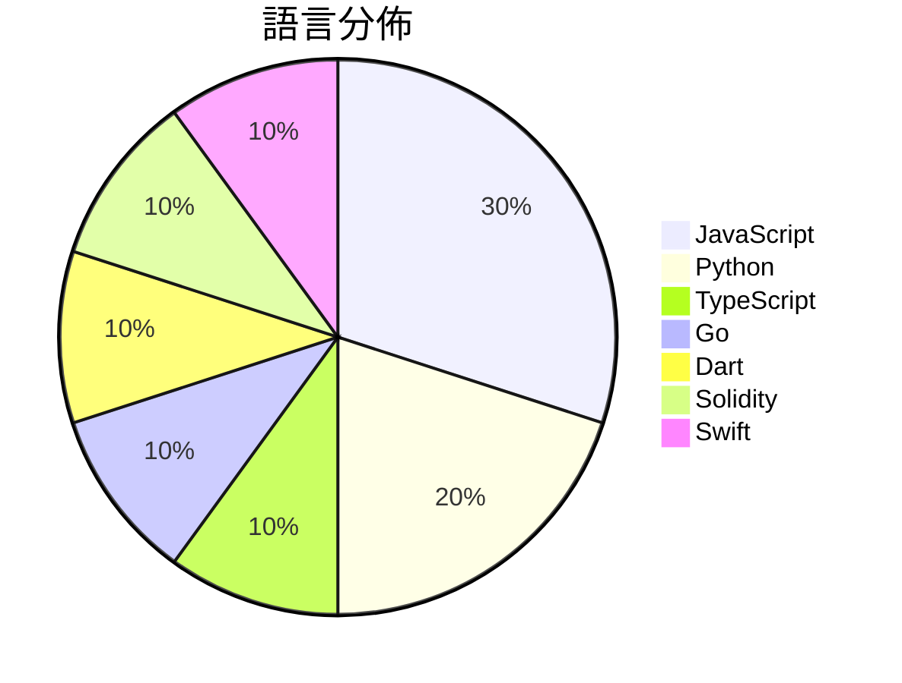

# GitHub Trending - 2026-07-22

> [!summary] 本日摘要
> 收錄 **10** 個新專案，合計 **20.9k** stars
> 語言分佈：JavaScript (3) · Python (2) · TypeScript (1) · Go (1) · Dart (1) · Solidity (1) · Swift (1)

> [!tip] 本週焦點
> **[[Fei-Away--Codex-Dream-Skin|Fei-Away/Codex-Dream-Skin]]** — 6 天內累積 11.6k stars（1.9k stars/天）
> 為 Codex 桌面端提供可自定義的主題和外觀，增強使用體驗。



---

## 收錄列表

| # | 專案 | 分類 | Stars | 速度 | 安裝 | 語言 | 用途 |
| :--: | --- | --- | ---: | ---: | --- | --- | --- |
| 1 | [[Fei-Away--Codex-Dream-Skin\|Fei-Away/Codex-Dream-Skin]] | 開發工具 | 11.6k | 1.9k/天 | `medium` | JavaScript | 為 Codex 桌面端提供可自定義的主題和外觀，增強使用體驗。 |
| 2 | [[lopopolo--harness-engineering\|lopopolo/harness-engineering]] | 開發工具 | 1.7k | 576/天 | `easy` | Python | 提升代理輸出質量，透過塑造環境來改善代理的工作效果。 |
| 3 | [[hoainho--img2threejs\|hoainho/img2threejs]] | 開發工具 | 1.5k | 219/天 | `easy` | Python | 將參考圖像中的物體重建為僅用代碼生成的程序化 Three.js 模型，並具備動畫 |
| 4 | [[tandpfun--wardrobe\|tandpfun/wardrobe]] | 其他 | 1.3k | 258/天 | `medium` | JavaScript | 透過 gpt-image 提取並組織你的衣物。 |
| 5 | [[pablostanley--yoinks\|pablostanley/yoinks]] | CLI 工具 | 970 | 194/天 | `easy` | TypeScript | 從終端機下載任何視頻，無廣告干擾。 |
| 6 | [[nethical6--conversation-steganography\|nethical6/conversation-steganography]] | 安全 | 915 | 229/天 | `medium` | Go | 透過正常對話隱藏秘密訊息，實現私密通訊。 |
| 7 | [[v-modal--vmodal_sdk_flutter\|v-modal/vmodal_sdk_flutter]] | 開發工具 | 782 | 156/天 | `easy` | Dart | 提供多模態記憶的 Flutter SDK，讓應用程式能夠快速搜尋影片中的特定時刻 |
| 8 | [[MIgHTy-alIeN--MEV-Arbitrage-Bot\|MIgHTy-alIeN/MEV-Arbitrage-Bot]] | 其他 | 739 | 185/天 | `medium` | Solidity | 自動化套利機器人，透過智能合約在 Uniswap 池之間尋找套利機會。 |
| 9 | [[Blueturboguy07--cue\|Blueturboguy07/cue]] | 生產力 | 704 | 117/天 | `medium` | JavaScript | 提供隱形的 AI 助手，幫助用戶在會議中獲得即時建議，並保持隱藏於螢幕分享之外。 |
| 10 | [[Blaizzy--nativ\|Blaizzy/nativ]] | AI/ML | 647 | 647/天 | `medium` | Swift | 在你的 Mac 上本地運行 AI 模型的應用程式，提供聊天、服務、監控和連接 M |

---

## 重點摘要

### 1. [[Fei-Away--Codex-Dream-Skin|Fei-Away/Codex-Dream-Skin]] `開發工具`

> 為 Codex 桌面端提供可自定義的主題和外觀，增強使用體驗。

**11.6k** stars · **1.9k** stars/天 · JavaScript · `medium`

_建立 6 天就累積 11583 stars（1931/天），forks 1170（10.1%），這顯示出強勁的用戶需求。作者 Fei-Away 是一位活躍的開源貢獻者，這個專案解決了 Codex 用戶在美觀和使用體驗上的痛點，之前用戶只能依賴官方主題或靜態截圖。近期的社群討論和反饋也促進了這個專案的曝光率。技術上，這個工具的 CDP 注入技術使得主題切換變得安全且不影響原始應用，這在當前的開源生態中是相對少見的。forks/stars 比率顯示有相當一部分用戶在積極修改和使用這個工具，反映出其實用性和潛力。_

---

### 2. [[lopopolo--harness-engineering|lopopolo/harness-engineering]] `開發工具`

> 提升代理輸出質量，透過塑造環境來改善代理的工作效果。

**1.7k** stars · **576** stars/天 · Python · `easy`

_建立 3 天就累積 1727 stars（576/天），forks 158（9.1%），顯示出強烈的興趣和活躍度。作者 Ryan Lopopolo 在代理工程領域有深厚的背景，之前的工作專注於如何利用 Codex 提升代理的效能。這個專案解決了傳統方法無法有效整合組織內部知識和需求的痛點，提供了一個系統化的框架來改善代理的輸出。社群的反饋和討論也促進了這個專案的快速發展，特別是在技能整合方面的熱門問題。這個工具的出現正好契合了當前對於提升人工智慧代理效能的需求，並且在技術生態中找到了自己的定位。_

---

### 3. [[hoainho--img2threejs|hoainho/img2threejs]] `開發工具`

> 將參考圖像中的物體重建為僅用代碼生成的程序化 Three.js 模型，並具備動畫準備功能。

**1.5k** stars · **219** stars/天 · Python · `easy`

_建立 7 天內累積 1534 stars（219/天），forks 124（8.1%），顯示出強勁的增長潛力。作者 hoainho 在 3D 和計算機圖形領域有一定的背景，這個專案解決了從單一圖像生成高質量 3D 模型的需求，這在傳統的 3D 建模流程中是非常困難的。這個工具的出現使得開發者能夠更快速地生成模型，並且降低了對於藝術資源的依賴。社群對於這個工具的需求也反映在熱門 Issues 中，像是對於擴展支持更多主題領域的請求。這些因素共同推動了其快速增長。_

---

### 4. [[tandpfun--wardrobe|tandpfun/wardrobe]] `其他`

> 透過 gpt-image 提取並組織你的衣物。

**1.3k** stars · **258** stars/天 · JavaScript · `medium`

_建立 5 天內累積 1291 stars（258/天），forks 187（14.5%），顯示出不錯的初期增長。作者 tandpfun 在開源社群中活躍，這個專案解決了用戶在管理衣物時的隱私問題，特別是對於需要本地化解決方案的用戶。社群的反饋和需求可能是推動這個專案快速增長的原因之一。技術上，使用 OpenAI 的 API 使得這個工具具備了強大的圖像處理能力，而這在目前的市場上是相對少見的。_

---

### 5. [[pablostanley--yoinks|pablostanley/yoinks]] `CLI 工具`

> 從終端機下載任何視頻，無廣告干擾。

**970** stars · **194** stars/天 · TypeScript · `easy`

_建立 5 天就累積 970 stars（194/天），forks 101（10.4%），顯示出良好的社群反應。作者 Pablo Stanley 之前有開發其他開源工具，這次的 yoinks 解決了終端用戶在下載視頻時常遇到的繁瑣流程，特別是避免了廣告和假按鈕的困擾。這個工具的出現正好滿足了對簡潔、高效下載工具的需求，並且在社群中引起了討論。高比例的 forks/stars 也顯示出許多人對此工具的實際修改和使用意圖。_

---

### 6. [[nethical6--conversation-steganography|nethical6/conversation-steganography]] `安全`

> 透過正常對話隱藏秘密訊息，實現私密通訊。

**915** stars · **229** stars/天 · Go · `medium`

_建立 4 天就累積 915 stars（229/天），forks 55（6.0%），顯示出穩定的增長趨勢。專案的創建者 nethical6 在開源社群中有一定的影響力，並且這個工具解決了在即時通訊中隱私保護的痛點，特別是在政府監控日益嚴格的環境中。這個專案的推出正好契合了對私密通訊需求的增加，吸引了許多對隱私有高需求的使用者。社群的反應和討論也可能促進了其快速增長。_

---

### 7. [[v-modal--vmodal_sdk_flutter|v-modal/vmodal_sdk_flutter]] `開發工具`

> 提供多模態記憶的 Flutter SDK，讓應用程式能夠快速搜尋影片中的特定時刻。

**782** stars · **156** stars/天 · Dart · `easy`

_建立 5 天內累積 782 stars（156/天），forks 2（0.3%），這顯示出一定的關注度。作者 arita37 似乎專注於開發與多媒體相關的工具，這個 SDK 解決了移動應用中對於影片搜尋的需求，之前的方案往往缺乏靈活性和易用性。這個專案的推出可能受到開發者對於多模態搜尋需求的增長影響，尤其是在移動端應用中。forks/stars 比率較低，顯示出目前使用者主要是觀望，尚未進行實質修改。_

---

### 8. [[MIgHTy-alIeN--MEV-Arbitrage-Bot|MIgHTy-alIeN/MEV-Arbitrage-Bot]] `其他`

> 自動化套利機器人，透過智能合約在 Uniswap 池之間尋找套利機會。

**739** stars · **185** stars/天 · Solidity · `medium`

_這個專案在建立僅 4 天內就累積了 739 stars（每天 185），forks 數量達到 497（67.3%），顯示出強烈的社群興趣。作者 MIgHTy-alIeN 似乎專注於開發與區塊鏈相關的自動化工具，解決了傳統手動套利的繁瑣問題，讓用戶能夠更輕鬆地參與市場。此專案的推出可能受到近期以太坊交易量增加的影響，並且在社群中引發了討論。高比例的 forks 表示許多人正在嘗試修改或擴展這個工具，顯示出其潛在的實用性和靈活性。_

---

### 9. [[Blueturboguy07--cue|Blueturboguy07/cue]] `生產力`

> 提供隱形的 AI 助手，幫助用戶在會議中獲得即時建議，並保持隱藏於螢幕分享之外。

**704** stars · **117** stars/天 · JavaScript · `medium`

_建立 6 天就累積 704 stars（117/天），forks 147（20.9%），這顯示出強烈的社群興趣。這個專案的作者 Blueturboguy07 之前有開發過其他相關工具，這次的 cue 解決了在會議中需要即時建議但又不希望被錄製的痛點。這種需求在遠端工作和線上會議日益普及的背景下變得更加明顯。社群的反饋和討論也促進了專案的快速成長，特別是在 GitHub 上的活躍度。_

---

### 10. [[Blaizzy--nativ|Blaizzy/nativ]] `AI/ML`

> 在你的 Mac 上本地運行 AI 模型的應用程式，提供聊天、服務、監控和連接 MLX 模型的功能。

**647** stars · **647** stars/天 · Swift · `medium`

_建立 1 天內累積 647 stars（647/天），forks 35（5.4%），顯示出相對穩定的關注度。作者 Lazarus-931 和 Blaizzy 具備開源背景，這使得他們能夠快速迭代並解決使用者需求。Nativ 解決了本地運行 AI 模型的需求，之前的方案往往需要依賴雲端，帶來延遲和隱私問題。最近的推廣活動和社群討論也可能促進了其曝光度。技術上，Apple Silicon 的普及使得這個工具的可行性大幅提升，因為它專為該平台優化。forks/stars 比率相對較低，顯示大多數使用者仍在觀望階段。_

---

## 今日到期複習

> [!tip] 根據間隔複習排程，今天該回顧的專案

```dataview
TABLE
  stars_per_day AS "Stars/天",
  category AS "分類",
  engagement AS "參與度"
FROM "Repos"
WHERE next_review AND date(next_review) <= date("2026-07-22") AND status != "archived"
SORT priority DESC
```

## 待處理

```dataviewjs
const pending = dv.pages('"Repos"').where(p => p.status === "to-review").length;
const unrated = dv.pages('"Repos"').where(p => p.status !== "archived" && p.status !== "to-review" && (p.my_rating || 0) === 0).length;
const noVerdict = dv.pages('"Repos"').where(p => p.status !== "archived" && (p.my_rating || 0) > 0 && (!p.verdict || p.verdict === "")).length;
const items = [];
if (pending > 0) items.push(`**${pending}** 個待分流`);
if (unrated > 0) items.push(`**${unrated}** 個已讀但未評分`);
if (noVerdict > 0) items.push(`**${noVerdict}** 個已評分但無結論`);
if (items.length > 0) dv.paragraph(items.join(" / "));
else dv.paragraph("所有專案都已處理完畢！");
```
