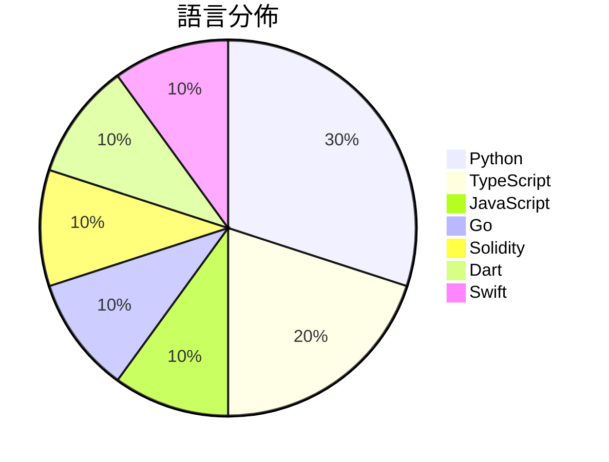

# GitHub Trending - 2026-07-23

> [!summary] 本日摘要
> 收錄 **10** 個新專案，合計 **10.0k** stars
> 語言分佈：Python (3) · TypeScript (2) · JavaScript (1) · Go (1) · Solidity (1) · Dart (1) · Swift (1)

> [!tip] 本週焦點
> **[[lopopolo--harness-engineering|lopopolo/harness-engineering]]** — 4 天內累積 2.2k stars（551 stars/天）
> 提升代理輸出，透過塑造環境來改善代理的運作效果。



---

## 收錄列表

| # | 專案 | 分類 | Stars | 速度 | 安裝 | 語言 | 用途 |
| :--: | --- | --- | ---: | ---: | --- | --- | --- |
| 1 | [[lopopolo--harness-engineering\|lopopolo/harness-engineering]] | 開發工具 | 2.2k | 551/天 | `medium` | Python | 提升代理輸出，透過塑造環境來改善代理的運作效果。 |
| 2 | [[tandpfun--wardrobe\|tandpfun/wardrobe]] | 開發工具 | 1.4k | 227/天 | `medium` | JavaScript | 利用 gpt-image 提取並組織你的衣物。 |
| 3 | [[pablostanley--yoinks\|pablostanley/yoinks]] | CLI 工具 | 1.1k | 176/天 | `easy` | TypeScript | 從終端機輕鬆下載任何視頻，無廣告干擾。 |
| 4 | [[nethical6--conversation-steganography\|nethical6/conversation-steganography]] | 安全 | 1.0k | 201/天 | `medium` | Go | 透過正常對話隱藏秘密訊息，實現私密通訊。 |
| 5 | [[MIgHTy-alIeN--MEV-Arbitrage-Bot\|MIgHTy-alIeN/MEV-Arbitrage-Bot]] | 基礎設施 | 920 | 184/天 | `medium` | Solidity | 自動化以太坊的套利機會，讓用戶無需手動操作即可獲利。 |
| 6 | [[v-modal--vmodal_sdk_flutter\|v-modal/vmodal_sdk_flutter]] | 開發工具 | 888 | 148/天 | `easy` | Dart | 讓你的 Android 和 iOS 應用程式擁有多模態記憶，透過語意搜尋和即時上 |
| 7 | [[Blaizzy--nativ\|Blaizzy/nativ]] | AI/ML | 768 | 384/天 | `medium` | Swift | 讓你在 Mac 上本地運行 AI 模型的應用，集成聊天、監控和模型管理功能。 |
| 8 | [[Jakubantalik--thinking-orbs\|Jakubantalik/thinking-orbs]] | 開發工具 | 655 | 655/天 | `easy` | TypeScript | 提供 AI 和代理 UI 的點狀思維圓球加載指示器，具備六種調整狀態和自動深淺色 |
| 9 | [[xiejunjie524--handdraw-story-video\|xiejunjie524/handdraw-story-video]] | 其他 | 621 | 155/天 | `medium` | Python | 將手繪故事插圖轉換為 35-45 秒的逐步顯示和上色視頻。 |
| 10 | [[powerycy--goutoujunshi\|powerycy/goutoujunshi]] | AI/ML | 548 | 274/天 | `medium` | Python | 提供情緒支持與關係分析的 AI 恋爱军师，幫助用戶制定可執行的戀愛策略。 |

---

## 重點摘要

### 1. [[lopopolo--harness-engineering|lopopolo/harness-engineering]] `開發工具`

> 提升代理輸出，透過塑造環境來改善代理的運作效果。

**2.2k** stars · **551** stars/天 · Python · `medium`

_建立 4 天就累積 2202 stars（551/天），forks 221（10.0%），顯示出強烈的使用者興趣。作者 Ryan Lopopolo 過去在代理技術領域有豐富的經驗，這個專案解決了如何有效整合代理與環境的問題，之前的解決方案往往無法有效地將組織的需求轉化為可操作的上下文。近期的社群討論和推文也引發了對這個專案的關注，尤其是其在提升代理輸出方面的潛力。這個工具的出現正好迎合了對於代理技術日益增長的需求，並且其設計理念也反映了當前技術生態的變化，特別是在非功能性需求的管理上。forks/stars 比率為 10.0%，顯示出有相當比例的用戶對其進行了實際修改，這是活躍開發的良好指標。_

---

### 2. [[tandpfun--wardrobe|tandpfun/wardrobe]] `開發工具`

> 利用 gpt-image 提取並組織你的衣物。

**1.4k** stars · **227** stars/天 · JavaScript · `medium`

_建立 6 天內累積 1362 stars（227/天），forks 195（14.3%），顯示出強烈的用戶興趣。作者 tandpfun 在開源社群中活躍，過去有多個相關項目，這個工具解決了衣物管理的痛點，提供了一個直觀的方式來數字化衣物。近期在社交媒體上引發了討論，吸引了許多對時尚和 AI 有興趣的開發者。技術上，隨著 OpenAI 圖像處理能力的提升，這個工具的可行性大幅增加。高達 14.3% 的 forks/stars 比率顯示出用戶對於這個工具的實際修改和使用意願。_

---

### 3. [[pablostanley--yoinks|pablostanley/yoinks]] `CLI 工具`

> 從終端機輕鬆下載任何視頻，無廣告干擾。

**1.1k** stars · **176** stars/天 · TypeScript · `easy`

_建立 6 天就累積 1053 stars（176/天），forks 104（9.9%），這顯示出相對活躍的社群參與。作者 Pablo Stanley 以開發多個開源項目聞名，這次的 yoinks 解決了用戶在終端下載視頻時的繁瑣步驟，提供了一個簡單的解決方案。近期的推廣和社群討論可能促進了這個工具的快速增長。技術上，Node.js 的普及和 ffmpeg 的廣泛應用使得這個工具的實現變得可行。高達 9.9% 的 forks/stars 比率表明許多用戶對這個工具有實際的修改和使用需求。_

---

### 4. [[nethical6--conversation-steganography|nethical6/conversation-steganography]] `安全`

> 透過正常對話隱藏秘密訊息，實現私密通訊。

**1.0k** stars · **201** stars/天 · Go · `medium`

_建立 5 天內累積 1003 stars（201/天），forks 69（6.9%），這顯示出該專案的快速增長。作者 nethical6 是一位熱衷於 LLM 和隱寫術的開發者，這個專案解決了在當前監控環境下安全傳遞訊息的需求。隨著對隱私的重視增加，這類工具的需求也在上升。該專案的設計使得用戶能夠在不引起懷疑的情況下進行加密通訊，這是一個以往工具未能充分解決的痛點。最近的社群討論和推廣活動也可能促進了其快速增長。_

---

### 5. [[MIgHTy-alIeN--MEV-Arbitrage-Bot|MIgHTy-alIeN/MEV-Arbitrage-Bot]] `基礎設施`

> 自動化以太坊的套利機會，讓用戶無需手動操作即可獲利。

**920** stars · **184** stars/天 · Solidity · `medium`

_建立 5 天內累積 920 stars（184/天），forks 650（70.7%），這顯示出極高的用戶參與度。作者 MIgHTy-alIeN 在區塊鏈領域有一定的經驗，這個工具解決了以太坊套利過程中的自動化問題，之前的解決方案往往需要手動操作，效率低下。近期的市場波動和套利機會的增多，讓這個工具的需求激增，並且在社群中引發了討論。高達 70.7% 的 forks/stars 比率顯示出許多人在實際修改和使用這個工具，這是其受歡迎的明顯指標。_

---

### 6. [[v-modal--vmodal_sdk_flutter|v-modal/vmodal_sdk_flutter]] `開發工具`

> 讓你的 Android 和 iOS 應用程式擁有多模態記憶，透過語意搜尋和即時上傳功能提升用戶體驗。

**888** stars · **148** stars/天 · Dart · `easy`

_建立 6 天內累積 888 stars（148/天），forks 3（0.3%），顯示出初期的穩定增長。作者 arita37 過去在開發 SDK 方面有一定經驗，這個專案解決了多模態視頻搜尋的需求，之前的工具往往無法提供即時的上傳和搜尋功能。近期的推廣活動可能吸引了開發者的注意，特別是在移動應用開發領域。forks/stars 比率低於 5% 表示目前使用者主要是觀望，尚未大量修改或實際使用。_

---

### 7. [[Blaizzy--nativ|Blaizzy/nativ]] `AI/ML`

> 讓你在 Mac 上本地運行 AI 模型的應用，集成聊天、監控和模型管理功能。

**768** stars · **384** stars/天 · Swift · `medium`

_建立 2 天內累積 768 stars（384/天），forks 40（5.2%），顯示出不錯的初期接受度。這個專案由 Lazarus-931 和 Blaizzy 等活躍貢獻者主導，解決了在 Mac 上本地運行 AI 模型的需求，之前的方案多依賴雲端服務，導致延遲和隱私問題。隨著本地推理需求的上升，這個工具正好填補了市場空白。社群的反饋也在不斷推動功能的完善，像是對 Apple 硬體的支持需求和對新模型的請求。這些因素共同促成了 Nativ 的快速增長。_

---

### 8. [[Jakubantalik--thinking-orbs|Jakubantalik/thinking-orbs]] `開發工具`

> 提供 AI 和代理 UI 的點狀思維圓球加載指示器，具備六種調整狀態和自動深淺色主題。

**655** stars · **655** stars/天 · TypeScript · `easy`

_建立 1 天就累積 655 stars（655/天），forks 42（6.4%），這顯示出其快速的增長潛力。作者 Jakub Antalik 以其對 UI/UX 的專注而聞名，這個專案解決了在 AI 和代理界面中缺乏輕量級加載指示器的問題。之前的方案通常依賴於較重的圖形處理，導致性能問題。這個專案的出現正好填補了這個空白，並且在社群中引起了關注。技術上，這個工具的設計使其能夠輕鬆集成到現有的 React 應用中，並且能夠自動適應主題，這在當前的開發趨勢中是相當重要的。forks/stars 比率為 6.4%，顯示出有相當一部分用戶對其進行了實際修改和使用。_

---

### 9. [[xiejunjie524--handdraw-story-video|xiejunjie524/handdraw-story-video]] `其他`

> 將手繪故事插圖轉換為 35-45 秒的逐步顯示和上色視頻。

**621** stars · **155** stars/天 · Python · `medium`

_建立 4 天內累積 621 stars（155/天），forks 95（15.3%），顯示出良好的社群反應。作者 xiejunjie524 之前的專案可能涉及多媒體或動畫領域，這使得他能夠針對手繪故事視頻的需求提供解決方案。這個工具填補了市場上對於手繪風格視頻生成的需求，讓創作者能夠快速製作出具有個人風格的內容。社群的活躍度和對於手繪風格的興趣可能是其快速增長的原因。這個專案的設計理念也符合當前對於個性化內容創作的趨勢。_

---

### 10. [[powerycy--goutoujunshi|powerycy/goutoujunshi]] `AI/ML`

> 提供情緒支持與關係分析的 AI 恋爱军师，幫助用戶制定可執行的戀愛策略。

**548** stars · **274** stars/天 · Python · `medium`

_建立 2 天就累積 548 stars（274/天），forks 68（12.4%），顯示出強勁的增長潛力。作者 powerycy 在情感科技領域有一定的背景，這個專案解決了傳統戀愛建議工具無法提供深入分析的痛點。之前的工具多數提供簡單的建議，缺乏情感支持和多元關係的考量。近期社交媒體的討論也引發了對這類工具的興趣，讓更多人關注到情感健康的重要性。這個工具的設計符合當前對於情感智能的需求，並且其多元性別和關係支持使其在市場上具有獨特性。forks/stars 比率適中，顯示出一定的實際修改需求。_

---

## 今日到期複習

> [!tip] 根據間隔複習排程，今天該回顧的專案

```dataview
TABLE
  stars_per_day AS "Stars/天",
  category AS "分類",
  engagement AS "參與度"
FROM "Repos"
WHERE next_review AND date(next_review) <= date("2026-07-23") AND status != "archived"
SORT priority DESC
```

## 待處理

```dataviewjs
const pending = dv.pages('"Repos"').where(p => p.status === "to-review").length;
const unrated = dv.pages('"Repos"').where(p => p.status !== "archived" && p.status !== "to-review" && (p.my_rating || 0) === 0).length;
const noVerdict = dv.pages('"Repos"').where(p => p.status !== "archived" && (p.my_rating || 0) > 0 && (!p.verdict || p.verdict === "")).length;
const items = [];
if (pending > 0) items.push(`**${pending}** 個待分流`);
if (unrated > 0) items.push(`**${unrated}** 個已讀但未評分`);
if (noVerdict > 0) items.push(`**${noVerdict}** 個已評分但無結論`);
if (items.length > 0) dv.paragraph(items.join(" / "));
else dv.paragraph("所有專案都已處理完畢！");
```
