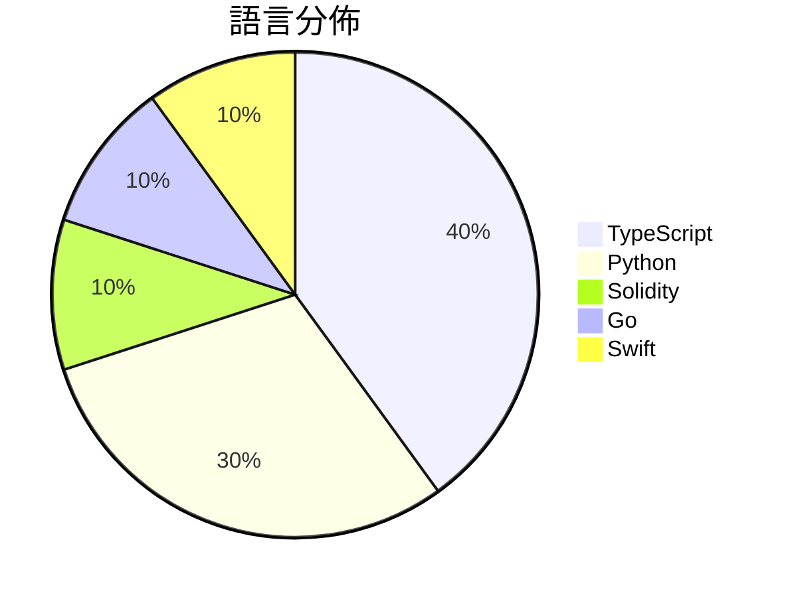

# GitHub Trending - 2026-07-24

> [!summary] 本日摘要
> 收錄 **10** 個新專案，合計 **11.4k** stars
> 語言分佈：TypeScript (4) · Python (3) · Solidity (1) · Go (1) · Swift (1)

> [!tip] 本週焦點
> **[[lopopolo--harness-engineering|lopopolo/harness-engineering]]** — 5 天內累積 2.3k stars（457 stars/天）
> 提升代理輸出的環境設計指南，讓代理更有效率地運作。



---

## 收錄列表

| # | 專案 | 分類 | Stars | 速度 | 安裝 | 語言 | 用途 |
| :--: | --- | --- | ---: | ---: | --- | --- | --- |
| 1 | [[lopopolo--harness-engineering\|lopopolo/harness-engineering]] | 開發工具 | 2.3k | 457/天 | `easy` | Python | 提升代理輸出的環境設計指南，讓代理更有效率地運作。 |
| 2 | [[andrewyng--openworker\|andrewyng/openworker]] | 生產力 | 1.7k | 422/天 | `medium` | Python | 提供一個開源的 AI 助手平台，能夠在桌面上自動完成日常任務。 |
| 3 | [[MIgHTy-alIeN--MEV-Arbitrage-Bot\|MIgHTy-alIeN/MEV-Arbitrage-Bot]] | 基礎設施 | 1.2k | 199/天 | `medium` | Solidity | 自動化套利機器人，透過智能合約在 Uniswap 池之間尋找並執行套利機會。 |
| 4 | [[nyblnet--bento\|nyblnet/bento]] | 其他 | 1.2k | 195/天 | `easy` | TypeScript | 提供一個獨立的 HTML 檔案作為 PowerPoint 替代方案，無需安裝任何 |
| 5 | [[nethical6--conversation-steganography\|nethical6/conversation-steganography]] | 安全 | 1.1k | 179/天 | `medium` | Go | 讓兩個人透過任何即時通訊應用進行完全私密的對話，隱藏秘密訊息於正常的聊天文本中。 |
| 6 | [[Vincentwei1021--video-shotcraft\|Vincentwei1021/video-shotcraft]] | AI/ML | 1.0k | 251/天 | `easy` | TypeScript | 將 AI 轉化為電影級產品視頻製作工具，提供 106 種拍攝食譜與模板。 |
| 7 | [[Jakubantalik--thinking-orbs\|Jakubantalik/thinking-orbs]] | 開發工具 | 841 | 421/天 | `easy` | TypeScript | 提供 AI 和代理 UI 的點狀思考圓球加載指示器，擁有六種調整狀態和兩種尺寸， |
| 8 | [[Blaizzy--nativ\|Blaizzy/nativ]] | AI/ML | 822 | 274/天 | `medium` | Swift | 讓你在 Mac 上本地運行 AI 模型的應用，提供聊天、監控和模型管理功能。 |
| 9 | [[powerycy--goutoujunshi\|powerycy/goutoujunshi]] | AI/ML | 689 | 230/天 | `easy` | Python | 提供情感支持、关系分析与可执行策略的 AI 恋爱顾问。 |
| 10 | [[pireel--pireel\|pireel/pireel]] | 開發工具 | 666 | 222/天 | `medium` | TypeScript | 提供一個無需後端的 AI 影片編輯器，專為對話式影片設計，支持故事板、動態字幕等 |

---

## 重點摘要

### 1. [[lopopolo--harness-engineering|lopopolo/harness-engineering]] `開發工具`

> 提升代理輸出的環境設計指南，讓代理更有效率地運作。

**2.3k** stars · **457** stars/天 · Python · `easy`

_建立 5 天內累積 2283 stars（457/天），forks 229（10.0%），顯示出相對於其新穎性，社群的興趣相當高。作者 Ryan Lopopolo 在代理技術領域有豐富的經驗，這個專案解決了如何有效整合環境與代理的痛點，之前的方案往往無法充分考量非功能性需求。這個專案的出現正好填補了這個空白，並且引起了社群的廣泛討論。技術生態的變化，如對於代理技術的需求增加，也使得這個工具的可行性大幅提升。高達 10% 的 forks/stars 比率顯示出許多人對這個專案進行實際修改，反映出其實用性和潛力。_

---

### 2. [[andrewyng--openworker|andrewyng/openworker]] `生產力`

> 提供一個開源的 AI 助手平台，能夠在桌面上自動完成日常任務。

**1.7k** stars · **422** stars/天 · Python · `medium`

_建立 4 天內累積 1686 stars（422/天），forks 249（14.8%），顯示出強烈的社群興趣。這個專案的作者 rohitprasad15 和 andrewyng 具備豐富的開發經驗，之前在 aisuite 的工作為這個專案奠定了基礎。OpenWorker 解決了許多用戶在日常工作中需要多個工具協作的痛點，提供了一個集成的解決方案。最近的推文和社群討論也引發了對這個工具的關注，特別是在 AI 助手的需求日益增加的背景下。高達 14.8% 的 forks/stars 比率顯示出許多開發者對這個專案進行實際修改和使用的興趣。_

---

### 3. [[MIgHTy-alIeN--MEV-Arbitrage-Bot|MIgHTy-alIeN/MEV-Arbitrage-Bot]] `基礎設施`

> 自動化套利機器人，透過智能合約在 Uniswap 池之間尋找並執行套利機會。

**1.2k** stars · **199** stars/天 · Solidity · `medium`

_建立 6 天內累積 1195 stars（199/天），forks 854（71.5%），顯示出強烈的社群興趣。這個專案由 MIgHTy-alIeN 開發，專注於自動化套利交易，解決了手動套利過程中效率低下的問題。隨著 DeFi 生態系統的迅速發展，對於自動化交易工具的需求也隨之上升，這使得該專案在短時間內獲得了大量關注。高達 71.5% 的 forks 表示許多開發者對其進行了修改或擴展，顯示出其實用性和可擴展性。_

---

### 4. [[nyblnet--bento|nyblnet/bento]] `其他`

> 提供一個獨立的 HTML 檔案作為 PowerPoint 替代方案，無需安裝任何軟體。

**1.2k** stars · **195** stars/天 · TypeScript · `easy`

_建立 6 天內累積 1171 stars（195/天），forks 66（5.6%），顯示出穩定的增長趨勢。這個專案的作者 nyblnet 和 tura-ai-agent 之前有過其他開源專案的經驗，這使得他們能夠快速推出一個功能完整的工具。Bento 解決了傳統簡報工具的鎖定問題，讓使用者能夠擁有自己的檔案而不依賴雲端服務。這種設計理念吸引了對隱私和資料控制有需求的使用者群體。社群的反饋也顯示出對於即時協作和簡報功能的高度需求，進一步促進了這個專案的流行。_

---

### 5. [[nethical6--conversation-steganography|nethical6/conversation-steganography]] `安全`

> 讓兩個人透過任何即時通訊應用進行完全私密的對話，隱藏秘密訊息於正常的聊天文本中。

**1.1k** stars · **179** stars/天 · Go · `medium`

_建立 6 天內累積 1072 stars（179/天），forks 77（7.2%），顯示出強勁的增長勢頭。作者 nethical6 是一位對隱私和安全有深入研究的開發者，這個專案解決了在即時通訊中隱藏訊息的需求，尤其在政府監控日益嚴格的背景下。這個工具的出現讓人們能夠在不引起懷疑的情況下進行私密對話，滿足了對於安全通訊的迫切需求。社群的反應熱烈，顯示出對於這類工具的需求和興趣。_

---

### 6. [[Vincentwei1021--video-shotcraft|Vincentwei1021/video-shotcraft]] `AI/ML`

> 將 AI 轉化為電影級產品視頻製作工具，提供 106 種拍攝食譜與模板。

**1.0k** stars · **251** stars/天 · TypeScript · `easy`

_建立 4 天就累積 1002 stars（250.5/天），forks 73（7.3%），這顯示出不錯的社群反應。作者 Vincent Wei 之前在 AI 動畫和視頻生成領域有過相關經驗，這個專案解決了傳統視頻製作流程中繁瑣的問題，讓用戶能夠快速生成專業級視頻。近期的推廣和展示也吸引了不少關注，尤其是在社群平台上分享的視頻範例。技術上，Remotion 的流行使得這個工具能夠在瀏覽器中高效運行，這是其成功的關鍵因素之一。forks/stars 比率在 7.3% 屬於中等，顯示出有一定數量的用戶在實際修改和使用這個工具。_

---

### 7. [[Jakubantalik--thinking-orbs|Jakubantalik/thinking-orbs]] `開發工具`

> 提供 AI 和代理 UI 的點狀思考圓球加載指示器，擁有六種調整狀態和兩種尺寸，並自動適應深色/淺色主題。

**841** stars · **421** stars/天 · TypeScript · `easy`

_建立 2 天內累積 841 stars（421/天），forks 59（7.0%），這顯示出強勁的增長潛力。作者 Jakub Antalik 是一位活躍的開發者，過去有多個成功的開源專案。這個專案解決了在 AI 和代理 UI 中缺乏美觀且高效的加載指示器的痛點，提供了一個簡單的解決方案。社群中對於 Vue 3 版本的需求也顯示出其潛在的擴展性。技術生態的變化，如對於性能和可訪問性的重視，使得這個工具的需求上升。forks/stars 比率為 7.0%，顯示出有相當比例的用戶在實際修改和使用這個專案。_

---

### 8. [[Blaizzy--nativ|Blaizzy/nativ]] `AI/ML`

> 讓你在 Mac 上本地運行 AI 模型的應用，提供聊天、監控和模型管理功能。

**822** stars · **274** stars/天 · Swift · `medium`

_建立 3 天內累積 822 stars（274/天），forks 43（5.2%），顯示出穩定的增長潛力。這個專案的主要貢獻者有過往的開發經驗，並且專注於解決本地 AI 模型運行的痛點，這在過去的工具中並不常見。之前的解決方案往往需要雲端支持或缺乏本地化的整合，Nativ 則提供了一個完整的本地解決方案。社群的反應也顯示出對於本地 AI 應用的需求，尤其是在 Apple 硬體上。這個工具的出現正好滿足了這一需求，並且有潛力在未來獲得更多的使用者。_

---

### 9. [[powerycy--goutoujunshi|powerycy/goutoujunshi]] `AI/ML`

> 提供情感支持、关系分析与可执行策略的 AI 恋爱顾问。

**689** stars · **230** stars/天 · Python · `easy`

_建立 3 天就累積 689 stars（229.7/天），forks 81（11.8%），這顯示出相對活躍的社群參與。作者 powerycy 之前有過相關的開發經驗，這次專案針對情感支持的需求填補了市場空白。此工具能夠提供更深入的情感分析與策略建議，這在目前的市場上是相對少見的。隨著人們對情感健康的重視增加，這樣的工具自然受到關注。forks/stars 比率 11.8% 表示有相當比例的用戶在進行實際修改或擴展，顯示出對此工具的實際需求。_

---

### 10. [[pireel--pireel|pireel/pireel]] `開發工具`

> 提供一個無需後端的 AI 影片編輯器，專為對話式影片設計，支持故事板、動態字幕等功能。

**666** stars · **222** stars/天 · TypeScript · `medium`

_建立 3 天內累積 666 stars（222/天），forks 52（7.8%），顯示出良好的社群反應。作者 tangjinzhou 之前有開發其他 AI 相關工具，這次推出的 Pireel 解決了傳統影片編輯器需要後端支持的痛點，讓用戶能夠在瀏覽器中進行完整的編輯流程。這種無需伺服器的設計在當前的開發環境中非常受歡迎，尤其是對於需要快速迭代的創作者來說。社群的活躍度和快速的反饋也促進了這個專案的成長。_

---

## 今日到期複習

> [!tip] 根據間隔複習排程，今天該回顧的專案

```dataview
TABLE
  stars_per_day AS "Stars/天",
  category AS "分類",
  engagement AS "參與度"
FROM "Repos"
WHERE next_review AND date(next_review) <= date("2026-07-24") AND status != "archived"
SORT priority DESC
```

## 待處理

```dataviewjs
const pending = dv.pages('"Repos"').where(p => p.status === "to-review").length;
const unrated = dv.pages('"Repos"').where(p => p.status !== "archived" && p.status !== "to-review" && (p.my_rating || 0) === 0).length;
const noVerdict = dv.pages('"Repos"').where(p => p.status !== "archived" && (p.my_rating || 0) > 0 && (!p.verdict || p.verdict === "")).length;
const items = [];
if (pending > 0) items.push(`**${pending}** 個待分流`);
if (unrated > 0) items.push(`**${unrated}** 個已讀但未評分`);
if (noVerdict > 0) items.push(`**${noVerdict}** 個已評分但無結論`);
if (items.length > 0) dv.paragraph(items.join(" / "));
else dv.paragraph("所有專案都已處理完畢！");
```
