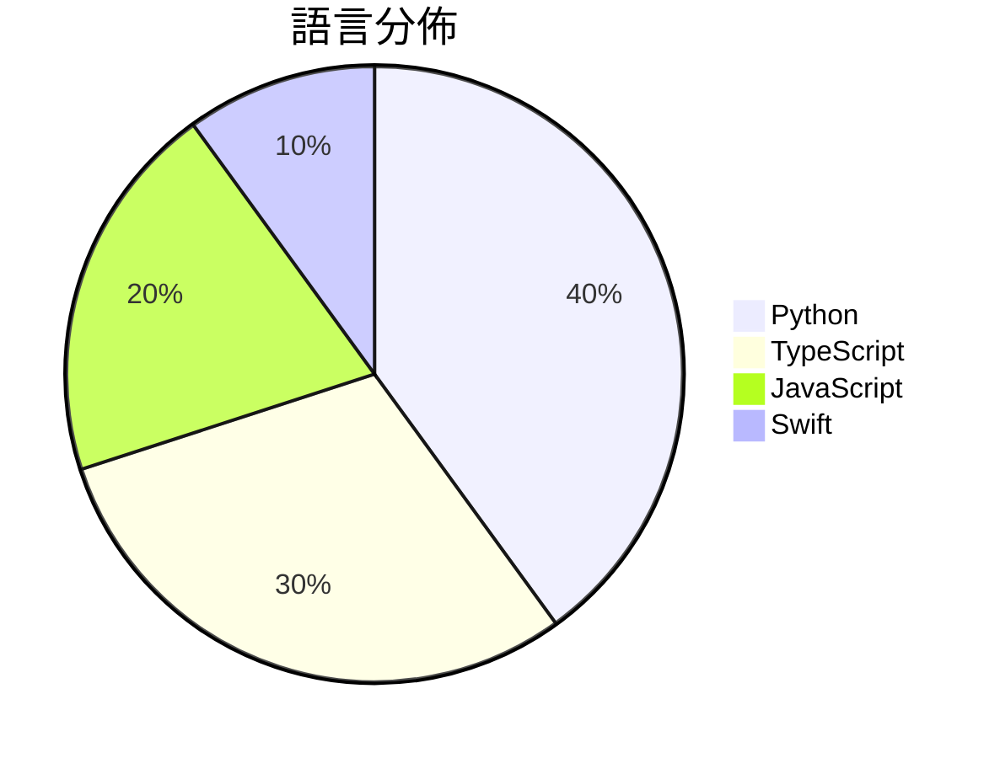

# GitHub Trending - 2026-07-25

> [!summary] 本日摘要
> 收錄 **10** 個新專案，合計 **12.5k** stars
> 語言分佈：Python (4) · TypeScript (3) · JavaScript (2) · Swift (1)

> [!tip] 本週焦點
> **[[andrewyng--openworker|andrewyng/openworker]]** — 5 天內累積 3.5k stars（708 stars/天）
> 提供一個能在桌面上運行的開源 AI 助手，幫助用戶完成日常任務。



---

## 收錄列表

| # | 專案 | 分類 | Stars | 速度 | 安裝 | 語言 | 用途 |
| :--: | --- | --- | ---: | ---: | --- | --- | --- |
| 1 | [[andrewyng--openworker\|andrewyng/openworker]] | 生產力 | 3.5k | 708/天 | `medium` | Python | 提供一個能在桌面上運行的開源 AI 助手，幫助用戶完成日常任務。 |
| 2 | [[lopopolo--harness-engineering\|lopopolo/harness-engineering]] | 開發工具 | 2.3k | 388/天 | `medium` | Python | 提升代理輸出，通過塑造環境來改善代理的運作與結果。 |
| 3 | [[Vincentwei1021--video-shotcraft\|Vincentwei1021/video-shotcraft]] | 其他 | 1.5k | 299/天 | `easy` | TypeScript | 將 AI 轉變為電影級產品視頻製作工具，提供 106 種拍攝食譜和 161 種動 |
| 4 | [[Jakubantalik--thinking-orbs\|Jakubantalik/thinking-orbs]] | 開發工具 | 936 | 312/天 | `easy` | TypeScript | 為 AI 和代理 UI 提供點狀思維球加載指示器，擁有六種調整狀態和兩種大小，能 |
| 5 | [[Blaizzy--nativ\|Blaizzy/nativ]] | AI/ML | 863 | 216/天 | `medium` | Swift | 讓你在 Mac 上本地運行和管理 AI 模型的應用程式。 |
| 6 | [[powerycy--goutoujunshi\|powerycy/goutoujunshi]] | AI/ML | 812 | 203/天 | `easy` | Python | 提供情绪支持与关系分析的 AI 恋爱军师，帮助用户制定可执行的恋爱策略。 |
| 7 | [[pireel--pireel\|pireel/pireel]] | 其他 | 716 | 179/天 | `medium` | TypeScript | 提供一個無後端的 AI 影片編輯器，專為對話式影片設計，支持故事板、圖形設計和動 |
| 8 | [[xiejunjie524--handdraw-story-video\|xiejunjie524/handdraw-story-video]] | 其他 | 643 | 107/天 | `medium` | Python | 將手繪故事插圖轉換為 35-45 秒的逐步顯示和著色視頻。 |
| 9 | [[gnipbao--story-to-handdrawn-video\|gnipbao/story-to-handdrawn-video]] | 其他 | 610 | 203/天 | `medium` | JavaScript | 將中文故事或上傳的漫畫頁面轉換為手繪日記漫畫動畫。 |
| 10 | [[CatsJuice--sticker-forge\|CatsJuice/sticker-forge]] | 開發工具 | 530 | 133/天 | `easy` | JavaScript | 讓使用者輕鬆創建互動式 WebGL 貼紙，支持豐富的文本和圖像上傳。 |

---

## 重點摘要

### 1. [[andrewyng--openworker|andrewyng/openworker]] `生產力`

> 提供一個能在桌面上運行的開源 AI 助手，幫助用戶完成日常任務。

**3.5k** stars · **708** stars/天 · Python · `medium`

_建立 5 天內累積 3538 stars（708/天），forks 473（13.4%），這顯示出強勁的增長潛力。作者 Andrew Yng 之前在 aisuite 上有過成功的開發經驗，這個專案解決了用戶在多種 AI 模型間切換的困難，並提供了本地運行的選項，這在數據隱私日益重要的今天尤為關鍵。最近的推廣活動和社群討論也為其帶來了更多的關注。技術上，隨著 AI 模型的多樣化和用戶需求的增加，這個工具的出現正好填補了市場的空白。高達 13.4% 的 forks/stars 比率顯示出許多人在實際使用和修改它，這是活躍社群的指標。_

---

### 2. [[lopopolo--harness-engineering|lopopolo/harness-engineering]] `開發工具`

> 提升代理輸出，通過塑造環境來改善代理的運作與結果。

**2.3k** stars · **388** stars/天 · Python · `medium`

_建立 6 天就累積 2329 stars（388/天），forks 237（10.2%），這顯示出強烈的初期興趣。Ryan Lopopolo 是一位知名的專家，過去在代理系統和環境設計方面有豐富的經驗。這個專案解決了在代理系統中如何有效整合非功能性需求的痛點，之前的方案往往忽略了環境的影響。這個專案的推出引發了社群的廣泛討論，尤其是在 Twitter 和相關論壇上。技術生態的變化，如對於代理系統的需求增加，也使得這個工具的出現變得更加必要。forks/stars 比率達到 10.2%，顯示出相對較高的實際使用意圖。_

---

### 3. [[Vincentwei1021--video-shotcraft|Vincentwei1021/video-shotcraft]] `其他`

> 將 AI 轉變為電影級產品視頻製作工具，提供 106 種拍攝食譜和 161 種動態預覽。

**1.5k** stars · **299** stars/天 · TypeScript · `easy`

_建立 5 天內累積 1496 stars（299/天），forks 122（8.2%），顯示出強勁的增長潛力。該專案由 Vincentwei1021 和其他貢獻者共同開發，目的是解決傳統視頻製作過程中的繁瑣問題，提供一個自動化的解決方案。之前的視頻生成工具往往缺乏針對性和自動化，而 video-shotcraft 則專注於產品視頻的生成，填補了這一市場空白。社群的反饋和使用者的需求也促進了這個專案的快速成長。技術上，Remotion 框架的使用讓這個工具在視頻質量上有了保障，這也是其受歡迎的原因之一。_

---

### 4. [[Jakubantalik--thinking-orbs|Jakubantalik/thinking-orbs]] `開發工具`

> 為 AI 和代理 UI 提供點狀思維球加載指示器，擁有六種調整狀態和兩種大小，能自動適應深淺主題。

**936** stars · **312** stars/天 · TypeScript · `easy`

_建立 3 天就累積 936 stars（312/天），forks 70（7.5%），顯示出相對活躍的興趣。作者 Jakub Antalik 之前有其他開源專案，這次專案解決了在 AI 和代理 UI 中缺乏輕量級且美觀的加載指示器的痛點。這類需求在當前的開發環境中越來越普遍，特別是在需要快速反應的應用中。社群的反應也顯示出對於這個專案的潛力和需求，尤其是對於 Vue 和 Flutter 的適配請求，顯示出需求的多樣性。這個工具的設計考量了現代 UI 的需求，並且在技術上簡化了實現過程，讓開發者能夠快速上手。_

---

### 5. [[Blaizzy--nativ|Blaizzy/nativ]] `AI/ML`

> 讓你在 Mac 上本地運行和管理 AI 模型的應用程式。

**863** stars · **216** stars/天 · Swift · `medium`

_建立 4 天就累積 863 stars（216/天），forks 45（5.2%），顯示出不錯的增長潛力。作者 Lazarus-931 和 Blaizzy 具備開源背景，並且這個專案填補了本地 AI 模型運行的需求，特別是在 Apple Silicon 環境中。近期的社群討論和需求反饋也促進了這個專案的曝光率。由於本地運行 AI 模型的需求日益增加，這個工具的出現正好契合了市場需求。_

---

### 6. [[powerycy--goutoujunshi|powerycy/goutoujunshi]] `AI/ML`

> 提供情绪支持与关系分析的 AI 恋爱军师，帮助用户制定可执行的恋爱策略。

**812** stars · **203** stars/天 · Python · `easy`

_建立 4 天就累積 812 stars（203/天），forks 93（11.5%），顯示出強烈的社群興趣。作者 powerycy 是一位專注於情感與心理學的開發者，這個專案解決了許多傳統戀愛建議工具無法深入分析情感和關係的痛點。之前的工具往往提供簡單的建議，而狗頭軍師則透過情感支持和具體策略的結合，填補了這一空白。近期的推廣活動和社群討論也促進了其曝光率，讓更多人關注到這個工具的潛力。_

---

### 7. [[pireel--pireel|pireel/pireel]] `其他`

> 提供一個無後端的 AI 影片編輯器，專為對話式影片設計，支持故事板、圖形設計和動態字幕。

**716** stars · **179** stars/天 · TypeScript · `medium`

_建立 4 天內累積 716 stars（179/天），forks 56（7.8%），顯示出強烈的社群興趣。作者 tangjinzhou 之前在開源社群有過多個貢獻，這個專案解決了傳統影片編輯器需要伺服器支持的痛點，讓用戶能夠在本地編輯影片，避免了資料外洩的風險。這種設計在當前對隱私和安全性要求越來越高的環境下，顯得尤為重要。社群的活躍度和開發者的背景都為這個專案的未來發展提供了良好的基礎。_

---

### 8. [[xiejunjie524--handdraw-story-video|xiejunjie524/handdraw-story-video]] `其他`

> 將手繪故事插圖轉換為 35-45 秒的逐步顯示和著色視頻。

**643** stars · **107** stars/天 · Python · `medium`

_建立 6 天內累積 643 stars（107 stars/天），forks 97（15.1%），這顯示出相對高的使用者興趣。作者 xiejunjie524 和 binyangzhu000-sudo 具備開源背景，專案解決了手繪故事轉視頻的需求，之前的工具往往需要繁瑣的手動操作。近期在社交媒體上有討論，進一步推動了使用者的關注。技術上，隨著動畫和視頻內容需求的增加，這個工具的可行性和實用性也得到了提升。forks/stars 比率為 15.1%，顯示出有相當比例的使用者在進行實際修改或使用。_

---

### 9. [[gnipbao--story-to-handdrawn-video|gnipbao/story-to-handdrawn-video]] `其他`

> 將中文故事或上傳的漫畫頁面轉換為手繪日記漫畫動畫。

**610** stars · **203** stars/天 · JavaScript · `medium`

_建立 3 天內累積 610 stars（203/天），forks 69（11.3%），顯示出快速增長的潛力。作者 gnipbao 之前有其他開源專案，這個專案解決了將靜態故事轉換為動態內容的需求，特別是在中文故事創作領域。這個工具的出現正好填補了市場上對於自動化動畫生成的需求，並且在社群中引起了討論。技術上，Remotion 的使用讓這個工具能夠生成高品質的影片，並且簡化了開發流程。forks/stars 比率為 11.3%，顯示出不少開發者在積極修改和使用這個專案。_

---

### 10. [[CatsJuice--sticker-forge|CatsJuice/sticker-forge]] `開發工具`

> 讓使用者輕鬆創建互動式 WebGL 貼紙，支持豐富的文本和圖像上傳。

**530** stars · **133** stars/天 · JavaScript · `easy`

_建立 4 天就累積 530 stars（133/天），forks 46（8.7%），這顯示出相對較高的使用者興趣。作者 CatsJuice 是一位專注於創意工具開發的開發者，過去有多個成功的開源專案。這個專案解決了現有貼紙製作工具缺乏互動性和自定義選項的痛點，讓使用者能夠創建更具個性化的貼紙。近期的推廣活動和社群討論也促進了這個專案的曝光率。技術上，WebGL 的進步使得這種互動式貼紙的實現成為可能。高達 8.7% 的 forks/stars 比率顯示出許多開發者在實際修改和使用這個工具。_

---

## 今日到期複習

> [!tip] 根據間隔複習排程，今天該回顧的專案

```dataview
TABLE
  stars_per_day AS "Stars/天",
  category AS "分類",
  engagement AS "參與度"
FROM "Repos"
WHERE next_review AND date(next_review) <= date("2026-07-25") AND status != "archived"
SORT priority DESC
```

## 待處理

```dataviewjs
const pending = dv.pages('"Repos"').where(p => p.status === "to-review").length;
const unrated = dv.pages('"Repos"').where(p => p.status !== "archived" && p.status !== "to-review" && (p.my_rating || 0) === 0).length;
const noVerdict = dv.pages('"Repos"').where(p => p.status !== "archived" && (p.my_rating || 0) > 0 && (!p.verdict || p.verdict === "")).length;
const items = [];
if (pending > 0) items.push(`**${pending}** 個待分流`);
if (unrated > 0) items.push(`**${unrated}** 個已讀但未評分`);
if (noVerdict > 0) items.push(`**${noVerdict}** 個已評分但無結論`);
if (items.length > 0) dv.paragraph(items.join(" / "));
else dv.paragraph("所有專案都已處理完畢！");
```
