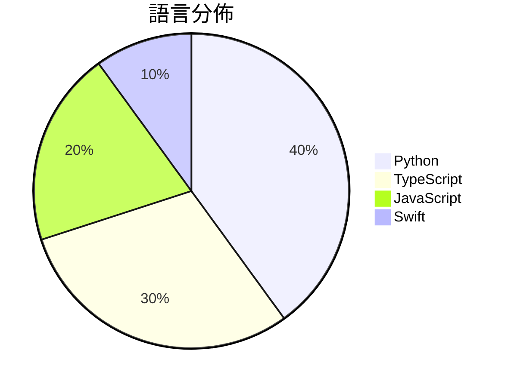

# GitHub Trending - 2026-07-26

> [!summary] 本日摘要
> 收錄 **10** 個新專案，合計 **13.2k** stars
> 語言分佈：Python (4) · TypeScript (3) · JavaScript (2) · Swift (1)

> [!tip] 本週焦點
> **[[andrewyng--openworker|andrewyng/openworker]]** — 6 天內累積 5.2k stars（870 stars/天）
> 提供一個開放的 AI 助手平台，能夠自動化日常任務並生成實際的工作成果。



---

## 收錄列表

| # | 專案 | 分類 | Stars | 速度 | 安裝 | 語言 | 用途 |
| :--: | --- | --- | ---: | ---: | --- | --- | --- |
| 1 | [[andrewyng--openworker\|andrewyng/openworker]] | 生產力 | 5.2k | 870/天 | `medium` | Python | 提供一個開放的 AI 助手平台，能夠自動化日常任務並生成實際的工作成果。 |
| 2 | [[Vincentwei1021--video-shotcraft\|Vincentwei1021/video-shotcraft]] | AI/ML | 1.8k | 295/天 | `medium` | TypeScript | 將 Claude Code 或 Codex 轉變為一個動態設計工作室，輕鬆製作產 |
| 3 | [[Jakubantalik--thinking-orbs\|Jakubantalik/thinking-orbs]] | 開發工具 | 1.0k | 256/天 | `easy` | TypeScript | 提供 AI 和代理 UI 的點狀思維球加載指示器，具備六種調整狀態和自動深淺色主 |
| 4 | [[Blaizzy--nativ\|Blaizzy/nativ]] | AI/ML | 886 | 177/天 | `medium` | Swift | 在你的 Mac 上本地運行 AI 模型的應用，支持聊天、監控和模型管理。 |
| 5 | [[powerycy--goutoujunshi\|powerycy/goutoujunshi]] | AI/ML | 885 | 177/天 | `easy` | Python | 提供情感支持、关系分析与可执行策略的 AI 恋爱军师。 |
| 6 | [[slvDev--esp32-ai\|slvDev/esp32-ai]] | AI/ML | 875 | 438/天 | `medium` | Python | 在 $8 的 ESP32 微控制器上運行 28.9M 參數的語言模型，實現無伺服 |
| 7 | [[pireel--pireel\|pireel/pireel]] | 開發工具 | 756 | 151/天 | `medium` | TypeScript | 提供無後端的 AI 影片編輯器，專為對話式影片設計，支援故事板、動態字幕等功能。 |
| 8 | [[gnipbao--story-to-handdrawn-video\|gnipbao/story-to-handdrawn-video]] | 其他 | 631 | 158/天 | `medium` | JavaScript | 將中文故事或手繪圖片轉換為靜音手繪日記漫畫動畫。 |
| 9 | [[mikiarlo3--ai-copywriter\|mikiarlo3/ai-copywriter]] |  | 621 | 621/天 |  | Python | An AI copywriter that uses real copywrit |
| 10 | [[CatsJuice--sticker-forge\|CatsJuice/sticker-forge]] | 開發工具 | 576 | 115/天 | `medium` | JavaScript | 讓用戶輕鬆製作互動式 WebGL 貼紙，支持豐富的文本和圖像上傳。 |

---

## 重點摘要

### 1. [[andrewyng--openworker|andrewyng/openworker]] `生產力`

> 提供一個開放的 AI 助手平台，能夠自動化日常任務並生成實際的工作成果。

**5.2k** stars · **870** stars/天 · Python · `medium`

_建立 6 天內累積 5217 stars（870/天），forks 694（13.3%），顯示出強勁的增長潛力。這個專案的作者 rohitprasad15 和 andrewyng 在開源社群中有一定的知名度，並且之前有過相關的開發經驗。OpenWorker 解決了用戶在日常工作中需要多個工具協作的痛點，之前的解決方案往往無法提供一個統一的工作平台。這個專案的出現正好填補了這個空白，並且其設計理念與當前對於 AI 助手的需求相契合。社群的反饋也顯示出對於其功能的期待，尤其是在多模型支持和隱私保護方面。forks/stars 比率為 13.3%，顯示出有相當比例的用戶在實際修改和使用這個工具。_

---

### 2. [[Vincentwei1021--video-shotcraft|Vincentwei1021/video-shotcraft]] `AI/ML`

> 將 Claude Code 或 Codex 轉變為一個動態設計工作室，輕鬆製作產品宣傳影片。

**1.8k** stars · **295** stars/天 · TypeScript · `medium`

_建立 6 天內累積 1768 stars（295/天），forks 152（8.6%），這顯示出相當高的使用興趣。作者 Vincentwei1021 及其團隊專注於 AI 影片生成，這在市場上仍然是一個相對新穎的領域。此工具解決了傳統影片製作流程繁瑣、時間成本高的問題，特別是對於小型團隊或個人開發者來說。近期在社群平台上引發了討論，吸引了許多對影片製作感興趣的開發者。技術上，Remotion 框架的使用使得這個工具能夠實現高效的影片生成，這在過去的工具中並不常見。forks/stars 比率達到 8.6%，顯示出許多人在實際修改和使用這個工具。_

---

### 3. [[Jakubantalik--thinking-orbs|Jakubantalik/thinking-orbs]] `開發工具`

> 提供 AI 和代理 UI 的點狀思維球加載指示器，具備六種調整狀態和自動深淺色主題。

**1.0k** stars · **256** stars/天 · TypeScript · `easy`

_建立 4 天就累積 1022 stars（256/天），forks 76（7.4%），顯示出強烈的社群興趣。作者 Jakub Antalik 之前在 UI 動畫方面有豐富經驗，這個專案解決了傳統加載指示器在不同主題下顯示不一致的問題，提供了一個簡單且美觀的解決方案。最近的推廣活動和社群討論可能進一步提升了其曝光率，尤其是在 AI 和代理應用的開發者中。這個工具的設計考慮到了現代網頁應用的需求，特別是在主題切換和性能方面的優化。_

---

### 4. [[Blaizzy--nativ|Blaizzy/nativ]] `AI/ML`

> 在你的 Mac 上本地運行 AI 模型的應用，支持聊天、監控和模型管理。

**886** stars · **177** stars/天 · Swift · `medium`

_建立 5 天內累積 886 stars（177/天），forks 47（5.3%），顯示出穩定的增長潛力。這個專案的作者 Lazarus-931 和 Blaizzy 在開源社群中有一定的影響力，之前也有其他成功的專案。Nativ 解決了在 Mac 上本地運行 AI 模型的需求，之前的方案往往需要依賴雲端服務，造成延遲和隱私問題。最近的推廣活動和社群討論也吸引了不少開發者的注意，特別是在推特和 Hacker News 上的討論。隨著 Apple Silicon 的普及，這個工具的需求也隨之上升，讓它成為一個值得關注的選擇。_

---

### 5. [[powerycy--goutoujunshi|powerycy/goutoujunshi]] `AI/ML`

> 提供情感支持、关系分析与可执行策略的 AI 恋爱军师。

**885** stars · **177** stars/天 · Python · `easy`

_建立 5 天就累积 885 stars（177/天），forks 97（11.0%），显示出强劲的增长势头。作者 powerycy 在情感和心理学领域有深入研究，解决了传统恋爱建议工具无法满足的个性化和情感支持需求。此项目的出现正好填补了市场空白，尤其是在多元关系和情感复杂性日益增加的背景下。高 fork/stars 比率（11.0%）表明用户对该工具的兴趣和实际修改需求，显示出活跃的社区参与。_

---

### 6. [[slvDev--esp32-ai|slvDev/esp32-ai]] `AI/ML`

> 在 $8 的 ESP32 微控制器上運行 28.9M 參數的語言模型，實現無伺服器的本地生成文本。

**875** stars · **438** stars/天 · Python · `medium`

_建立 2 天就累積 875 stars（438/天），forks 98（11.2%），這顯示出高水平的社群參與。作者 slvDev 之前在 AI 和微控制器領域有過相關經驗，這個專案解決了在資源有限的設備上運行大型語言模型的痛點，之前的方案無法滿足這個需求。這個專案的推出引起了對於微控制器 AI 應用的廣泛討論，特別是在社群平台上。技術上，這個專案的成功依賴於對於記憶體使用的創新設計，讓它在小型設備上運行成為可能。forks/stars 比率為 11.2%，顯示出有相當一部分使用者在實際修改和使用這個專案。_

---

### 7. [[pireel--pireel|pireel/pireel]] `開發工具`

> 提供無後端的 AI 影片編輯器，專為對話式影片設計，支援故事板、動態字幕等功能。

**756** stars · **151** stars/天 · TypeScript · `medium`

_建立 5 天內累積 756 stars（151/天），forks 63（8.3%），顯示出穩定的增長潛力。作者 tangjinzhou 在開源社群中活躍，過去有多個相關專案，這使得 Pireel 獲得了良好的初始關注。這個專案解決了傳統影片編輯器需要後端支持的痛點，讓用戶能夠在無需伺服器的情況下進行編輯，這在當前的開源影片編輯工具中是相對少見的。社群對這個專案的反應良好，並且有潛在的需求來簡化影片編輯流程。forks/stars 比率為 8.3%，顯示出有相當比例的用戶在積極修改和使用這個專案。_

---

### 8. [[gnipbao--story-to-handdrawn-video|gnipbao/story-to-handdrawn-video]] `其他`

> 將中文故事或手繪圖片轉換為靜音手繪日記漫畫動畫。

**631** stars · **158** stars/天 · JavaScript · `medium`

_建立 4 天內累積 631 stars（158/天），forks 70（11.1%），這顯示出強勁的增長潛力。專案的主要貢獻者 gnipbao 之前在開源社群中活躍，這使得該專案更具可信度。它解決了將故事文本轉換為動畫的需求，這在現有工具中相對少見，特別是針對中文內容的自動化處理。社群的反應熱烈，沒有開放的 Issues 顯示出目前的穩定性。這樣的增長可能與最近的社交媒體推廣有關，或是因為其獨特的功能吸引了對故事創作有需求的開發者。_

---

### 9. [[mikiarlo3--ai-copywriter|mikiarlo3/ai-copywriter]]

**621** stars · **621** stars/天 · Python

---

### 10. [[CatsJuice--sticker-forge|CatsJuice/sticker-forge]] `開發工具`

> 讓用戶輕鬆製作互動式 WebGL 貼紙，支持豐富的文本和圖像上傳。

**576** stars · **115** stars/天 · JavaScript · `medium`

_建立 5 天內累積 576 stars（115/天），forks 52（9.0%），顯示出穩定的增長潛力。作者 CatsJuice 在開源社群中活躍，過去有多個成功的專案。這個工具解決了用戶在創建互動式貼紙時的需求，之前的解決方案往往缺乏物理互動效果。近期的社交媒體推廣和開發者社群的討論也可能促進了其曝光率。技術上，WebGL 和 Three.js 的進步使得這個工具能夠實現更高效的渲染和互動，這是其受歡迎的原因之一。forks/stars 比率適中，顯示出有一定的實際使用者在進行修改和貢獻。_

---

## 今日到期複習

> [!tip] 根據間隔複習排程，今天該回顧的專案

```dataview
TABLE
  stars_per_day AS "Stars/天",
  category AS "分類",
  engagement AS "參與度"
FROM "Repos"
WHERE next_review AND date(next_review) <= date("2026-07-26") AND status != "archived"
SORT priority DESC
```

## 待處理

```dataviewjs
const pending = dv.pages('"Repos"').where(p => p.status === "to-review").length;
const unrated = dv.pages('"Repos"').where(p => p.status !== "archived" && p.status !== "to-review" && (p.my_rating || 0) === 0).length;
const noVerdict = dv.pages('"Repos"').where(p => p.status !== "archived" && (p.my_rating || 0) > 0 && (!p.verdict || p.verdict === "")).length;
const items = [];
if (pending > 0) items.push(`**${pending}** 個待分流`);
if (unrated > 0) items.push(`**${unrated}** 個已讀但未評分`);
if (noVerdict > 0) items.push(`**${noVerdict}** 個已評分但無結論`);
if (items.length > 0) dv.paragraph(items.join(" / "));
else dv.paragraph("所有專案都已處理完畢！");
```
